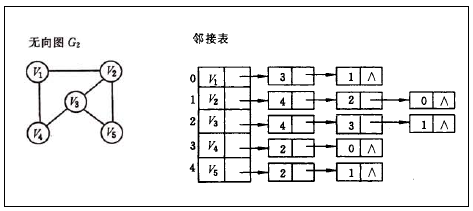
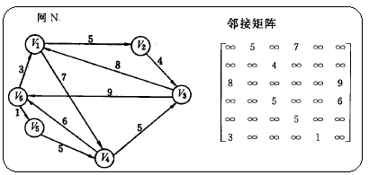

## 实现

图通常通过 **邻接表** 或 **邻接矩阵** 实现。





下面是一个较为简单的基于邻接表的 C++ 实现：

```c++
class Graph {
public:
	struct Edge {
		int to; int weight;
		Edge(int t, int w) : to(t), weight(w) {}
	}
private:
	// 核心数据结构：邻接表
	// graph.size() == 图的节点数量
	// graph[u] 存储从节点 u 出发的所有边（出边）
	vector<vector<Edge>> graph;

public:
	Graph(int n) {
		// 初始化：节点数量
		graph = vector<vector<Edge>>(n);
	}

	// 向图添加带权重边
	void addEdge(int from, int to, int weight) {
		graph[from].emplace_back(to, weight);
	}

	// 删除一条有向边
	void removeEdge(int from, int to) {
		// 在 vector 中找到这个边，复杂度 O(out_degree(from))
		for (auto it = graph[from].begin(); it != graph[from].end(); it++) {
			if (it->to == to) {
				 graph[from].erase(it);
				 break;
			}
		}
	}

	// 检查两个节点是否相邻
	bool isNeighbor(int from, int to) {
		// 复杂度 O(V)
		for (const auto& e : graph[from]) {
			if (e.to == to) return true;
		}
		return false;
	};
}
```

## 参考资料

- [数据结构：图的存储结构之邻接表](https://blog.csdn.net/jnu_simba/article/details/8866844)
- [图->存储结构->邻接表](https://www.cnblogs.com/aimmiao/p/9737661.html "发布于 2018-10-02 18:15")
- [图->存储结构->数组表示法(邻接矩阵)](https://www.cnblogs.com/aimmiao/p/9737654.html "发布于 2018-10-02 18:11")
