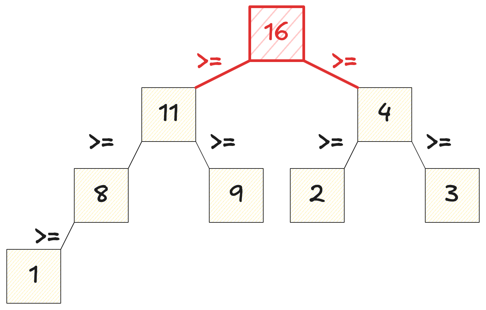
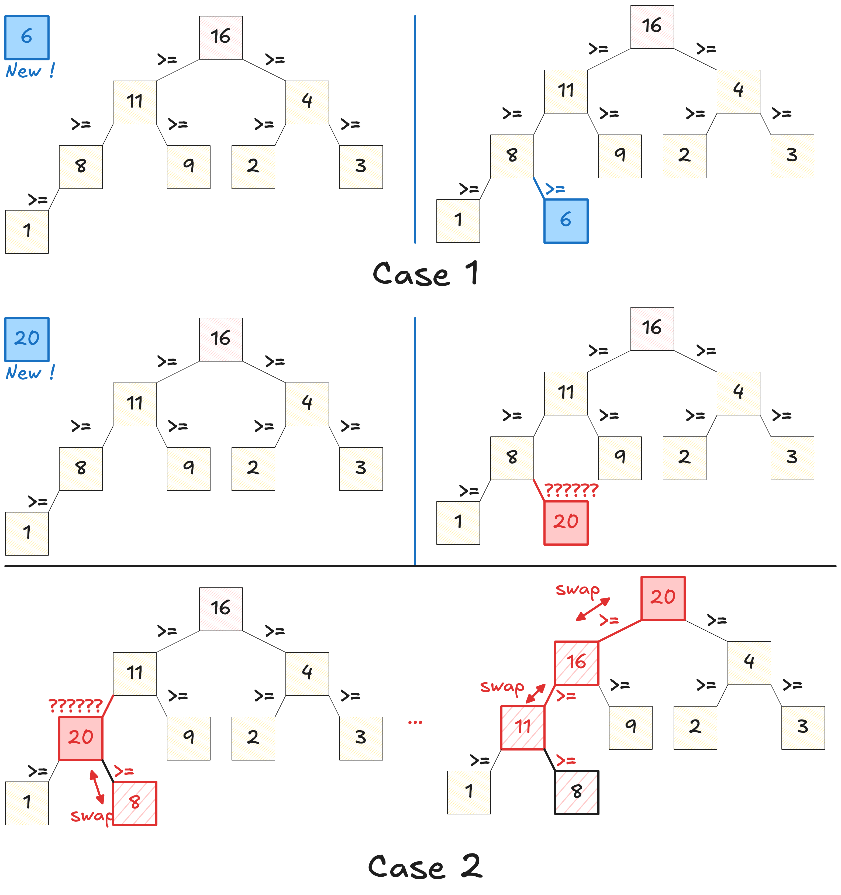
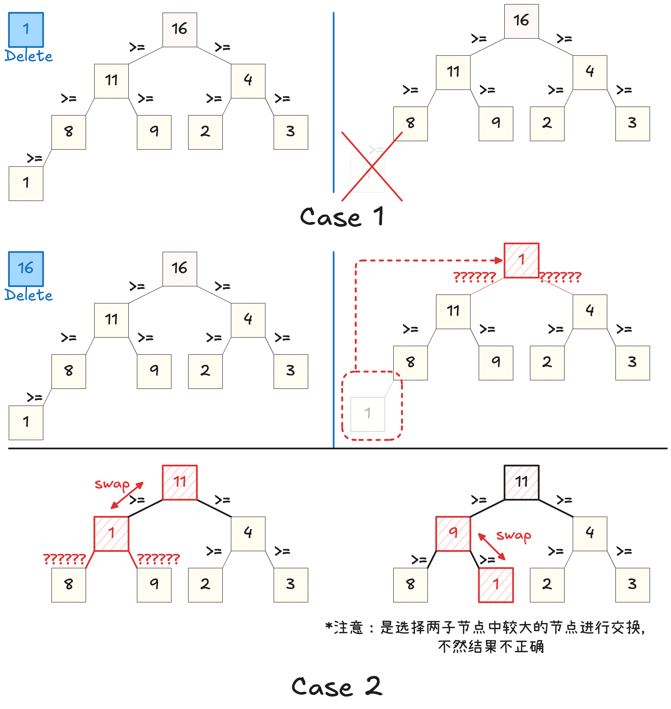

优先级队列通常基于二叉堆实现，支持在 $O(1)$ 时间内访问当前**最大/最小**元素，并在 $O(\log n)$ 时间内完成插入和删除操作，相比于每次线性扫描 $O(n)$，在需要频繁动态维护最值的场景中具有明显优势。

优先级队列还支持基于自定义比较规则的优先级定义，只要该比较规则满足严格弱序，从而能够形成一致的优先级关系。

## 二叉堆性质

二叉堆是一种特殊的二叉树，这里以最大堆为例：
- **二叉堆满足对于任意节点，其值一定大于左子节点和右子节点值**
	- 因此，其值一定大于等于其所有子树（即左子树和右子树）的所有节点的值
	- 二叉堆堆顶（即根节点）的值一定是二叉堆中所有节点中最大
	- 与二叉搜索树不同，二叉堆维护的是局部的父子约束。左右子树之间没有必然存在顺序关系。但每个子树的根节点都是该子树的最大值，尤其是堆顶是全局最大值。
- 其次，二叉堆是一棵**完全二叉树**。这意味着除了最后一层之外所有层都是满的，且最后一层节点从左到右放置
	- 因此二叉堆可以用数组实现



最小堆即为以上表述中所有大于改成小于。

二叉堆的优势在于访问当前最大/最小元素是 $O(1)$ 的，因为访问堆顶元素即可。但是在插入/删除元素时需要分别 `swim`（上浮）和 `sink`（下沉）元素，时间复杂度是 $O(\log n)$.
- 注意插入和删除时必须保证二叉堆是完全二叉树的特性！





### 性能考虑

- **数据量大时的性能**：由于 `std::priority_queue` 的主要操作（插入和删除）具有 $O(\log n)$ 的时间复杂度，因此即使在处理大量数据时，它也能保持良好的性能。这使得它适合用于需要频繁插入和删除元素的场景。
- **内存使用**：`std::priority_queue` 的内存使用取决于其底层容器（默认是 `std::vector`）。由于是基于数组的实现，它通常比基于节点的数据结构（如链表）更加内存高效。
- **元素比较**：元素的比较次数取决于堆的高度，即 O(log n)。你可以通过提供自定义的比较函数来影响排序行为。这对于处理复杂对象或自定义排序准则特别重要。

总体来说，`std::priority_queue` 在处理具有动态优先级的数据集合方面非常有效，特别是在需要快速访问、添加或移除优先级最高或最低元素的应用中。然而，它不适用于需要频繁访问或修改队列中间元素的场景。
## C++ 实现

注意：
- 默认是最大堆，即默认堆顶是最大元素：`priority_queue<int>`
- 如果希望使用最小堆，则应该定义为 `priority_queue<int, vector<int>, greater<int>>pq`
- 第二个参数表示装载元素的容器，通常是 `vector<...>`
- 如果希望使用自定义类型（如链表结点），则需要定义 `comp` 函数
- ⚠️ **反直觉的是，priority_queue 维护的是谁不应该在上面。因此如果希望实现的是大顶堆，比较运算符应该实现前者不该在后者上面，因此使用小于号。**

举例：
```cpp
// 最小整型顶堆的写法
priority_queue<int, vector<int>, greater<int>> pq;

// 大顶堆的写法，priority_queue 维护的是谁不应该在上面
auto cmp = [](ListNode* a, ListNode* b) {
    return a->val < b->val;
};

priority_queue<ListNode*, vector<ListNode*>, decltype(cmp)> pq(cmp);
```

基本的 API 和栈相似：`top()`, `pop()/push()`, `empty()`

```cpp
#include <iostream>
#include <queue>
using namespace std;

int main(){

    // Create a max-heap priority queue (default)
    priority_queue<int> pq;

    pq.push(30);
    pq.push(10);
    pq.push(20);
    pq.push(40);

    cout << "Elements removed from priority queue in order:\n";

    while (!pq.empty()){
        cout << pq.top() << " ";
        pq.pop();
    }

    return 0;
}
```

## 参考资料

- [【C_C++ 数据结构 优先队列】了解学习std::priority_queue的使用](https://zhuanlan.zhihu.com/p/679669848)
- [Priority Queue in C++ STL](https://www.geeksforgeeks.org/cpp/priority-queue-in-cpp-stl/)
