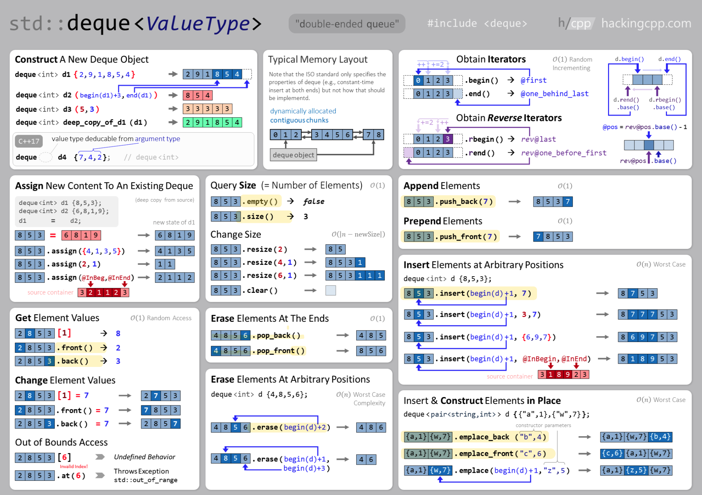

## C++ 实现

### 双端队列 API

**查询**：
- 队列某一位置元素：`[i]`
- 队列头/尾元素：`.front()`, `.back()`

**插入**：
- 在**队列末尾插入**（推荐！）：`.push_back(element)`
- 在**队列头部插入**（推荐！）：`.push_front(element)`
- 在队列末尾插入并构造：`.emplace_back(arg1, arg2, ...)`
- 在队列头部插入并构造：`.emplace_front(arg1, arg2, ...)`
- 在队列任意位置插入：`.insert(@insert_pos, {ele1, ele2, ...}`

**删除**：
- **删除队列末尾**（推荐！）：`.pop_back()`
- **删除队列头部**（推荐！）：`.pop_front()`
- **删除队列全部**（推荐！）：`.clear()`
- 删除任意位置：`.erase(@position)`, `.erase(@range_begin, @range_end)

### 栈 API

`std::stack<T>` 的底层实现是 `std::deque<T>`。为了符合栈特性，`stack` 容器删除了 `deque` 中不符合栈特性的 API.

**查询**：
- 栈顶端：`.top()`
- 不支持队列任意位置元素查询

**插入**：
- **压栈**：`.push(element)`，注意原先队列中的两种方式都无效
- 注意不能在栈任意位置插入

**删除**：
- **弹栈**：`.pop()`，注意原先队列中的两种方式都无效
- 注意不能直接删除栈中的全部元素

### 队列 API

`std::queue<T>` 同样底层实现也是 `std::deque<T>`. 为了符合栈特性，`stack` 容器删除了 `deque` 中不符合栈特性的 API.

**查询**：
- 队列顶端和尾端：`.front()`, `.back()`
- 不支持队列任意位置元素查询

**插入**
- 在**队列头部插入**：`.push(element)，注意原先队列中的两种方式都无效
- 注意不能在栈任意位置插入

**删除**：
- **删除队列头部**：`.pop()`，注意原先队列中的两种方式都无效
- 注意不能直接删除栈中的全部元素
