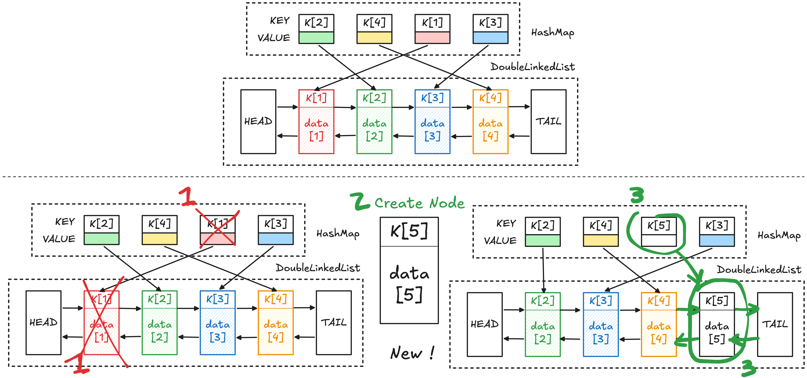

## LRU 算法

**Least Recently Used (LRU)** 算法是一种缓存淘汰策略，用于在有限缓存空间中维护数据及其最近访问顺序。其要求是：
- 【要求 1】插入 (add/put) /删除 (remove)、访问 (get) /更新状态任何元素是 $O(1)$ 的
- 【要求 2】当空间已满又需要插入新数据时，优先淘汰最长时间没有被访问的元素[^1]。
- 【要求 3】每次访问 `cache` 中的某个 `key`，需要将这个元素变为最近使用的，也就是说 `cache` 要支持在任意位置快速插入和删除元素。

[^1]: 这里的最近使用不仅包括读取（get），也包括更新（put）等操作；只要一个元素被访问，它就会被认为是最近使用”的

LRU 算法通常基于**哈希表 + 双向链表**实现：
- **哈希表[^2]**
    - 用于从 key 快速定位节点，对应要求 1；
    - 因此查找、插入、删除都可以做到 $O(1)$；
    - 但哈希表本身是无序的，无法维护“最近访问时间”的顺序。
- **双向链表（Doubly Linked List）**
    - 用于维护缓存项的访问顺序，对应要求 2-3；
    - 最近访问的元素**移动**到链表头部，最久未访问的元素位于尾部；
    - 由于是双向链表，节点的插入、删除、移动都可以在 $O(1)$ 完成；
    - 但链表无法做到 $O(1)$ 查找某个元素

[^2]: 参考 [基本数据结构：键值对和哈希表](基本数据结构：键值对和哈希表.md)

我们将这个结构称之为哈希链表，接下来将介绍如何实现这个数据结构。

## 哈希链表

每个缓存数据都使用唯一的 `key` 标识，哈希表中的 `key` 和双向链表中的 `key` 一一对应。

双向链表中的每一个节点 `Node` 都保存了一组实际数据和链表相关的信息。

哈希表中的 `key` 依然是缓存数据的 `key`，但哈希表的 `value` 不再是真实数据，而是一个指向双向链表节点的指针 `Node*`。这样设计后就可以通过哈希表直接定位到双向链表对应节点。
例如：
- 查询缓存时，可以先通过哈希表找到链表节点，再直接操作这个节点
- 更新缓存时，可以直接修改节点中的 value
- 调整最近访问顺序时，可以直接将该节点从链表当前位置删除，再移动到链表尾部
- 淘汰数据时，可以直接删除链表头部节点，并根据节点中的 key 同步删除哈希表中的对应项



```cpp
#include <iostream>
#include <unordered_map> // use for HashMap

// Implementation: DoubleLinkedList
struct Node {
    int key, val; // val contains real data
    Node* prev;
    Node* next;

    Node(int k, int v)
        : key(k), val(v), prev(nullptr), next(nullptr) {}
};

class DoubleLinkedList {
private:
    Node* head; // dummy head, next = least recently used (LRU)
    Node* tail; // dummy tail, prev = most recently used (MRU)
    int size;

public:
    DoubleLinkedList() {
        // create dummy nodes
        head = new Node(0, 0);
        tail = new Node(0, 0);

        head->next = tail;
        tail->prev = head;

        size = 0;
    }

    // add node to the tail (most recent position)
    void addLast(Node* x) {
        x->prev = tail->prev;
        x->next = tail;

        tail->prev->next = x;
        tail->prev = x;

        size++;
    }

    // remove a node from linked list
    void remove(Node* x) {
        x->prev->next = x->next;
        x->next->prev = x->prev;

        size--;
    }

    // remove and return the least recently used node
    Node* removeAndGetFirst() {
        // empty list
        if (head->next == tail)
            return nullptr;

        Node* first = head->next;

        remove(first);

        return first;
    }

    int getSize() {
        return this->size;
    }
};

// LRUCache
class LRUCache {
private:
    // key -> node address
    std::unordered_map<int, Node*> map;

    // maintain access order
    DoubleLinkedList cache;

    int capacity;

public:
    LRUCache(int c)
        : capacity(c) {}

    // make a key the most recently used
    void make_recent(int key) {
        Node* x = map[key];

        // remove from original position
        cache.remove(x);

        // move to tail (MRU)
        cache.addLast(x);
    }

    int get(int key) {
        if (!map.contains(key))
            return -1;

        // accessed => becomes recent
        make_recent(key);

        return map[key]->val;
    }

    // add a new key-value pair as most recent
    void add_recent(int key, int val) {
        Node* x = new Node(key, val);

        cache.addLast(x);

        // map stores node pointer, not value
        map[key] = x;
    }

    // delete a key completely
    void delete_key(int key) {
        Node* x = map[key];

        cache.remove(x);

        map.erase(key);

        // avoid memory leak
        delete x;
    }

    // remove least recently used node
    void remove_least_recent() {
        Node* x = cache.removeAndGetFirst();

        if (x == nullptr)
            return;

        int delete_key = x->key;

        map.erase(delete_key);

        // free memory
        delete x;
    }

    void put(int key, int val) {
        // key already exists => overwrite
        if (map.contains(key)) {
            delete_key(key);
            add_recent(key, val);
            return;
        }

        // cache full => remove LRU first
        if (capacity == cache.getSize()) {
            remove_least_recent();
        }

        // insert new node
        add_recent(key, val);
    }
};

int main() {
    LRUCache cache(2);

    cache.put(1, 1);
    cache.put(2, 2);

    std::cout << cache.get(1) << std::endl;

    cache.put(3, 3);

    std::cout << cache.get(2) << std::endl;

    cache.put(4, 4);

    std::cout << cache.get(1) << std::endl;
    std::cout << cache.get(3) << std::endl;
    std::cout << cache.get(4) << std::endl;

    return 0;
}
```
