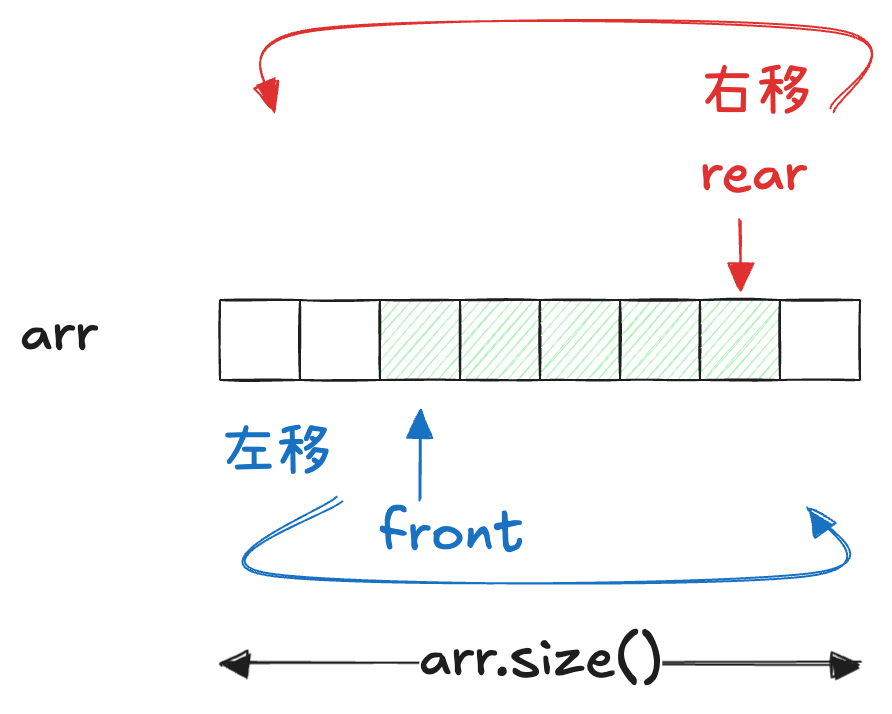

## 循环数组

在保持数组这种连续内存、高效访问结构的前提下，循环数组希望实现对队首和队尾的插入删除都能达到 $O(1)$ 的效率。

普通数组在头部删除或插入时，会在数组中留下“空位”，如果试图通过数据搬移来填补这些空位，就会导致 $O(n)$ 的开销。

循环数组的核心思想是：**不再试图填补这些空位，而是通过维护 front 和 rear 指针，并结合取模运算，将数组在逻辑上视为一个环，从而跳过这些空位，实现常数时间的头尾操作。**

下图展示了 `addFirst(element)` 和 `addLast(element)` 时两个指针所发生的移动：

### 实现

1. 使用 `front` 和 `rear` 来手动标定数组的头和尾
2. 任何对于数组访问（包括访问头/尾，增减元素等）操作都对 index 求模运算。当 `i` 到达数组末尾元素时，`i + 1` 和 `arr.length` 取余数又会变成 0，即会回到数组头部。

## 小技巧

环形数组最好定义为左闭右开，即 `[front, rear)`. 这样可以避免边界处理带来的麻烦。但是需要注意，
- 这意味着 `front` 所指向的位置永远有意义，`rear` 则相反
- 添加元素时，`front` 先移动再写入，而 `rear` 是先写入再移动
- 访问元素时，数组队首即 `arr[front]`，但是数组队尾是 `arr[(rear-1+arr.size())%arr.size()]`，即 `rear` 的前一个位置