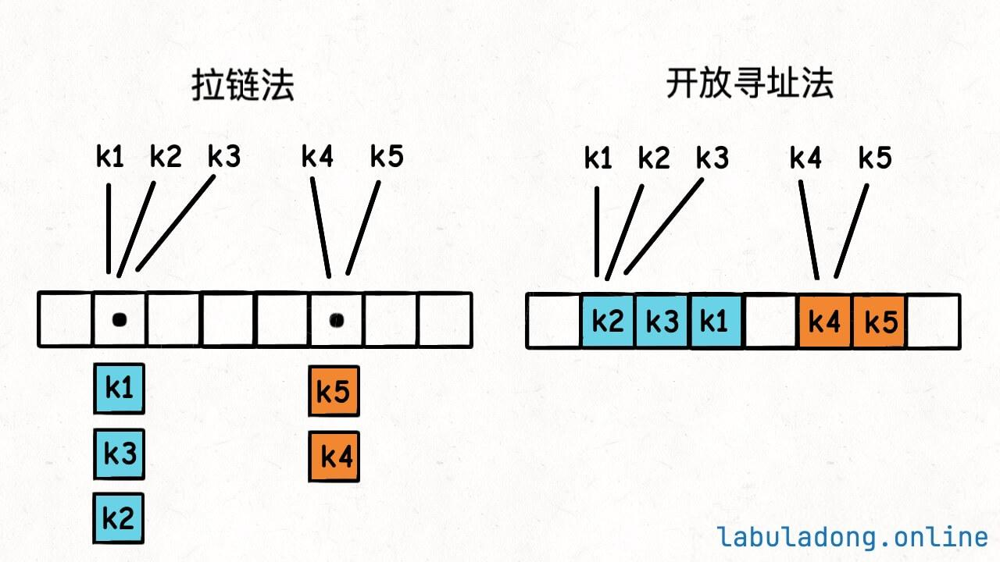

**哈希表** 是用来高效存储和查找键值 (key, value) 对的数据结构，使得任意 dict 结构的 `get, put, remove` 方法平均时间复杂度都是 $O(1)$. 哈希表的底层数据结构是**数组**。由于不同 key 可能映射到相同位置（**哈希冲突**），通常通过拉链法或开放寻址法来处理冲突，并通过优化哈希函数和控制负载因子（动态扩容）来降低冲突概率。为了保证哈希值的稳定性，key 通常要求是不可变对象。

基于哈希表的数据结构，在平均情况下可以以 $O(1)$ 时间完成**元素查找**，因此可以通过“遍历 + 查找”的方式，将许多原本需要 $O(n^2)$ 的问题优化到 $O(n)$.
 
## 哈希表实现

### 底层数据结构

dict 的底层是**一个数组（哈希表）**
- 每个位置存储 key-value 对（或其引用），因此可以通过**数组索引** index 来访问这些数据。  
- 通过哈希函数，**将 key 映射为数组索引**，从而实现接近 O(1) 的访问。  
- 哈希函数保证相同 key 映射到相同位置，但是无法保证不同 key 一定映射到不同的位置，即 **哈希冲突**
- 哈希表的设计目标是尽量减少不同 key 的冲突，但冲突不可避免，因此需要额外机制处理。

### 哈希冲突解决方式

**哈希冲突** 的解决方式：拉链法和开放寻址法。
- 拉链法意味着哈希表的底层数组并不直接存储 `value` 类型，而是存储一个链表，当有多个不同的 `key` 映射到了同一个索引上，这些 `key -> value` 对就存储在这个链表中，遍历链表以找到所查询的数据。
- 开放寻址法的思路是，一个 `key` 发现算出来的 `index` 值已经被别的 `key` 占了，那么它就去 `index + 1` 的位置看看，如果还是被占了，就继续往后找，直到找到一个空的位置为止。

但是以上方法都会退化哈希函数的效率。为了解决哈希冲突，主要有两个思路：
- 使总体分布更加均匀：平衡 `key` 的哈希分布，优化哈希算法
- 让数组更稀疏：哈希表的数组太小，已经有太多 key-value 对



我们希望避免哈希表装太满，在元素数量太多的时候即对数组进行动态扩容。因此需要定义 **负载因子**，当哈希表内严肃达到负载因子时，将哈希表数组扩容。

### 使用哈希表的前提条件

哈希表要求 key 不可变，是因为其索引依赖于 key 的哈希值。一旦 key 发生变化，其哈希值和等价关系都会改变，从而破坏“key → bucket”的映射，使得元素无法被正确查找或删除。

## 哈希表相关实现 API


```cpp
#include <iostream>
#include <unordered_map>
#include <unordered_set>

using namespace std;

int main() {
    // ===== 1. 定义 =====
    unordered_map<int, string> m;  // key -> value
    unordered_set<int> s;          // 只存 key

    // ===== 2. 插入 / 修改 =====
    m.insert({1, "one"});
    m[2] = "two";        // 如果 key 不存在，会自动插入
    s.insert(10);
    s.insert(20);

    // ===== 3. 访问 =====
    cout << "m[1] = " << m[1] << endl;

    // ===== 4. 查找（推荐 contains）=====
    if (m.contains(2)) {
        cout << "m contains key 2" << endl;
    }

    if (s.contains(10)) {
        cout << "set contains 10" << endl;
    }

    // ===== 5. 删除 =====
    m.erase(1);
    s.erase(20);

    // ===== 6. 判空 =====
    if (m.empty()) {
        cout << "map is empty" << endl;
    } else {
        cout << "map is not empty" << endl;
    }

    if (s.empty()) {
        cout << "set is empty" << endl;
    } else {
        cout << "set is not empty" << endl;
    }

    return 0;
}
```


## 参考资料

- [哈希表核心原理](https://labuladong.online/zh/algo/data-structure-basic/hashmap-basic/)