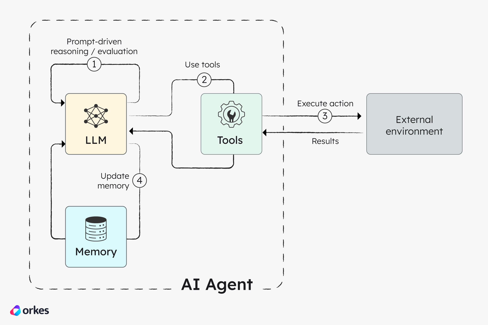
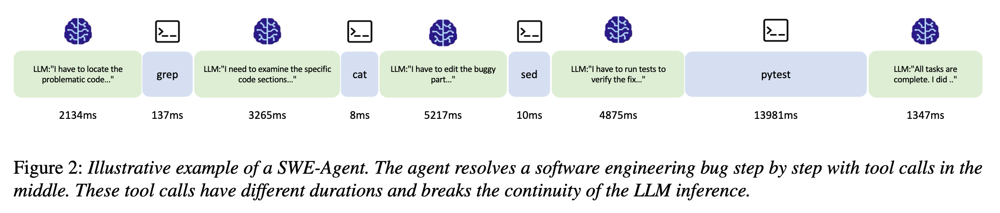
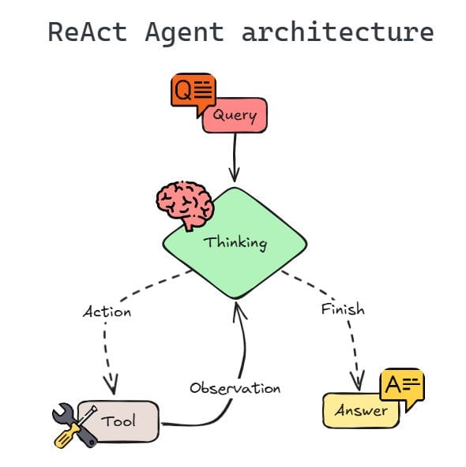

## 关键概念整理

### Agentic LLM workflows

**Agentic LLM workflows** 指的是为了完成某个目标，由多次 LLM 调用、工具调用、状态维护和动态决策组成的多步骤执行流程.

Agent workflow 的主要特征是：
1. **multi-step**。一次用户任务会触发多轮 LLM 调用，而不是一次 inference。
2. **stateful**。中间结果、工具返回、历史上下文、memory、scratchpad 都要保留

Agent workflow 可以看作一张图，图里的每个节点是两类资源需求完全不同的节点之一[^1]：
1. **LLM node**，负责调用大模型，例如生成计划、判断下一步、总结工具结果。它主要消耗 **GPU**，尤其是 prefill/decode、KV cache、显存、batching 资源。
2. **Tool node**： 负责执行工具调用，例如 SQL 查询、HTTP API、检索、Python 函数、本地脚本。它主要消耗 **CPU / 网络 / I/O / 数据库资源**，不一定吃 GPU。

[^1]: [2601-Halo-Batch Query Processing and Optimization for Agentic Workflows](paper-reading/2601-Halo-Batch%20Query%20Processing%20and%20Optimization%20for%20Agentic%20Workflows.md)

其他特征：
1. **tool-interactive**。LLM 会调用搜索、数据库、代码执行器、浏览器、文件系统、API 等外部工具。
2. **control-flow dynamic**。下一步做什么取决于上一步结果，所以执行图不是完全固定的。
3. **resource pattern irregular**。有时需要 GPU 推理，有时在等工具，有时在读文件，有时又突然需要长上下文 prefill。

Tool node 运行时长高度可变。

下图是 Agentic LLM workflow 的示例（同时也是一个 [ReAct-agent loop](Agent%20Infra.md#ReAct-agent%20loop)）。

#### ReAct-agent loop

**ReAct-agent loop**，即 Reasoning + Acting 交替，是现代 Agent workload 的基本执行范式。

ReAct-agent loop 反复循环以下步骤[^2]：
1. **Reasoning step**：LLM 读上下文，决定下一步。模型会看当前任务、历史对话、工具返回结果，然后生成想法或中间判断。例如生成想法：我应该打开日志查看具体情况。
2. **Action step**：LLM 调用工具，即外部动作，例如 SQL 查询、HTTP API、检索、Python 函数、本地脚本。
3. **Context update**：把工具结果写回上下文。（接下来就交给 1. 去继续对写回的答案进行分析）

ReAct-agent loop 意味着这个请求的完整运行路径通常无法在提交时完全确定，即为一个动态工作流，且很难被预测，因为下一步依赖于上一步的 observation 和 LLM 的决策。

ReAct-agent loop 被目前 Claude Code 和 Cursor，以及类似 LangChain 和 LangGraph 等使用。

[^2]: [2511-Continuum Efficient and Robust Multi-Turn LLM Agent Scheduling with KV  Cache Time-to-Live](paper-reading/2511-Continuum%20Efficient%20and%20Robust%20Multi-Turn%20LLM%20Agent%20Scheduling%20with%20KV%20%20Cache%20Time-to-Live.md)

