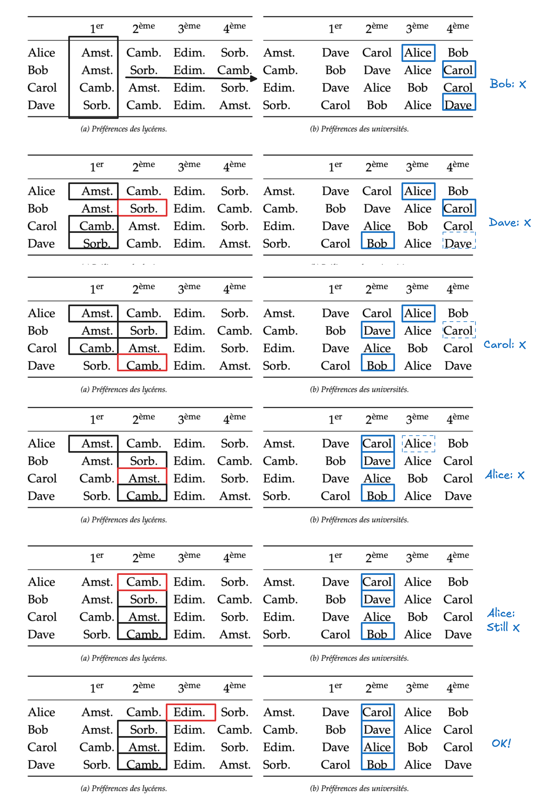

博弈论系列文章：
- [博弈论（1）：Gale-Shapley 稳定匹配机制构造](博弈论（1）：Gale-Shapley%20稳定匹配机制构造.md)
- [博弈论（2）：标准形博弈](博弈论（2）：标准形博弈.md)
- [博弈论（3）：纳什均衡](博弈论（3）：纳什均衡.md)

## 偏好、稳定性与 Gale-Shapley (1962)

设有两个集合 $A$ 与 $B$，它们的基数都为 $n$。可以把 $A$ 理解为学生，把 $B$ 理解为大学；也可以反过来理解为求职者与公司、医生与医院、租客与房东。问题本身并不依赖具体语义，它真正关心的是：当两个群体都具有主观偏好时，如何构造一种不会被参与者主动推翻的**匹配机制**。

最朴素的想法是：既然双方都有偏好，那就让每个人尽可能选择自己最喜欢的对象。例如，让所有学生同时申请自己最喜欢的大学，然后大学从申请者中选择最喜欢的学生。
- 这种局部贪心会产生冲突：多个学生可能同时选择同一所大学，而大学也只愿意接收其中一个。
- 更严重的问题在于，即使最终人为地解决了冲突，得到的结果也可能是不稳定的：系统中的两个主体可能私下更愿意重新配对（因为双方都是彼此更心仪的人选），而不是接受当前安排。

因此**如何构造一个稳定的匹配机制，使得没有主体想要重新匹配**成为了这个问题真正的核心。

> 稳定的匹配机制解释：例如，在恋爱配对关系中，我有比我现在匹配对象更喜欢的人，但是对方并不比起当前匹配对象更喜欢我（比如说 TA 的伴侣比我更优秀），所以我心服口服，这就是所谓稳定的匹配机制。

### 偏好关系

首先需要形式化定义偏好关系。

**偏好关系**（preference relation）$\succ$ 描述了主体对于候选对象的偏好顺序。例如，对于学生 $a \in A$，若 $b_1 \succ_a b_2$，表示学生 $a$ 更喜欢大学 $b_1$ 而不是 $b_2$；对于大学 $b \in B$，若 $a_1 \succ_b a_2$，则表示大学 $b$ 更偏好学生 $a_1$。
- 这里的偏好关系定义了一个严格排序关系。为了让这种排序能够用于推导与算法设计，通常要求它满足三个性质。
- 第一是**完备性**（completeness）。对于任意两个不同对象 $x,y$，主体必须能够比较它们，即：$x \succ y \quad \text{或} \quad y \succ x$。这意味着不存在“无法比较”的情况。系统必须知道：如果必须二选一，你究竟更偏好谁。
- 第二是**非自反性**（irreflexivity）：$x \not\succ x$。没有对象会严格优于自己。保证了偏好关系不会出现逻辑循环的起点。
- 第三是**传递性**（transitivity）：$x \succ y,\quad y \succ z \implies x \succ z$。如果一个学生认为哈佛优于斯坦福，斯坦福优于伯克利，那么他也必须认为哈佛优于伯克利。否则偏好系统会出现循环，例如：$x \succ y,\quad y \succ z,\quad z \succ x$。这会导致不存在真正意义上的最优选择，因为偏好会沿着环不断反转。

### 匹配

有了偏好关系之后，一个**匹配**（matching）可以形式化为一个双射：
$$
\mu : A \to B
$$
- 每个主体必须恰好匹配一个对象
- 每个对象也恰好被分配给一个主体

### 阻塞对和稳定匹配

考虑如下情况：学生 $a_1$ 被分配到大学 $b_1$、学生 $a_2$ 被分配到大学 $b_2$，但同时满足：
$$
b_2 \succ_{a_1} b_1, \quad a_1 \succ_{b_2} a_2
$$
也就是说，学生 $a_1$ 更喜欢大学 $b_2$，而大学 $b_2$ 也更喜欢学生 $a_1$。那么即使系统给出了当前匹配，$a_1$ 与 $b_2$ 仍然有动力绕开机制，私下重新配对。这种 $(a,b)$ 被称为一个 **阻塞对**（blocking pair）。

于是，一个匹配 $\mu$ 被称为 **稳定匹配**（stable matching），当且仅当不存在任何阻塞对。形式化地说，不存在 $(a,b)$ 满足：
$$
b \succ_a \mu(a)
\quad\text{ and }\quad
a \succ_b \mu(b)
$$

注意这里的稳定性并不意味着所有人满意，其真正含义是：**没有两个主体同时认为，脱离当前系统后他们会过得更好。** 系统的目标不是创造绝对最优，而是创造一个没有人愿意偏离的均衡结构。

## 稳定匹配机制存在和构造：Gale-Shapley 算法

稳定匹配是否总是存在？
- 这并不显然。因为偏好是高度离散且互相冲突的。局部上没有阻塞对，并不意味着全局上一定能构造出这样的配置。
- **Gale-Shapley 算法**（Deferred Acceptance Algorithm）出了一个极具影响力的结果：不仅稳定匹配总是存在，而且可以通过一个非常简单的迭代机制构造出来。

算法的思想非常朴素，但它背后隐含的结构极深。假设由学生发起申请，那么过程如下：
1. 每个学生向自己**当前最喜欢、且尚未拒绝过自己**的大学申请；
2. 每所大学从当前收到的所有申请者中，**暂时保留**自己最喜欢的一个，并拒绝其余人；
3. 被拒绝的学生继续向自己的下一志愿申请；
4. 重复这一过程，直到不存在新的申请。

- 大学并不会立即最终确定录取对象，而是始终保留当前最优候选，并允许未来更优申请者替换。
- 假设以下场景【1】大学 $A$ 拒绝了学生 $a$ 且大学 $B$ 选择了学生 $b$，【2】因此学生 $a$ 需要重新选择。学生 $a$ 选择了大学 $B$ 【3】此时大学 $B$ 发现相比于学生 $b$ 更喜欢学生 $a$，那么 $B$ 会踢掉 $b$ 而保留 $a$，学生 $b$ 需要再重新选择，……

举例：

**为什么它一定终止？** 因为每个学生最多只会向每所大学申请一次，因此总申请次数最多为 $n^2$。算法不可能无限循环。

> 理论上界是 $(n-1)^2+1$

**为什么终止后一定稳定？**
- 设最终匹配为 $\mu$。假设存在一个阻塞对 $(a,b)$。
- 由于 $a$ 更喜欢 $b$ 而不是当前匹配对象 $\mu(a)$，那么在算法过程中，$a$ 一定曾经向 $b$ 申请过。既然最终没有匹配成功，说明 $b$ 在某个阶段拒绝了 $a$。
- 而大学只会拒绝那些“不如当前保留对象”的申请者。因此，$b$ 当前最终匹配到的对象 $\mu(b)$ 一定比 $a$ 更优，即：$\mu(b) \succ_b a$。这与“$b$ 更喜欢 $a$ 而不是当前匹配对象”矛盾。因此阻塞对不存在，匹配稳定。

Gale-Shapley 算法并不是中立的。
- 如果由学生发起申请，那么最终结果会是所有稳定匹配中，对学生最优（student-optimal）的那个稳定匹配；相应地，它会是对大学最差（college-pessimal）的稳定匹配。
- 反之，如果由大学发起申请，则结果方向完全相反。
- 这意味着：匹配机制本身具有偏向性。谁拥有主动申请权，谁就能在所有稳定结果中占据更有利的位置。这也是为什么 Gale-Shapley 理论后来会深刻影响现实制度设计，例如医学院住院医分配、美国高校录取、器官捐赠匹配等系统。
