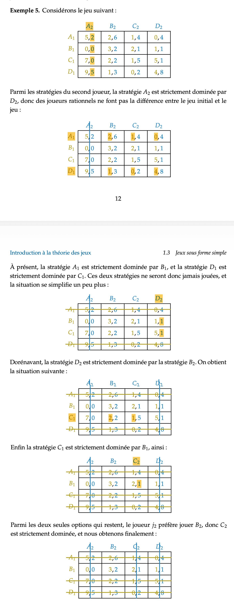

在很多现实问题中，一个人的决策结果不仅取决于自己的选择，还取决于其他人的行为。例如，企业定价会受到竞争对手影响，国家政策会影响其他国家的回应，求职者是否接受 offer 也会受到公司策略变化的影响。在这类问题中，决策主体之间形成了相互依赖：每个人都在根据别人可能采取的行动来调整自己的选择。

传统的优化问题通常只研究给定环境下如何选择最优行动，而博弈论研究的问题则更进一步：环境本身也是由其他理性决策者共同构成的。因此，一个玩家面对的并不是固定世界，而是一个会随着所有人策略变化而不断变化的互动系统。

**有限标准形博弈**（finite normal-form game）正是对这类策略相互依赖问题的一种最基本抽象。它用参与者、可选策略以及不同策略组合对应的收益，来描述一个完整的战略互动结构。
## 标准形博弈

在有限标准形博弈中，每个玩家都会从自己的策略集合中选择一个行动。一个玩家在做决策时，无法观察到其他玩家当前正在选择什么，也得不到任何能够推断他人选择的信息。因此，每个玩家都必须在对他人行为进行预期的基础上独立做出自己的决策。

> 目前为止，可以假设有限标准形博弈中，每个玩家是同时做出决策的。

标准形博弈通常描述的是一种一次性的互动过程。所有玩家只进行一次策略选择，不存在后续轮次，也不存在根据历史行为不断调整策略的过程。

任何一次策略互动至少都要回答三个问题：参与者是谁，参与者能选什么，不同选择组合会带来什么后果。
- 当所有玩家 $i\in N$ 分别选择其策略 $s_{i}$ 后，
- 这些选择共同形成一个策略组合  $(s_1,\dots,s_n)$，
- 随后每个玩家都会根据这个完整的策略组合获得对应收益，特别的对于玩家 $i$ 其收益函数可以表示为 $g_{i}(s_{1},\dots s_{n})$. 这意味着每个玩家的收益不仅取决于自己的决策还取决于所有玩家行动之间的共同作用。

因此，有限标准形博弈通常表示为

$$
G = \bigl(N, (S_i)_{i\in N}, (g_i)_{i\in N}\bigr).

$$
- $N$ 是一个有限集合，其中的元素称为 **玩家**（players）
- 对每个玩家 $i\in N$，$S_i$ 是玩家 $i$ 的 **策略集合**（strategy set），其中的元素 $s_i\in S_i$ 表示玩家 $i$ 可以选择的一种行动或方案；
- $g_i : \prod_{i \in N}S_{i}\to \mathbb{R}$ 是玩家 $i$ 的 **收益函数**（payoff function），用于描述在所有玩家都做出选择之后，玩家 $i$ 获得的结果价值。

> 收益函数 $g_{i}=g_{i}(s_{1},\dots,s_{n})$ 定义为在策略 $s=(s_{1},\dots,s_{n})$ 下玩家 $i$ 的收益，因此在有限博弈中 $|G| = |S| \times |N|$.

当每个玩家都从自己的策略集合中选择一个策略时，所有人的选择共同组成一个 **策略组合**（strategy profile）。所有可能策略组合的集合记为
$$
S = \prod_{i\in N} S_i.
$$

博弈的结果不是由单个玩家的选择决定的，而是由所有玩家选择的组合共同决定的。
- 若 $N=\{1,\dots,n\}$，那么一个策略组合可以写作 $s=(s_1,\dots,s_n)$，其中 $s_i\in S_i$。
- 收益函数 $g_i:S\to\mathbb{R}$ 则把每一个完整策略组合映射为**玩家 $i$ 的收益** $g_i(s_1,\dots,s_n)$。
- 这意味着同一个策略 $s_i$ 对玩家 $i$ 的价值并不是固定的，与其他玩家的行动有关。

为了刻画“我在别人这样选择时应该怎么做”，我们需要把某个玩家自己的策略和其他人的策略分开。对玩家 $i$，记

$$

S_{-i}=\prod_{j\in N\setminus\{i\}} S_j,

$$

它表示除玩家 $i$ 之外所有玩家策略集合的乘积。若 $s\in S$ 是一个完整策略组合，则常写成 $s=(s_i,s_{-i})$，其中 $s_i$ 是玩家 $i$ 的策略，$s_{-i}$ 是其他所有玩家的策略组合。

【举例】**囚徒困境**的形式化博弈建模。
- 两个囚徒 $N = \{p_{1},p_{2}\}$
- 策略 $S_1=S_2=\{S,T\}$，
	- 其中 $S$ 表示沉默，$T$ 表示背叛
	- 由于两个囚徒都可以做出这个行动因此两者的策略集合是一样的
- 收益函数：用矩阵形式表达，则如下图表示。
	- 左侧为 $p_{1}$ 的行动，上侧为 $p_{2}$ 的行动，每个格子代表了一种策略组合，例如 $s=(s_{1},s_{2})=(T, T)$.
	- 每个格子的内容代表了对于两个玩家（囚徒）的收益。左侧的数值表示 $p_{1}$ 的收益，右侧的数值表示 $p_{2}$ 的收益，例如 $g_{1}(T, T) = g_{2}(T, T) = -3$, $g_{1}(T, S) = 0$, $g_{2}(T, S)=-4$

$$
\begin{array}{c|cc}
 & T & S \\
\hline
T & \textcolor{blue}{(-3,-3)}& \textcolor{red}{(0,-4)} \\
S & (-4,0) & (-1,-1)
\end{array}
$$
### 支配策略、严格占优策略和严格占优均衡

标准形博弈的形式化结构已经告诉我们：一个玩家的收益不仅取决于自己的选择，还取决于其他玩家的策略组合 $s_{-i}$。但仅仅把博弈写成一个数学对象还不够。真正的问题是：在这样一个相互依赖的系统中，什么样的策略才是“理性”的？

这里首先会出现一种非常强的情况：有些策略无论别人怎么行动，它都比另一个策略更差。换句话说，其他玩家的行为虽然会影响收益大小，但不会改变两个策略之间的优劣顺序。如果一个玩家已经知道某个策略在所有情况下都更差，那么继续保留它就没有任何意义。这便引出了 **支配关系**（dominance relation）。

对于玩家 $i$，若存在两个策略 $\sigma_i,s_i\in S_i$，满足：

$$
g_i(\sigma_i,s_{-i}) > g_i(s_i,s_{-i}),
\quad
\forall s_{-i}\in S_{-i},
$$

那么称策略 $\sigma_i$ **严格支配**（strictly dominates）策略 $s_i$，而 $s_i$ 被称为一个 **严格被支配策略**（strictly dominated strategy）。
- 对所有 $s_{-i}$ 都成立意味着：**无论别人如何行动**，$\sigma_i$ 的收益始终优于 $s_i$。因此，$s_i$ 不只是有时候不好，而是在整个博弈结构中完全没有存在必要。
- 大多数博弈问题之所以困难，正是因为最佳行动依赖于别人怎么选；而严格支配关系描述了一种不依赖外界环境的优劣结构。

更加的，如果存在一个策略 $\sigma_{i}\in S_{i}$ 严格支配所有其他策略 $s_{i}\in S_{i}\backslash \{\sigma_{i}\}$，则称为它是**严格占优策略** (strictly dominant strategy)：
$$
\forall s_i \in S_i \setminus {\sigma_i},
\quad
\forall s_{-i}\in S_{-i},
\quad
g_i(\sigma_i,s_{-i}) >
g_i(s_i,s_{-i})
$$

> 【例题：囚徒困境】题目建模见上文。对任意一个囚徒而言，背叛 $T$ 都严格支配沉默 $S$。因为：
> - 如果对方沉默，那么背叛得到 $0$，沉默得到 $-1$；
> - 如果对方背叛，那么背叛得到 $-3$，沉默得到 $-4$。
>
> 也就是说：
>
> $$
> g_i(T,s_{-i}) > g_i(S,s_{-i}),
> \quad
> \forall s_{-i}\in S_{-i}.
> $$
>
> 于是一个理性的囚徒没有理由选择一个在所有情况下都更差的方案，即保持沉默。

对于一个策略组合 $s=(s_{1},\dots, s_{n})\in S$，如果对于每个玩家 $i$，$s_{i}$ 都是其严格占优策略，则称 $s$ 为**严格占优策略均衡**。
- 在这种情况下，每个玩家无论其他玩家如何行动，都会选择对应的策略 $s_{i}$，因此该策略组合具有稳定性。

> 【例题：二阶拍卖问题】有 $n \ge 2$ 个买家参与一个不可分割物品的密封拍卖。每个买家 $i \in \{1,\dots,n\}$ 对该物品有一个私人价值（估值） $v_i$，表示这个物品对他而言真正值多少钱。每个买家同时提交一个出价 $b_i$，并且这些出价只有拍卖主持人能够看到，其他买家无法观察。拍卖结束后，出价最高的买家获得该物品。如果有多人出价并列最高，则在这些玩家中均匀随机选择赢家。但赢家不付自己的出价（即最高出价），而是付第二高的出价。试证明：每个玩家按照自己估值 $v_{i}$ 出价永远是最优策略。
>
> 问题建模：对于玩家 $i$ 来说，易得到其收益函数
> $$
> 	g_{i}(s_{i},s_{-i}) = \begin{cases}
> 	0,\quad &s_{i}< \text{max}_{j \neq i}s_{j} \\
> 	\frac{v_{i}- \text{max}_{j \neq i} s_{j}}{|\{j | s_{j}=s_{i}\}|},  & s_{i} \geq \text{max}_{j \neq i} s_{j}
> 	\end{cases}
> $$
>
> 因为一定满足 $g_{i}(v_{i},s_{-i})\geq{0}$ （这是只有 $v_{i}- \text{max}_{j \neq i} s_{j}$ 为非负时才会进入到第二种情况，此时分子一定非负），因此
> $$
> 	\forall s_{i} \in \mathbb{R}, \; \begin{cases}
> 	g_{i}(s_{i}, s_{-i}) = 0 \leq g_{i}(v_{i}, s_{-i}), \; &s_{i}< \text{max}_{j \neq i}s_{j \\
> 	} \\
> 	g_{i}(s_{i}, s_{-i}) \leq 0 \leq g_{i}(v_{i},s_{-i}),\;&s_{i}\geq \text{max}_{j\neq i}s_{j}, \; v_{i} \leq \max_{j\neq i}s_{j} \\
> 	0 < g_{i}(s_{i}, s_{-i}) \leq g_{i}(v_{i},s_{-i}),\;&s_{i}\geq \text{max}_{j\neq i}s_{j}, \; v_{i} >\max_{j\neq i}s_{j}
> 	\end{cases}
> $$
>
> 在所有情况下 $g_{i}(v_{i},s_{-i}) \geq g_{i}(s_{i},s_{-i})$. 因此 $s_{i}=v_{i}$ 是最优策略。
### 弱支配和占优策略

严格支配（strict domination）之所以重要，是因为它给出了一个几乎不需要任何额外假设的理性消元”原则：如果一个策略在所有情况下都严格更差，那么理性玩家就绝不会选择它。这个结论非常强，因为它不依赖于玩家对他人行为的预测，也不依赖于概率、信念或者心理预期。一个严格被支配策略之所以能够被安全地删除，本质上是因为它在整个收益结构中已经完全失去了存在意义。

但严格支配也有一个明显的问题：它过于强了。真实博弈中，很多策略并不是处处更差，而是**从不更好，并且有时更差。** 换句话说，一个策略可能在某些情况下与另一个策略收益相同，只在部分情况下处于劣势。

对于玩家 $i$，若存在两个策略 $\sigma_i,s_i\in S_i$，满足：

$$
g_i(\sigma_i,s_{-i})
\ge
g_i(s_i,s_{-i}),
\quad
\forall s_{-i}\in S_{-i},
$$

并且至少存在一个其他玩家策略组合 $\sigma_{-i}\in S_{-i}$，使得：

$$
g_i(\sigma_i,\sigma_{-i})
>
g_i(s_i,\sigma_{-i}),
$$

则称 $\sigma_i$ **弱支配**（weakly dominates）$s_i$，而 $s_i$ 被称为一个 **弱被支配策略**（weakly dominated strategy）。

这个定义与严格支配之间只有一个非常细微、但影响极其深远的差异。在严格支配中，我们要求：

$$
g_i(\sigma_i,s_{-i})
>
g_i(s_i,s_{-i}),
\quad
\forall s_{-i},
$$

即无论外部环境如何变化，$\sigma_i$ 都必须严格优于 $s_i$。而在弱支配中，严格更好只要求在至少一个情形下成立，其余情况下允许两者收益相同。也就是说，弱支配并不意味着一个策略绝对错误，而只是意味着：玩家始终存在一个不更差的替代方案，并且在某些情况下这个替代方案会更优。

## 迭代删除严格劣策略

前面已经提到，如果玩家是理性的，那么他们不会选择严格劣策略。因为无论其他玩家采取什么行动，这种策略都会带来更差的收益，因此不存在任何主动选择它的理由。

如果所有玩家都知道游戏的完整规则，并且每个人都知道其他玩家也是理性的，那么每个玩家都会意识到：其他玩家同样不会去选择严格劣策略。
- 于是，在分析自己的决策时，一个玩家实际上不需要再考虑那些“理性情况下根本不会出现”的对手策略。
- 而一旦这些策略被移除，整个博弈的结构就会发生变化。某些原本看起来“还可以接受”的策略，可能会因为对手策略空间缩小，而变成新的严格劣策略。于是这些策略也会继续被删除。
- 因此，我们得到一个不断重复的过程：找到严格劣策略 -> 将其删除 -> 缩小策略空间 -> 再找到新的严格劣策略 -> 将其删除......

这个过程称为**迭代删除严格劣策略** (Iterated Elimination of Strictly Dominated Strategies, IDSDS)

如果经过有限次迭代删除之后，每个玩家最终都只剩下一个策略：

$$
|S_i| = 1,\quad \forall i
$$

那么称该游戏**可以被迭代删除严格劣策略求解**(solvable by iterated elimination of strictly dominated strategies)。此时剩下的唯一策略组合，就是在共同理性假设下唯一可能出现的结果。

此外，对于严格劣策略，还有一个非常重要的性质：删除顺序不会影响最终结果。也就是说，无论先删除哪些严格劣策略，最终保留下来的策略集合都是相同的。因此，严格劣策略的迭代删除过程具有良好的稳定性与一致性。

需要注意的是，这个性质对于弱劣策略（weakly dominated strategies）通常并不成立。弱劣策略的删除顺序可能改变最终结果，因此其理论性质要更加微妙。
