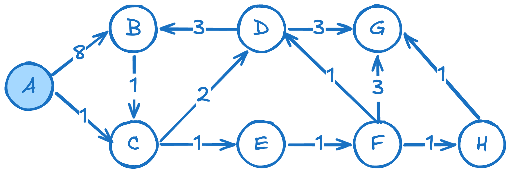
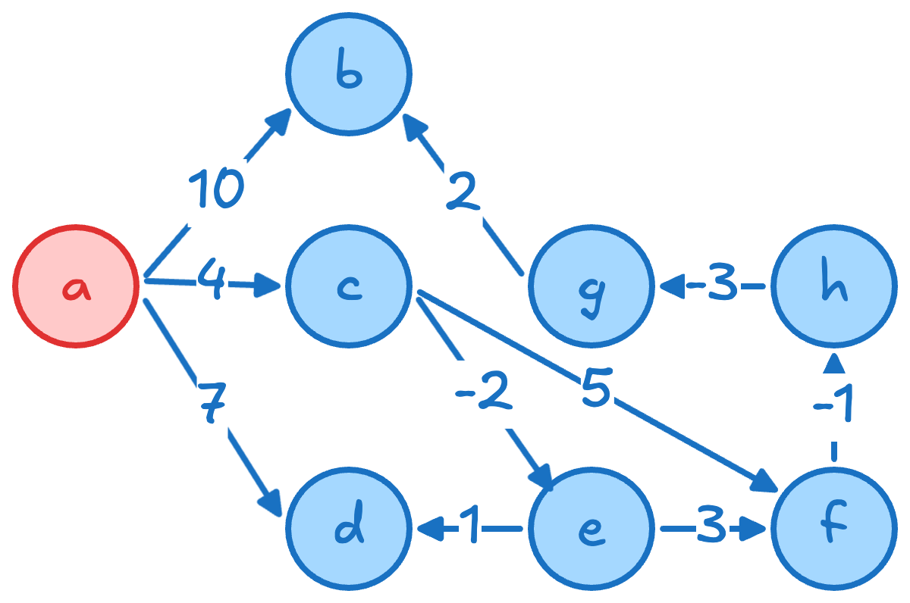
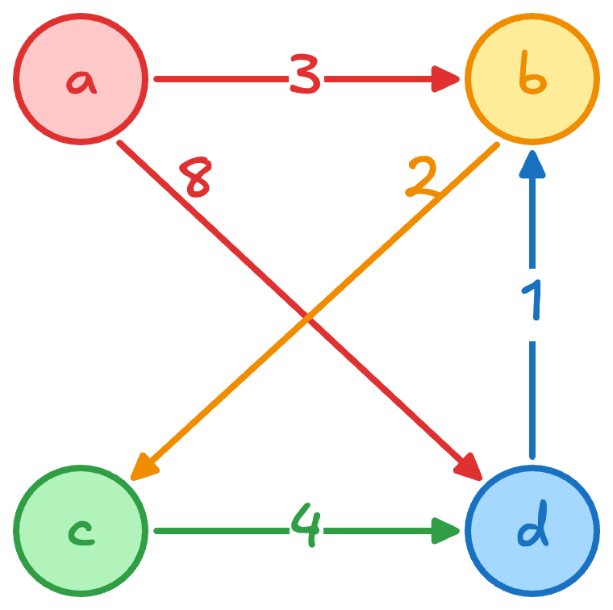

## Dijkstra 算法

Dijkstra 算法
- 前提：图中没有负权边 (non-negative weights)
- 可以解决**单源最短路径问**题，即求解从起始点到其他点的最短距离和对应路径
- 基于性质：**一旦某个点的最短路径被确定，它就不会再变小**
- 初始化：对于所有非起点的节点，将其 dist 设为 $+\infty$. 对起点设为 $0$.
- **贪心**选择：
	- 每一步从所有**尚未确定最短距离**的节点中，选择当前**距离起点最近**的节点，将其最短距离确定；
	- 然后用该节点去**松弛（relax）其邻居的距离**（即尝试更新最短距离）。
	- 重复该过程，直到所有可达节点的最短距离被确定。
- 时间复杂度为 $O(V^2)$，可以通过最小堆优化到 $O(E \log V)$

例子：

距离矩阵更新：
$$
\begin{array}{c|c|cccccccc}
\text{step} & \text{pivot} & A & B & C & D & E & F & G & H \\
\hline
0 & - & 0 & \infty & \infty & \infty & \infty & \infty & \infty & \infty \\
1 & A & \textcolor{red}{0} & 8 & 1 & \infty & \infty & \infty & \infty & \infty \\
2 & C & 0 & 8 & \textcolor{red}{1} & 3 & 2 & \infty & \infty & \infty \\
3 & E & 0 & 8 & 1 & 3 & \textcolor{red}{2} & 3 & \infty & \infty \\
4 & D & 0 & 6 & 1 & \textcolor{red}{3} & 2 & 3 & 6 & \infty \\
5 & F & 0 & 6 & 1 & 3 & 2 & \textcolor{red}{3} & 6 & 4 \\
6 & H & 0 & 6 & 1 & 3 & 2 & 3 & 5 & \textcolor{red}{4} \\
7 & G & 0 & 6 & 1 & 3 & 2 & 3 & \textcolor{red}{5} & 4 \\
8 & B & 0 & \textcolor{red}{6} & 1 & 3 & 2 & 3 & 5 & 4 \\
\end{array}
$$

前驱矩阵更新（用于求解最短距离对应路径）：

$$
\begin{array}{c|c|cccccccc}
\text{step} & \text{pivot} & A & B & C & D & E & F & G & H \\
\hline
0 & - & - & - & - & - & - & - & - & - \\
1 & A & - & A & A & - & - & - & - & - \\
2 & C & - & A & A & C & C & - & - & - \\
3 & E & - & A & A & C & C & E & - & - \\
4 & D & - & D & A & C & C & E & D & - \\
5 & F & - & D & A & C & C & E & D & F \\
6 & H & - & D & A & C & C & E & H & F \\
7 & G & - & D & A & C & C & E & H & F \\
8 & B & - & D & A & C & C & E & H & F \\
\end{array}
$$

## DAG 最短路径

Bellman 算法
- 前提：有向无环图（DAG）
- 可以解决**单源最短路径问题**，即求解从起始点到其他点的最短距离和对应路径
- 基于性质：每个点的最短距离等于所有【前驱点的最短距离+当前边权】之和的最小值。由于 DAG 中没有环，因此一定存在一个拓扑序使得对于计算点 $v$ 时，所有其可能的前驱 $u$ 都被计算完成。
- 先进行拓扑排序：不断选择入度为 0 的点，删除其出边，更新其他点入度，直到所有点完成排序
- 按照拓扑排序遍历：
	- 初始化起点距离 $\text{dist}[s]=0$ 和所有其他点 $\text{dist}[v] = +\infty$
	- 对于所有点 $u \in V$：对所有从 $u$ 出发的边 $u \to v$ 执行松弛（relax）[^1]：$\text{dist}[v]= \min(\text{dist}[v], \text{dist}[u] +  w(u, v))$
- 时间复杂度： $O(V+E)$，因为每个点和每条边都只被处理一次

[^1]: 放宽当前的限制或约束/**修正一个过于保守的估计**，使系统朝着更优或更可行的状态调整

根据图，可以得到拓扑排序过程（当入度为 0 的点数量不为 1 时，按照字母排序优先处理较小排序的节点）：

| step | 当前入度为 0 的点 | 删除的边                       | 更新入度                          |
| ---- | ---------- | -------------------------- | ----------------------------- |
| 1    | $A$        | $A\to C,\ A\to D,\ A\to B$ | $C:1\to0,\ D:2\to1,\ B:3\to2$ |
| 2    | $C$        | $C\to E,\ C\to F$          | $E:1\to0,\ F:2\to1$           |
| 3    | $E$        | $E\to D,\ E\to F$          | $D:1\to0,\ F:1\to0$           |
| 4    | $D$        | $D\to G,\ D\to B$          | $G:2\to1,\ B:2\to1$           |
| 5    | $F$        | $F\to H$                   | $H:1\to0$                     |
| 6    | $H$        | $H\to G$                   | $G:1\to0$                     |
| 7    | $G$        | $G\to B$                   | $B:1\to0$                     |
| 8    | $B$        | 无                          | 无                             |

最终得到一个合法拓扑序：

$$
A,\ C,\ E,\ D,\ F,\ H,\ G,\ B
$$

因此从源点 $A$ 出发的距离矩阵和前序矩阵分别为：

$$
\begin{array}{c|c|cccccccc}
\text{step} & \text{pivot} & A & C & E & D & F & H & G & B \\
\hline
0 & - & 0 & \infty & \infty & \infty & \infty & \infty & \infty & \infty \\
1 & A & \textcolor{red}{0} & 4 & \infty & 7 & \infty & \infty & \infty & 10 \\
2 & C & 0 & \textcolor{red}{4} & 2 & 7 & 9 & \infty & \infty & 10 \\
3 & E & 0 & 4 & \textcolor{red}{2} & 3 & 5 & \infty & \infty & 10 \\
4 & D & 0 & 4 & 2 & \textcolor{red}{3} & 5 & \infty & 5 & 7 \\
5 & F & 0 & 4 & 2 & 3 & \textcolor{red}{5} & 4 & 5 & 7 \\
6 & H & 0 & 4 & 2 & 3 & 5 & \textcolor{red}{4} & 1 & 7 \\
7 & G & 0 & 4 & 2 & 3 & 5 & 4 & \textcolor{red}{1} & 3 \\
8 & B & 0 & 4 & 2 & 3 & 5 & 4 & 1 & \textcolor{red}{3} \\
\end{array}
$$

$$
\begin{array}{c|c|cccccccc}
\text{step} & \text{pivot} & A & C & E & D & F & H & G & B \\
\hline
0 & - & - & - & - & - & - & - & - & - \\
1 & A & - & A & - & A & - & - & - & A \\
2 & C & - & A & C & A & C & - & - & A \\
3 & E & - & A & C & E & E & - & - & A \\
4 & D & - & A & C & E & E & - & D & D \\
5 & F & - & A & C & E & E & F & D & D \\
6 & H & - & A & C & E & E & F & H & D \\
7 & G & - & A & C & E & E & F & H & G \\
8 & B & - & A & C & E & E & F & H & G \\
\end{array}
$$

需要注意的是如果想知道 DAG 的非源点（以 $E$ 为源点为例）到其他点的距离，不修改拓扑序，直接从拓扑序里 $E$ 为起点开始遍历，生成的的距离矩阵和前序矩阵分别为：

$$
\begin{array}{c|c|cccccccc}
\text{step} & \text{pivot} & A & C & E & D & F & H & G & B \\
\hline
0 & - & \infty & \infty & 0 & \infty & \infty & \infty & \infty & \infty \\
1 & A & \infty & \infty & 0 & \infty & \infty & \infty & \infty & \infty \\
2 & C & \infty & \infty & 0 & \infty & \infty & \infty & \infty & \infty \\
3 & E & \infty & \infty & \textcolor{red}{0} & 1 & 3 & \infty & \infty & \infty \\
4 & D & \infty & \infty & 0 & \textcolor{red}{1} & 3 & \infty & 3 & 5 \\
5 & F & \infty & \infty & 0 & 1 & \textcolor{red}{3} & 2 & 3 & 5 \\
6 & H & \infty & \infty & 0 & 1 & 3 & \textcolor{red}{2} & -1 & 5 \\
7 & G & \infty & \infty & 0 & 1 & 3 & 2 & \textcolor{red}{-1} & 1 \\
8 & B & \infty & \infty & 0 & 1 & 3 & 2 & -1 & \textcolor{red}{1} \\
\end{array}
$$

$$
\begin{array}{c|c|cccccccc}
\text{step} & \text{pivot} & A & C & E & D & F & H & G & B \\
\hline
0 & - & - & - & - & - & - & - & - & - \\
1 & A & - & - & - & - & - & - & - & - \\
2 & C & - & - & - & - & - & - & - & - \\
3 & E & - & - & - & E & E & - & - & - \\
4 & D & - & - & - & E & E & - & D & D \\
5 & F & - & - & - & E & E & F & D & D \\
6 & H & - & - & - & E & E & F & H & D \\
7 & G & - & - & - & E & E & F & H & G \\
8 & B & - & - & - & E & E & F & H & G \\
\end{array}
$$

## Roy-Warshall-Floyd 算法

Roy-Warshall-Floyd 算法，也常称为 Floyd-Warshall 算法。
- 前提：图中允许存在**负权边**（negative edge），但不能存在负权环（negative cycle）
- 可以解决**所有点对最短路径问题**（All-Pairs Shortest Paths, APSP），即同时求解任意两个点之间的最短距离
- 基于**动态规划**递推：
	- **子问题**：在只允许 $1,\dots,k$ 作为中间点的限制下，从 $i$ 到 $j$ 的最短距离是多少。
	- **递推**：之前已求解出来在 $1,\dots,k-1$ 作为中间点的限制下从 $i$ 到 $j$ 的最短距离，基于此结果计算在 $1,\dots,k-1, \textcolor{red}{k}$ 作为中间点的限制下从 $i$ 到 $j$ 的最短距离
	- 形式化表述：设 $d_{ij}^{(k)}$ 表示从 $i$ 到 $j$ 的路径中，只允许使用 $\{1,\dots,k\}$ 作为中间点时的最短距离。当新允许点 $k$ 作为中间点时，最短路径只有两种可能：一种是不经过 $k$，此时距离仍为 $d_{ij}^{(k-1)}$；另一种是经过 $k$，此时路径可以拆成 $i\to k$ 和 $k\to j$ 两段，距离为 $d_{ik}^{(k-1)}+d_{kj}^{(k-1)}$。因此逐步放宽允许作为中间点的集合，有递推关系：
  $$
  d_{ij}^{(k)}=\min\left(d_{ij}^{(k-1)},d_{ik}^{(k-1)} + d_{kj}^{(k-1)}\right)
  $$
- 初始化：若 $i=j$，则 $d(i,j)=0$. 若存在边 $i\to j$，则 $d(i,j)=w(i,j)$. 若不存在边，则初始化为 $+\infty$
- 动态规划过程：依次枚举每个点 $k$，尝试让所有路径都**允许经过 $k$，并且对所有点对 $(i,j)$ 更新**：
	$$
    d(i,j)
    =
    \min
    \left(
    d(i,j),
    d(i,k)+d(k,j)
    \right)
    $$

- 时间复杂度：

  $$
  O(V^3)
  $$

  因为需要三重循环枚举：中间点 $k$、起点 $i$ 和终点 $j$

初始化距离矩阵：不允许经过任何中间点

$$
D^{(0)}
=
\begin{array}{c|rrrr}
 & A & B & C & D \\
\hline
A & 0 & 3 & \infty & 8 \\
B & \infty & 0 & 2 & \infty \\
C & \infty & \infty & 0 & 4 \\
D & \infty & 1 & \infty & 0 \\
\end{array}
$$

**第一步：允许经过点 $A$**。由于没有任何点能够到达 $A$，因此通过 $A$ 无法产生更短路径。所以矩阵保持不变：

$$
D^{(1)}
= D^{(0)} =
\begin{array}{c|rrrr}
 & A & B & C & D \\
\hline
A & 0 & 3 & \infty & 8 \\
B & \infty & 0 & 2 & \infty \\
C & \infty & \infty & 0 & 4 \\
D & \infty & 1 & \infty & 0 \\
\end{array}
$$
**第二步：允许经过点 $B$**。现在允许路径：$\forall (i,j) \in V^2, \; i\to B\to j$. 因为根据 $D^{(1)}$ 图里有 $\{a, d\} \to b \to \{c\}$，因此需要更新 $a\to c$ 和 $d\to c$。更新后：

$$
D^{(2)}
=
\begin{array}{c|rrrr}
 & A & B & C & D \\
\hline
A & 0 & 3& \textcolor{red}{5} & 8 \\
B & \infty & 0 & 2 & \infty \\
C & \infty & \infty & 0 & 4 \\
D & \infty & 1 & \textcolor{red}{3} & 0 \\
\end{array}
$$
**第三步：允许经过点 $C$**。现在允许路径：$\forall (i,j) \in V^2, \; i\to C\to j$. 因为根据 $D^{(2)}$ 图[^2] 里有 $\{a,b,d\}\to c\to \{d\}$，因此需要更新 $a\to d$, $b\to d$.

[^2]: 这里一定是根据上一步得到的距离矩阵进行检查有哪些路径需要更新，而不是基于原图的 $E$ 进行检查

$$
D^{(3)}
=
\begin{array}{c|rrrr}
 & A & B & C & D \\
\hline
A & 0 & 3 & 5 & \textcolor{red}{8} \\
B & \infty & 0 & 2 & \textcolor{red}{6} \\
C & \infty & \infty & 0 & 4 \\
D & \infty & 1 & 3 & 0 \\
\end{array}
$$

**第四步：允许经过点 $D$**。现在允许路径：$\forall (i,j) \in V^2, \; i\to D\to j$. 因为根据 $D^{(2)}$ 图里有 $\{a,b,c\}\to d \to \{b,c\}$，因此需要更新 $a\to b$, $a\to c$, $b\to c$, $c\to b$.

最终矩阵：

$$
D^{(4)}
=
\begin{array}{c|rrrr}
 & A & B & C & D \\
\hline
A & 0 & \textcolor{red}{3} & \textcolor{red}{5} & 8 \\
B & \infty & 0 & \textcolor{red}{2} & 6 \\
C & \infty & \textcolor{red}{5} & 0 & 4\\
D & \infty & 1 & 3 & 0 \\
\end{array}
$$

最终最短距离矩阵为 $D=D^{(4)}$.

前驱矩阵为：

$$
P
=
\begin{array}{c|rrrr}
 & A & B & C & D \\
\hline
A & - & A & B & A \\
B & - & - & B & C \\
C & - & D & - & C \\
D & - & D & B & - \\
\end{array}
$$
