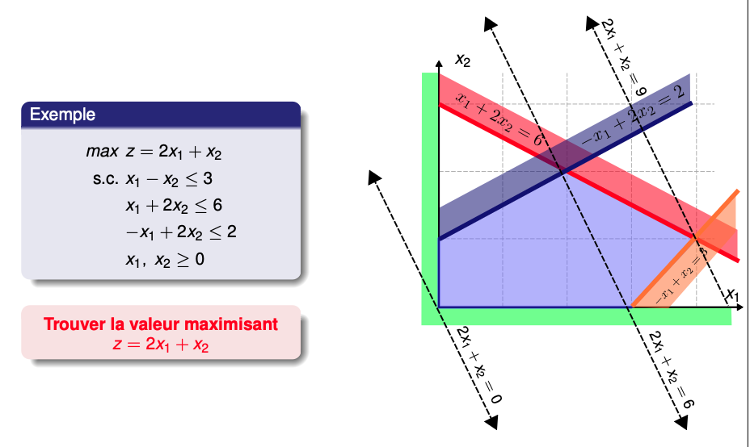

## 线性规划

线性规划用于解决资源有限下的最优分配问题，但需要基于以下假设：
- 目标是线性的
- 约束是线性的
- 决策变量可连续分割（若不可连续分割可采用别的方法，例如整数线性规划）

假设一家工厂同时生产两类产品：产品 A 和产品 B。
- 每生产一单位产品 A，需要消耗 2 小时机器时间和 1 单位原材料。
- 每生产一单位产品 B，需要消耗 1 小时机器时间和 3 单位原材料。

工厂每天最多拥有 100 小时机器时间和 90 单位原材料。同时每单位产品 A 可带来利润 40 元； 每单位产品 B 可带来利润 50 元。我们希望求解：如何决定每天生产多少产品 A 和产品 B，使得总利润最大，同时不超过资源限制？

在下面的章节我们将会介绍建模这个问题并且如何求解类似问题。

### 问题建模

**决策变量**（decision variable）
- 表示问题中真正由我们决定的量，通常记为向量 $x \in \mathbb{R}^n$。
- 这里的 $n$ 表示需要同时决定的变量个数，$x_i$ 表示第 $i$ 个具体决策量。

> 在我们的例子中，即每天生产 $A$ 和生成 $B$ 的数量，分别表示为 $x_{1}$ 和 $x_{2}$

**目标函数**（objective function）
- 定义在所有的方案中什么叫更好的方案。
- 若每个变量 $x_i$ 对收益的单位贡献为 $c_i$，那么总收益可以写成 $c_1x_1 + c_2x_2 + \cdots + c_nx_n$，用向量形式就是 $c^Tx$。
- 这里 $c \in \mathbb{R}^n$ 称为**目标系数向量**（objective coefficient vector），它刻画每个决策变量在优化目标中的权重。目标函数 $c^Tx$ 的作用，是把一个高维方案 $x$ 映射成一个标量，从而让不同方案之间可以比较大小。如果问题追求收益最大化，就写成 $\max c^Tx$；如果问题追求成本最小化，则可以写成 $\min c^Tx$。

> 在我们的例子中，我们的目标是最大化生产两个产品所带来的利润

**线性约束**（linear constraints）
- 只有目标函数还不够，因为现实问题中的最优选择从来不是在整个 $\mathbb{R}^n$ 中任意搜索。这些限制决定了哪些 $x$ 是可接受的。
- 常见形式是 $Ax \leq b$，其中 $A \in \mathbb{R}^{m \times n}$ 是**约束系数矩阵**（constraint coefficient matrix），$b \in \mathbb{R}^m$ 是**资源上界向量**（resource bound vector）。
- 矩阵 $A$ 的第 $i$ 行描述第 $i$ 条约束中各个变量的消耗或贡献，$b_i$ 描述该约束允许的最大值。于是 $(Ax)_i \leq b_i$ 表示第 $i$ 类资源消耗不能超过上限。

把目标函数和约束放在一起，一个典型的**线性规划模型**可以写成：

$$
\begin{aligned}
\max \quad & c^T x \\
\text{s.t.} \quad & Ax \leq b, \\
& x \geq 0.
\end{aligned}
$$

- $\max c^Tx$ 说明我们希望最大化方案 $x$ 带来的线性收益
- $Ax \leq b$ 说明方案必须满足 $m$ 条线性资源约束
- $x \geq 0$ 表示每个决策变量都不能为负。

> 因此在我们的例子，假设 $x_{1},x_{2}$ 分别为产品 $A$ 和产品的 $B$ 的生产量，整个问题可以表达为：
> $$
> \begin{aligned}
> \max \quad & 40x_1+50x_2 \\
> \text{s.t.}\quad
> & 2x_1+x_2\le100,\\
> & x_1+3x_2\le90,\\
> & x_1,x_2\ge0.
> \end{aligned}
> $$

**可行解**（feasible solution）指满足所有约束条件的决策向量 $x$。由所有可行解构成的集合称为**可行域**（feasible region），通常记为

$$
\mathcal{F}=\{x \in \mathbb{R}^n \mid Ax \leq b,\ x \geq 0\}.
$$
总结：
- 决策变量 $x$ 表示我们能够控制的方案，
- 目标系数 $c$ 表示评价方案优劣的标准，
- 约束矩阵 $A$ 和向量 $b$ 表示现实世界对方案施加的限制，
- 目标函数优化等价于：在所有合法方案 $x \in \mathcal{F}$ 中，找到使 $c^Tx$ 最大的那个方案，形式上可以写成 $\max_{x \in \mathcal{F}} c^Tx$。
### Naive 求解：遍历线性规划问题所有极点

如何求解线性规划问题？
- 线性约束会把空间切成一个凸多面体
- 而目标函数 $c^Tx$ 则像一个沿着方向 $c$ 不断移动的超平面。
- 于是，求解线性规划的问题等价于在一个凸多面体上，找到目标函数最大的那个点。

如上图所示，在二维情况下，
- 若只有两个变量，约束条件会在平面中形成若干半平面，它们的交集构成一个多边形区域。
- 目标函数 $c^Tx=\alpha$ 对应一族互相平行的直线。
- 当 $\alpha$ 不断增大时，这条直线会沿着方向 $c$ 平移，直到它最后一次接触可行域的位置。
- 这个最后接触的点，往往是边界上的尖角位置。

为了严格描述这种尖角，需要引入 **极点**（vertex）的概念。在线性规划中，可行域通常是一个凸多面体，因此其中很多点都可以由其他点混合得到。例如，若两个点 $x_1,x_2$ 都在可行域中，那么它们的凸组合
$$
x=\lambda x_1+(1-\lambda)x_2,\quad 0\leq \lambda\leq1
$$
仍然位于可行域内部。

**极点**（vertex）刻画的正是那些无法再被进一步分解的点。形式上，一个点 $x$ 是多面体的极点，如果它不能表示成两个不同可行点的非平凡凸组合。换句话说，不存在 $x_1\neq x_2$ 和 $0<\lambda<1$，使得
$$
x=\lambda x_1+(1-\lambda)x_2.
$$

有了极点之后，一个非常重要的结论就出现了：

> [!note]
> 若线性规划存在最优解，则至少存在一个最优解是可行域的极点。

这个结论通常被称为 **线性规划基本定理**（fundamental theorem of linear programming）。它的重要性在于：它把一个“连续空间上的优化问题”，压缩成了一个“有限候选点之间的比较问题”。

为什么这个结论会成立？核心原因在于目标函数是线性的。假设某个最优点 $x^*$ 不是极点，那么根据定义，它可以写成
$$
x^*=\lambda x_1+(1-\lambda)x_2
$$
其中 $x_1,x_2$ 都是不同的可行点。由于目标函数是线性的：
$$
f(x^*)=f(\lambda x_{1}+ (1-\lambda)x_{2}) = \lambda f(x_{1})+(1-\lambda)f(x_{2}), \; f:x \mapsto c^Tx
$$

因此 $x^*$ 的目标函数可以被理解为 $x_{1}$ 和 $x_{2}$ 的目标函数的加权平均。对于最小化问题，不可能同时出现 $(x_{1},x_{2})\in \mathcal{F}^2$,
$$
	f(x_{1}) > f(x^*), \quad f(x_{2})>f(x^*)
$$

否则他们的加权平均将会大于 $f(x^*)$，因此必然至少存在一个点满足 $f(x_{i})\leq f(x^*)$. 对于最大化问题也是同样。

这意味着：即使当前最优解位于某条边或某个面内部，我们也总能沿着这个面继续移动，最终抵达某个极点，而目标值不会变差。

**因此原本我们似乎需要在无限多个可行点中搜索最优解，但现在知道只需要检查可行域的极点即可。**

于是得到了一个最朴素的求解算法：
1. **枚举可行域中的所有极点；**
2. 对每个极点计算目标函数值 $c^Tx$；
3. 取其中最大的那个。

这个思路本质上是一个离散搜索算法，利用线性规划可行域和目标函数的凸性，把问题离散化成有限个候选点之间的比较。

在低维情况下，这个方法是可行的。二维或三维问题中，可行域的极点数量通常不多，可以直接画图或逐个检查。但随着维度增长，可行域的复杂度会急剧爆炸。一个高维多面体可能拥有指数级数量的极点，而每个极点都对应若干约束超平面的交点。即使单个极点容易计算，枚举全部极点的代价也会迅速失控。因此我们希望在高维度情况下，不枚举所有的极点就找到最优极点。

### 单纯形法求解

**单纯形法**（Simplex Method）希望不遍历全部极点，而是在极点之间有方向地移动，并且保证目标函数不断改善，最终抵达最优极点。

> 类似不停地向损失函数最低的方向移动。

由于可行域是一个凸多面体，而极点对应若干约束超平面的交点，因此我们可以把整个优化过程理解成：
- 当前位于某个极点；（如何用代数方式刻画极点？）
- 沿着多面体的一条边移动；（我们应该选择哪一条边移动？如何建模移动？单纯形法会计算出来）
- 每一步都让目标函数变得更优；
- 最终抵达一个无法继续改进的极点。

于是求解线性规划变成了在极点图（graph of vertices）上的一种局部迭代过程。

> TBD
