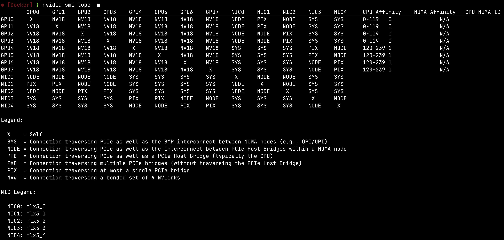
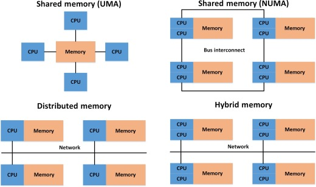

在 [现代 AI 集群通信体系](现代%20AI%20集群通信体系.md) 中我们分析了不同通信硬件、互连拓扑和网络协议栈，本文通过 `nvidia-smi topo -m` 展示的是服务器内部 GPU、NIC、CPU Socket、NUMA 与 PCIe/NVLink 的物理通信拓扑：本机中 GPU0-7 两两之间均为 `NV18`，说明 8 张 GPU 通过 NVLink/NVSwitch 形成了全互连高速 Fabric，因此节点内 GPU-GPU 通信通常直接走 NVLink，而不经过 CPU 与 NUMA hierarchy，非常适合 TP、EP、AllReduce 等高通信量并行；而跨节点通信时则需要关注 GPU 与 NIC 的 PCIe/NUMA 距离，此时 `PIX > NODE > SYS` 分别对应越来越远的 PCIe/NUMA 路径与更高通信代价，因此训练和推理框架（如 NCCL、Megatron、vLLM）通常会优先将 GPU 绑定到最近的 NIC，以减少 PCIe hierarchy 与跨 NUMA 带来的 latency 和 bandwidth loss。

## 命令

通过

```bash
nvidia-smi topo -m
```

可以查看服务器上拓扑情况。

## 结果分析



其中关于 Legend 下文字的翻译：

| 标记 | 含义 |
|------|------|
| X | 自身 |
| SYS | 经过 PCIe + NUMA 节点间 SMP 互连（如 UPI/QPI） |
| NODE | 经过 PCIe + NUMA 内部不同 PCIe Host Bridge 间互连 |
| PHB | 经过 PCIe Host Bridge（通常是 CPU Root Complex） |
| PXB | 经过多个 PCIe Bridge，但不经过 Host Bridge |
| PIX | 最多经过一个 PCIe Bridge |
| NV# | 经过绑定的 NVLink 连接（例如 NV18 表示 18 条 NVLink lane 聚合） |

以上图为例我们分析从命令输出能得到那些信息。

### 整体结构

```
CPU Socket 0 (NUMA 0)
 ├── GPU0 GPU1 GPU2 GPU3
 ├── NIC0 NIC1 NIC2
 └── PCIe Host Bridge

CPU Socket 1 (NUMA 1)
 ├── GPU4 GPU5 GPU6 GPU7
 ├── NIC3 NIC4
 └── PCIe Host Bridge
```

- GPU0-3 更靠近 NUMA0，GPU4-7 更靠近 NUMA1
- 前 120 个 CPU core 属于 socket0。后 120 个 CPU core 属于 socket1

### NVLink

NV18 意味着两个 GPU 之间通过一组 bonded NVLink 相连。在本例中，GPU0 到 GPU7 全都是 NV18 意味着这是一个全互连 NVLink Fabric。这意味着节点内通信任意 GPU 都能高带宽访问任意 GPU，可以支持高达 8 卡 TP。
### NUMA 和 PCIe

**NUMA（Non-Uniform Memory Access）** 描述的是多路 CPU 系统中的非一致内存访问拓扑。每个 NUMA node 通常包含一组 CPU core 与其本地 DRAM。访问本地内存代价较低，而访问其他 NUMA node 的内存则需要经过 CPU 间互连（如 UPI/QPI），因此延迟和带宽并不一致。



因此假设 GPU0 (NUMA0) -> NIC1 (NUMA1)，需要首先走 PCIe -> CPU0 Root Complex -> CPU 间互连设备（例如 UPI/QPI）-> CPU1 Root Complex -> NIC1.

**NUMA 更主要影响 GPU 与 NIC、CPU、Host DRAM 等 PCIe 路径通信。** 在本例中，对于 GPU0 (NUMA0) -> GPU4 (NUMA1) 的场景，GPU0 与 GPU4 虽然可能在不同 NUMA socket 对应的 PCIe hierarchy 下，但由于 GPU 间存在直接 NVLink/NVSwitch 互连，因此 GPU-GPU 通信通常优先走 NVLink fabric，而不经过 CPU Root Complex 与 UPI/QPI。因此 NUMA 对 GPU 间通信的影响会显著降低。

### 跨节点通信

再看跨节点通信场景。为了跨节点通信，GPU 需要通过网卡 NIC 向别的主机发送数据。以 GPU0 为例可以看到：

```
GPU0 -> NIC1 = PIX
GPU0 -> NIC0 = NODE
GPU0 -> NIC3 = SYS
```

这意味着，
- GPU0 和 NIC1 只经过一个 PCIe bridge，通常是最优 RDMA 路径之一
- GPU0 和 NIC0 需要跨 PCIe Host Bridge，意味着可能需要经过多个 PCIe bridge，略次于前者
- GPU0 和 NIC3 需要跨 NUMA，因此不仅有多个 PCIe bridge 开销，还有 CPU 间互连开销，是最差的选择。

在本例中，
- GPU0-1 最好用 NIC1
- GPU2-3 最好用 NIC2
- GPU4-5 最好用 NIC3
- GPU6-7 最好用 NIC4

## 对模型训练和推理的影响

该节点内部 GPU 间存在全互连 NVLink/NVSwitch Fabric，因此节点内 GPU-GPU 通信带宽和延迟都非常优秀，适合进行高通信量的 Tensor Parallel（TP）或 Expert Parallel（EP）。

对于节点间通信，则需要关注 GPU 与 NIC 的拓扑亲和性（topology affinity）。

不同 GPU 到不同 NIC 的 PCIe/NUMA 路径代价不同：
- PIX 通常是最优 RDMA 路径
- NODE 次之
- SYS 由于需要跨 NUMA socket，通常延迟更高、带宽更差

因此在多机训练或推理中，通信框架（如 NCCL）通常会尽量让 GPU 绑定距离最近的 NIC，以减少 PCIe hierarchy 与 NUMA 带来的额外开销。