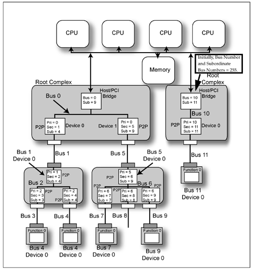
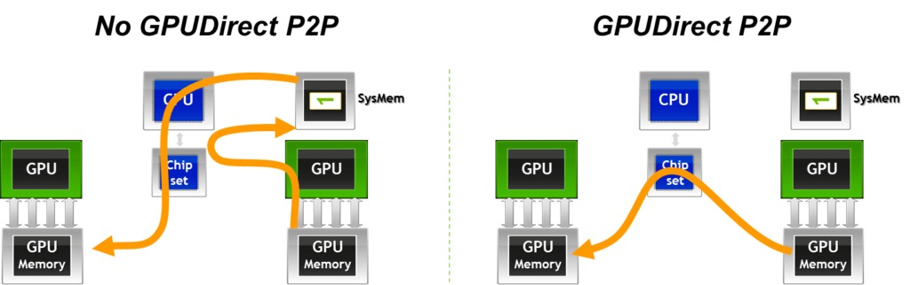
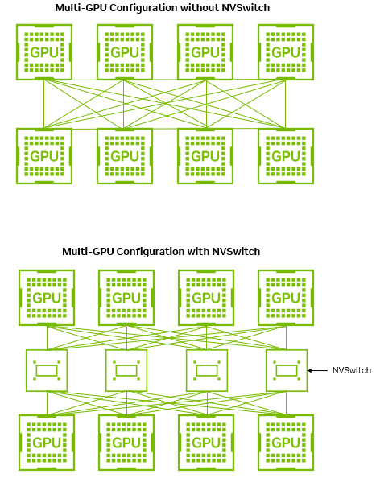
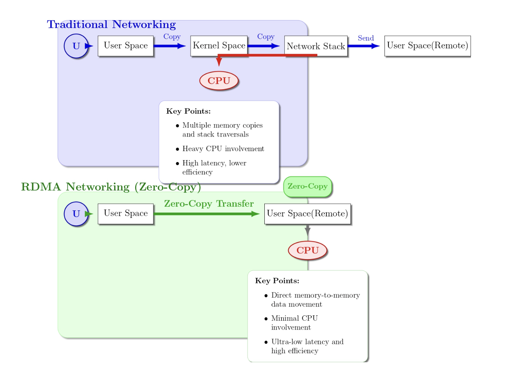
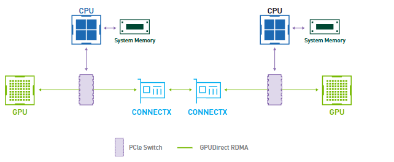

这篇文章介绍了现代 AI / HPC 集群中的 GPU 通信体系，以及为什么“大模型训练”本质上越来越像一个网络系统问题。

文章从单机内 GPU 互连开始，介绍 PCIe、NVLink 与 NVSwitch 的拓扑与数据流；再扩展到多机场景中的 RDMA、InfiniBand 与 RoCE，解释为什么跨机器通信会成为分布式训练与推理的核心瓶颈。

核心主线可以概括为：
- PCIe 是通用设备总线，但 GPU 通信带宽有限
- NVLink / NVSwitch 是为 GPU-GPU 高带宽通信专门设计的互连 fabric
- 当 GPU 跨机器后，网络成为新的瓶颈
- RDMA 的本质是把网络通信尽量变成内存访问
- InfiniBand 是原生为 RDMA/HPC 设计的网络体系
- RoCE 则是在 Ethernet 生态中实现接近 RDMA 的能力
- 大规模 LLM 训练中的通信拓扑、并行策略与系统设计，本质上深受这些硬件互连能力约束

## 单机多卡互连

### 基本设施

### 基础互连：PCIe

**PCIe（Peripheral Component Interconnect Express）** 本质上是现代计算机里的通用高速总线。它最初并不是为 GPU 设计的，而是为了统一 CPU 与各种外设（网卡、SSD、GPU、FPGA 等）的通信接口。

GPU 插在 PCIe 插槽上，本质上也是 PCIe Device。

PCIe 的设计目标是通用性。其基本特点是：
- 系统拓扑是中心化的，所有设备都挂在 CPU Root Complex 下
- 各个设备通过 PCIe Switch / Root Port 接入
- 数据以 packet 的形式在链路上传输

**如何通过 PCIe 将 GPU0 上的数据发给 GPU1？**
- 整个过程通常从 CPU 发起一个 GPU-to-GPU copy 请求开始，例如被 CUDA Runtime 执行 ``cudaMemcpyPeerAsync(...)` 调用
- CPU 会完成一些控制层面的工作，例如检查两个 GPU 是否支持 P2P（Peer-to-Peer）访问、配置 DMA 参数、建立地址映射等
- GPU0 上的 DMA Engine（DMA copy engine）会开始工作。它会从 GPU0 的显存（VRAM）中读取数据，并将这些数据封装成 PCIe packet。
- 这些 packet 会经过 PCIe 拓扑中的交换结构，即 PCIe Switch 或者 Root Complex
- *如果 GPU0 和 GPU1 支持 PCIe P2P*：则直接 `GPU0 VRAM -> PCIe Switch/Root Complex -> GPU1 VRAM` 链路发送，数据不经过 CPU core 也不经过 Host DRAM
- 但是如果不支持的话，就需要借助 Host DRAM 作为中转站，进行两次 DMA 运输[^1]，即退化为 staged copy：`GPU0 VRAM -> Host DRAM -> GPU1 VRAM`.

[^1]: DMA（Direct Memory Access）是 CPU 让设备自己搬数据，而不是让 CPU 自己搬。DMA 可以让别的设备从别处搬进来 (DMA write into device memory)，也可以从自己这里搬出去 (DMA read from device memory)

这意味着，在 GPU0 和 GPU1 之间有没有 P2P 的情况下：
- 有 P2P 的情况下，通信开销是一次 PCIe 传输
- 没有 P2P 的情况下，通信开销是两次 PCIe 传输 + DRAM 写入+读取开销

总结 PCIe 的限制：
1. 带宽有限
2. 延迟相对高
3. 多 GPU 会竞争总线
4. GPU 间通信通常需要经过 CPU Root Complex 或 PCIe Switch

不同版本的 PCIe 带宽参考

| **互连**        | **代际** | **单 GPU 总带宽（双向）** |
| ------------- | ------ | ----------------- |
| PCIe Gen3 x16 | 通用     | ~32 GB/s          |
| PCIe Gen4 x16 | 通用     | ~64 GB/s          |
| PCIe Gen5 x16 | 通用     | ~128 GB/s         |

## GPU 间专属：NVLink

NVLink 是为了加速 GPU 间数据通信，NVIDIA 专门为 GPU-GPU 设计的高速直连网络。

NVLink 可以在两张 GPU 之间建立直接的点对点链路，而不依赖 Host DRAM 中转。
- NVLink 支持 GPU 直接访问其他 GPU 的显存。
- NVLink 用于构建高带宽、低延迟的多 GPU 通信 fabric。

以下是不同版本的 NVLink 带宽参考

| **互连**                | **代际**    | **单 GPU 总带宽（双向）** |
| --------------------- | --------- | ----------------- |
| NVLink 1.0（P100）      | Pascal    | ~160 GB/s         |
| NVLink 2.0（V100）      | Volta     | ~300 GB/s         |
| NVLink 3.0（A100）      | Ampere    | ~600 GB/s         |
| NVLink 4.0（H100）      | Hopper    | ~900 GB/s         |
| NVLink 5.0（B200/B100） | Blackwell | ~1.8 TB/s         |

可以看到 NVLink 不仅在带宽上远远高于 PCIe 链路，而且带宽增长速度也远快于后者。

## GPU 交换机：NVSwitch

在有少量 GPU 时，可以直接 GPU 两两通过 NVLink 直连，但是当 GPU 数量变多时，直连数量级是 $O(n^2)$，因此需要一个设备来专门实现 GPU 间数据转发，类似计算机网络中的交换机。

NVSwitch 把所有 GPU 接到交换芯片上，由交换芯片负责转发流量。
- 这样使得每张 GPU 并不需要和另外所有的 GPU 都直接一一连接
- 而是通过多个 NVSwitch 构成全互连拓扑
- GPU 发给别的 GPU 时，路径是： `GPU -> NVLink -> NVSwitch -> NVLink -> GPU`

在一个推理服务器例如 DGX[^2] 中通常有多个 NVSwitch，每个 NVSwitch 与多个 GPU 连接[^3].

[^2]: NVIDIA 的 Deep Learning GPU System
[^3]: 这也意味着两个 GPU 之间可能有多条可达路径

## 多机场景

### RDMA

**RDMA（Remote Direct Memory Access）** 是一种通信模型，允许一台机器可以直接访问另一台机器内存，而不经过对方 CPU。它允许一台机器上的网卡直接读写另一台机器的内存，不需要 CPU 负责协议栈和 buffer 管理，而尽量绕过双方 CPU 对数据路径的参与，从而降低延迟、减少 CPU 开销，并避免多余的数据拷贝。

在传统 TCP 通信中，数据通常需要经过 kernel buffer、协议处理、上下文切换以及多次内存拷贝[^4]；而 RDMA 在受信的数据中心网络环境中，通过 kernel bypass、NIC offload 与 zero-copy 等机制，大幅降低了延迟与 CPU 开销。

但 RDMA 不适用于经常会发生丢包的场景下，一旦丢包就会造成 queue blocking，从而导致 latency 很高。

### InfiniBand

**InfiniBand 是一种高性能集群网络，用来连接多台服务器/GPU 节点，让它们之间高速、低延迟通信**。它常用于 HPC、AI 训练、大模型集群、超算、GPU 云平台，其拥有一套相对独立的网络体系，包括自己的网卡、交换机、链路层协议、拥塞控制和 RDMA 语义。

在 AI 集群里，InfiniBand 的典型作用是连接不同服务器上的 GPU。单机内 GPU 可以通过 PCIe / NVLink / NVSwitch 通信；一旦跨机器，就必须经过网卡和网络交换机。InfiniBand 的价值在于，它天然支持 RDMA，可以让一台机器的网卡直接读写另一台机器的内存，从而绕过传统 TCP/IP 协议栈中的大量 CPU 参与。

### RoCE

RoCE（RDMA over Converged Ethernet）是在以太网上实现 RDMA 的方案。

  

它的动机很直接：InfiniBand 性能很好，但需要专门的网络设备和生态，这意味着需要另外购买 IB 网卡、IB Switch、IB cable 等，不兼容现有数据中心；而以太网已经是数据中心最普遍的网络基础设施。如果能在以太网上跑 RDMA，就可以在保留 Ethernet 生态的同时，获得接近 InfiniBand 的低 CPU 开销和 zero-copy 通信能力。

相较于 InfiniBand，RoCE 的核心思想是在保留现有 Ethernet 数据中心生态与基础设施的前提下，以略微牺牲部分网络原生性与极致性能为代价，换取接近 RDMA 的高性能通信能力与更低部署成本。

## 带宽比较

| 互连方式 | 典型范围 | 主要场景 |
|---|---:|---|
| PCIe Gen4 x16 | ~64 GB/s 双向 | 单机内 CPU-GPU / 设备互连 |
| PCIe Gen5 x16 | ~128 GB/s 双向 | 单机内高速设备互连 |
| NVLink 4.0 | ~900 GB/s 双向 / GPU | 单机内 GPU-GPU |
| NVLink 5.0 | ~1.8 TB/s 双向 / GPU | Blackwell GPU 节点内互连 |
| InfiniBand NDR | 400 Gb/s，即约 50 GB/s / 端口 | 多机 GPU 集群 |
| InfiniBand / Ethernet 800G | 800 Gb/s，即约 100 GB/s / 端口 | 新一代 AI 集群网络 |

## 参考资料

- [PCI Express System Architecture](https://www.oreilly.com/library/view/pci-express-system/0321156307/0321156307_ch21lev1sec6.html)
- [P2P peer-to-peer on NVIDIA RTX 2080Ti vs GTX 1080Ti GPUs](https://www.pugetsystems.com/labs/hpc/p2p-peer-to-peer-on-nvidia-rtx-2080ti-vs-gtx-1080ti-gpus-1331/)
- [NVIDIA NVLink and NVIDIA NVSwitch Supercharge Large Language Model Inference](https://developer.nvidia.com/blog/nvidia-nvlink-and-nvidia-nvswitch-supercharge-large-language-model-inference/)
- [HPC networking: Introduction to InfiniBand](https://www.cudocompute.com/blog/hpc-networking-introduction-to-infiniband)

[^4]: 例如，在调用 `send(fd, user_buf, len, 0);` 时内核通常要把 `user_buf` 里的数据复制到内核维护的 socket buffer，之后网卡通过 DMA 从内核 buffer 取数据发出去。
