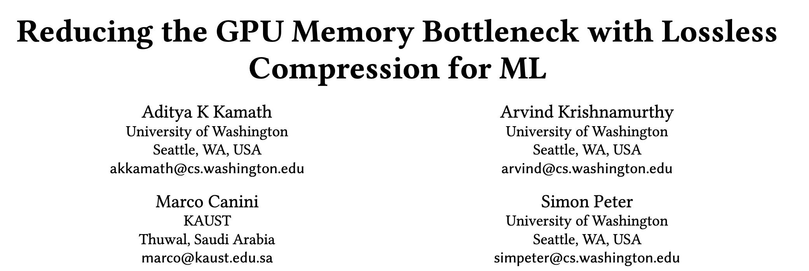
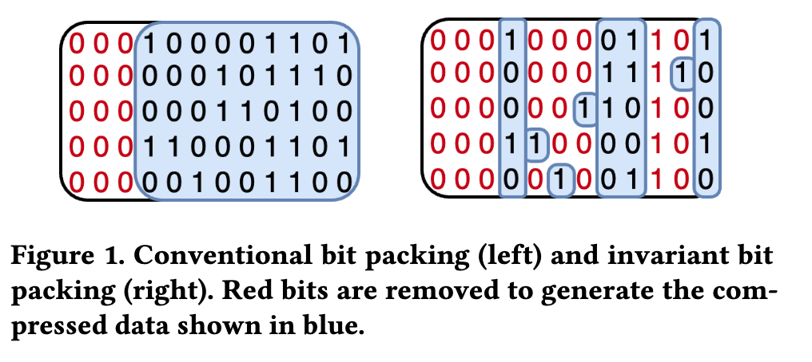

## 问题背景

### PCIe 带宽带来的内存瓶颈问题

在推理过程中，有把数据从 CPU 搬到 GPU 的需求。
- 比如 GNN 训练时，节点 feature 可能有几百 GB 到 TB；
- DLRM 推荐模型里 embedding table 巨大；
- LLM 长上下文推理时 KV cache 也可能远超显存。

常见做法是：把大数据放在 CPU memory、disk 或远端存储里，需要时再通过 PCIe 搬到 GPU。


然而 PCIe 带宽远低于 GPU HBM 带宽，因此 GPU 算得很快，但经常在等数据，这就形成 memory / PCIe bottleneck。

### 优化手段：无损压缩

> 文中还简略提及了有损压缩的方式，但是不是后文的重点所以忽略。

为了缓解这个瓶颈问题，已有方法常使用缓存、prefetch、overlap，以及有损压缩如 quantization。但有损压缩可能引入模型精度风险；传统无损压缩虽然不损失精度，但 GPU 解压开销和额外元数据可能抵消传输收益。

因此如果要实现无损压缩，我们希望它能满足以下条件：
1. 压缩后必须能完全还原原始 tensor，不改变模型输出，不引入精度风险。
2. 解压必须足够快，最好让解压开销被 PCIe 传输隐藏掉。
3. 元数据要小，不能为了压缩又占用大量 GPU 显存，因为 GPU 显存本来就紧张。

## 本文目标

设计一种面向 ML tensor 传输的无损压缩机制，使其
1. 能够在不影响模型精度的前提下，减少 CPU→GPU 的 PCIe 数据传输量，
2. 并通过 GPU-friendly 的低开销解压，使压缩收益能够转化为端到端训练/推理加速。

## Key Insights

1. ML tensor 并不是随机比特流。虽然 tensor 数值看起来很多样，但它们来自结构化分布，在 bit level 上经常存在共享模式。
2. **Tensor 中稳定的共享结构 invariant bits**：
	- 很多 tensor 在相同 bit position 上具有稳定值，尤其是浮点数的 sign bit 和 exponent bits。
	- 虽然完整的数值不同，但某些 bit position 可能 80%、90% 以上都一样，
	- 这些稳定的 bit 被称为 **invariant bits**.
	- BF16 因为 exponent bits 更多，LLM KV 和 weights 里有更多可利用的不变位。
	- 总结：存在很多 invariant bits 且在大量 tensor 之间可能保持一致或高度一致
3. 传统 bit packing 通常关注单个值内部能否去掉前导零，或者整数范围是否足够小；但这对浮点 tensor 效果有限。IBP 的核心变化是从单个值内部压缩转向**跨 tensor** 的同一 bit position 压缩。
4. 对 ML 系统来说，压缩率不是唯一目标。真正重要的是压缩后的数据传输和 GPU 解压总时间是否更低。因此 IBP 需要小 metadata、GPU-friendly 解压、aligned PCIe transfer，并尽量让解压开销被数据传输隐藏。



## 本文提出的方法

本文提出 **Invariant Bit Packing (IBP)**，核心流程包括：
1. **Preprocessing**：扫描 tensor 集合，统计每个 bit position 上 0/1 的出现频率，生成 Mask 和 Bitval。Mask 表示哪些 bit position 是 invariant，Bitval 表示这些位置的固定值。
2. **Compression**：对每个 tensor chunk，如果其 invariant bit 与 Bitval 匹配，则删除这些 invariant bits，只保留非 invariant bits；如果不匹配，则保持未压缩或部分未压缩。
3. **Decompression**：GPU 端使用 warp-parallel decompression，根据 Mask 和 Bitval 将被删除的 invariant bits 插回去，并用 zero-copy、shared memory、asynchronous read、128B aligned transfer 降低 PCIe 访问和解压开销。


### 预处理：判断哪些位置高度相似、可以被删除

**Chunk**. 把一个 tensor 的 bit 序列切成若干个固定大小的小片段，每个小片段叫一个 chunk[^1]。


例如有 $N=5$ 个 tensor chunk：

```text
t1 = 1001 1101
t2 = 1001 1011
t3 = 1001 0010
t4 = 1001 1100
t5 = 1000 1001
```

IBP  会按 **bit position** 纵向统计每一列有多少个 1：

```text
count(1) = [5, 0, 0, 4, 4, 2, 2, 3]
N = 5 // tensor chunk 数量
```

然后设一个阈值 $T$。论文里说会 sweep 不同 $T$，但实践上 $T=0.8N$ 通常效果好。这里 $N=5$，所以$T=4$。
- 如果某个 bit position 中 1 的数量 $≥ T$，那么这个位置可以认为稳定为 1。
- 如果某个 bit position 中 0 的数量 $≥ T$，也就是 count(1) $≤ N - T$，那么这个位置可以认为稳定为 0。
- 否则，这个位置不稳定，不能删。

所以就可以判断 bit0-bit4 为稳定，bit5-bit7 不稳定，生成：

```text
Mask   = 1111 1000
Bitval = 1001 1000
```

### 压缩

有了 Mask 和 Bitval 后，压缩每个 chunk 时要判断它是否“参与压缩”，判断条件是：

```
(chunk & Mask) == Bitval
```

这是因为 invariant 不是 100% invariant，而可能是 80% invariant。也就是说，有些 chunk 不符合这个模式。如果不符合，还硬删 bit，解压就还原不回来了。

对于 chunk 0-1：

```text
chunk 0 = 1001 1101
chunk 1 = 1011 1101
```

- chunk 0 可以被压缩成 `compressed payload = 101`
- 而 chunk 1 存在有与 Mask 不一致的位置，则不可以被压缩，不然解压时会插回错误的值

论文在原来 chunk 上加一个 participation bit 来区分表示这个 chunk 是否被压缩。

### 解压

根据 Participation bit 的值决定是读取完整 chunk 还是需要插入 invariant bits.

根据 Mask 的值决定是从 Bitval 还是 compressed payload 拿。

用伪代码可以表示为：

```
if participation_bit == 1:
    for each bit position:
        if Mask[position] == 1:
            output[position] = Bitval[position]
        else:
            output[position] = next_bit_from_compressed_payload
else:
    output = raw_chunk
```


[^1]: 这里对 tensor 切成固定大小的 chunk，是为了能够使后续 GPU 并行解压时提供并行可能。如果整个 tensor 压缩成一个变长 bitstream，后面的线程不知道自己应该从哪里开始读，只能串行解析前面的 bits。这会毁掉 GPU 并行性。


