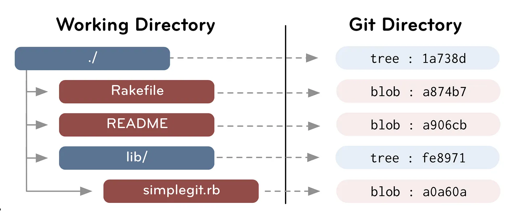
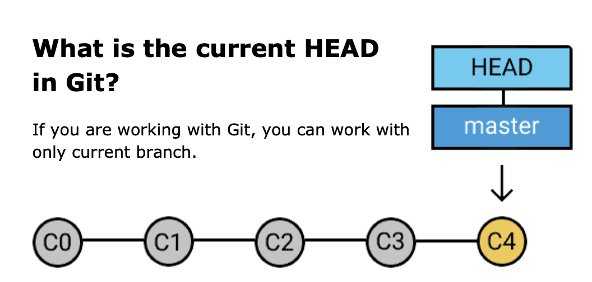

在软件开发中，一个项目从最初的几行代码，到逐渐演化成复杂系统，整个开发过程本质上是一系列变化的积累。

但问题在于，**变化本身是很难管理的。** 我们如何描述项目状态的变化？如果没有工具，我们只能：
- 手动复制文件做备份（例如 `project_final_v3_real_final`）
- 靠记忆或零散笔记记录修改原因
- 在多人协作时反复覆盖彼此的工作

这在本质上是混乱的，因为我们没有一个结构化的方式来记录历史。

**版本控制系统（Version Control System, VCS）** 正是为了解决这个问题而出现的。它将一个项目的演化过程抽象为一系列“快照”（snapshot）及其之间的关系。

从这个角度看，一个项目的开发过程可以类比为一个**状态机**：
- 每一个快照是一个“状态”，而开发过程就是在这些状态之间不断演进。
- 每一个快照记录某一时刻项目的完整状态，同时附带元信息（作者、时间、修改说明等），从而让这些变化变得可追踪、可理解、可回溯。

本文简单介绍 **Git**，作为现代版本控制系统的事实标准，是如何解决这些问题的。

## Git Repository and Data Types

**Git** 通常和一个文件夹关联，记录这个文件夹在不同时间点的状态。

**Git 对象** 是对项目数据的分层建模：
- blob 表示文件内容
- tree 表示目录结构
- commit 表示某一时刻整个项目的状态。这里“状态”不仅是指项目的当前文件快照（内容），还包括基于哪一个上一个状态（时间关系），以及做出这些变化的作者、时间、message 等信息。


```
type object = blob | tree | commit
```


### 文件系统相关：Blob, Tree 和 Snapshot

文件树中的文件和目录对应 Git 的两种对象：
- **Blob** - File：文件内容（纯数据）
- **Tree** - Directory：目录结构（名字 + 指针）



因此：

```
// a file is a bunch of bytes
type blob = array<byte>

// a directory contains named files and directories
type tree = map<string, tree | blob>
```


项目的文件**快照（Snapshot）**. 即某一时刻整个项目的完整结构 + 内容。Snapshot 可以用项目根目录的 tree 来表示，例如下图就展示了一个可能的文件快照。


### 历史追踪相关：History 和 Commit

**History**. 在 Git 中，历史可以表示为一个有向无环图（DAG），其中每个节点是项目的一个 snapshot.
- 这意味着，除了根节点之外（即初始状态），每个 snapshot 都会指向一个或多个父节点
- 这意味着这个 snapshot 由之前项目的每个状态经过若干改变修正而来

**Commit** 记录了一次项目状态. Commit 是 Git 历史中的一个节点，它包含
- 一个文件快照，即当前时刻项目文件的状态，也就是从项目根目录为根结点的 tree，描述该时刻文件结构和内容
- 指向其父 commit 的引用，记录是从哪一个快照而来的，从而将多个 snapshot 连接成一个有向无环图。
- 一些元信息，例如作者、提交时间和 message


```
// a commit has parents, metadata, and the top-level tree
type commit = struct {
    parents: array<commit>
    author: string
    message: string
    snapshot: tree
}
```

Git 中的 commit 是不可变的。这不意味着 commit 中的错误无法被修正，只是说，对提交历史的“修改”，实际上是创建新的 commit，然后更新引用（reference）去指向这些新的 commit。

### 总结：Commit, Tree 和 Blob

Commit, tree 和 blob 的概念可以从下图体现。Commit 通过存储项目根目录 tree 指针的方式记录项目的 snapshot.


## Git 中的引用

因为 Git 对象是根据项目内容 hash 标识的，基于项目历史不可篡改的项目，所有 Git 对象都是不可变的。假如我们想回到项目之前历史的某一时刻，我们需要改变项目的状态。

这可以通过指针来实现，用以指向某个 commit，从而表示当前所在的位置。例如，
- HEAD 表示当前项目的位置，通过指向某个 commit（通常经由分支）来确定当前状态
- Branch 表示一条开发分支，指向某个 commit，并随着新的提交不断向前移动，从而记录一条状态的演化路径。与此同时，不同的 branch 表示项目历史中不同的开发路径，例如并行进行修复代码逻辑 A 的 bug 和增加新功能代码逻辑 B. 一条 Branch 可以被命名为 `main`, `master`, `dev-XXX` 等.




**Git Reference**. 即指向某一个 commit 的指针，并且可以被灵活移动。其中，
- 一部分 reference（如 branch）是可移动的，会随着新的提交不断向前推进；
- 而另一部分（如 tag）则用于固定标记历史中的特定位置，通常不会改变。

## Git Repository：可回溯的状态空间

从上面的角度来看，Git 实际上构建了一个完整的“项目状态空间”：
- **objects（blob / tree / commit）** 描述了“状态是什么”
- **references（HEAD / branch / tag）** 描述了“当前在哪个状态，以及如何移动”

因此可以理解为 **Git = 一个不可变的状态集合 + 一组可移动的指针**. 这使得 Git 具备了几个关键能力：
- 可以精确记录每一个历史状态（snapshot）
- 可以在不同状态之间自由切换（checkout）
- 可以并行演化多个开发路径（branch）
- 可以在不破坏历史的前提下进行修改（通过创建新的 commit）

因此，Git 构建了一个可导航、可回溯、可分叉的状态空间，而开发过程本质上就是在这个状态空间中的不停移动。

## 参考资料

- [Version Control and Git](https://missing.csail.mit.edu/2026/version-control/)
- [Part 2: Blobs and trees](https://alexwlchan.net/a-plumbers-guide-to-git/2-blobs-and-trees/)
- [Git from the bits and pieces, beyond the basics — Part 1](https://medium.com/swlh/git-from-the-bits-and-pieces-beyond-the-basics-part-1-aca2d02d360b)