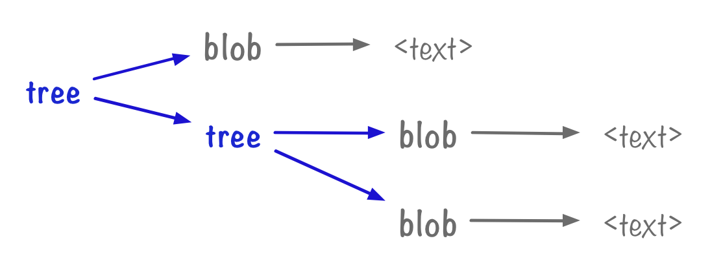
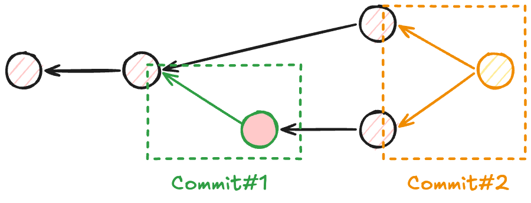
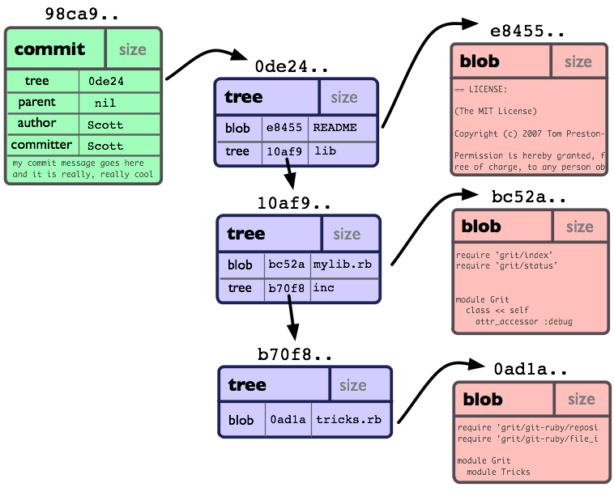

在软件开发中，一个看似简单但本质深刻的问题是：我们如何描述“变化”？

一个项目的开发过程可以类比为一个**状态机**：一个项目从最初的几行代码，到逐渐演化成复杂系统，本质上是一系列“状态”的演进。
如果没有工具，我们只能：
- 手动复制文件做备份（project_final_v3_real_final）
- 靠记忆或零散笔记记录修改原因
- 在多人协作时反复覆盖彼此的工作

这在本质上是混乱的，因为我们没有一个结构化的方式来记录历史。

**版本控制系统（Version Control System, VCS）** 正是为了解决这个问题而出现的。它将一个项目的演化过程抽象为一系列“快照”（snapshot）及其之间的关系

每一个快照记录某一时刻项目的完整状态，同时附带元信息（作者、时间、修改说明等）。在此基础上，我们可以自然地回答一些关键问题：
- 这个文件是谁写的？
- 某一行代码是什么时候被修改的？为什么？
- 哪一次修改引入了 bug？
- 能否回到某个“曾经是对的”的状态？

本文简单介绍 Git，作为现代版本控制系统的事实标准，是如何解决这些问题的。

## Git 底层数据模型

### 文件系统相关：Blob, Tree 和 Snapshot

现在假设我们的项目的文件树 (tree) 如下：

```
.
├── docs
│   ├── someDoc1.md
│   └── someDoc2.md
├── main.py
├── pyproject.toml
└── README.md
```

可以看到这棵文件树由子树和文件构成。


在 Git 中，文件树中的文件和目录对应 Git 的两种对象：
- **Blob**：文件内容（纯数据）
- **Tree**：目录结构（名字 + 指针）

在本例中：

```
(root tree)
├── docs        → tree (T_docs)
├── main.py     → blob (B_main)
├── pyproject.toml → blob (B_pyproject)
└── README.md   → blob (B_readme)

// 其中
T_docs (tree)
├── someDoc1.md → blob (B_doc1)
└── someDoc2.md → blob (B_doc2)

// 再往下
B_main        → "print(...)"
B_pyproject   → "[tool.poetry] ..."
B_readme      → "# Project ..."
B_doc1        → "Some documentation..."
B_doc2        → "More documentation..."
```

**快照（Snapshot）**. 在项目不断演化的过程中，追踪的根目录下的文件和目录结构都有可能发生改变。我们可以将某一时刻被追踪的根目录（包括文件内容和目录结构）视为项目的一个完整状态，这个状态称为一个 snapshot。
- 通过保存项目当前的状态（目录结构和文件内容）为一个快照（commit），可以将其视为 VCS 状态机中的一个“状态”
- 两个状态之间的转移发生在创建新快照（commit）时；在此之前，对代码的修改仅存在于工作区中，并不会被纳入状态机的历史

### 历史追踪相关：History 和 Commit

**History**. 在 Git 中，历史可以表示为一个有向无环图（DAG），其中每个节点是项目的一个 snapshot.
- 这意味着，除了根节点之外（即初始状态），每个 snapshot 都会指向一个或多个父节点
- 这意味着这个 snapshot 由之前项目的每个状态经过若干改变修正而来

**Commit**. Commit 是 Git 历史中的一个节点，它包含一个 snapshot（即一个 root tree），以及指向其父 commit 的引用，从而将多个 snapshot 连接成一个有向无环图。



Git 中的 commit 是不可变的。这不意味着 commit 中的错误无法被修正，只是说，对提交历史的“修改”，实际上是创建新的 commit，然后更新引用（reference）去指向这些新的 commit。

## 总结

Commit, tree 和 blob 的概念可以从下图体现。Commit 通过存储项目根目录 tree 指针的方式记录项目的 snapshot.



## Git 中的引用

Commit 通过 SHA-1 哈希值存储，这不适合人类记忆。为了方便记忆，Git 创建了 **引用 (reference)** 的概念，其中重要的是：
- Branch 是指向某个 commit 的可变引用
- HEAD，是当前当前所在位置的引用
	- 通常情况下，你应该处在某个 branch 的某个 commit 上，而不是直接指向某个 commit，因此应该是 `HEAD -> branchName -> C`
	- 在特殊情况下，即直接指向某个 commit，称之为 detached HEAD：`HEAD -> C`

## Git Repository

基于上文介绍的概念，我们所称之为 **Git repository** 由两部分组成：
- **对象（objects）**：包括 blobs、trees 和 commits，用于表示文件内容、目录结构以及项目的快照
- **引用（references）**：包括 HEAD 和各个 branch，用于指向某个 commit，从而确定当前所处的位置

## Branching 艺术

一些核心思想：
- 早建分支！多用分支！这是因为即使创建再多的分支也不会造成储存或内存上的开销，并且按逻辑分解工作到不同的分支要比维护那些特别臃肿的分支简单多了。
- 使用分支其实就相当于在说：“我想基于这个提交以及它所有的 parent 提交进行新的工作。”
- Git branch 创建分支，Git checkout 切换分枝（Git switch）
- Git merge 我们准备了两个分支，每个分支上各有一个独有的提交。这意味着没有一个分支包含了我们修改的所有内容。咱们通过合并这两个分支来解决这个问题。
  - 
## 紧急情况处理

## 参考资料

- [Version Control and Git](https://missing.csail.mit.edu/2026/version-control/)
- [Part 2: Blobs and trees](https://alexwlchan.net/a-plumbers-guide-to-git/2-blobs-and-trees/)
