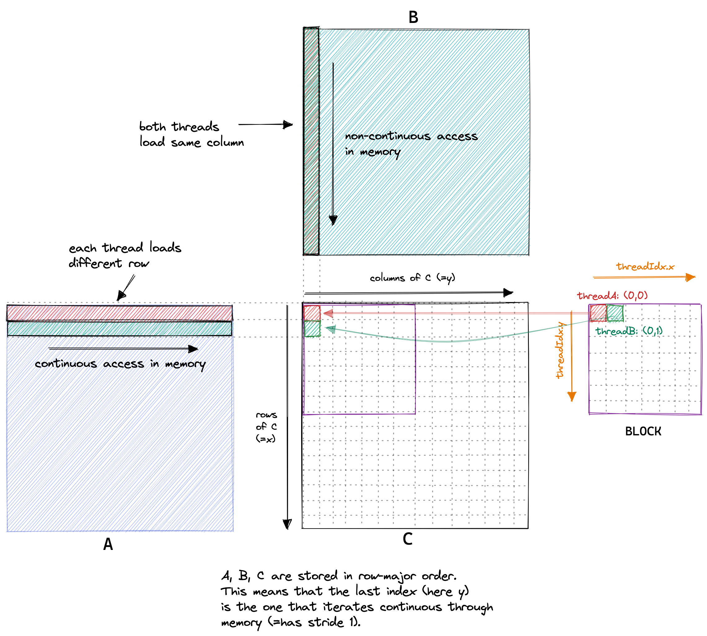

本文简单介绍对于 GEMM 计算的优化思路和方法。

## Naive GEMM

在本文接下来的部分中，我们希望优化 $C= \text{matmul}(A, B)$ 操作，其中 $A \in \mathbb{R}^{M \times N}$，且 $B \in \mathbb{R}^{N \times K}$，因此生成的矩阵 $C \in \mathbb{R}^{m \times k}$. 从线性代数角度来看：

$$
\forall (i, k) \in [\![1, M]\!] \times [\![1, K]\!], \quad C_{ik} = \sum_{j=1}^N A_{i,j} B_{j,k}
$$

这意味着为了计算 $C$ 矩阵的每一个元素，都要读取 $A$ 中的一行元素和 $B$ 中的一列元素。用图表示即为：
由于矩阵在内存存储通常是 row-majored，对 $B$ 矩阵访问是不连续的，影响内存 cache hit.

## 参考资料

- [How to Optimize a CUDA Matmul Kernel for cuBLAS-like Performance: a Worklog](https://siboehm.com/articles/22/CUDA-MMM)
