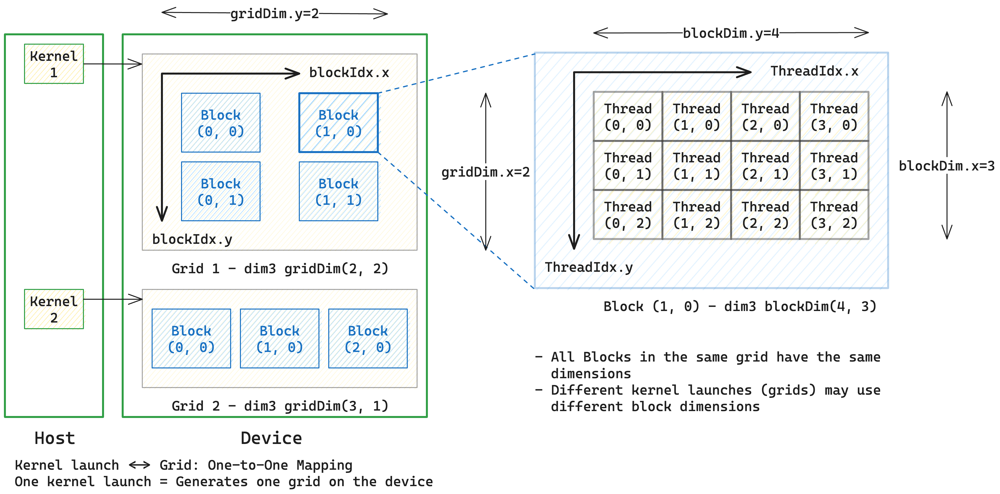
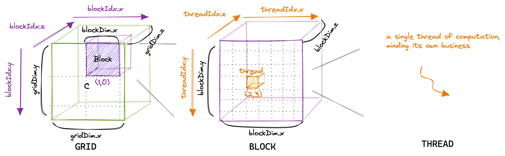
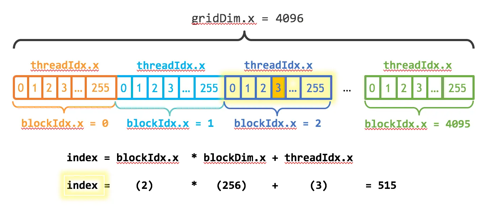
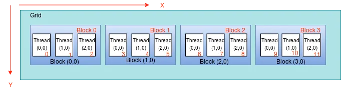
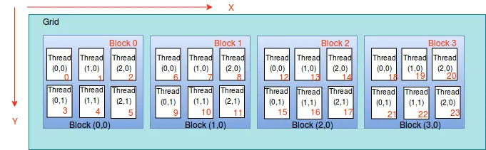
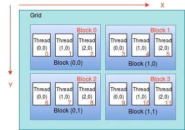
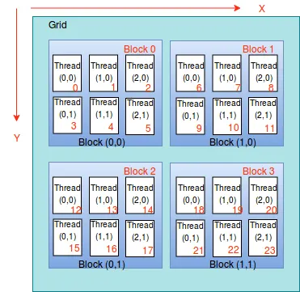

本文简单介绍了在 CUDA 环境下 Grid, Block 和 Thread 的概念，以及如何寻找它们的地址。

## 关键概念




**CUDA Kernel** 是一个用 `__global__` 声明的函数，它在 GPU (device) 上执行，由 CPU (host) 发起调用。

```cpp
__global__ void myKernel() {
	...
}

// invoke
dim3 gridDim(2, 2);
dim3 blockDim(4, 3);
mykernel<<<gridDim, blockDim>>>();
```

**Grid**. 当 Host 启动一个 kernel 时，CUDA runtime 会在 Device 上创建一个 **grid**。
- 一个 grid 是由多个 thread blocks 组成的集合。
- 每一次 kernel launch 会生成一个 grid，因此 kernel launch 与 grid 之间是一一对应的关系。
- 不同的 kernel launch 可以使用不同的 grid 维度和 block 维度。
- `gridDim.{x,y,z}` 表示 Grid 的 shape

**Block**. 多个 thread 组成的集合。
- 在同一个 grid 中，所有的 block 的 shape 都是一样的
- 在不同 kernel launch 对应的 grid 中，block 的 shape 可能不同
- `blockDim.{x,y,z}` 表示 Block 的 shape
- 使用 `blockIdx.{x,y,z}` 表示当前 block 在 grid 中的索引

**Thread**. 实际执行的最小 (software) execution unit.
- 使用 `threadIdx.{x,y,z}` 表示当前 thread 在 block 中的索引

Grid 和 Block 都可以是三维的，如下图所示：


## Thread indexing

并行计算中，不同线程需要处理不同的数据。为了确定每个线程所负责的数据位置，我们需要计算每个线程的 **global thread index**。在这个章节我们会研究如何通过线程索引来确定每个线程处理的数据位置。



总体思路：目的是将多维的 thread 组织（grid/block/thread）映射为一维的 global thread index
- 首先定位 block 位置，把 blockIdx flatten 成 1D，确认每个 block 有多少个 thread
- 再确定 thread 在 block 第几行，把 threadIdx flatten 成 1D，确认 block 中的每一行有多少个 thread
- 最后加上 threadIdx.x

$$
\text{threadId} = \underbrace{\text{blockId}}_{\text{grid 内 block 的线性编号}} \times \underbrace{\text{threadsPerBlock}}_{\text{每个 block 的线程总数}} + \underbrace{\text{localThreadId}}_{\text{block 内 thread 的线性编号}}
$$



1D Grid + 1D Block 情况：总共有 $\text{blockDim}.x \times \text{gridDim}.x$ 个 thread，
$$
\text{threadId} = (\text{blockIdx}.x \times \text{blockDim}.x) + \text{threadIdx}.x
$$



1D Grid + 2D Block 情况：总共有 $\text{gridDim}.x \times (\text{blockDim}.x \times \text{blockDim}.y)$ 个 thread，
$$
\text{threadId} = (\text{blockIdx}.x \times \text{blockDim}.x \times \text{blockDim}.y) + (\text{threadIdx}.y \times \text{blockDim}.x) + \text{threadIdx}.x
$$




2D Grid + 1D Block 情况：总共有 $(\text{gridDim}.x \times \text{gridDim}.y) \times \text{blockDim}.x$ 个 thread，
$$
\text{blockId} := (\text{blockIdx}.y \times \text{gridDim}.x) + \text{blockIdx}.x
$$
因此 
$$
\text{threadId} = \text{blockId} \times \text{blockDim}.x + \text{threadIdx}.x
$$




2D Grid + 2D Block 情况：总共有 $(\text{gridDim}.x \times \text{gridDim}.y) \times (\text{blockDim}.x \times \text{blockDim}.y)$ 个 thread,
$$
\text{blockId} = \text{gridDim}.x \times \text{blockIdx}.y + \text{blockIdx}.x
$$
因此
$$
\text{threadId} = \text{blockId} \times \text{blockDim}.x \times \text{blockDim}.y + \text{blockDim}.x \times \text{threadIdx}.y + \text{threadIdx}.x
$$


## 参考资料

- [CUDA Thread Indexing](https://anuradha-15.medium.com/cuda-thread-indexing-fb9910cba084)
- [Mastering CUDA Kernel Development: A Comprehensive Guide](https://medium.com/@omkarpast/mastering-cuda-kernel-development-a-comprehensive-guide-1f3032666b94)
- [How to Optimize a CUDA Matmul Kernel for cuBLAS-like Performance: a Worklog](https://siboehm.com/articles/22/CUDA-MMM)
