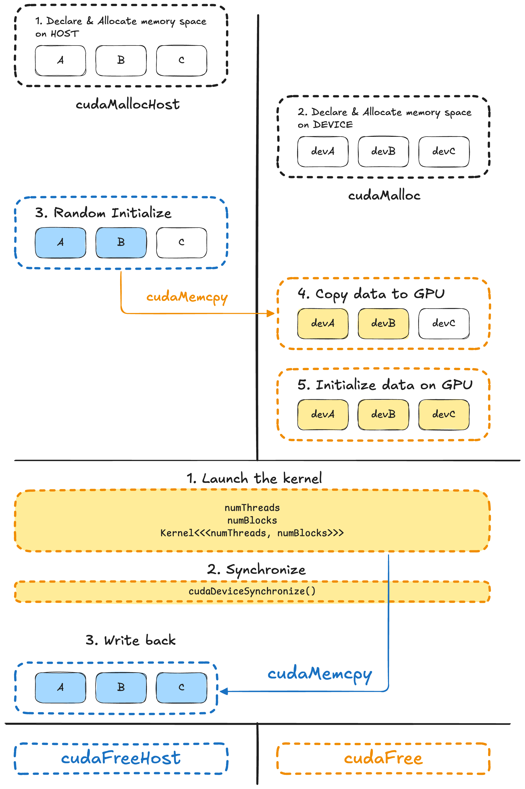

本文基于 CUDA 的官方教程实现了一个最基础的 vector add 的 toy example.



```cpp
#include <iostream>
#include <cuda_runtime.h>
#include <cuda/cmath>
#include <ctime>

#define CUDA_CHECK(expr_to_check) do {                         \
    cudaError_t result = expr_to_check;                        \
    if (result != cudaSuccess) {                               \
        fprintf(stderr,                                        \
                "CUDA Runtime Error: %s:%i:%d = %s\n",         \
                __FILE__,                                      \
                __LINE__,                                      \
                result,                                        \
                cudaGetErrorString(result));                   \
    }                                                          \
} while (0)

// Helper function: randomly initialize array
void initArray(float* A, int length)
{
    std::srand(std::time({}));

    for (int i = 0; i < length; i++) {
        A[i] = rand() / static_cast<float>(RAND_MAX);
    }
}

__global__ void vecAdd(float* A, float* B, float* C, int vectorLength)
{
    int x = threadIdx.x + blockIdx.x * blockDim.x;

    if (x < vectorLength) {
        C[x] = A[x] + B[x];
    }
}

// CPU version
void seqAdd(float* A, float* B, float* C, int vectorLength)
{
    for (int x = 0; x < vectorLength; x++) {
        C[x] = A[x] + B[x];
    }
}

// Helper function: check correctness
bool vectorApproximatelyEqual(float* A, float* B, int length, float epsilon = 0.00001f)
{
    for (int i = 0; i < length; i++) {
        if (fabs(A[i] - B[i]) > epsilon) {
            printf("Index %d mismatch: %f != %f\n", i, A[i], B[i]);
            return false;
        }
    }

    return true;
}

int main()
{
    int vectorLength = 1024;

    // [Part 1] Preparation
    // 1. Allocate host memory
    float* A = nullptr;
    float* B = nullptr;
    float* C = nullptr;

    CUDA_CHECK(cudaMallocHost(&A, vectorLength * sizeof(float)));
    CUDA_CHECK(cudaMallocHost(&B, vectorLength * sizeof(float)));
    CUDA_CHECK(cudaMallocHost(&C, vectorLength * sizeof(float)));

    // 2. Allocate device memory
    float* devA = nullptr;
    float* devB = nullptr;
    float* devC = nullptr;

    CUDA_CHECK(cudaMalloc(&devA, vectorLength * sizeof(float)));
    CUDA_CHECK(cudaMalloc(&devB, vectorLength * sizeof(float)));
    CUDA_CHECK(cudaMalloc(&devC, vectorLength * sizeof(float)));

    // 3. Random initialize on host
    initArray(A, vectorLength);
    initArray(B, vectorLength);

    // 4. Copy data to GPU
    CUDA_CHECK(cudaMemcpy(devA, A, vectorLength * sizeof(float), cudaMemcpyHostToDevice));
    CUDA_CHECK(cudaMemcpy(devB, B, vectorLength * sizeof(float), cudaMemcpyHostToDevice));

    // 5. Initialize GPU output buffer
    CUDA_CHECK(cudaMemset(devC, 0, vectorLength * sizeof(float)));

    // [Part 2] Launch kernel
    int numThreads = 256;
    int numBlocks = (vectorLength + numThreads - 1) / numThreads;

    vecAdd<<<numBlocks, numThreads>>>(devA, devB, devC, vectorLength);
    CUDA_CHECK(cudaGetLastError());

    CUDA_CHECK(cudaDeviceSynchronize());

    // Copy result back to host
    CUDA_CHECK(cudaMemcpy(C, devC, vectorLength * sizeof(float), cudaMemcpyDeviceToHost));

    // Verify correctness
    float* compRes = static_cast<float*>(malloc(vectorLength * sizeof(float)));

    seqAdd(A, B, compRes, vectorLength);

    if (vectorApproximatelyEqual(C, compRes, vectorLength)) {
        std::cout << "CPU and GPU answers match" << std::endl;
    }

    // [Part 3] Free up
    free(compRes);

    CUDA_CHECK(cudaFree(devA));
    CUDA_CHECK(cudaFree(devB));
    CUDA_CHECK(cudaFree(devC));

    CUDA_CHECK(cudaFreeHost(A));
    CUDA_CHECK(cudaFreeHost(B));
    CUDA_CHECK(cudaFreeHost(C));

    return 0;
}
```

## 参考资料

[2.1. Intro to CUDA C++](https://docs.nvidia.com/cuda/cuda-programming-guide/02-basics/intro-to-cuda-cpp.html#intro-to-cuda-c)
