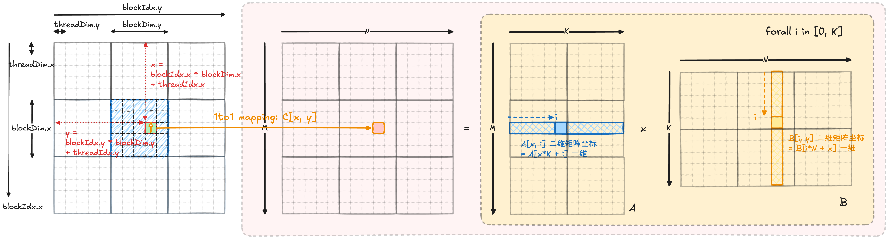
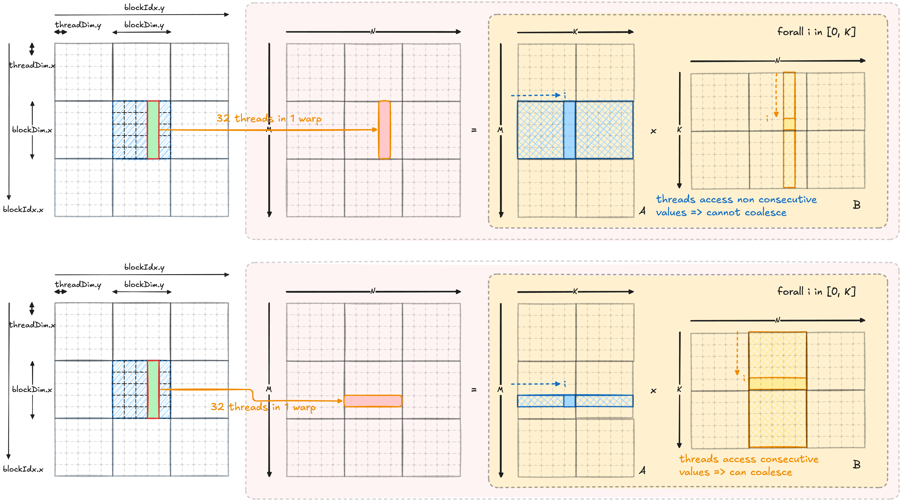
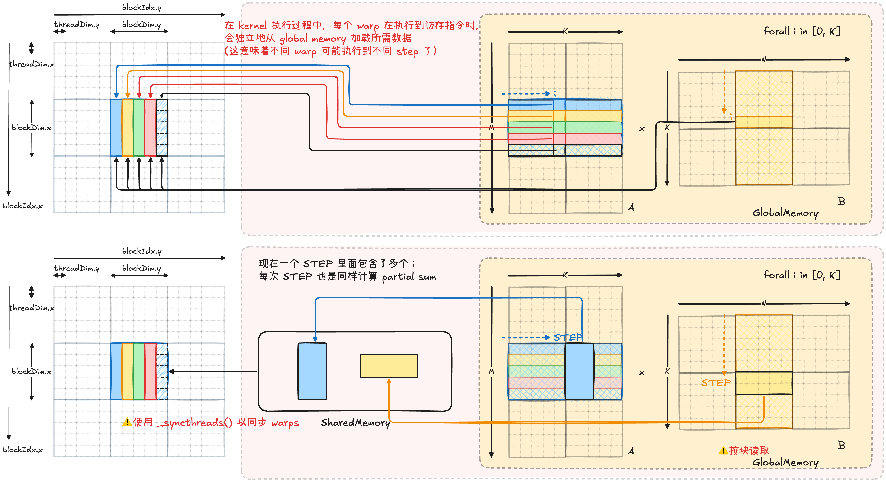

本文介绍如何优化 CUDA SGEMM Kernel.

## 问题建模

在本文接下来的部分中，我们希望优化 $C= \text{matmul}(A, B)$ 操作，其中 $A \in \mathbb{R}^{M \times K}$，且 $B \in \mathbb{R}^{K \times N}$，因此生成的矩阵 $C \in \mathbb{R}^{M \times N}$. 具体而言：

$$
\forall (i, j) \in [\![0, M-1]\!] \times [\![0, N-1]\!], \quad C_{ij} = \sum_{k \in [\![1, K]\!]} A_{ik}B_{kj}
$$
在 CUDA / BLAS 中，**通用矩阵乘法（SGEMM）** 的标准形式是在矩阵乘法的基础上，把线性组合 + 矩阵乘法融合成一个 kernel，定义为
$$
\boxed{C := \alpha A B + \beta C}
$$

因此我们将在下文采用这个记法。具体而言：
$$
\forall (i, j) \in [\![1, M]\!] \times [\![1, N]\!], \quad C_{ij} = \alpha \sum_{k \in [\![1, K]\!]} A_{ik}B_{kj}  + \beta C_{ij}
$$

当矩阵规模较大时，直接计算矩阵乘法代价较高。注意到输出矩阵 $C$ 中的每一个元素 $C_{ij}$ 都是彼此独立计算的，因此可以将矩阵乘法拆分为大量独立的子任务。在 CUDA 中，我们可以将这些子任务映射到 GPU 的线程上，使每个 thread 负责计算一个或多个 $C_{ij}$，从而实现大规模并行计算。在 [CUDA Grid, Block, Thread 和寻址](CUDA%20Grid,%20Block,%20Thread%20和寻址.md) 文章中我们介绍了 CUDA 的执行结构，现在我们希望合理分配每个 thread 任务来并行化矩阵乘法运算。

## 版本 1: Naive SGEMM

> 原博客有关于 `threadIdx.x` 和 `threadIdx.y` 的画法略有前后不一致。在我的文章里统一将 `threadIdx.x` 定义为连续行方向。

最朴素的想法就是将每一个 $C_{ij}$ 都分配一个 thread 去做，一个 thread 对应一个 $C_{ij}$ 的计算。因此每个 thread 内部需要
- 访问 $A_{i.}$ 和 $B_{.j}$ 向量
- 执行 for 循环沿 $K$ 维度累加 $A_{ik}B_{kj}$

因此，在 Naive GEMM 实现中，我们先在 global memory 中分别为矩阵 $A,B,C$ 分配存储空间。对于 $C \in \mathbb{R}^{M \times N}$，我们使用二维 thread/block 结构，并令每个 thread 负责计算一个 $C$ 中的元素。我们让 CUDA 中连续的 `threadIdx.x` 对应矩阵中连续的行方向，且采用映射：
$$
	(\text{threadIdx.x}, \text{threadIdx.y}) \mapsto C[x, y] = C_{xy}
$$

当每个 block 的大小为 $(32, 32)$ 时，grid 维度为：

$$
\text{gridDim.x} = \left\lceil \frac{M}{32} \right\rceil,\quad
\text{gridDim.y} = \left\lceil \frac{N}{32} \right\rceil
$$

其中 `gridDim.x` 覆盖矩阵的列方向，`gridDim.y` 覆盖矩阵的行方向。

## 版本 2：利用 Warp 的内存合并特性优化 Global Memory Access

CUDA 在逻辑上由 Grid、Block 和 Thread 组成，其中 thread 是程序员视角下的最小执行单元。但在硬件执行时，GPU 通常以 **warp** 为基本调度单位。一个 warp 包含 32 个连续的 thread，这些 thread 通常执行同一条指令，并在同一条指令下发起各自的内存访问。

如果一个 warp 内的 32 个 thread 访问的是连续的 global memory 地址，GPU 可以将这些访问 **合并（coalesce）** 成更少次数的内存事务，从而显著提高访存效率。反之，如果 32 个 thread 访问的地址相隔很远，就可能退化成多次独立访存，性能会明显下降。

我们观察到 Naive GEMM 的 CUDA thread 和矩阵位置映射方式会导致在一个 warp 内的 thread 会产生跨步访问，无法合并因此访存效率低，因此我们修改了 thread 到矩阵坐标的映射以提高访存效率。
### Warp 中 thread 的组织方式

在 CUDA 中，warp 是按照 thread 在 block 内的线性编号来划分的。对于二维 block，thread 的线性编号为：

$$
\text{threadId} = \text{threadIdx.x} + \text{blockDim.x} \times \text{threadIdx.y}
$$

因此，CUDA 会优先沿着 `threadIdx.x` 方向组织连续的 thread。也就是说，在 `threadIdx.y` 固定时，`threadIdx.x` 相邻的 thread 会优先被划入同一个 warp；只有当 `threadIdx.x` 方向不够 32 个 thread 时，才会继续进入下一个 `threadIdx.y`。

### Naive GEMM 中的问题

在 naive GEMM 中，如果我们使用 $(\text{threadIdx.x}, \text{threadIdx.y}) \mapsto C[x, y]$ 映射方式，那么
- 同一个 warp 内的 32 个 thread 沿 `threadIdx.x` 连续分布，假设处理 $C[x_{1:32}, y]$ 也就是同一列上的 32 个不同行元素。
- 在计算矩阵乘法时，在每个 step $i$，每个 thread 都需要访问 $A[x, i]$. 因此，一个 warp 内会访问 $A[x_{1:32}, i]$.（$B[i,y]$ 矩阵对于每个 thread 都是一样的）
- 如果矩阵 $A$ 按 row-major 方式存储，那么这些地址在内存中并不连续，因为 $A[x, i] \Rightarrow A[x \times K + i]$
- 当 $x$ 连续变化时，访问地址之间相隔 $K$ 个元素。因此，一个 warp 内的 32 个 thread 会产生跨步访问，难以被合并成一次高效的内存读取。
- 这就是 naive GEMM 访存效率低的核心原因之一。

### 优化思路：交换 thread 到矩阵坐标的映射

为了让同一个 warp 内的 thread 访问连续内存，我们可以调整 thread 到矩阵元素的映射方式：

$$
\boxed{(\text{threadIdx.y}, \text{threadIdx.x}) \mapsto C[x, y]}
$$

- 让连续的 `threadIdx.x` 对应矩阵 $C$ 中**同一行上的连续列元素** $C[y, x_{1:32}]$
- 此时，在计算这些元素时，一个 warp 内的 32 个 thread 会访问：$B[i, x_{1:32}]$（$A[y,i]$ 对于所有 thread 都一样）
- 由于矩阵 $B$ 按 row-major 存储，所以 $B[i, x] \Rightarrow B[i \times N + x]$
- 当 $x$ 连续变化时，访问地址也是连续的。因此，这 32 个 thread 对 $B$ 的访问可以被 GPU 合并成更少次数的 global memory transaction。

**Global memory coalescing 重新安排 thread 和数据的对应关系，让同一个 warp 内的 thread 尽量访问连续内存。这使得每次对于 global memory 的访问都变得更加高效。**

> Trick:
> - CUDA Warp 通常沿 `threadIdx.x` 方向组织连续的 thread
> - 因此，应尽量让 `threadIdx.x` 对齐数据在内存中的连续维度，从而实现 coalesced memory access
> - 例如本例中，矩阵按行连续存储（CUDA 默认 row-major），因此列索引（column index）对应内存中的连续地址变化。

## 版本 3: 利用 Shared Memory 减少 Global Memory Access 次数

在 Kernel 2 中，我们主要从 warp 视角优化 global memory access。
对于矩阵乘法，一个 CUDA block 通常负责计算 $C$ 中的一块 tile。从整个 block 的视角看，这些 warp 实际上都在围绕同一块 $C$ tile 做计算。

因此，它们在计算过程中会反复使用同一批 $A$ 和 $B$ 数据：
- 同一行的 $A$ 元素会被多个不同列的 $C_{ij}$ 使用；
- 同一列方向上的 $B$ 元素会被多个不同行的 $C_{ij}$ 使用；
- 这些复用不一定发生在单个 warp 内，也可能发生在 block 内的多个 warp 之间。

如果每个 warp 都直接从 global memory 读取自己需要的 $A$ 和 $B$，那么即使每次访问都比较 coalesced，同一份数据仍然可能被不同 warp 重复加载。

> 在我们 Kernel 2 的例子中会重复加载相同的 $B$ tile.

Shared Memory 的作用就是把这些跨 thread、跨 warp 会被重复使用的数据缓存到 block 内部。

Shared Memory
- 是每个 block 私有的一块高速片上存储。
- 同一个 block 内的所有 thread，也就是同一个 block 内的所有 warp，都可以访问这块 shared memory。

因此，我们可以让一个 block 内的多个 warp 协作完成两件事：
1. 先由 block 内的 threads 共同把当前计算阶段需要的一小块 $A$ 和一小块 $B$ 从 global memory 加载到 shared memory；
2. 然后 block 内的所有 warp 都从 shared memory 中读取数据，完成这一小段 $K$ 维度上的累加。

**也就是说，Kernel 3 不再让每个 warp 各自从 global memory 中取数据，而是让整个 block 先合作搬运一块数据，再让 block 内的多个 warp 共同复用这块数据。**

### 优化思路：Blocking 或 Tiling 思想

我们把 $K$ 维度切成多个小块。假设 block size 为 `BLOCKSIZE`，那么一次只处理：

$$
A[\text{当前 } C \text{ tile 的行},\ k:k+\text{BLOCKSIZE}]
$$

和

$$
B[k:k+\text{BLOCKSIZE},\ \text{当前 } C \text{ tile 的列}]
$$

这两块数据。

每一轮计算流程如下：
1. block 内的 threads，也就是多个 warp，一起从 global memory 中加载一块 $A$ 和一块 $B$ 到 shared memory；
2. 使用 `__syncthreads()` 等待整个 block 加载完成；
3. block 内的每个 warp 使用 shared memory 中的数据，继续计算自己负责的那部分 $C$ 元素；
4. 每个 thread 在 shared memory 上完成这一小块 $K$ 维度上的多次乘加；
5. 再次使用 `__syncthreads()`，确保所有 warp 都已经用完当前 shared memory 中的数据；
6. 进入下一轮，加载下一块 $A$ 和 $B$。

这里必须使用同步。因为 shared memory 是整个 block 共享的，而不是某个 warp 私有的。如果某些 warp 计算得更快，提前开始加载下一块 tile，就可能覆盖 shared memory 中当前 tile 的数据；此时其他较慢的 warp 如果还在读取当前 tile，就会读到错误数据。

因此，相比于 Kernel 2 主要优化的是 warp 内的 global memory access pattern，让一个 warp 的一次访存更容易被 coalesce；Kernel 3 进一步优化的是 **global memory access 的次数**。

它的关键收益是：
- 原来不同 warp 可能各自从 global memory 读取相同或重叠的 $A/B$ 数据；
- 现在这些数据先被整个 block 协作加载到 shared memory；
- 然后 block 内的多个 warp 都可以反复复用它；
- 因此 global memory 的访问次数减少了。

## 参考资料

- [How to Optimize a CUDA Matmul Kernel for cuBLAS-like Performance: a Worklog](https://siboehm.com/articles/22/CUDA-MMM)
