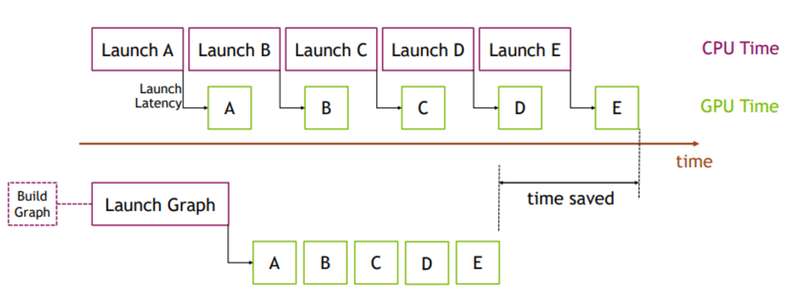

在 CUDA 编程模型中，CPU 不断向 GPU 提交 CUDA kernels[^1]，而一个 Transformer forward 则会进一步拆解成大量这样的 kernel 调用。即使单个 kernel 很快，CPU 发起 kernel launch 仍然存在固定开销，包括 runtime 调度、参数准备、driver 调用以及 GPU command queue 提交等。
[^1]: CUDA kernel 可以理解为 GPU 上执行的底层并行函数。深度学习框架中的一个 operator（如 GEMM、LayerNorm、Softmax 等）通常会对应一个或多个 CUDA kernels。例如 `nn.Linear` 可能调用 cuBLAS GEMM Kernel.

在大模型推理中，模型结构通常是固定的，尤其是在 decode 阶段，执行路径会高度重复：每一层做相同的计算，只是输入数据不同。因此，大量 iteration 实际上是在重复提交几乎相同的一串 kernels。

CUDA Graph 的核心思想，就是把这一整段 GPU 执行流程提前录制下来并复用。
- 录制过程中，CUDA runtime 会捕获 kernel 的执行顺序、依赖关系以及相关 memory operations（例如参数、输入输出内存地址），形成一个 executable graph。
- 之后再次执行时，CPU 不再需要逐个 launch kernel，而是只需一次 graph launch，就可以让 GPU 按照预先记录好的 execution graph 执行整段计算。