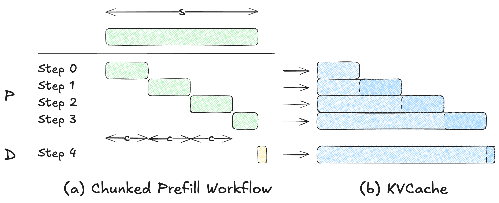
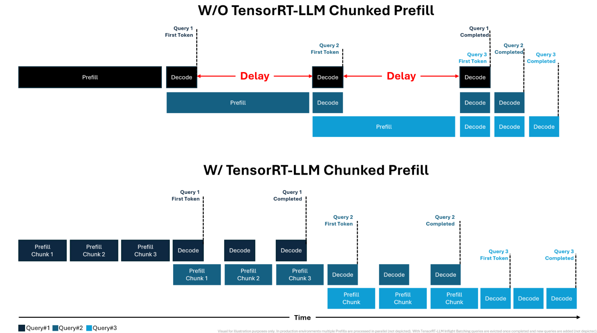

## Chunked Prefill

> 参考论文：[SARATHI: Efficient LLM Inference by Piggybacking Decodes with Chunked Prefills](https://arxiv.org/abs/2308.16369)

> [!note]
> **Chunked Prefill** 通过将原本规模为 $O(S^2)$ 的 Causal Attention 计算重排为若干较小的分块计算，从而降低 Prefill 阶段的峰值显存占用，以及使得调度单元变得更加细粒度。

下图展示了 Chunked Prefill 的主要流程。Chunked Prefill 将原本一次性处理完整序列的 Prefill 过程拆分为多个按顺序执行的分块计算。设 Chunk size 为 $c$，则对于长度为 $S$ 的输入序列，会被划分为 $\lceil S / c \rceil$ 个 chunk 依次处理。

在每一次分块计算中，系统会：
- 选取当前 chunk 中的至多 $c$ 个 token；
- 计算这些 token 的 $Q/K/V$ 表示，并将新生成的 $K/V$ 写入 KV Cache；
- 将当前 chunk 的 $Q$与已累计的历史 $K$（包括此前所有 chunk 的 token）进行因果 Attention 计算；
- 若该 chunk 为最后一段，则完成整个 Prefill 阶段，并进入后续 Decode 阶段。

需要注意的是 KVCache 总量并没有变少，但是中间每一步参与计算的 $Q$ 和 Attention 中间矩阵变小了。

## 应用场景

1. 适配超长 Prompt，解决输入序列过长导致 GPU 资源不足的问题。在 Chunked Prefill 之后，大约可以降到原来的 $c/L$.
2. 调度单元变得更加细粒度，减少 Pipeline 以及调度产生的 bubble

## 参考资料

- [Streamlining AI Inference Performance and Deployment with NVIDIA TensorRT-LLM Chunked Prefill](https://developer.nvidia.com/blog/streamlining-ai-inference-performance-and-deployment-with-nvidia-tensorrt-llm-chunked-prefill/)