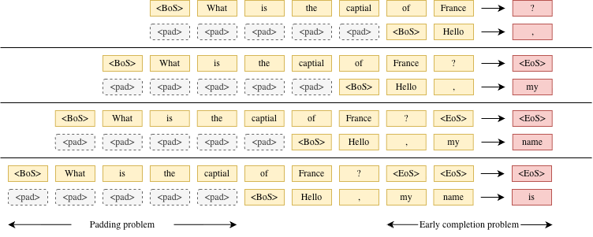
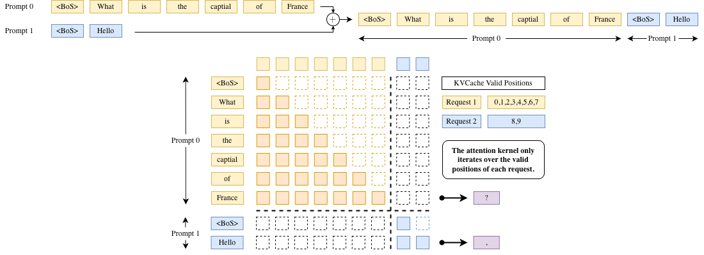
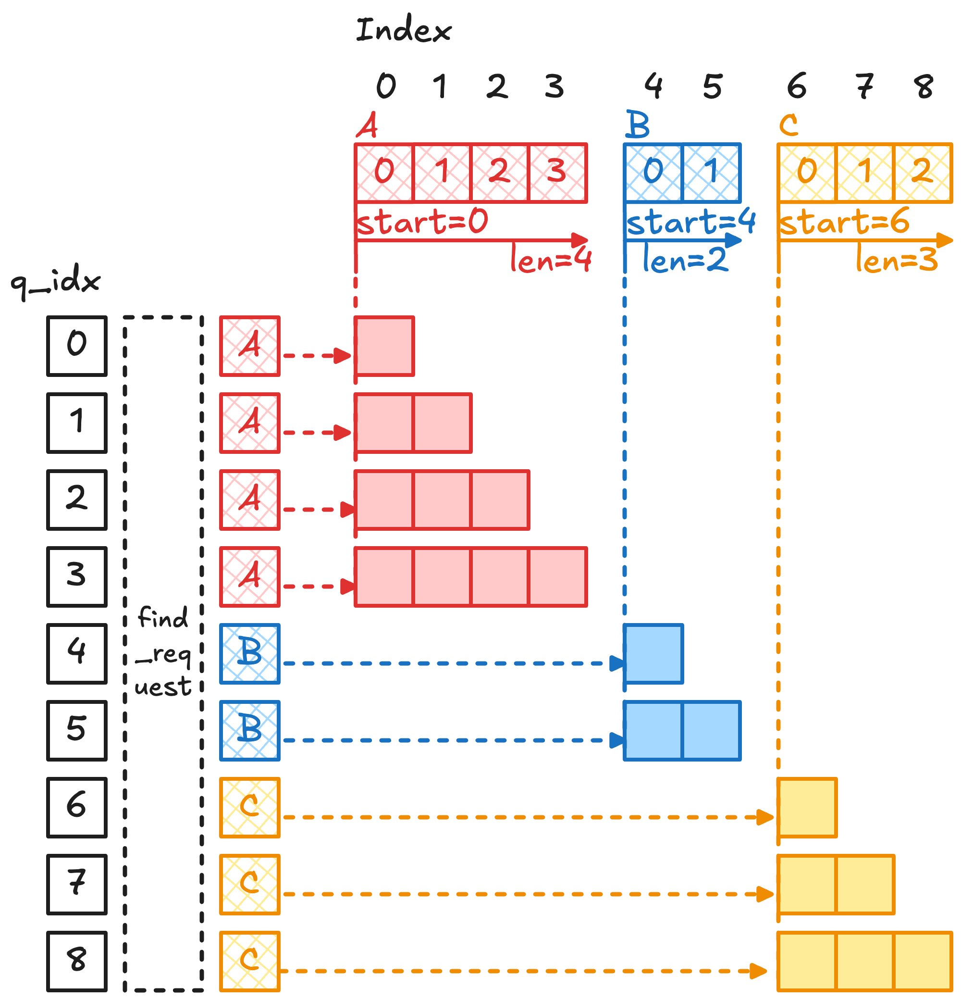

> [!note]
> **Continuous batching** 是一种面向在线推理的调度机制，在每个 decode step 动态组织当前活跃请求，从而避免 padding 和长尾带来的资源浪费，提高系统吞吐、提高 GPU 利用率.

## 问题背景

直接将多个请求简单拼成一个固定 batch 进行推理，会带来两个结构性问题：
1. **长度不一致导致的 padding 浪费**：不同请求的输入长度不同。为了将它们组织成规则 tensor 输入模型，通常需要对较短序列进行 padding。模型在计算时也会对这些“无效 token”执行 attention 和 FFN 计算，造成算力浪费。
2. **Decode 阶段的生命周期不同步（Tail Latency）**：在生成阶段，每个请求需要生成的 token 数量不同，而且生成长度在开始时是不可预测的。在固定 batch 机制下，只有当 batch 中**最后一个请求完成生成**后，整个 batch 才能结束并返回结果。因此，已经提前完成生成的请求会被迫等待最长的那个请求完成，导致尾延迟（tail latency）显著上升。



## Continuous Batching

Continuous Batching 核心思想是以 batch 里面每个请求为单位进行组织，
- 调度单位从一整个 batch 变成 batch 里的每个请求
- 不同请求之间进度相互独立、互不影响
- 当一个请求结束（例如生成 `<EoS>` Token）立刻就被替换为新的请求：


Continuous Batching 通常依赖于 **ragged batching** 技术来实现（ragged 意为拼接），即在同一个批次中拼接来自不同请求、长度不一的 token 序列。

### Attention Mask 构造实现

为了保证不同请求之间互不干扰，可以通过构造块 block-diagonal 的 Causal Attention Mask 实现，确保每个请求的 token 仅与自身历史 token 进行 Attention 计算，而不会与其他请求的 token 发生交互。



### 优化：偏移实现 Mask

显式构造 $(T, T)$ 大小的 Attention Mask 显然会带来巨大内存开销，我们希望避免显式构造 Attention Mask.

假设我们有以下几个请求：
```
A = [a0, a1, a2, a3]   global index: 0,1,2,3
B = [b0, b1]           global index: 4,5
C = [c0, c1, c2]       global index: 6,7,8
```

拼接之后变成了：
```
tokens = [a0,a1,a2,a3,b0,b1,c0,c1,c2]
```

我们需要统计每个 request 在拼接之后的序列里的索引范围，因此记录 metadata：
```
seq_start_loc = [0, 4, 6];
seq_len       = [4, 2, 3];
```

假设每个 CUDA Kernel Thread 负责一个 $Q$ 向量，用伪代码表示可以为：

```cpp
int q_idx = global_query_index;

// 通过 q_idx 找它属于哪个 request
int req_id = find_request(q_idx, seq_start_loc);

// 定位这个 request 的范围，以及确认这个 q 在序列中的位置
int start = seq_start_loc[req_id];
int local_pos = q_idx - start;

// request boundary + causal boundary
int kv_begin = start;
int kv_end = start + local_pos + 1;

for (int j = kv_begin; j < kv_end; ++j) {
    score = dot(Q[q_idx], K[j]);
    // softmax accumulate V[j]
}
```



## 扩展：vLLM v1 中的实现

> TBD: 优化这一段

在 vLLM V1 中，这一过程进一步工程化。系统不会显式构造 attention mask，也通常不会让 CUDA thread 在 kernel 内部通过全局 token index 动态查找 request。相反，scheduler 会提前构造 attention metadata，例如 `query_start_loc`、`seq_lens`、`slot_mapping` 和 `block_table`。Attention backend 将这些 metadata 传给 FlashAttention / PagedAttention kernel。kernel 的 grid 或 scheduler metadata 已经将计算任务划分为某个 request 的某个 query tile / KV tile，因此 kernel 只需要根据 `query_start_loc` 和 `seq_lens` 确定 query/KV 边界，再通过 `block_table` 将逻辑 KV 位置映射到物理 KV cache block。这样，block-diagonal causal mask 不再是一个真实存在的矩阵，而是被转化为 kernel 内部的边界检查和 KV cache 地址映射。

```cpp
// 简化理解：一个 CUDA Kernel Block 对应一个请求（或者请求的一个 tile）
int req_id = blockIdx.x;

int q_start = query_start_loc[req_id];
int q_end   = query_start_loc[req_id + 1];
int q_len   = q_end - q_start;

int seq_len = seq_lens[req_id];

// context_len 表示本轮 query 之前已有的历史 KV token 数量。
// 纯 prefill 时 context_len = 0；
// chunked prefill / prefix cache 命中 / decode 时，context_len > 0。
int context_len = seq_len - q_len;

// 当前 tile 内的 query 位置
int local_q = get_local_q_pos_inside_request();

// causal 边界
int max_kv_pos = context_len + local_q;

for (int kv_pos = 0; kv_pos <= max_kv_pos; ++kv_pos) {
    // 逻辑 KV 位置 kv_pos
    // 如果没有 paged cache：直接 K[request_offset + kv_pos]
    // 如果有 paged cache：通过 block_table 找物理 KV block

    // kv_pos 是 request 内部的逻辑位置
    int logical_block = kv_pos / BLOCK_SIZE;
    int block_offset  = kv_pos % BLOCK_SIZE;

    // 根据当前 request 的 block_table 找到真实物理 KV block
    int physical_block = block_table[req_id][logical_block];

    K = k_cache[physical_block][block_offset];
    V = v_cache[physical_block][block_offset];
}
```

假设 $C=[c_{0}, c_{1},c_{2}]$ 的 block_table 对应 `[7, 18]`, 且 BLOCK_SIZE = 2.

那么当 `kv_pos = 1` 的时候，`logical_block = 0`, `block_offset = 1`, `physical_block = 7`，访问的是 physical block 7 的 offset 1，也就是 `c1`.

总结：对于某个 request，其 KV cache 在逻辑上是连续的（以 token 为单位），但在物理上存储在离散的 KV cache blocks 中。kernel 在计算 attention 时，会根据当前 request 的 `block_table`，将逻辑 KV 位置映射到对应的物理 KV cache block，从而只访问属于该 request 的 KV 数据。这样，请求之间的隔离并不是通过显式的 attention mask 实现，而是通过 request 级别的 metadata（如 `block_table`）以及 kernel 中的访问边界控制隐式完成的。

## 扩展：与 Chunked Prefill 结合

Continuous Batching 通常与 Chunked Prefill 结合使用。下图展示了在三个请求同时存在时的推理示例。在每一个调度 step 中，系统的执行流程如下：
- 对正在进行 Decode 的请求执行一次 forward 计算，各生成一个新的 token；
- 在剩余的计算预算内，调度处于 Prefill 阶段的请求，按 chunk 大小处理相应数量的 token；
- 当某个请求完成（Decode 结束）时，将其从当前 batch 中移除；
- 将新到达的请求或尚未完成 Chunked Prefill 的请求加入 batch，以维持持续的计算负载。


Continuous Batching 在工程实现上通常结合 Paged Attention，以实现对 KV Cache 的更细粒度管理。若采用“一个 token 对应一个 block”的设计，会导致显存碎片化严重，并带来较高的元数据与调度开销。更高效的做法是使用固定大小的 Cache Block，每个 block 存储多个连续 token 的 KV 表示，从而在保持灵活分配能力的同时减少碎片化并提高内存利用率。
