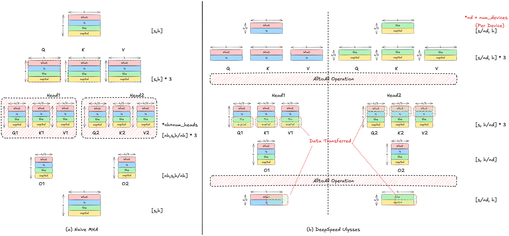

SP 因为 Attention 计算在序列维度 $s$ 上的数据依赖而变得困难，DeepSpeed Ulysses 通过在 Attention 计算之前引入 All-to-All 通信来将原本按 sequence 切分的数据重排为按 head 切分，使得每个设备能够在本地对完整序列、但仅部分 attention heads 执行计算，从而实现高效的分布式并行。

> 参考论文：[DeepSpeed Ulysses: System Optimizations for Enabling Training of Extreme Long Sequence Transformer Models](https://arxiv.org/abs/2309.14509)

## DeepSpeed Ulysses 实现

回顾 Attention 操作（见 [LLM 基础：Attention](../llm/LLM%20基础：Attention.md)），在计算相关性权重时：
$$
\forall (i,j) \in [\![1, s]\!]^2, \quad \alpha_{ij} = \frac{\exp(q_i^T k_j)}{\sum_{t=1}^{s} \exp(q_i^T k_t)}
$$

- Attention 的核心在于对每个 query，需要与整个序列中的所有 key 计算相似度，并在该维度上进行 softmax 归一化。因此，其计算本质上构成了一个全连接的 token-to-token 依赖关系。
- 当沿 sequence 维度进行切分（SP）时，每个设备仅持有局部 token，无法独立完成 $q_i$ 对所有 $k_j$ 的计算。
- 因此，在标准实现中，需要在 Attention 计算前恢复完整序列。

与 Naive MHA 实现的比较：基于 DeepSpeed Ulysses 的思想，重新分布 QKV：
- **Attention 之前的 All-to-All**：把数据从 **按 sequence 切分** → **按 head 切分**
- **Attention 之后的 All-to-All**：再把数据从 **按 head 切分** → **还原为按 sequence 切分**

## 应用

在长序列场景下常优先用 Chunked Prefill 来解决，通常不用 DeepSpeed Ulysses，因为可以避免引入的额外 All-to-All 通信开销。

~~但 DeepSpeed Ulysses 常用于解决 DP 场景下负载不均衡问题，即不同请求输出序列长度不一致的情况。~~

## 参考资料

- [推理Ulysses并行优化与DeepSeekV3/V3.2实践](https://zhuanlan.zhihu.com/p/1995776941110878482)
- [DeepSpeed Ulysses: System Optimizations for Enabling Training of Extreme Long Sequence Transformer Models](https://arxiv.org/abs/2309.14509)