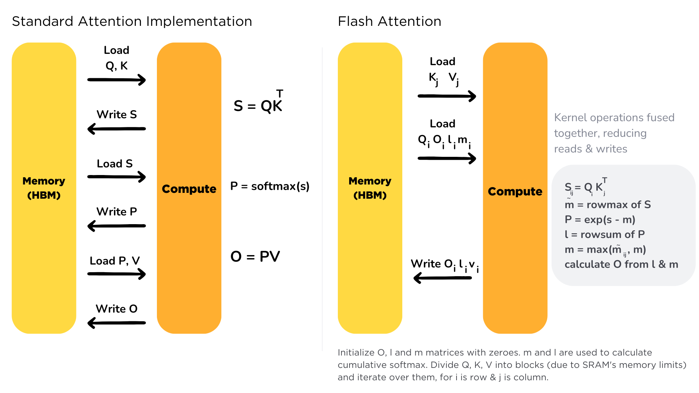
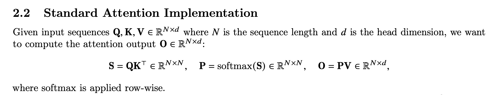
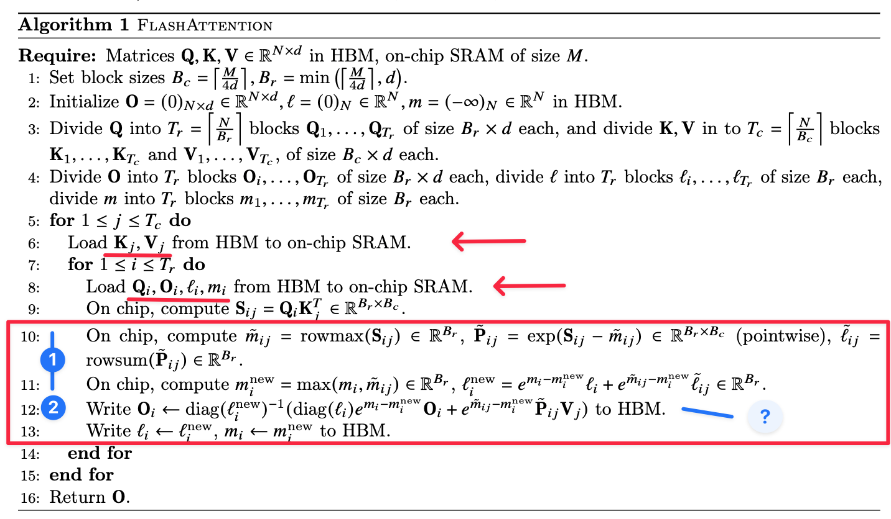
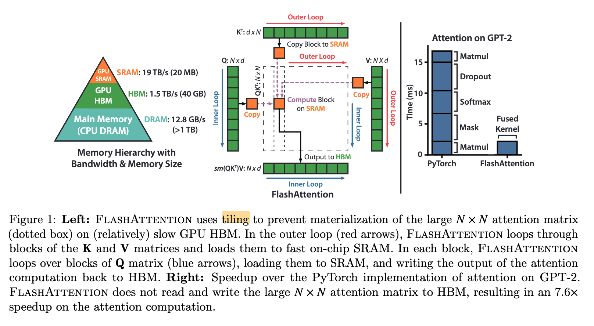
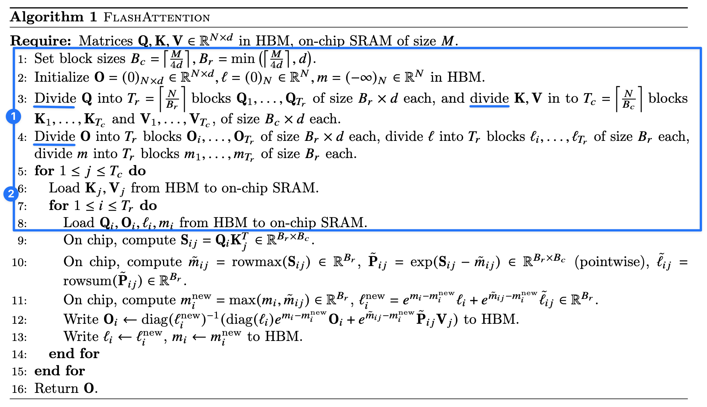
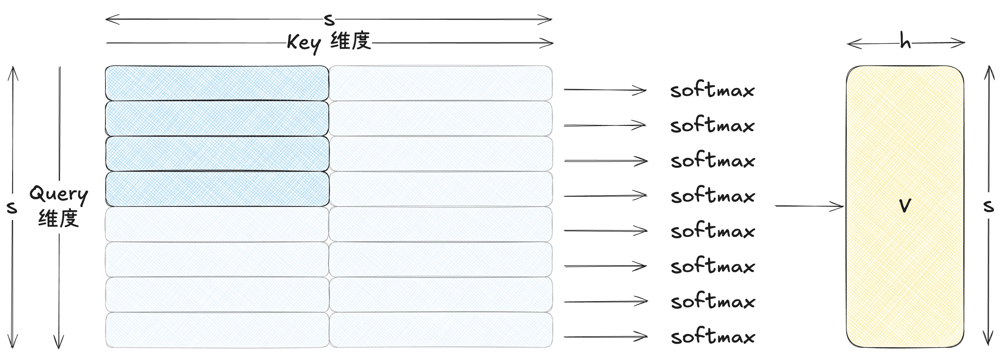

**FlashAttentionV1** 通过分块计算与在线 softmax 更新，在不显式构造 $N\times N$ attention 矩阵的情况下减少显存访问与内存开销，从而提高 GPU 计算效率。具体而言：
- 基于 Matrix Tiling 的思想，将 $\{K, V\}$ 和 $Q$ 向量分成小块，改成 for-loop 流式访问模式
- 提出 online softmax 机制，通过在遍历过程中维护 **running max、归一化因子（denominator）以及输出累积值**，使 softmax 从依赖全局信息的操作转化为可流式计算，从而避免显式构造 $N \times N$ attention 矩阵

> 参考论文：[FlashAttention: Fast and Memory-Efficient Exact Attention with IO-Awareness](https://arxiv.org/abs/2205.14135)

## Naive Attention 问题分析

Standard Attention 可以建模为：

其中 **(Safe) softmax 函数**定义如下. 对于一个 vector $x \in \mathbb{R}^d$，为了避免指数爆炸，定义：
$$
m(x) := \max_{i}x_{i}, \quad \text{softmax}(x) := \frac{\begin{bmatrix}
\dots  & e^{x_{i}-m(x) } & \dots
\end{bmatrix}}{\sum_{j=1}^d e^{x_{j}-m(x)}} \in \mathbb{R}^d
$$

下面展示计算 Attention Block 的算法流程。可以看到：
- 标准 Attention 需要显式构造中间矩阵（如 $S = QK^\top$ 和 $P = \mathrm{softmax}(S)$），其规模为 $N \times N$
- 这些中间结果需要在 HBM 中反复写入和读取，带来大量的数据搬运开销
- 因此，Attention 的执行往往受限于**内存带宽（memory bandwidth）**，而非计算能力

一个自然的优化思路是将上述三个步骤 **融合为一个 kernel（Fused Kernel）**，使得每个元素在加载后立即参与后续计算，从而避免中间矩阵的物化。然而，这种融合会面临两个主要挑战：
- **Softmax 的归一化依赖**：如下图所示，
	- 为了计算 softmax 需要知道
		- 向量中所有元素的最大值 $m(x)$
		- 该行（或列）所有元素的归一化因子（即分母部分）
	- 因此在未遍历完整个向量之前无法得到最终结果。
	- 这使得 GEMM 操作和 softmax 操作没有办法融合。
- **训练阶段的反向传播需求**：在训练过程中，需要保存 softmax 的中间结果（例如概率矩阵  $P$），以便在 backward pass 中计算梯度。

## FlashAttention v1 Overview

## 背景：Tiling

对于矩阵乘法（GEMM）的优化，一个核心思想是 **Tiling（分块计算）**。其基本动机是减少对慢速内存（如 HBM/DRAM）的访问次数，使数据在片上高速存储（如 cache / shared memory）中被尽可能多次复用。

考虑计算

$$
C = A B^\top, \quad A, B \in \mathbb{R}^{N \times d}, \qquad C \in \mathbb{R}^{N \times N}.
$$

为了提高数据复用率，我们将矩阵 $A$ 和 $B$ 按 **行维度**切分成多个小块（tiles）。设 tile 的大小分别为 $d_A$ 和 $d_B$，则：

$$
A =
\begin{bmatrix}
A_1 \\
\vdots \\
A_{T_A}
\end{bmatrix},
\qquad
A_i \in \mathbb{R}^{d_A \times d},
\qquad
T_A = \left\lceil \frac{N}{d_A} \right\rceil
$$

$$
B =
\begin{bmatrix}
B_1 \\
\vdots \\
B_{T_B}
\end{bmatrix},
\qquad
B_j \in \mathbb{R}^{d_B \times d},
\qquad
T_B = \left\lceil \frac{N}{d_B} \right\rceil
$$

对应地，输出矩阵 $C$ 也被划分为若干子块：

$$
C_{ij} \in \mathbb{R}^{d_A \times d_B}, \qquad
C_{ij} = A_i B_j^\top .
$$

因此整个矩阵乘法可以通过如下分块计算完成：

- For $1 \le i \le T_A$
  - Load $A_i$ 到片上高速内存
  - For $1 \le j \le T_B$
    - Load $B_j$
    - 计算
      $$
      C_{ij} = A_i B_j^\top
      $$
    - 将结果写回对应的 $C_{ij}$

最终返回矩阵 $C$。

这种 **分块计算（tiling）** 的关键优势在于：
- 每个 tile（如 $A_i$ 或 $B_j$）只需从全局内存读取一次
- 在片上内存中可以被多次复用
- 显著减少 HBM 访问带宽压力

因此，现代 GPU 的高性能 GEMM 实现（如 CUDA kernel、TensorCore kernel）都会采用类似的 **tile-based 计算策略** 来提高计算效率。

### Tiling in FlashAttention

在 FlashAttention 中，因为需要对 $Q.K$ 以及 $f(Q.K).V$ 做 GEMM 运算，因此将 $Q$, $K$ 和 $V$ 矩阵都进行分块
- 切分维度在 sequence dimension 上，即分别将 $Q$ 和 {$K$,$V$} 切分成形状为 $\mathbb{R}^{B_{r}\times d}$ 和 $\mathbb{R}^{B_{c} \times d}$ 的块。
- 因此 $Q$  和 $\{K, V\}$ 被切分成 $T_{r} = \left\lceil  \frac{N}{B_{r}}  \right\rceil$ 和 $T_{c}= \left\lceil  \frac{N}{B_{c}}  \right\rceil$ 数量的小块。

在计算中，
- Outer loop 是 $K$ 和 $V$ 矩阵（对应上一小节的 $B$ 矩阵，按列切分）
- Inner loop 是 $Q$ 以及形状相同的 $O$ 矩阵
- 这么设计 Outer-Inner loop 是为了让“大且昂贵”的数据 $(K,V)$ 尽可能少地从 HBM 读取
- 在每个 tile 内都进行了大小为

$$
\mathbb{R}^{B_{r}\times d} \times \mathbb{R}^{d \times B_{c}} \to \mathbb{R}^{B_{r}\times B_{c}}
$$

的计算，后续第 9-13 行是每个 tile 的计算内容。

## Online Softmax

### Online Softmax 算法推导

关于 Online Softmax 算法推导，请见 [Online Softmax 推导](Online%20Softmax%20推导.md) 文章。
### Online Softmax in FlashAttention

现在我们放在 Attention 情况下，思想也是完全相同：更新最大值，再对分子分母进行放缩。在 Attention 计算中，
- 每一行，对应一个 query 是一个独立 softmax
- 每个 query 在扫描 $K$ 的过程中做 online softmax
- 可以理解为同时对于多行，每一行是对应一行独立的 softmax，在扫描 $K$ 维度的过程中做 online softmax，不同行之间相互独立、互不干涉

下图是 Flash Attention v1 原文的求解算法：

- 第 10 行介绍了每一行需要计算的局部状态，主要包括了 online softmax 的元素最大值 $\tilde{m}_{ij}$ 和归一化因子 $\tilde{l}_{ij}$，与此同时还需要记录每一个元素的分子部分 $\tilde{P}_{ij}$，用于与 $V_{j}$ 相乘。
- 第 11 行介绍了每一个 tilde 对于局部状态的更新计算公式
- 第 12 行介绍了每一个 tilde 对于输出矩阵的更新计算公式

具体而言，可以用下图总结（图中各个序号对应了下一章节推导的步骤）：

#### 核心局部状态计算和更新公式推导

在进行矩阵分块计算的背景下，设 outer loop index 为 $j$，inner loop index 为 $i$。输出矩阵记为 $O$。对第 $i$ 个 query block，有：
$$
Q_i \in \mathbb{R}^{B_r \times d}, \quad
K_j, V_j \in \mathbb{R}^{B_c \times d}.
$$

对应的 attention score 为：
$$
S_{ij} = Q_i K_j^T \in \mathbb{R}^{B_r \times B_c}.
$$

对第 $i$ 个 block，我们维护 **row-wise 的 softmax 状态**：
$$
m_i \in \mathbb{R}^{B_r}, \quad
l_i \in \mathbb{R}^{B_r}, \quad
O_i \in \mathbb{R}^{B_r \times d}.
$$

其中：
- $m_i$：当前已处理部分的 **row-wise 最大值**
- $l_i$：对应的 **归一化因子**
- $O_i$：已经归一化后的输出

对应的**未归一化 numerator**定义为：
$$
N_i = \operatorname{diag}(l_i)\, O_i \in \mathbb{R}^{B_r \times d}.
$$

对于每个 Tile：

**1. Tile 内部 softmax**。首先在当前 tile 上计算局部状态：

$$
\begin{cases}
\tilde{m}_{ij} &= \operatorname{rowmax}(S_{ij}) \in \mathbb{R}^{B_r}, \\
\tilde{P}_{ij} &= \exp\big(S_{ij} - \tilde{m}_{ij}\big)
\in \mathbb{R}^{B_r \times B_c}, \\
\tilde{l}_{ij} &= \operatorname{rowsum}(\tilde{P}_{ij})
\in \mathbb{R}^{B_r}.
\end{cases}
$$

> 对应的局部 softmax（仅用于推导，不显式计算）为：
> $$
> \tilde{\text{softmax}}_{ij}
> = \frac{\tilde{P}_{ij}}{\tilde{l}_{ij}}.
> $$

**2. 更新 running max 和 normalizer**

$$
\begin{cases}
m_i^{\text{new}} &= \max(m_i, \tilde{m}_{ij}) \in \mathbb{R}^{B_r}, \\
l_i^{\text{new}} &=
l_i \odot e^{m_i - m_i^{\text{new}}}
+
\tilde{l}_{ij} \odot e^{\tilde{m}_{ij} - m_i^{\text{new}}}
\in \mathbb{R}^{B_r}.
\end{cases}
$$

其中 $\odot$ 表示逐元素乘法（row-wise）。

**3. 当前 tile 的新贡献（numerator）**

计算当前 tile 的未归一化输出：
$$
\tilde{O}_{ij} = \tilde{P}_{ij} V_j \in \mathbb{R}^{B_r \times d}.
$$

**4. 历史结果的重缩放**

原有 numerator 为：
$$
N_i = \operatorname{diag}(l_i)\, O_i.
$$

**5. 合并 3+4 并归一化**

$$
\begin{cases}
\Delta_i
=
\operatorname{diag}\!\big(e^{\tilde{m}_{ij} - m_i^{\text{new}}}\big)\,
\tilde{O}_{ij}. \\
\Phi_i
=
\operatorname{diag}\!\big(e^{m_i - m_i^{\text{new}}}\big)\,
N_i
=
\operatorname{diag}\!\big(l_i\, e^{m_i - m_i^{\text{new}}}\big)\, O_i. \\
\boxed{O_i^{\text{new}}
=
\operatorname{diag}(l_i^{\text{new}})^{-1}
\big(\Phi_i + \Delta_i\big)
\in \mathbb{R}^{B_r \times d}.}
\end{cases}
$$

等价写法为：
$$
O_i^{\text{new}}
=
\operatorname{diag}(l_i^{\text{new}})^{-1}
\left(
\operatorname{diag}(l_i)e^{m_i-m_i^{\text{new}}}O_i
+
e^{\tilde{m}_{ij}-m_i^{\text{new}}}\tilde{P}_{ij}V_j
\right),
$$

### 总结

在 Flash Attention V1 实现中，维护局部变量 $(m_{i},l_{i}, O_{i})$，对于每个 tilde 进行计算时将其进行更新。

对于局部变量计算有（第一步）：
$$
\begin{cases}
\tilde{m}_{ij} &= \operatorname{rowmax}(S_{ij}) \in \mathbb{R}^{B_r}, \\
\tilde{P}_{ij} &= \exp\big(S_{ij} - \tilde{m}_{ij}\big)
\in \mathbb{R}^{B_r \times B_c}, \\
\tilde{l}_{ij} &= \operatorname{rowsum}(\tilde{P}_{ij})
\in \mathbb{R}^{B_r}. \\
\tilde{O}_{ij} &= \tilde{P}_{ij} V_j \in \mathbb{R}^{B_r \times d}.
\end{cases}
$$

状态更新 $(m_{i},l_{i}) \to (m_{i}^\text{new}, l_{i}^\text{new})$ 式子（第二步）：
$$
\begin{cases}
m_i^{\text{new}} &= \max(m_i, \tilde{m}_{ij}) \in \mathbb{R}^{B_r}, \\
l_i^{\text{new}} &=
l_i \odot e^{m_i - m_i^{\text{new}}}
+
\tilde{l}_{ij} \odot e^{\tilde{m}_{ij} - m_i^{\text{new}}}
\in \mathbb{R}^{B_r}.
\end{cases}
$$

最终更新输出矩阵 $O_{i}\to O_{i}^\text{new}$（第三-五步）：

$$
\begin{cases}

N_i = \operatorname{diag}(l_i)\, O_i. \\

\Phi_i
=
\operatorname{diag}\!\big(e^{m_i - m_i^{\text{new}}}\big)\,
N_i
=
\operatorname{diag}\!\big(l_i\, e^{m_i - m_i^{\text{new}}}\big)\, O_i. \\ 
\Delta_i
=
\operatorname{diag}\!\big(e^{\tilde{m}_{ij} - m_i^{\text{new}}}\big)\,
\tilde{O}_{ij}. \\  

\boxed{O_i^{\text{new}}
=
\operatorname{diag}(l_i^{\text{new}})^{-1}
\big(\Phi_i + \Delta_i\big)
\in \mathbb{R}^{B_r \times d}.}
\end{cases}
$$

Flash Attention V2 

## 参考资料

- [FlashAttention: Fast and Memory-Efficient Exact Attention with IO-Awareness](https://arxiv.org/abs/2205.14135)
- [FlashAttention — Visually and Exhaustively Explained](https://medium.com/ai-advances/flashattention-visually-and-exhaustively-explained-d6124670f7fb)
- [Flash Attention](https://huggingface.co/docs/text-generation-inference/en/conceptual/flash_attention)
