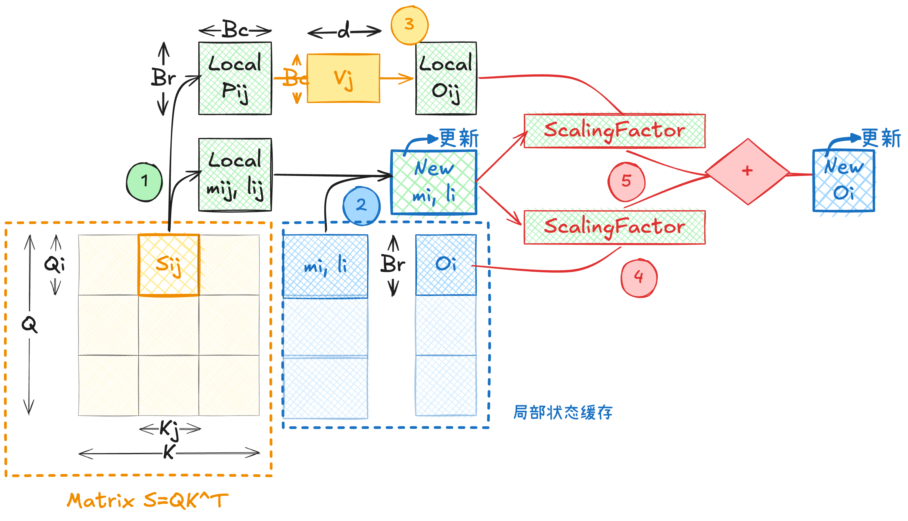
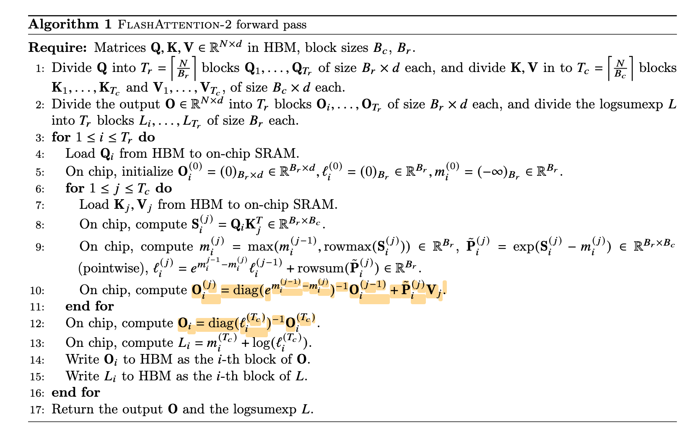

Flash Attention V2 在 Flash Attention V1 的基础上：
- 优化了算法计算
- 沿 sequence length 维度并行化
- thread block 内重新分配 warp 工作

> 参考论文：[FlashAttention-2: Faster Attention with Better Parallelism and Work Partitioning](https://arxiv.org/abs/2307.08691)

## 回顾

- [Online Softmax 推导](Online%20Softmax%20推导.md)
- [Flash Attention (FA1)](Flash%20Attention%20(FA1).md)

## 算法优化

下图是 Flash Attention V1 计算 $O_{i}$ 的 Workflow：

在 Flash Attention V1 实现中，维护局部变量 $(m_{i},l_{i}, O_{i})$，对于每个 tilde 进行计算时将其进行更新。

对于局部变量计算有（第一步）：
$$
\begin{cases}
\tilde{m}_{ij} &= \operatorname{rowmax}(S_{ij}) \in \mathbb{R}^{B_r}, \\
\tilde{P}_{ij} &= \exp\big(S_{ij} - \tilde{m}_{ij}\big)
\in \mathbb{R}^{B_r \times B_c}, \\
\tilde{l}_{ij} &= \operatorname{rowsum}(\tilde{P}_{ij})
\in \mathbb{R}^{B_r}. \\
\tilde{O}_{ij} &= \tilde{P}_{ij} V_j \in \mathbb{R}^{B_r \times d}.
\end{cases}
$$

状态更新 $(m_{i},l_{i}) \to (m_{i}^\text{new}, l_{i}^\text{new})$ 式子（第二步）：
$$
\begin{cases}
m_i^{\text{new}} &= \max(m_i, \tilde{m}_{ij}) \in \mathbb{R}^{B_r}, \\
l_i^{\text{new}} &=
l_i \odot e^{m_i - m_i^{\text{new}}}
+
\tilde{l}_{ij} \odot e^{\tilde{m}_{ij} - m_i^{\text{new}}}
\in \mathbb{R}^{B_r}.
\end{cases}
$$

最终更新输出矩阵 $O_{i}\to O_{i}^\text{new}$（第三-五步）：

$$
\begin{cases}

N_i = \operatorname{diag}(l_i)\, O_i. \\

\Phi_i
=
\operatorname{diag}\!\big(e^{m_i - m_i^{\text{new}}}\big)\,
N_i
=
\operatorname{diag}\!\big(l_i\, e^{m_i - m_i^{\text{new}}}\big)\, O_i. \\ 
\Delta_i
=
\operatorname{diag}\!\big(e^{\tilde{m}_{ij} - m_i^{\text{new}}}\big)\,
\tilde{O}_{ij}. \\  

\boxed{O_i^{\text{new}}
=
\operatorname{diag}(l_i^{\text{new}})^{-1}
\big(\Phi_i + \Delta_i\big)
\in \mathbb{R}^{B_r \times d}.}
\end{cases}
$$

### 减少非矩阵乘法运算

Flash Attention V2 观察到如果将维护的输出矩阵 $O_{i}$ 改成 online softmax“分子累积量”的输出矩阵 $N_{i}$，**可以节省在每个 step 中 $O_{i}^\text{new}$ 的计算，也就是归一化预算——$N_{i}^\text{new}$ 与局部 $\text{diag}(l_{i}^\text{new})^{-1}$ 的乘法计算。** 这一步变成只有最后一个 tilde 才执行。

需要注意的是 Flash Attention V2 中 $\tilde{P}_{ij}$ 与 Flash Attention V1 的定义不一样，且是完成状态更新 $(m_{i},l_{i}) \to (m_{i}^\text{new}, l_{i}^\text{new})$ 后才运算的。为了表示区别，我在 FA2 定义的变量上加了个上标。

$$
\begin{cases} 
\boxed{\tilde{P}_{ij}^{(\text{FA2})} = \exp(S_{ij}-m_{i}^\text{new})}  \\
\Phi_i  
=  
\operatorname{diag}\!\big(e^{m_i - m_i^{\text{new}}}\big)\, N_i  
\\
\Delta_i  
=  
\operatorname{diag}\!\big(e^{\tilde{m}_{ij} - m_i^{\text{new}}}\big)\, \tilde{O}_{ij}  \implies \boxed{\Delta_{i}= \tilde{P}_{ij}^{(\text{FA2})} V_{j}}
\\
\boxed{  
N_i^{\text{new}} = \Phi_i + \Delta_i  
}
\end{cases}
$$

因此在 Flash Attention V2 中，维护的局部变量变成了 $(m_{i},l_{i}, N_{i})$，在循环结束后统一输出：
$$
\boxed{
O_i = \operatorname{diag}(l_i)^{-1} N_i
}
$$

在原文中的算法是这么推导的：

> ⚠️ 原文第 10 行有误，$\text{diag}(\dots)^{-1}$ 应该改为 $\text{diag}(\dots)$

看似只是减少了多次 $\text{diag}^{-1}$ 运算，但实际上优化效果非常好。这是因为在 GPU 中非矩阵*乘法*运算比矩阵*乘法*运算慢 16倍，因此需要**尽量减少非矩阵乘法的运算**。

> ⚠️ 注意是矩阵乘法运算而不是矩阵运算之间的比较
### Causal Masking 优化

在自回归模型中，由于 causal mask 的存在，attention 矩阵的上三角部分不会对结果产生贡献，因此在优化实现中可以跳过这些无效计算。Flash Attention 在分块计算过程中，也可以利用 mask 跳过部分上三角区域的计算。

### 内外循环位置变化

- softmax 操作在 row 维度上做，因此固定 $Q$ 循环 $\{K,V\}$ 想法更符合 softmax 特性
- 以 $Q$ 为外循环，可以避免往 SHM 上读写中间结果和最终结果 $O_{i}$

## CUDA 层级优化

TBD

## 参考资料

- [图解大模型计算加速系列：Flash Attention V2，从原理到并行计算](https://zhuanlan.zhihu.com/p/691067658)