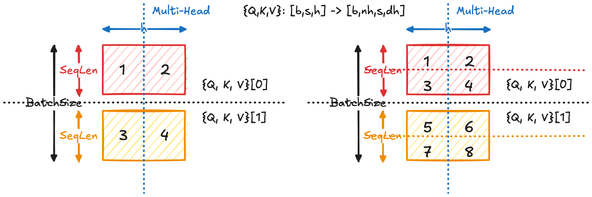
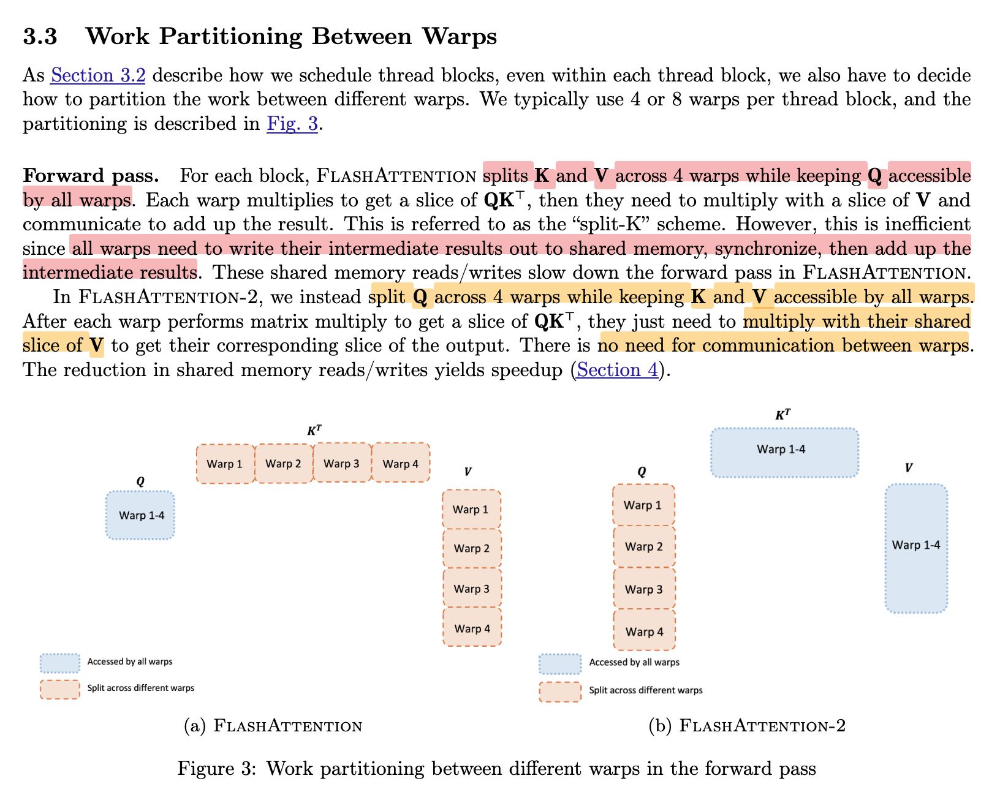

**Flash Attention V2** 在 Flash Attention V1 的基础上，从计算模式与并行策略两个层面进行了共四点系统性优化。在算法层面，FA2 **减少了非矩阵乘法运算**（例如不必要的 rescale 和 normalize 等逐元素操作），使整体计算过程更加接近连续的 GEMM。同时，对于 causal masking，FA2 采用了更高效的处理方式，尽量**避免在被 mask 的区域上进行无效计算**，进一步提升了计算效率。

在并行化方面，FA2 沿 sequence length（即 $Q$ 维度）引入了**更细粒度的并行划分**，将原本较粗粒度的计算任务拆分并分配给更多的 thread block，从而显著提高了硬件并行度与资源利用率。在 thread block 内部，FA2 **重新设计了 warp 的工作分配方式**，使不同 warp 分别负责不同的 $Q$ 子块（对应不同输出行），从而避免多个 warp 同时对同一输出进行并行写入且避免了对中间结果的合并需求，显著降低了 warp 间的同步与通信开销。

> 参考论文：[FlashAttention-2: Faster Attention with Better Parallelism and Work Partitioning](https://arxiv.org/abs/2307.08691)

## 问题背景

- [Online Softmax 推导](Online%20Softmax%20推导.md)
- [Flash Attention (FA1)](Flash%20Attention%20(FA1).md)

Attention 计算可以建模为：

FlashAttention V1 将 Q 按 sequence 维度切分为若干块 $Q_i$，同时将 K, V 也按 sequence 维度切分为 $K_j, V_j$。对于任意 $Q_i$，其对应的输出 $O_i$ 需要与所有的 $(K_j, V_j)$ 进行交互计算。具体而言，FlashAttention 通过遍历所有 KV 块 $j$，逐步累积计算 $O_i$。 下图展示了单步 $(i, j) \in [\![1, n]\!]^2, (Q_{(i)}, \{K, V\}_{(j)}) \to^\text{Update} O_{i}$ 的计算过程：

在 Flash Attention V1 实现中，维护局部变量 $(m_{i},l_{i}, O_{i})$，对于每个 tilde 进行计算时将其进行更新。

对于局部变量计算有（第一步）：
$$
\begin{cases}
\tilde{m}_{ij} &= \operatorname{rowmax}(S_{ij}) \in \mathbb{R}^{B_r}, \\
\tilde{P}_{ij} &= \exp\big(S_{ij} - \tilde{m}_{ij}\big)
\in \mathbb{R}^{B_r \times B_c}, \\
\tilde{l}_{ij} &= \operatorname{rowsum}(\tilde{P}_{ij})
\in \mathbb{R}^{B_r}. \\
\tilde{O}_{ij} &= \tilde{P}_{ij} V_j \in \mathbb{R}^{B_r \times d}.
\end{cases}
$$

状态更新 $(m_{i},l_{i}) \to (m_{i}^\text{new}, l_{i}^\text{new})$ 式子（第二步）：
$$
\begin{cases}
m_i^{\text{new}} &= \max(m_i, \tilde{m}_{ij}) \in \mathbb{R}^{B_r}, \\
l_i^{\text{new}} &=
l_i \odot e^{m_i - m_i^{\text{new}}}
+
\tilde{l}_{ij} \odot e^{\tilde{m}_{ij} - m_i^{\text{new}}}
\in \mathbb{R}^{B_r}.
\end{cases}
$$

最终更新输出矩阵 $O_{i}\to O_{i}^\text{new}$（第三-五步）：

$$
\begin{cases}

N_i = \operatorname{diag}(l_i)\, O_i. \\

\Phi_i
=
\operatorname{diag}\!\big(e^{m_i - m_i^{\text{new}}}\big)\,
N_i
=
\operatorname{diag}\!\big(l_i\, e^{m_i - m_i^{\text{new}}}\big)\, O_i. \\ 
\Delta_i
=
\operatorname{diag}\!\big(e^{\tilde{m}_{ij} - m_i^{\text{new}}}\big)\,
\tilde{O}_{ij}. \\  

\boxed{O_i^{\text{new}}
=
\operatorname{diag}(l_i^{\text{new}})^{-1}
\big(\Phi_i + \Delta_i\big)
\in \mathbb{R}^{B_r \times d}.}
\end{cases}
$$

## 算法优化

### 减少非矩阵乘法运算

Flash Attention V2 观察到如果将维护的输出矩阵 $O_{i}$ 改成 online softmax “分子累积量”的输出矩阵 $N_{i}$，**可以节省在每个 step 中 $O_{i}^\text{new}$ 的归一化计算，即$N_{i}^\text{new}$ 与局部 $\text{diag}(l_{i}^\text{new})^{-1}$ 的乘法计算。** 这一步变成只有最后一个 tilde 才执行。

需要注意的是 Flash Attention V2 中 $\tilde{P}_{ij}$ 与 Flash Attention V1 的定义不一样，且是完成状态更新 $(m_{i},l_{i}) \to (m_{i}^\text{new}, l_{i}^\text{new})$ 后才运算的。为了表示区别，我在 FA2 定义的变量上加了个上标。

$$
\begin{cases} 
\boxed{\tilde{P}_{ij}^{(\text{FA2})} = \exp(S_{ij}-m_{i}^\text{new})}  \\
\Phi_i  
=  
\operatorname{diag}\!\big(e^{m_i - m_i^{\text{new}}}\big)\, N_i  
\\
\Delta_i  
=  
\operatorname{diag}\!\big(e^{\tilde{m}_{ij} - m_i^{\text{new}}}\big)\, \tilde{O}_{ij}  \implies \boxed{\Delta_{i}= \tilde{P}_{ij}^{(\text{FA2})} V_{j}}
\\
\boxed{  
N_i^{\text{new}} = \Phi_i + \Delta_i  
}
\end{cases}
$$

因此在 Flash Attention V2 中，维护的局部变量变成了 $(m_{i},l_{i}, N_{i})$，在循环结束后统一输出：

$$
\boxed{O_i = \operatorname{diag}(l_i)^{-1} N_i}
$$

在原文中的算法是这么推导的：

> ⚠️ 原文第 10 行有误，$\text{diag}(\dots)^{-1}$ 应该改为 $\text{diag}(\dots)$

看似只是减少了多次 $\text{diag}^{-1}$ 运算，但实际上优化效果非常好。这是因为在 GPU 中非矩阵*乘法*运算比矩阵*乘法*运算慢 16 倍，因此需要**尽量减少非矩阵乘法的运算**。

> ⚠️ 注意是矩阵**乘法**运算而不是矩阵运算之间的比较

### Causal Masking 优化

在自回归模型中，由于 causal mask 的存在，attention 矩阵的上三角部分不会对结果产生贡献，因此在优化实现中可以跳过这些无效计算。Flash Attention 在分块计算过程中，也可以利用 mask 跳过部分上三角区域的计算。

### 内外循环位置变化

- softmax 操作在 row 维度上做，因此固定 $Q$，循环 $\{K,V\}$ 想法更符合 softmax 特性
- 以 $Q$ 为外循环，可以使中间状态 $(m, l, O)$ 在寄存器中连续累积，而不需要在不同 warp 之间反复读取和合并，从而减少在 SHM 上的读写与同步开销
 
## CUDA 层级优化

### 更细粒度的并行方式

FlashAttention-2 在 FlashAttention-1 的基础上，引入了**更细粒度的并行划分方式**。下图展示了 FA1 和 FA2 的并行划分方式区别：

在 FA1 中，计算主要在 batch size 和 head 维度上并行，每个 CUDA thread block 通常负责一个 `(b, h)` 对应的 attention 计算，即 $\text{Attention}(Q_{(b,h)}, K_{(b,h)}, V_{(b,h)})$. 这种方式的并行度受限于 $b \times n_h$，在序列较长时难以充分利用 GPU 计算资源。

FA2 在此基础上，
- **进一步在 sequence length（Q 的行维度）上进行切分**
- 将单个 attention 的计算拆分为多个子任务
- 每个 thread block 仅负责一部分 $Q$（即若干 token）的 attention 计算，
- 而所有 block 共享完整的 $K$, $V$ 并独立完成对应输出行的计算。

因此，FA2 的并行粒度从：  
$$
(b, h) \quad \rightarrow \quad (b, h, \text{Q-block})
$$

**显著增加了 thread block 数量，使多个 block 能够协同计算同一个 attention，从而提升 GPU 的并行利用率和整体性能。**

### Warp 间工作量分配

下面我们研究单个 thread block 的工作 $\forall i= (b,h,\text{Q-block}), \; (Q_{\text{local}}, K, V)_{i}\to O_{i}$ 是如何分配给多个 GPU warp 执行的。
- 在 FA1 中，所有 warp 共享 $Q_{\text{local},i}= Q_{i}$，并各自处理 $\{K,V\}_{i}$ 矩阵的不同子块。这意味着在多个 warp 并行执行之后，由于它们共同计算同一个 $O_i$ 的*部分*结果，需要通过 shared memory 进行通信，并由一个 warp 统一进行合并（reduction）操作。
- 而在 FA2 中，所有 warp 共享 $\{K, V\}_{i}$ 矩阵（只读），但各自负责 $Q_{\text{local},i}$ 的不同子块（即不同输出行）。由于不同 sequence 的 $Q$ 维度之间没有依赖关系，是完全 embarrassingly parallel 的，因此每个 warp 可以独立完成对应的 $O_i$ 子块计算，不需要进行跨 warp 的同步合并。
- **FA2 将原本的通信开销转化为更加高效的独立计算，显著提升了整体性能。**

下图是原文论文表述。紫色块表示不同 warp 之间共享的矩阵，绿色块表示各个 warp 负责的不同子块的数据。

## 参考资料

- [图解大模型计算加速系列：Flash Attention V2，从原理到并行计算](https://zhuanlan.zhihu.com/p/691067658)