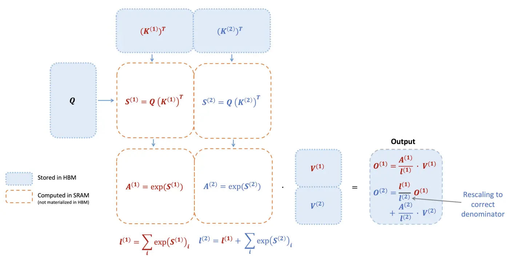

FlashAttention 在训练阶段可以借助 batch 和 sequence length 提供充足的并行度，从而高效利用 GPU；但在 decode 阶段，每一步仅涉及单个 query，导致可并行的计算任务数量有限，从而难以填满 GPU，单 step 的 SM 利用率较低。
Flash Decoding（FlashAttention V3）利用 online softmax 中间状态 $(m,l,O)$ 的可结合性，将原本的串行递推过程重写为**并行分块计算 + 规约合并**：显著提升了 decode 阶段的 SM 利用率。

## Flash Attention 在 LLM 推理阶段遇到的问题

在 [Flash Attention (FA1)](Flash%20Attention%20(FA1).md) 文章中我们推导了 Flash Attention 计算方式。具体而言，为了计算：
$$
O = \text{softmax}\left( \frac{QK^T}{\sqrt{ d }} \right).V, \quad \mathrm{softmax}(x)_i = \frac{e^{x_i}}{\sum_j e^{x_j}}
$$
对于 Query $Q$，与分块的 $\{K, V\}^{(1,2)}$ 计算可以用下图来表示：维护全局状态 $(m,l, O)$. 对于每一子块 $(i)$：
- 计算 $S^{(i)}= Q(K^{(i)})^T$
- 得到 $(m^{(i)}, l^{(i)})$ 和未归一化权重 $A^{(i)}$，更新全局状态 $(m,l)$
- **基于 $(O^{(i-1)}, A^{(i)} V^{(i)})$ 和归一化因子 $l^{(i)}$ 得到 $O^{(i)}$**

> 在这里我们使用 $A^{(i)}= e^{S^{(i)}}$，而我们在 [Flash Attention (FA1)](Flash%20Attention%20(FA1).md) 使用的 $\tilde{P}^{(i)} = e^{S^{(i)} - m^{(i)}}$ 是其数值稳定形式（通过减去最大值进行重标定），两者在数学上等价。

最后一点特别重要，这意味着在原来实现中，为了得到最终输出 $O^{(k)}$，需要一步一步的从 $O^{(1)}$ 推导：
$$
O^{(1)}\to O^{(2)} \to \dots \to O^{(k)} \to \text{output}
$$

下图展示了这个过程：

在推理（decode）阶段，每一步仅计算一个新的 query（即 $Q \in \mathbb{R}^{1 \times d}$），导致 FlashAttention 的两个关键并行维度受到限制：
1. **Query 维度并行性消失**：无法通过 batch 或 sequence length 提供足够的并行度来填满 GPU
2. **Key/Value 分块存在串行依赖**：由于 softmax 归一化依赖全局状态 $(m,l)$，各个 block 的计算必须按照顺序递推。

因此，在 decode 阶段，FlashAttention 虽然仍然减少了显存访问，但其计算过程呈现出 **低并行度 + 串行依赖链** 的特点，难以充分利用 GPU 计算资源。

## Flash Decoding 的优化

Flash Decoding 的主要优化点：
- **$O$ 的计算可以从串行优化为并行规约**
	- 在标准 attention / FlashAttention 中，对于单个 query，其对应的 $K/V$ 通常由一个 SM 顺序扫描完成（streaming softmax），因此存在明显的串行依赖。
    - 而 online softmax 可以表示为一组可累积的中间状态 $(m, l, O)$，并且这些状态的合并操作满足结合律（可以理解为需要 rescale 的加法操作）
    - 这意味着：
	    - 不同子块可以**独立计算局部状态**
	    - 再只需要通过规约（reduction）合并为全局结果
- 因此可以将 $K/V$ 沿 sequence 维度切分为多个块：
    - 每个 SM 负责一个 block，独立计算 $(m^{(i)}, l^{(i)}, O^{(i)})$
    - 最后通过一次（或分层）规约得到最终 $O$

具体计算流程如下图所示：