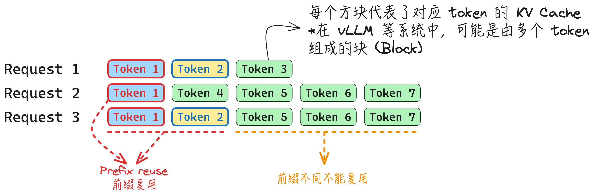
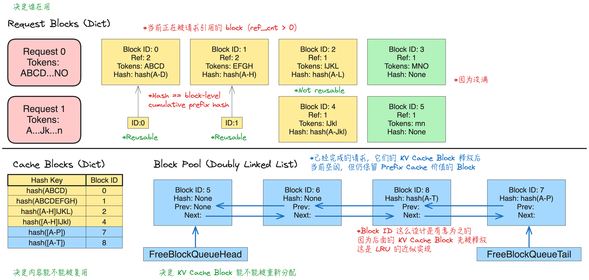

本文从 KV Cache 的复用动机出发，介绍 **Prefix cache** 的优化方法，~~并进一步分析 vLLM v1 如何将其演化为接近 zero-overhead 的“free lunch”机制。~~

## Prefix Cache (vLLM v0 naive version)

在 LLM 推理中，许多请求往往共享相同的前缀，例如对话系统中的 system prompt 往往对所有请求都是一致的。基于这一观察，系统可以缓存已经计算过的前缀对应的 KV Cache，并在后续具有相同前缀的请求中直接复用。这种 prefix cache 机制带来两个主要好处：
- **避免重复构建相同前缀的 KV Cache**，从而降低系统的 KV Cache 内存占用；
- **避免对相同前缀重复执行 prefill 计算**，从而减少计算开销并降低请求延迟。

如下图所示，
- Request 2 可以复用 Request 1 的第一个 token 的 KV Cache，
- Request 3 可以服用 Request 1 的第一和第二个 token 的 KV Cache. 
- Request 3 的 Token 5-7 不能复用 Request 2 的对应 token 的 KV Cache 是因为两个请求的前缀不同，因此对应的 KV Cache 自然也不同。

为了实现 Prefix cache 机制，我们需要考虑以下几个问题：
- **前缀匹配搜索**。对于新请求的 prompt，对于新请求的 prompt，系统需要高效地在已有的历史前缀缓存中查找可匹配的前缀，并定位可以直接复用的 KV Cache blocks。
- **Eviction 策略**。系统内存资源是有限的，当请求很多的时候，就需要做 eviction 策略来回收不常用的 KV Cache。
- **Block 大小与 Cache hit rate**. 在 vLLM 系统中，往往一个 KV Cache Block 包含多个 token，此时 block size 就非常重要。较大的 block size 可以降低管理和查找开销，但可能降低缓存命中率；较小的 block size 能提高复用粒度和命中率，但会带来更高的元数据管理和调度开销。

**Prefix cache 的收益**。Prefix cache 并不总是能带来收益，当 hit rate 很低时，由于存在前缀匹配搜索开销，所以存在一定可能导致收益损失。

## vLLM v1 Prefix Cache 实现

## 参考资料

- [vLLM的prefix cache为何零开销](https://zhuanlan.zhihu.com/p/1896927732027335111)
