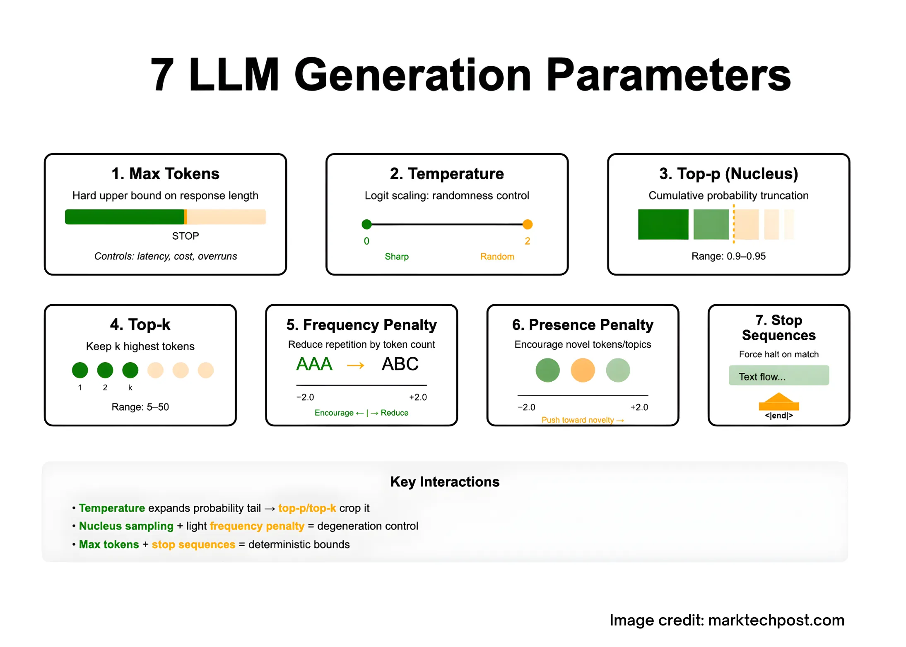
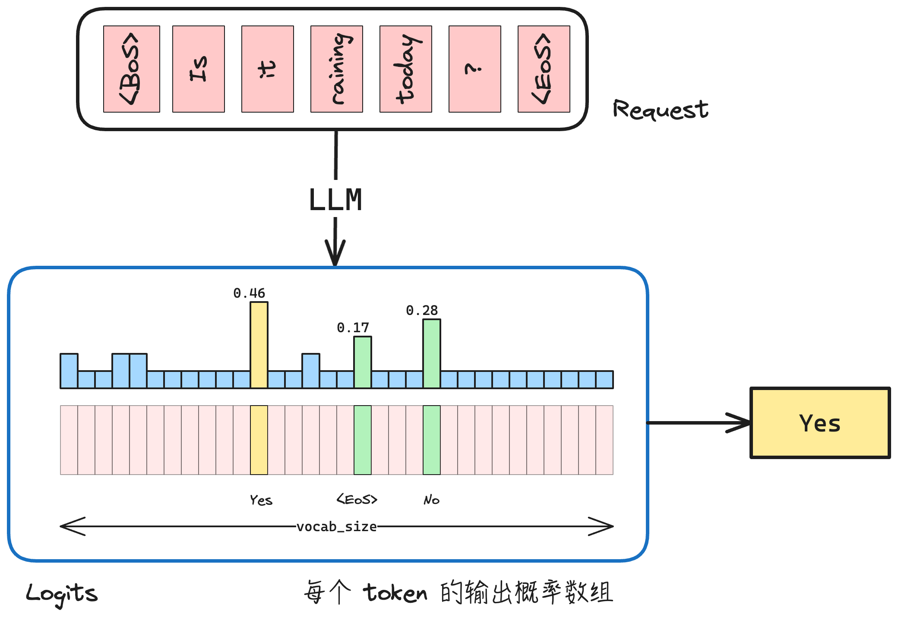
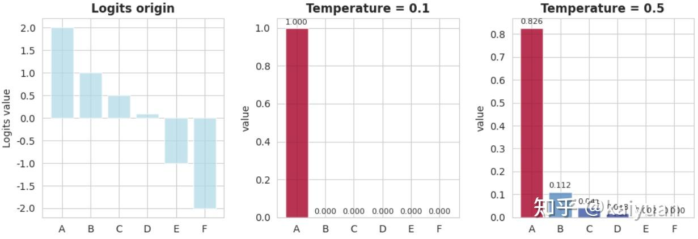
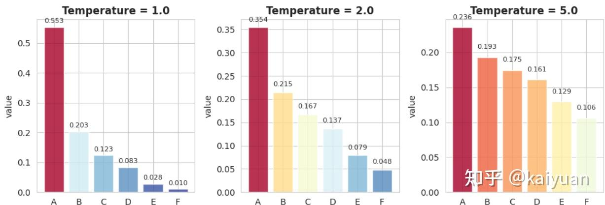
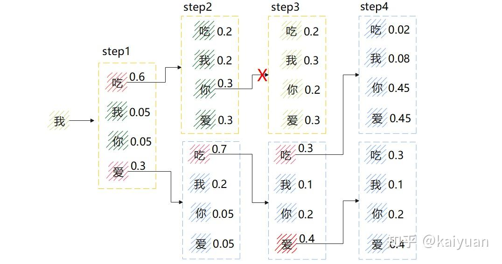

本文简单介绍了 LLM 推理采样的基本概念，并且介绍了不同采样方式和采样策略。

## 推理采样：根据模型输出的概率分布，选择下一个 token 的过程

下图展示了 LLM 的采样过程。具体而言，
- 一个 Request 在经过 LLM 前向计算后，会得到一个大小为 $\mathbb{R}^{|\mathcal{V}|}$ 的 logits 向量（未归一化分数），其中 $|\mathcal{V}|$ 为词表大小（vocab size）。通过 softmax 可以将其转换为一个概率分布。
- **采样（sampling）** 则是根据该概率分布，从词表中选择一个 token（结合 temperature、top-k、top-p 等策略进行调整）。

例如：
- 给定一个词表 tokens = `[Yes, No, <EoS>]`，模型输出对应的 logits 为 `[2.0, 1.0, 0.1]`。这些 logits 表示模型对每个 token 的“偏好强度”，数值越大，表示越倾向于选择该 token。
- 接着，对 logits 进行 softmax 变换，将其转化为概率分布，得到约 `[0.65, 0.24, 0.11]`。此时，每个值可以被解释为对应 token 被选中的概率。如果采用 greedy strategy（贪心策略），即始终选择概率最大的 token，那么最终会选择概率最高的 Yes。

## 采样策略

采样策略描述了如何根据概率分布向量，从词表中选择一个 token 的策略。

最直接的策略是选择概率最高的 token 作为下一个输出，也就是贪婪搜索策略。
然而，这种策略存在一些问题：
- **局部最优不等于序列级最优**（只优化当前 token，而非整体序列概率）
- **容易产生退化行为**（如重复、循环、无意义延展）
- **缺乏多样性**（输出趋于单一、保守）

大模型的应用通常在两个目标之间进行权衡：
- 一类场景希望输出具有**多样性与探索性**（如创作、对话等），因此需要引入一定的不确定性；
- 另一类场景希望输出**稳定、准确且可复现**（如问答、代码生成等），因此倾向于减少随机性。

因此对应的不同场景，有不同的采样策略。

### 随机采样

**随机采样**是基于概率分布的随机过程，假设概率分布为 $P$，则下一个 token $T \sim P$.

这意味着我们可以通过调整 logits 的概率分布 $P$ 来改变 token 采样。

### Temperature：调整概率分布尖锐/平坦程度

温度通过引入 $T$ 变量来影响 softmax 计算：

$$
\forall t \in \mathcal{V}, \;
P_T(t) =
\frac{\exp\left(\frac{z_t}{T}\right)}{\sum_{t' \in \mathcal{V}} \exp\left(\frac{z_{t'}}{T}\right)}
$$

具体而言：
- 低温（$0<T<1$）使得概率大值更加突出，输出变得可预测，但可能会变得重复和缺乏想象力
- 高温（$T>1$）使得输出更加多样，但有可能会导致不连贯或者出现错误

### Top-K/Top-P/Min-P：缩小候选 token 范围

词表大小 $|\mathcal{V}|$ 通常在 $15k \sim 150k$ 之间，但在采样时并不需要考虑全部 token。实际中通常先在 logits 上进行筛选，将不可能的 token 置为 $-\infty$，再进行 softmax 和采样。常见的筛选方法包括：
- **Top-K**：概率排序后，保留 logits 最大的 $K$ 个值
- **Top-P**：可以筛选低概率值。概率排序后，从概率最大的 token 开始，一直取到累积概率到 $P$ 为止，即保留最小集合 $\mathcal{S}$，使得 $\sum_{i \in \mathcal{S}} p_i \ge P$
- **Min-P**：能保证所选择的每个值达到一定要求。保留所有概率至少为最高概率的 $P$ 倍的候选词（$0 < P <1$），即保留所有满足 $p_i \ge P \cdot p_{\max}$ 的 token

Top-K 可能会选取到概率很低的样本；Top-P 会出现采集数量过多的问题，Min-P 会出现采样过少的问题。

### Penalty

在输出采样实践中，如果纯靠概率模型可能会犯一些错误，比如：**循环、重复、冗余。**

1. **频率惩罚**（frequency penalty）：对出现过的词，根据其出现频率降低logits值，频率越高衰减越严重：$z_{i} := z_{i}- \lambda_{f}.c_{i}$ 其中 $\lambda_{f}$ 是惩罚系数，$c_{i}$ 是出现次数
2. **存在惩罚**（presence penalty）：对出现过的词，在logits中减去一个相应惩罚值，每个词至多惩罚一次：$z_{i} := z_{i} - \lambda_{p} \; \text{if } c_{i} > 0 \; \text{otherwise } := 0$
3. **重复惩罚**（repetition penalty）：对重复出现的词进行衰减，类似频率处理：$z_i \leftarrow \begin{cases} z_i / r & \text{if } z_i > 0 \\ z_i \cdot r & \text{if } z_i < 0 \end{cases}$

## 确定性采样

确定性采样的目标就是找概率最大的输出结果。定义序列概率为：
$$
P(x_{1}, \dots,x_{T}) = \prod_{t=1}^T p(x_{t}|x_{<t})
$$

**贪婪搜索 (Greedy search)**
- 即每一步取概率最大的 logits 作为输出能够保证单步最优：$x_{t} = \arg\max_{\mathcal{x_{t'}\in V}} p(x_{t'}|x_{<t})$
- 但是并不能保证在多步情况下累积概率（也就是联合概率）最大的。

从全局角度来看，我们希望在长度为 T 的时间窗口内找到最优序列：
$$
(x_{T_0}, \dots, x_{T_0+T-1}) = \arg\max \prod_{t=T_0}^{T_0+T-1} p(x_t \mid x_{<t})
$$
该问题可以视为在一个分支因子为 $|\mathcal{V}|$、深度为 $T$ 的搜索树上寻找最优路径，其候选序列空间为：$\mathcal{V}^T$. 因此，可能的路径数量为 $|\mathcal{V}|^T$，呈指数增长，在实际中不可穷举。

因此，在实际解码过程中，需要采用近似搜索策略（如 Greedy Search、Beam Search 或 Sampling）来在计算复杂度和生成质量之间进行权衡。

### Beam Search

**Beam search** 是一种结合 top-K 和剪枝的搜索算法，每次保留束宽（beam width）k 个结果。beam search 的基本步骤：
1. 对首次输出进行 top-K 排序，选取前 $k$ 个值；
2. 根据上一 step 的 $k$ 个值，分别获得 $k$ 个输出，每个分支进行 top-K 排序，计算累积概率；
3. 对全局 $k \times  k$ 个累积概率排序，选取前 $k$ 个值；
4. 重复步骤2、3，直到 $k$ 个分支遇到结束符，最后以累积概率最大的分支作为结果。

下图展示了 $K=2$ 的 Beam Search 的例子。
- Step 1：选择 Top-2 token “吃”、“爱”
- Step 2：对 【“吃”-“你”/“爱”】 和 【“爱”-“吃”/“我”】进行 Top-2 筛选，剩下 ”吃你“ 和 ”爱吃“
- Step 3：对 【”吃你”-“我/”爱“】和【”爱吃“-”爱“/”吃“】进行 Top-2 筛选，剩下 “爱吃爱” 和 “爱吃吃”
- ...

但 Beam search 也有其不足：
- **增加 KV Cache 开销**：Beam Search 同时维护多个候选序列，每个序列对应不同的 prefix 状态，从而需要维护多份 KV Cache。其本质是从单路径推理转变为多路径并行推理。Prefix cache 可以缓解跨请求的前缀复用问题。
- 倾向于短输出。Beam Search 通过最大化序列的联合概率，而每一步的对数概率通常为负值，因此序列越长，其累计得分越低。由于在每一步都会进行 Top-K 剪枝，Beam Search 会优先选择早早输出 `<EoS>` 字符并且退出生成的方案。

## 参考资料

- [LLM推理采样(Sampling)常见知识概览](https://zhuanlan.zhihu.com/p/1981752176578667658
- [7 LLM Generation Parameters—What They Do and How to Tune Them?](https://www.marktechpost.com/2025/10/14/7-llm-generation-parameters-what-they-do-and-how-to-tune-them/)