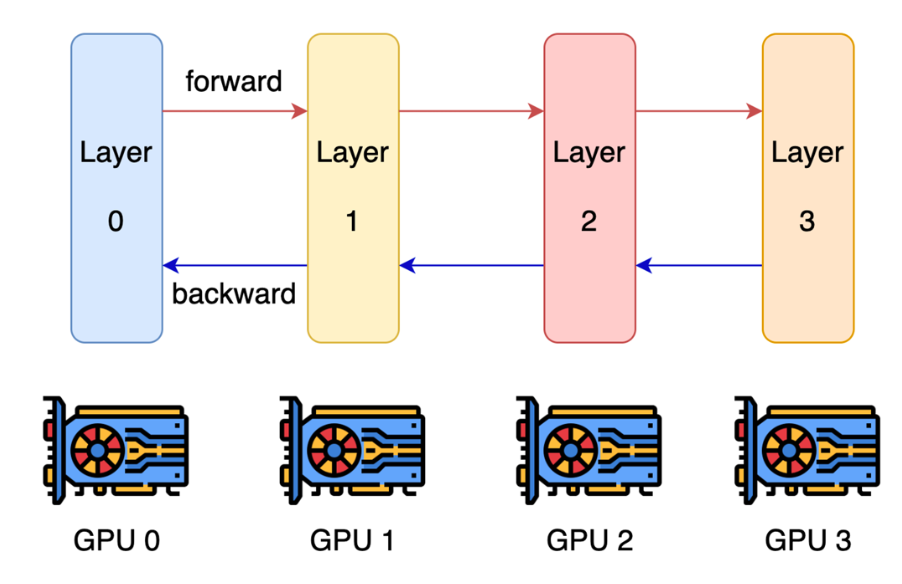
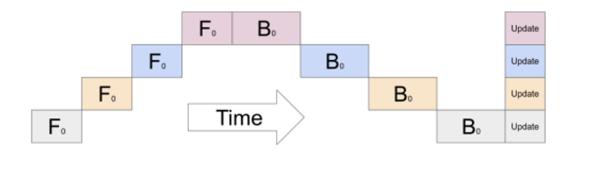
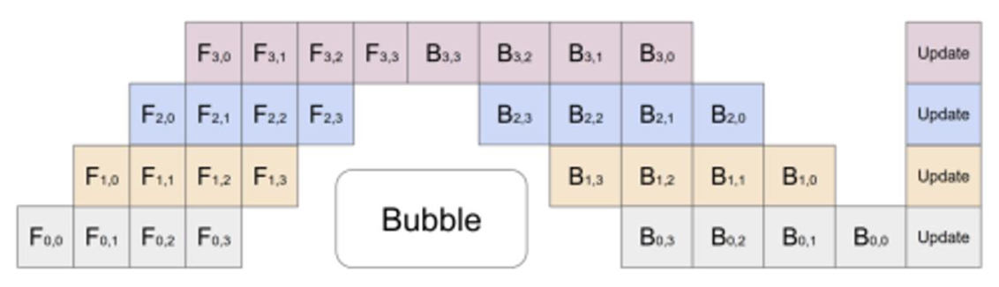
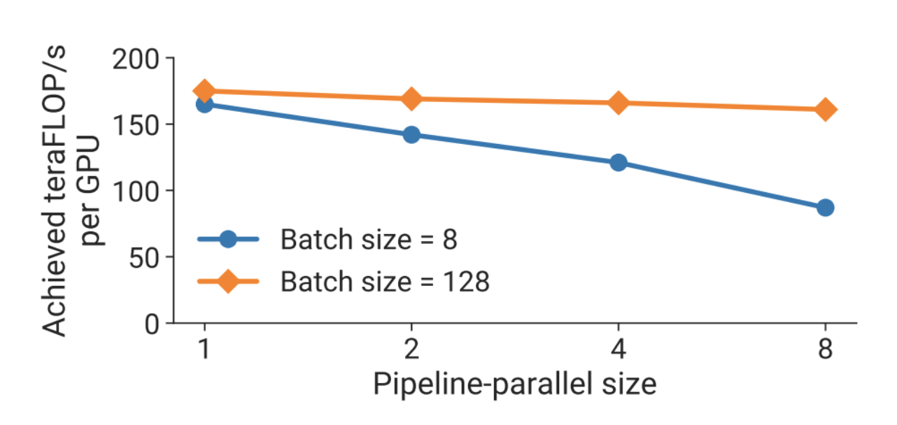
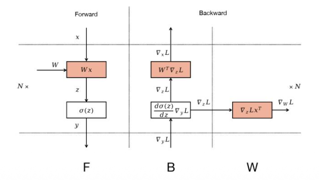
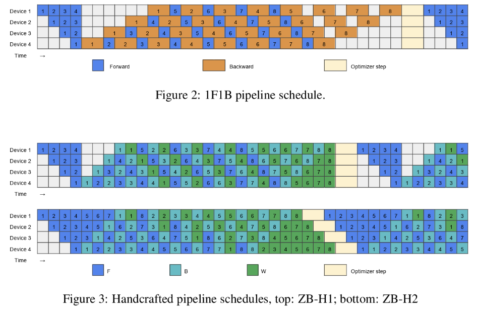

**模型并行**的核心思想是：不再让每张 GPU 都保存完整模型，而是把模型本身切分到不同 GPU 上。不同 GPU 负责模型的不同部分，并通过通信把中间结果传递给下一部分。换句话说，数据并行切的是数据，模型并行切的是模型。

## Naive method

最朴素的模型并行方式是 **layer-wise parallelism**：按照层来切分模型，把连续的一部分层放在一张 GPU 上，另一部分层放在另一张 GPU 上。

这种方式在语义上很直接：前向传播时，前一张 GPU 计算完自己的层之后，把 activation 发送给下一张 GPU；反向传播时，后一张 GPU 计算完局部梯度之后，再把 activation gradient 传回前一张 GPU。因此，activation 和 partial gradients 会在相邻 stage 之间来回传递。

问题在于，这种朴素切分的 GPU 利用率非常差。假设一共有 $n$ 张 GPU，如果一次只处理一个 batch，那么同一时刻通常只有一张 GPU 在工作，其余 GPU 都在等待。因此，每张 GPU 大约只有 $1/n$ 的时间是 active 的，大量时间浪费在 pipeline bubble 上。

## Pipeline parallel

Pipeline parallelism 的动机就是：既然一个完整 batch 经过多个 stage 时会产生大量等待，那就把这个 batch 切成多个 **micro-batches**，让不同 micro-batch 像**流水线**一样依次流过不同 GPU。

具体来说，第一个 GPU 计算完第一个 micro-batch 后，立刻把它发送给第二个 GPU；与此同时，第一个 GPU 不再空等，而是继续计算第二个 micro-batch。这样，当第二个 GPU 在处理第一个 micro-batch 时，第一个 GPU 可以同时处理第二个 micro-batch。多个 micro-batch 交错执行后，不同 GPU 就可以同时保持忙碌。

因此，pipeline parallelism 的本质不是消除模型层之间的依赖，而是利用 micro-batch 把多个样本的执行过程错开，从而填满流水线。它牺牲了一些调度复杂度，换来了更高的 GPU 利用率。

但是 Pipeline 中仍然存在 bubble。一个常见的近似表达是，bubble time 和 useful compute 的比例为：

$$

\frac{n_{\text{stages}} - 1}{n_{\text{micro-batches}}}

$$

其中 $n_{\text{stages}}$ 是 pipeline stage 数量，$n_{\text{micro-batches}}$ 是 micro-batch 数量。直观上，stage 越多，流水线越长，启动和排空的空泡越多；micro-batch 越多，流水线越容易被填满，bubble 的相对比例越小。

所以，pipeline parallelism 的性能高度依赖 batch size / micro-batch 数量。如果 micro-batch 太少，流水线填不满，GPU 仍然会频繁等待；如果 micro-batch 足够多，pipeline 的利用率会明显提高。

使用 pipeline parallelism 的主要原因有两个。
1. 它能节省显存，因为模型参数被按层切分到不同 GPU 上，同时 activation 也主要只需要在对应 stage 上保存。
2. 它的通信性质比较好：通信主要发生在相邻 stage 之间，是端到端通信，而不是所有 GPU 之间都要同步的 collective communication。通信内容也主要是 activation 或 activation gradient，而不是完整参数或完整梯度。

##  Zero-bubble pipelining

**Zero-bubble pipelining** 的目标是进一步优化 pipeline schedule，尽可能减少甚至消除 bubble，提高 GPU 利用率。

关键观察是：反向传播并不是一个不可拆分的整体。对于一个线性层加激活函数的简单例子，前向传播可以写成：

$$

y = \sigma(z), \qquad z = W x

$$

反向传播可以拆成两类计算。第一类是继续向前一层传播 activation gradient：

$$

\nabla_x L = W^T \nabla_z L, \qquad

\nabla_z L = \frac{d\sigma(z)}{dz} \nabla_y L

$$

第二类是计算当前层参数的梯度：

$$

\nabla_W L = \nabla_z L x^T

$$

这两类计算的依赖关系不同。计算 $\nabla_x L$ 是反向传播主链路的一部分，必须按照层的反方向逐层完成，因为前一层的 backward 需要依赖后一层传回来的 gradient。也就是说，这部分计算在 pipeline 中具有严格的数据依赖。

但是，计算 $\nabla_W L$ 的依赖相对更局部。只要当前层已经拿到了 $\nabla_z L$，并且还保存着前向传播时的输入 $x$，就可以计算该层的 weight gradient。它不一定必须卡在反向传播主链路上立刻完成。

Zero-bubble pipelining 的核心思想就是利用这个差异：把 backward 中必须立刻完成的 activation-gradient computation 和可以延后安排的 weight-gradient computation 拆开调度。这样，调度器可以把 weight-gradient computation 填到原本会空闲的 bubble 里，从而提高 pipeline 的整体利用率。

不过，这种方法的问题也很明显：**实现复杂度更高**。它不只是简单地把模型按层切开，而是需要更精细地拆分 backward 计算，并手工设计或自动生成更复杂的 pipeline schedule。因此，它在基础设施层面会更加复杂。
