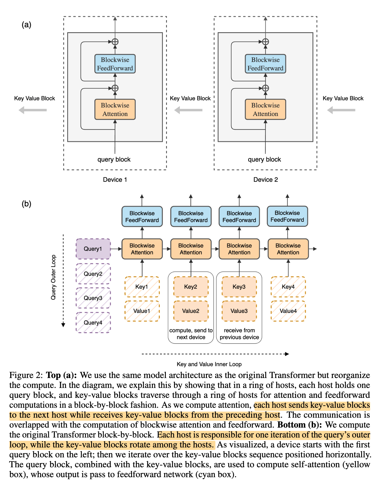
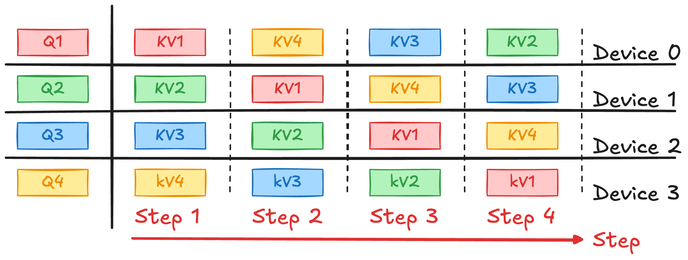

在 SP 中，Attention 的计算面临一个核心挑战：每个 query 需要访问完整的 KV 序列，这使得在序列维度上的直接切分变得困难。同时，在长序列场景下，单个设备往往无法容纳完整的 KV Cache，因此需要将 KV 分布式存储。

为了解决这一问题，**Ring Attention** 将 KV Cache 按序列维度划分到不同设备上，并通过 **ring 通信机制**在设备之间轮转 KV 块。每个设备在本地持有完整的 Query，并在接收不同 KV 块的过程中逐步完成 Attention 计算。通过将 **KV 传输与 Attention block 计算进行流水化（pipeline overlap）**，Ring Attention 能够在通信与计算之间形成稳定的并行执行，从而有效降低通信开销并提升整体吞吐。

> 参考论文：[Ring Attention with Blockwise Transformers for Near-Infinite Context](https://arxiv.org/abs/2310.01889)

## 回顾

Attention 计算：
$$
\text{Attention}(Q, K, V) = \text{softmax}\left( \frac{QK^T}{\sqrt{ d }} \right).V
$$

Attention 在每一行（每个 query）切分 $Q$ 不影响计算结果正确性。
## Ring Attention 思路

下图是论文里关于 Ring Attention workflow 的表述：

假设我们有 $n$ 个 rank，每个 rank 持有一部分的 $\{Q, K, V\}_{i \in [\![1, n]\!]}$. 对于任意 $Q_{i}$，都需要与完整的 $\{K, V\}_{1:n}$ 进行计算。
- **每个 rank 固定持有自己的 $Q_i$**
-  将 $(K, V)$ 按序列维度分块分布在各个 rank 上，并采用 ring 通信方式在 $n$ 个 step 中轮转这些 $(K, V)$ 块
- 并在 $n$ 个 step 中 **依次接收不同 rank 的 $(K_j, V_j)$ 块**
- 从而逐步完成对完整 $K,V$ 的 attention 计算。

由于块计算比块传输需要更长的时间，与标准 Transformer 相比，此过程不会增加开销。 

RingAttention 仅需要一个非常小的环形拓扑，并且支持 GPU 和 TPU。最小块大小由 FLOPs/单向带宽决定，可以很容易实现。

## 参考资料

- [伯克利 | 提出Ring Attention，Transformer分块，最高支持100M上下文！](https://zhuanlan.zhihu.com/p/660354607)