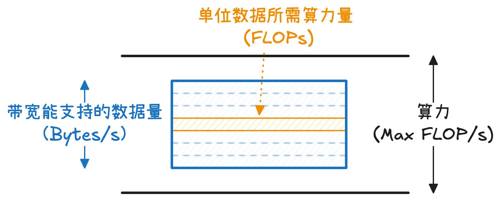

Roofline Model 用于衡量一个运算 / kernel 在特定计算平台（例如 GPU 或 TPU）上是计算受限（compute-bound）还是内存受限（memory-bound）。任何一个计算过程都同时受到**计算能力**和**内存带宽**两方面的约束，最终性能由两者中较小值决定。Roofline 模型不仅可以判断算子/模型的 Arithmetic Intensity 是否过低（导致 memory-bound），更重要的是用于定位性能瓶颈，指导优化方向。

## 计算平台指标

**FLOPs** 和 **FLOP/s (FLOPS)** 定义。为了避免混淆，我们先对这两个变量进行定义：
- **FLOPs（Floating Point Operations）** 表示**浮点运算的总数量**，是一个“工作量”的概念。例如，一个矩阵乘法需要执行多少次乘加操作，这个总次数就是 FLOPs。
- **FLOP/s（或 FLOPS）** 表示**每秒可以执行多少次浮点运算**，是一个“速度”或“吞吐”的概念。它描述的是“硬件一秒钟能做多少计算”

**算力 (Compute Throughput)**：计算平台的计算性能上限，表示平台单位时间内最多可以执行多少浮点运算，单位是 FLOPS 即 FLOP/s.

$$
	\pi = \text{Peak FLOPS}
$$

**带宽 (Memory Bandwidth)**：计算平台的带宽上限，定义为单位时间（1s）能从内存中读取或写入多少数据，单位是 Bytes/s.
$$
	\beta = \text{Peak Memory BW (Bytes/s)}
$$

## Roofline 模型

Roofline 模型希望回答：
1. 一个特定的运算 / kernel 或者模型，其访存量为 $m$ Bytes，计算量为 $c$ FLOPs
2. 在特定计算平台上，其中该计算平台算力为 $\pi$，带宽为 $\beta$
3. 其理论性能上限是多少

**一个运算的性能上限，本质上由计算能力和访存能力共同决定。**
- 从计算角度看，如果数据可以被无限快地提供，那么运算平台的峰值算力 $\pi$ 决定了每秒最多可以执行多少浮点运算（FLOPs），这是纯粹的计算上限。
- 然而在实际系统中，计算必须依赖于数据从内存中加载，因此性能往往还会受到访存能力的限制。

**最大访存能力**推导：在单位时间内（1s），系统由内存带宽所能提供的数据量，在给定算术强度（即单位数据对应的 FLOPs）的前提下，所能够支撑的最大 FLOPs；在算力无限的假设下，这一计算量可以被完全实现。即：
- 运算平台在单位时间（1s）内最多能准备多少数据，这是由带宽决定的
- **单位数据（1 Byte）需要执行多少 FLOPs 运算**，这一部分是由模型决定的。我们将其定义为**算术强度 (Arithmetic Intensity)** $I (\text{FLOPs/Bytes})$
- 两者结合在一起即为在访存限制下系统每秒最多能够支撑的计算量

因此：一个运算的实际性能上限应当是计算能力和访存能力两者中的较小值
$$
\begin{align}
\text{Achieved Performance (FLOPS)} &= \min(\text{Peak FLOPS}, \;\text{Arithmetic Intensity} \times \text{Peak Memory BW})  \\
&= \min (\pi, I\beta)
\end{align}
$$

- 当 $\pi > I \beta$，说明计算平台是内存受限（饥饿）。此时有两种可能：第一种计算平台的带宽比较差，第二种是运算/模型的每单位数据 FLOPs 运算量太小，需要优化
- 当 $\pi < I \beta$ 时，说明计算平台是计算受限的（太累），此时该算子具有较高的算术强度，能够充分利用计算资源。优化方向是降低计算量（量化、剪枝等）

同时，**算术强度上限**定义了模型在当前平台下，单位数据可以达到的理论执行 FLOPs 运算量的最大值
$$
	I \leq \boxed{I_{\max} = \frac{\pi}{\beta}}
$$

基于以上分析可以画出以下图像，其中 $P =\text{Achived Performance (FLOPS)}$.

## 应用：比较 GEMM 和 GEMV

以 GEMM 和 GEMV 为例。假设精度为 FP16，且
$$
\begin{align}
X\in \mathbb{R}^{1 \times n}, \; &M \in \mathbb{R}^{m \times n}, \; N \in \mathbb{R}^{n \times p} \\
\text{GEMV}: O = XN \in \mathbb{R}^{1 \times p}&, \quad \text{GEMM}: O= MN \in \mathbb{R}^{m \times p}
\end{align}
$$

我们希望比较以上两个运算。访存包括对于所有输入矩阵和输出矩阵的读写，运算则是矩阵乘法运算，则分别求解两个运算需要访存量 $m$ 和计算量 $c$
$$
\begin{cases}
m_{\text{GEMV}} &=(n+np+p) \times 2, \\
c_{\text{GEMV}} &= 2np 
\end{cases}, \quad
\begin{cases}
m_{\text{GEMM}} &= (mn+np+mp)\times {2}, \\
c_{\text{GEMM}} &= 2mnp 
\end{cases}
$$

因此我们可以得到：
$$
\begin{cases}
	I_{\text{GEMV}} &= \frac{np}{n+np+p} = \frac{1}{1+ \left( \frac{1}{p}+\frac{1}{n} \right)} \approx 1 \\
	I_{\text{GEMM}} &= \frac{mnp}{mn+np+mp} 
\end{cases}
$$

假设 $(m,n,p)$ 都是同数量级，特别的 $m=n=p=d$，则 $i_{\text{GEMM}} = \frac{d}{3}$，因此 $I_{\text{GEMM}} \propto d$.

以 H100 为例，其 FP 16 Tensor Core 算力为 $\pi \approx 1{,}979 \text{ TFLOPS} (\approx 2 \times 10^{15})$，内存带宽为 $\beta \approx 3.35 \sim 3.9 \text{ TB/s}$

因此
$$
	I_{\text{max}}= \frac{2 \times 10^{15}}{3.35 \times 10^{12}} \approx 600 \;\text{FLOPs/Byte}
$$

易得 $I_{\text{GEMV}} \ll I_{\text{max}}$，且当 GEMM 维度比较小的时候是 memory-bound. 当矩阵比较大的时候是 compute-bound.

## 参考资料

- [Roofline Model与深度学习模型的性能分析](https://zhuanlan.zhihu.com/p/34204282)