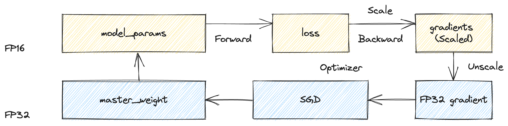
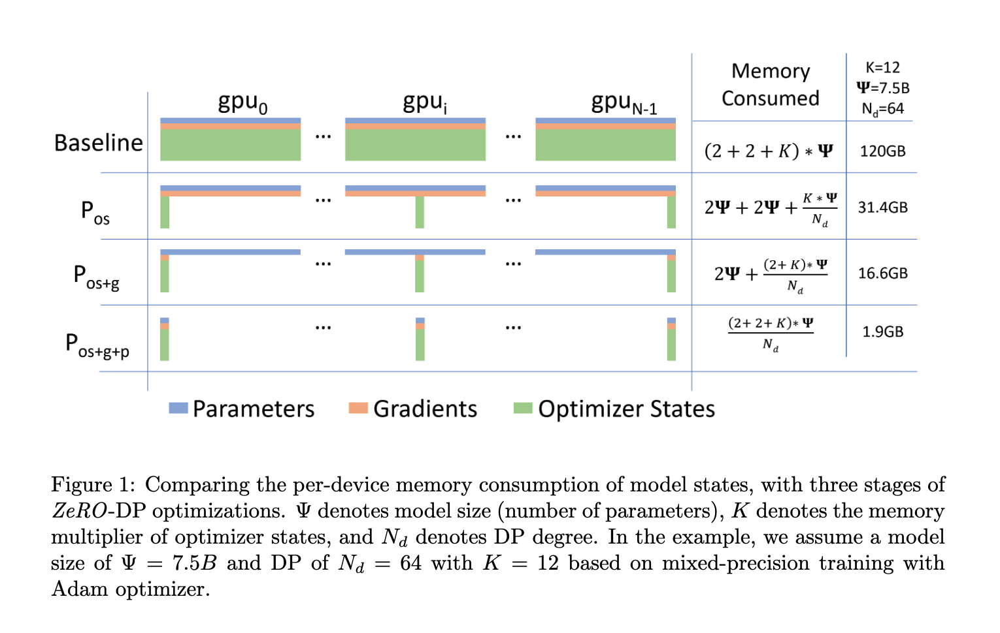
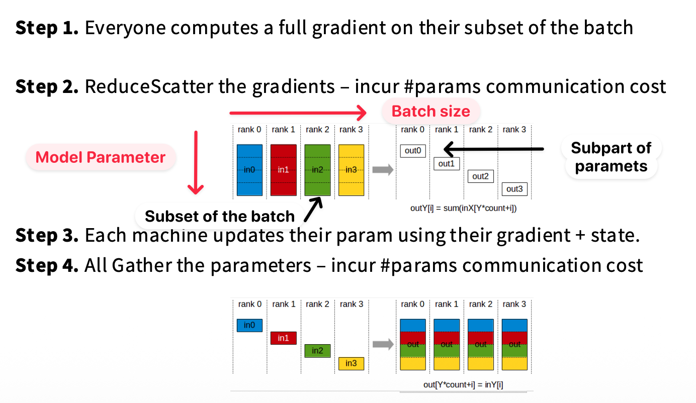
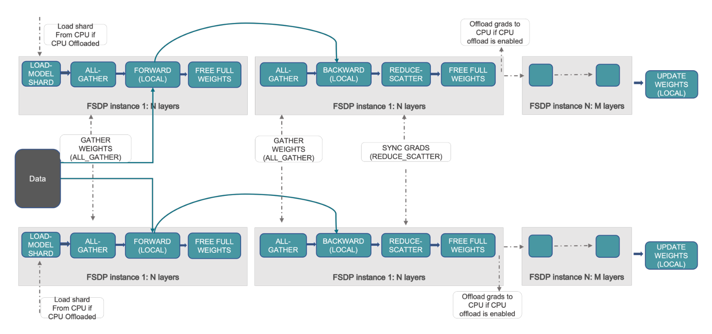

在传统数据并行中，每个设备都维护完整的模型参数、梯度以及优化器状态，导致显著的内存冗余。  
**ZeRO（Zero Redundancy Optimizer）通过对这些状态进行分布式切分来消除冗余存储，在可控的通信开销下显著降低单设备的内存占用。**  ZeRO 分为三个阶段（ZeRO-1 至 ZeRO-3），其中 ZeRO-3 又称 FSDP，逐步对优化器状态、梯度以及模型参数进行切分。

> 参考论文：[ZeRO: Memory Optimizations Toward Training Trillion Parameter Models](https://arxiv.org/pdf/1910.02054)


## 分布式训练流程

在数据并行训练中，每个设备都维护一份完整的模型参数，并在各自的数据子批次上独立计算梯度，随后通过同步操作（如 AllReduce）聚合梯度并更新模型。基于一个训练集 batch size 为 $B$ 的分布式训练，在 $t$ step 时刻的参数更新过程可以表示为：  
$$
\forall \theta \in \Theta, \quad \theta_{t+1} = \theta_t - \eta \sum_{i=1}^{B} \nabla f(x_i)  
$$


如下图所示，一个标准分布式训练的流程分为以下几个步骤：
1. **前向传播**：每个 rank 使用完全相同的模型参数跑不同的数据 batch shard，各自计算出不同的 loss
2. **反向传播**：对于每一层：
	- 每个 rank 先算本地梯度
	- 然后进行 AllReduce，同步每个 rank 的梯度
3. **参数更新**（Optimizer step）：
	- 在完成梯度同步之后，每个 rank 都已经有完全一致的梯度，每个 rank **独立执行 optimizer.step()**
	- 这一步运算对于所有 rank 都完全相同


## 训练时模型参数内存占用

在混合精度分布式训练中，每个模型参数不仅需要存储其本身，还需要额外维护与训练过程相关的多种状态。
- **模型参数**通常以 FP16 或 BF16 格式存储，占用 2 字节；
- 在反向传播过程中还需存储对应的**梯度**，同样占用 2 字节。
- 为了保证数值稳定性，**优化器**（如 Adam）通常额外维护一份 FP32 精度的 master weights，用于执行高精度的参数更新，这部分占用 4 字节。
	- Adam 优化器还需要维护一阶和二阶矩（即梯度的指数滑动平均和平方的指数滑动平均），分别用于估计动量和方差。这两部分通常以 FP32（或 BF16）格式存储，各占用 4（或 2）字节。


因此，在标准配置下，一个参数的总内存开销约为 16 字节。由此可以看出，训练过程中参数本身只占一小部分内存，绝大多数开销来自于优化器状态。

## Naive DP

在 Naive Data Parallelism 中，每个 rank 维护完整的模型参数与优化器状态。在每一步训练过程中，各 rank 需要通过 AllReduce 同步梯度，其通信开销与模型参数规模线性相关。对于使用 FP16/BF16 梯度的情况，总通信量约为 $2 \times \text{\#params} \times 2$ bytes（以 ring allreduce 为例）。（第一个 2 来源于 AllReduce，需要先 Reduce-scatter 再进行 All-gather 操作）

## ZeRO



### ZeRO-1

ZeRO-1 **对优化器状态进行分片**，即意味着不再让每个 rank 保存全部参数的优化器状态，而是每个 rank 仅负责其中一部分参数对应的优化器状态。优化器状态分布式存储在不同 rank 上，降低了每个设备上的内存占用。

每个模型仍然持有完整的模型参数和梯度数据，因此前向和反向传播过程仍然不变。但是在梯度同步过程中：
1. 每个 rank 计算出所有参数的局部梯度
2. 执行 All-Reduce 使得每个 rank 都获得完整梯度
3.  ZeRO-1 将优化器状态按照参数维度进行分片，**因此每个 rank 只持有自己负责那部分参数对应的优化器状态。** 于是 optimizer step 时，每个 rank 只负责更新自己那部分参数，计算出对应的更新后参数分片
4. 由于每个 rank 只计算出了一部分更新后的参数，为了保证下一轮前向传播能够使用完整且一致的模型参数，需要在 optimizer step 之后执行 All-Gather：将各个 rank 计算出的更新后参数分片同步回所有 rank，使每个 rank 再次拥有完整模型参数

在具体实现上，第二步的 All-Reduce 可以优化为 Reduce-Scatter：各个 rank 先对完整参数的本地梯度进行聚合，然后按照参数分片将聚合后的梯度分发给对应 rank。这样每个 rank 只获得自己负责那部分参数的全局梯度，用于更新对应的优化器状态和参数分片。

本质上来说，原先在数据并行中，每个 rank 都基于相同的完整梯度，对完整模型参数执行完全相同的 optimizer 更新，这一步存在冗余计算和冗余的 optimizer state 存储。在 ZeRO-1 中，这一步被按**参数维度**并行化：不同 rank 只负责一部分参数对应的 optimizer 更新。

因此相较于 Naive 版本实现：
- 通信原语改变：All-Reduce 变成 Reduce-Scatter + All-Gather
- 通信量：没有发生变化。~~只是把一次 2 $\times \text{\# params}$ 拆分成两次进行~~
- 存储量：假设优化器状态相关需要 $K \times \text{\# params}$（如前文分析，$K=12$），则从 $(4+K) \times \text{\# params}$ 变成 $(4+K / M) \times \text{\# params}$ per rank.



### ZeRO-2

在 ZeRO-1 中我们在每个 rank 只负责更新一部分参数，但事实上我们不需要在每个 rank 上都获得完整梯度，只需要获得自己负责更新参数的梯度即可。

因此我们讲 ZeRO-1 的第二步“各个 rank 先对完整参数的本地梯度进行聚合，然后按照参数分片将聚合后的梯度分发给对应 rank”改为：

**在反向传播过程中，每一层的梯度一旦计算出来，就立即通过 Reduce-Scatter 与其他 rank 进行聚合，并按照参数分片分发到对应 rank。** 这样，每个 rank 最终只保留自己负责参数的那部分全局梯度，而不是完整梯度。

ZeRO-2 将原先每个 rank 全部完成 backward 计算之后统一进行一次 All-Reduce 改为多次小通信（每一层计算梯度完成之后即立刻 Reduce-Scatter），但由于可以和计算 overlap 因此影响不大。

### ZeRO-3 (FSDP)

ZeRO-3 也被称为 __Fully-Sharded Data Parallel (FSDP)__，其核心思想：不仅对优化器状态和梯度进行分片，也对**模型参数**本身进行分片存储。
- 每个 rank 只存储自己负责的那一部分模型参数，而不是完整模型
- 参数和梯度都采用“按需获取，用完即释放”的策略，而不是长期驻留在显存中
- 但前向和反向传播计算依赖完整参数，如果参数未准备好，则无法执行计算
- 因此，需要在计算之前**提前预取参数**，并尽可能将**通信与计算进行重叠**
- 考虑到计算前向的时候，除了当前 rank 需要的层之外，其余的层的参数可以抛弃；因此采取在当前层进行前向/反向推理时，同时进行下一层模型参数的预取。

现在 Forward pipeline 变成

```
async_prefetch(next_layer_group.params);   // async all_gather 下一组参数

for layer_group in model:
    wait(layer_group.params);        // 确保当前参数已经 ready
    forward(layer_group);
    free(layer_group.params);        // 释放临时 gathered 参数
    async_prefetch(next_layer_group.params); // 异步拉取下一组参数
```

如下图所示，现在训练过程在：
- 计算一个特定的层的 forward 过程之前，使用 AllGather 获取模型该层所需的前置的层的参数。结束后释放掉不属于该rank分片的层的参数
- 计算一个特定的层的 backward 过程之前，使用AllGather获取该层所需要的层之前过程的参数。结束后释放掉不属于该rank分片的层的参数
- 在完成 backward 得到局部梯度之后，依然需要做 Reduce-scatter 等。

注：【与不同 rank 同步之间的问题】由于 AllGather 是一种 collective communication，其完成依赖于所有 rank 提供各自的参数分片，因此各个 rank 不需要显式同步控制流，但会在参数数据依赖处形成隐式同步。这种机制保证了各个 rank 在执行过程中不会出现计算进度的偏离（例如层级错位）

