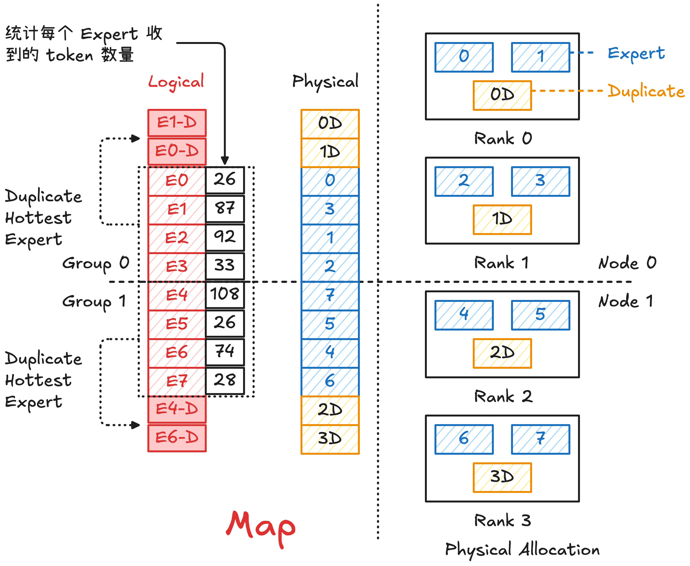

> TBD：增加代码解析

在 Mixture-of-Experts (MoE) 架构中，token 通过 gating 网络被动态路由到不同专家，导致 expert-level 的输入分布呈现明显的偏斜。当这些专家被分布到多个 GPU 上执行时，这种不均匀的 token 分布会直接转化为设备级的计算负载不均衡。**Expert Parallel Load Balancing (EPLB)** 用于在推理阶段使不同设备/节点上的 MoE Expert 负载均衡。

- 由于分布式执行通常采用同步模式，整体 step latency 由最慢的 GPU 决定。因此，负载较高的热门专家所在 GPU 会成为性能瓶颈，而其他 GPU 即使计算完成也必须等待，从而造成算力浪费。
- 这种负载不均还会进一步放大通信开销。在 All-to-All（A2A）通信过程中，token 分布的不均匀会导致部分节点通信和计算时间显著延长，从而引发全局同步等待，降低整体吞吐。
- **减少总体跨节点通信量**：通过对 expert 进行 token routing 感知的重排，可以显著提高 token 与 expert 之间的空间局部性（locality）。虽然 All-to-All 通信的总体数据量基本保持不变，但该优化能够将原本跨节点的通信流量转移到节点内，由于节点内通信带宽远高于跨节点带宽，可以有效降低通信阶段的整体延迟

## EPLB

### 专家重排

为了解决不平衡问题，一种解决方案是对专家重新排序，基于历史 token 分布，对专家在设备上的布局进行重新优化，使每个设备上的负载尽可能均衡，并采用“高低搭配”的策略来平衡负载。例如：
- 有 Expert 0-3 分别接收 25%, 50%, 20%, 5% 的 token 数量
- 如果将 Expert 0-1 放置在 Rank 0，Expert 2-3 放置在 Rank 1，则分别接收 75% 和 25% 的输入，高度不平衡
- 如果交换 Expert 1 和 Expert 2 的放置，则 Rank 0 和 Rank 1 分别接收 45% 和 55% 的输入，更加平衡

缺点：只对稳定分布有效，如果 routing 波动大会失效。因为专家重排通信开销较大，通常是周期性且离线更新，并不是每个 decode step 都会做。
### 专家复制

在负载较轻的设备上部署热门专家的副本，并将输入 token 在多个副本之间分流，从而缓解热点专家带来的瓶颈。

可以有效缓解热点专家问题，且对动态负载有效。在推理阶段可以异步复制部署。

缺点：需要消耗额外空间，且需要引入一定的调度和通信复杂度。

### Pipeline

EPLB 主要包括以下三个部件，且是串行执行，比较简单：
- **预测器（Predictor）**：采集历史数据，根据统计数据预测EP的权重；
- **平衡器（Balancer）**：根据 EP 权重计算 EP 的理想分布，获得逻辑到物理 EP 的映射 map；
- **执行器（Executer**）：输入目标 EP 的部署形态，调整 EP 在集群中的部署

## 实际设计思路

