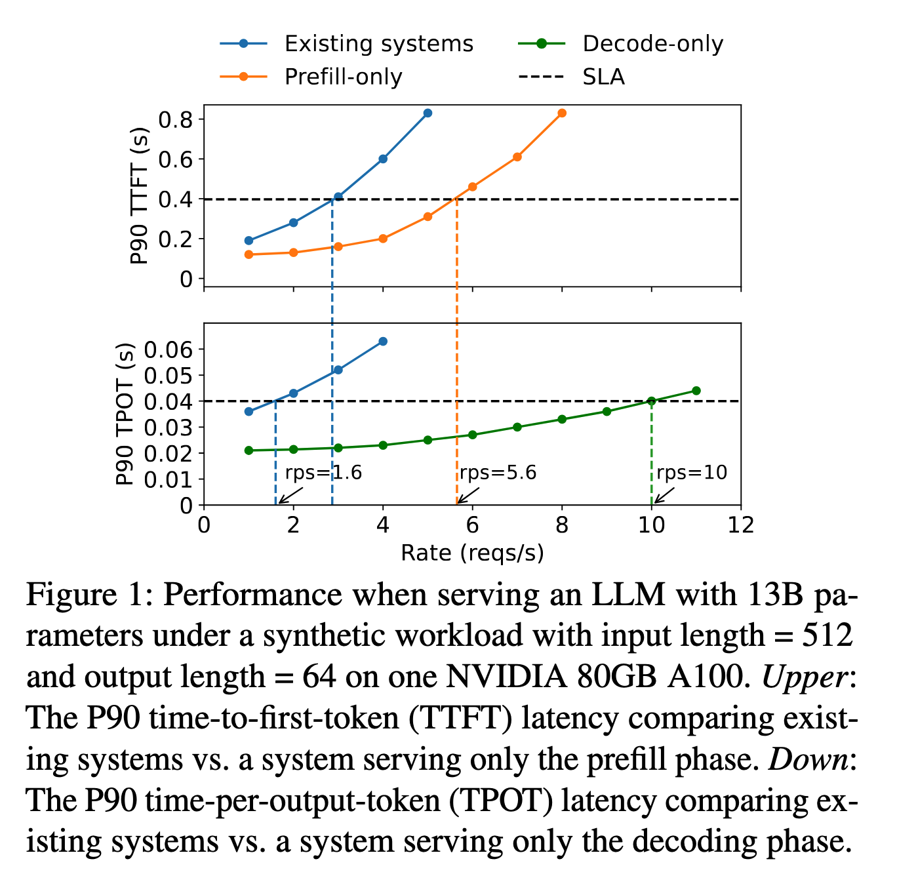
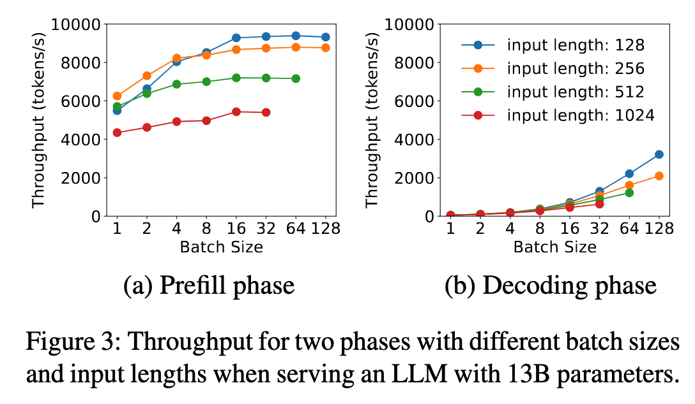

> 论文链接：[DistServe: Disaggregating Prefill and Decoding for Goodput-optimized Large Language Model Serving](https://arxiv.org/abs/2401.09670)

## Introduction

**LLM 两阶段推理**，**TTFT 和 TPOT**。
- prefill 阶段：处理用户 prompt，生成第一个 token。它决定 **TTFT，也就是 Time To First Token**
- decoding 阶段：一个 token 一个 token 地继续生成。它决定 **TPOT，也就是 Time Per Output Token**

不同应用对这两个指标的重视不同，例如
- 聊天机器人更关心 TTFT，因为用户希望它马上有反应；TPOT 只要快过人类阅读速度，比如 250 words/min，就可以接受。
- 文档摘要更关心 TPOT，因为摘要通常输出较长，用户更在意整体生成速度。

论文的目标不是单纯最大化吞吐量，而是最大化 **per-GPU goodput：在满足 TTFT / TPOT SLO 的前提下，每张 GPU 能服务多少请求。**

## 问题描述：Prefill 和 Decoding colocated serving 带来的问题

现有 LLM serving 系统通常将 prefill 和 decoding 放在同一组 GPU 上执行，也就是 **prefill-decoding colocated serving**。这样做的好处是系统实现简单，GPU 资源可以被统一管理，请求的两个阶段也可以在同一套 worker 上连续执行。

但问题在于，prefill 和 decoding 虽然都属于一次 LLM 推理过程，却具有很不同的执行特征和性能目标。

- Prefill 阶段一次性处理整段 prompt，计算量大、并行度高，更像是一个大矩阵计算任务；它直接影响 **Time To First Token (TTFT)**，也就是用户多久能看到第一个 token。
- Decoding 阶段则是逐 token 生成，每一步只处理少量新 token，但会反复读取 KV cache，对调度频率、显存带宽和 batch 组织更敏感；它直接影响 **Time Per Output Token (TPOT)**，也就是后续 token 的生成速度。

因此，prefill 更关心如何尽快完成一段较大的计算，而 decoding 更关心如何稳定、连续地生成 token。二者对延迟指标、资源配置和并行策略的需求并不相同。

实验也验证了这一点：在相同模型和设备下，如果单独运行 prefill instance 或单独运行 decoding instance，系统能够达到的 RPS 都明显高于将 prefill 和 decoding 混合运行。问题的关键不是 GPU 算力不够，而是**两类性质不同的任务被强行放在同一套 GPU 资源中执行，导致彼此干扰，降低了满足 SLO 的能力。**

:::note
为了提高实时 LLM serving 的吞吐和 GPU 利用率，现有 LLM 推理系统通常会引入两类优化：一类是 batching / scheduling，例如 Continuous Batching 和 Chunked Prefill；另一类是 model parallelism，例如 Tensor Parallelism 和 Pipeline Parallelism。

它们确实可以缓解资源利用不足的问题，但在 colocated serving 架构下，它们无法根治 prefill 和 decoding 之间的冲突。
:::

### 冲突一：Prefill-decoding 相互干扰

**Continuous Batching** 
- 核心思想：不要等一个 batch 中所有请求全部完成后再处理下一批
- 而是**在 decoding 过程中持续接收新请求**
- 并把新请求的 prefill 与已有请求的 decoding 混合到同一个 batch 中执行。
- 这可以提高 GPU 利用率，因为 GPU 不必等待整批请求结束后才处理新请求。

但它也带来了 prefill 和 decoding 之间的直接干扰。
- 对 decoding 来说，如果 batch 中插入了一个较长的 prefill job，那么**这一轮 batch 的执行时间会被 prefill 拉长**。已有请求虽然只需要生成一个 token，却必须等待这个较重的 prefill 一起执行完成，因此 TPOT 变大。
- 对 prefill 来说，如果它和许多 decoding token 混在一起执行，也不能独占 GPU 计算资源。batch 中**额外的 decoding 任务会增加调度和执行开销**，使 prefill 的完成时间变长，从而影响 TTFT。
- 这种干扰在长 prompt 场景下更明显。因为 prompt 越长，prefill 的计算越重；一个长 prefill 被放入 decoding batch 后，会显著拖慢正在进行的 decoding 请求。同时，decoding 请求也会反过来拉长 prefill 的执行时间。

**Chunked Prefill with piggyback**[^1] 试图缓解这个问题。
- 它将长 prefill 拆成多个小 chunk
- 然后让每个 prefill chunk 与若干 decoding job 一起组成 batc
- 这样做可以避免一个完整的长 prefill 长时间阻塞 decoding。

但 Chunked Prefill 只能缓解 interference，不能消除 interference。
- 原因在于，只要 prefill chunk 和 decoding token 仍然在同一组 GPU、同一个 batch 中执行，它们就仍然会竞争计算资源和显存带宽。
- 此外，**chunk size** 本身也形成了新的 trade-off。  
	- 如果 chunk size 太小，每个 prefill chunk 的计算规模不足，难以充分利用 GPU，并且切分次数变多，调度开销和 KV cache 访问开销都会增加。  
	- 如果 chunk size 太大，prefill chunk 仍然会占据大部分 batch 计算时间，留给 decoding piggyback 的空间变少，chunked prefill 缓解阻塞的效果也会下降。
- 更进一步，chunked prefill 还会**增加 KV cache 的读取开销**。假设一个 prompt 被切成多个 chunk，那么后面的 chunk 在计算 attention 时需要访问前面已经生成的 KV cache。切得越细，重复读取越多。直观地说，不切分时，prefill 对 prompt 进行一次完整处理；而切成多个 chunk 后，不同 chunk 会不断回看之前 chunk 的 KV，导致累计访问量从近似线性增长变成近似二次增长。

因此，Chunked Prefill 的本质不是消除 prefill-decoding interference，而是在 **prefill 阻塞 decoding** 和 **prefill 被切碎后自身效率下降** 之间做折中。

### 冲突二：更好的 Scheduling 无法解决问题

另一种自然想法是：既然 prefill 和 decoding 混在一个 batch 中会相互干扰，那是否可以通过**更好的 scheduling** 来解决？例如优先执行 prefill 以降低 TTFT，或者优先执行 decoding 以稳定 TPOT。

但调度只能决定谁先用 GPU，不能改变二者共享同一组 GPU 资源这一事实。
- 如果调度器优先 prefill，新请求可以更快完成首 token 计算，TTFT 会改善；但已有请求的 decoding 会被推迟，TPOT 变差。  
- 如果调度器优先 decoding，已有请求可以稳定生成后续 token，TPOT 会改善；但新请求的 prefill 会排队等待，TTFT 变差。

因此，在 colocated serving 中，prefill 和 decoding 的 SLO 目标天然冲突。调度策略可以在 TTFT 和 TPOT 之间移动压力，但不能同时消除两者的压力。面对严格 SLO，系统往往只能选择两种不理想的方案：要么牺牲某一类延迟指标，要么配置更多 GPU 资源来掩盖冲突。

这说明问题的本质是 prefill 和 decoding 被绑定在同一组资源中，调度器没有足够的自由度让二者分别满足自己的 SLO。

### 冲突三：Colocation 绑定了两类阶段的资源配置和并行策略

Prefill 和 decoding 不仅在调度上相互干扰，它们**对并行策略的偏好**也不同。但在 colocated serving 中，二者必须共享同一套 GPU allocation 和 parallelism strategy。

现有多 GPU 推理通常使用两类 model parallelism。

第一类是 **intra-op parallelism**
- 它将一次算子内部的矩阵计算切分到多张 GPU 上并行执行，可以降低单次大计算的执行时间，但会引入较高的 GPU 间通信开销。
- 它更适合 prefill，因为 prefill 处理整段 prompt，计算规模大，并行度高，使用更多 tensor parallelism 可以有效降低 TTFT。
- 典型例子是 Tensor Parallelism。

第二类是 **inter-op parallelism**
- 它将模型的不同层切分到不同 GPU 上，让请求依次经过多个 pipeline stage。
- 它对单个请求的端到端延迟帮助有限，因为一次请求仍然必须顺序经过所有层；但在多请求或 microbatch 场景下，它可以提高整体吞吐。
- 典型例子是 Pipeline Parallelism。

Prefill 和 decoding 对这些并行方式的需求并不一样。Prefill 通常更适合使用较强的 intra-op parallelism 来缩短大块计算的执行时间；decoding 每步计算较小，如果使用过多 tensor parallelism，通信开销可能反而更突出，因此它更依赖合适的 batch size、KV cache 管理和 token throughput 优化。

但如果 prefill 和 decoding colocate，它们就必须共享同一套并行配置。系统无法给 prefill 分配适合降低 TTFT 的并行策略，同时给 decoding 分配适合稳定 TPOT 和提高 token throughput 的并行策略。

因此，colocated serving 不仅导致执行时的 prefill-decoding interference，也导致资源配置和并行策略上的耦合。它把两个本应独立优化的阶段强行绑定在一起，使系统难以在严格 TTFT / TPOT SLO 下获得高 goodput。

### 小结

DistServe 发现的问题可以概括为：现有 LLM serving 系统将 prefill 和 decoding colocate 在同一组 GPU 上，但这两个阶段在计算特征、延迟目标、资源需求和并行策略上都不同。

Continuous Batching、Chunked Prefill 和 scheduling 可以缓解部分问题，但无法改变二者共享资源、相互干扰的根本矛盾。因此，系统在满足 TTFT 和 TPOT SLO 时的 per-GPU goodput 会显著下降。

这也引出 DistServe 的核心动机：与其在同一组 GPU 上不断调和 prefill 和 decoding 的冲突，不如将二者 disaggregate 到不同的 GPU worker 上，使 prefill 和 decoding 可以分别选择适合自己的资源配置、并行策略和调度目标。

## 最优策略分析

### Analysis for Prefill Instance

Prefill instance 的目标是：**用尽可能少的资源满足 TTFT 要求**。

Prefill 是 compute-bound
- Prefill 通常一次处理多个输入 token。
- 对于较长输入，Prefill 很容易打满 GPU 计算能力。
- 因此，Prefill 的 batch size 不一定越大越好。

论文图 3(a) 展示了不同输入长度和 batch size 下 Prefill 的吞吐变化。对于 13B 模型，当输入长度达到 512 时，单个请求已经可以让 A100 接近 compute-bound。此时继续增加 batch，并不会明显提升 GPU 效率，反而会延长整个 batch 的处理时间，增加所有请求的 TTFT。

所以 DistServe 认为，**Prefill batching 需要先 profile 一个关键长度阈值 Lm[^2]。当输入长度超过 Lm 时，一个请求已经足以打满 GPU，不应该再盲目增加 batch；只有当请求输入长度较短时，batch 多个请求才有意义。**

并行策略方面，论文比较了 66B 模型在两张 A100 上使用 inter-op 和 intra-op parallelism 的效果。
- 结果是：**在低请求率时，intra-op parallelism 更好，因为它可以降低单个请求的执行时间；但随着请求率升高，inter-op parallelism 逐渐更有优势，因为它能降低排队延迟，提高系统处理能力。**
- 论文用 M/D/1 排队模型解释这个现象。Prefill 的 TTFT 可以看成两部分：执行时间 + 排队时间。
	- intra-op 主要减少执行时间；
	- inter-op 虽然未必减少单请求总执行时间，但可以让 pipeline 的吞吐能力更强，从而减少高负载下的排队时间。

### Analysis for Decoding Instance

Decoding instance 的目标是：**用尽可能少的资源满足 TPOT 要求**。

Decoding 是 memory-bound
- 和 Prefill 的性质不同。每次 Decoding 只生成一个 token，
- 单请求情况下 GPU 利用率很低，因为它更受显存带宽限制。
- 因此，Decoding 的关键是通过 batch 聚合多个请求，提高 GPU 利用率。

论文图 3(b) 展示了 Decoding 在不同 batch size 下的吞吐变化：**batch size 越大，Decoding 吞吐越高。**原因是多个请求一起 Decoding 时，可以更充分地利用 GPU 的带宽和计算资源。

- 在传统系统中，Decoding batch size 不容易做大，因为 Prefill 任务会不断插入并竞争资源。请求率越高，新 Prefill 越多，Decoding 越容易被打断，TPOT 越难保证。
- DistServe 拆分后，一个 Decoding instance 可以对应多个 Prefill instance。这样 Decoding 可以积累更大的 batch，而不会被 Prefill 直接干扰。

并行策略方面，论文图 5 比较了 13B 模型在 batch size = 128、input length = 256 时使用不同 GPU 数量和并行方式的效果。结果是：
- **Intra-op parallelism** 可以降低 Decoding 延迟，但收益递减，因为通信开销和切分后的利用率下降会抵消部分收益。
- **Inter-op parallelism** 更接近线性提升吞吐，因此适合扩展 Decoding 的处理能力。

因此，**如果 TPOT SLO 很严格，需要 intra-op 来降低每步生成延迟；如果 TPOT 已经满足，更应该使用 inter-op 或 replication 来提升吞吐。**

### Practical Problems

拆分 Prefill 和 Decoding 会带来实际部署问题，最重要的是 **KV cache 传输**。

Prefill 完成后，需要把 KV cache 传给 Decoding instance。KV cache 可能很大。论文举例：对于 OPT-66B，一个长度为 512 的请求，其 KV cache 大约是 **1.13GB**。如果平均请求率是 10 rps，那么每秒需要传输约 **11.3GB** 数据，也就是约 **90Gbps** 带宽，才能让通信开销不明显。

如果集群有高速 InfiniBand，例如 800Gbps，跨节点传输可以接受。如果没有高速跨节点网络，就应该尽量使用节点内 NVLINK。论文提到，A100 GPU 之间的 NVLINK 峰值带宽可以达到 **600GB/s**，因此如果 placement 合理，通信开销可以被显著降低。

另一个问题是 **输入长度不均匀**。真实请求的 prompt 长度不同，会导致 pipeline 中某些 stage 比其他 stage 慢，从而产生 bubble。

还有一个问题是 **突发流量**。如果短时间内大量 Prefill 完成并把 KV cache 推给 Decoding，Decoding 实例可能显存压力过大。

## 优化手段

> TBD

[^1]: SARATHI

[^2]: 在 prefill batching 时用来控制 **一个 prefill batch 中总 token 数量** 的阈值，其中 batch total tokens = batch size $\times$ seq length
