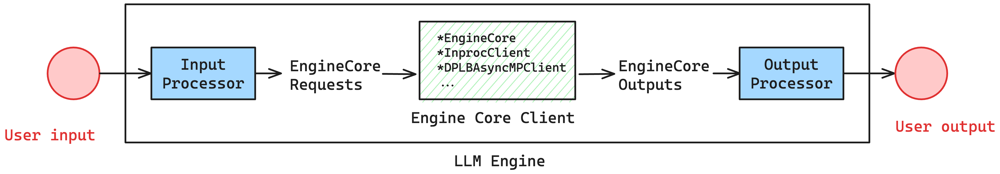
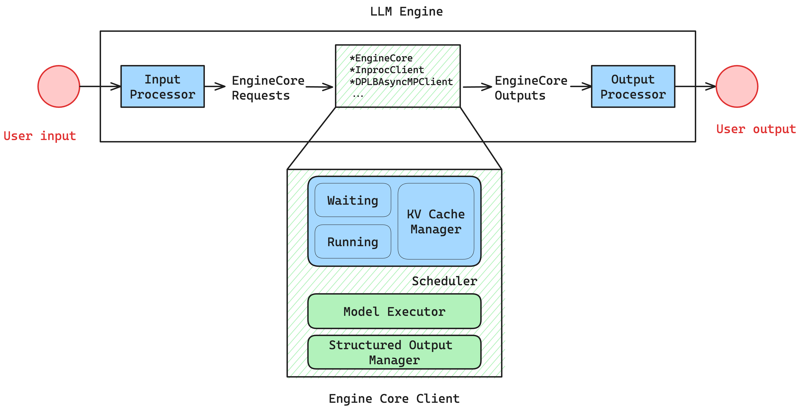

我们首先考虑单卡不开并行的场景。

## LLM Engine：最外接口层组件

LLM Engine
- 是系统对外提供推理服务的接口层组件，接受用户请求并且返回输出
- 输入通常包括动态的 text_prompt 以及对应的 sampling_params
- 最后输出生成的文本结果

LLM Engine 的主要组成部分包括：
- **vLLM 配置（config）**
    包含所有用于配置模型、缓存、并行策略等的参数
- **输入处理器（input processor）**
    将原始输入通过校验、tokenization、预处理，并且添加请求一些元数据，转换为 EngineCoreRequests
- **引擎核心客户端（engine core client）**
    在当前单机单卡示例中使用的是 InprocClient（本质上等价于 EngineCore）；后续会逐步扩展到 DPLBAsyncMPClient，以支持大规模服务
- **输出处理器（output processor）**
    将原始的 EngineCoreOutputs 转换为用户最终看到的 RequestOutput，其中包含了实际输出结果和一些元数据（例如终止原因、timestamp 等）

数据流可以表示为：


```
User Input
   ↓
[input processor]      —— 语义 → tensor / request
   ↓
[engine core]          —— 真正算模型（调度 + KV cache + kernel）
   ↓
[output processor]     —— tensor → 人类可读输出
   ↓
User Output
```

在 vLLM v1 中的代码片段：

```python
# In class LLMEngine: ...
# [1] Input & output processor

# Convert EngineInput --> EngineCoreRequest.
self.input_processor = InputProcessor(self.vllm_config, renderer)

# Converts EngineCoreOutputs --> RequestOutput.
self.output_processor = OutputProcessor( # <--------- !!!
	renderer.tokenizer,
	log_stats=self.log_stats,
	stream_interval=self.vllm_config.scheduler_config.stream_interval,
	tracing_enabled=tracing_endpoint is not None,
)

# [2] Engine core

# EngineCore (gets EngineCoreRequests and gives EngineCoreOutputs)
self.engine_core = EngineCoreClient.make_client(  # <--------- !!!
	multiprocess_mode=multiprocess_mode,
	asyncio_mode=False,
	vllm_config=vllm_config,
	executor_class=executor_class,
	log_stats=self.log_stats,
)

# which, in core_client.py, in the EngineCoreClient class ...
@staticmethod
def make_client(
	multiprocess_mode: bool,
	asyncio_mode: bool,
	vllm_config: VllmConfig,
	executor_class: type[Executor],
	log_stats: bool,
) -> "EngineCoreClient":
	# TODO: support this for debugging purposes.
	if asyncio_mode and not multiprocess_mode:
		raise NotImplementedError(
			"Running EngineCore in asyncio without multiprocessing "
			"is not currently supported."
		)

	if multiprocess_mode and asyncio_mode:
		return EngineCoreClient.make_async_mp_client(
			vllm_config, executor_class, log_stats
		)

	if multiprocess_mode and not asyncio_mode:
		return SyncMPClient(vllm_config, executor_class, log_stats)

	return InprocClient(vllm_config, executor_class, log_stats)
	
# 在单卡的情况下，使用的是 InprocClient 类，即等价于一个 EngineCore 实例
class InprocClient(EngineCoreClient):
    """
    InprocClient: client for in-process EngineCore. Intended
    for use in LLMEngine for V0-style add_request() and step()
        EngineCore setup in this process (no busy loop).

        * pushes EngineCoreRequest directly into the EngineCore
        * pulls EngineCoreOutputs by stepping the EngineCore
    """

    def __init__(self, *args, **kwargs):
        self.engine_core = EngineCore(*args, **kwargs)
```

## LLM Engine Core：实际执行请求推理的组件

**LLM Engine Core**.
- 是 vLLM 引擎内部的核心执行循环（inner loop）
- 内部负责初始化模型执行器、KV cache 和相关运行时状态
- 内部包含 scheduler，在每一轮 step 中决定哪些请求 / token 被调度执行（如 prefill 或 decode）
- 输入：请求以 EngineCoreRequest 形式传入
- 调用 model_executor.execute_model(...) 完成实际的模型 forward，在调度前输入会被转换为内部 Request 对象
- 根据执行结果更新 scheduler 状态，并生成 EngineCoreOutputs

LLM Engine Core 的主要组成部分包括：
- Scheduler，决定在一个 step 执行哪些请求，控制 prefill / decode 的混合，管理请求生命周期（waiting → running → finished）。其包含了以下组件：
	- 请求队列：waiting 和 running queues
	- 调度策略 Policy settings：FCFS / Priority queue
	- KV Cache manager：维护所有 KV Cache blocks，通过 `free_block_queue` 管理空闲的 KV Cache blocks
- Model Executor，即实际执行模型推理的组件
	- 实际执行模型 forward（prefill / decode）
	- 管理 GPU 上的运行状态（KV cache、CUDA graph、buffers 等）
	- 接收 scheduler 给出的 batch 并执行
- Structured Output Manager

