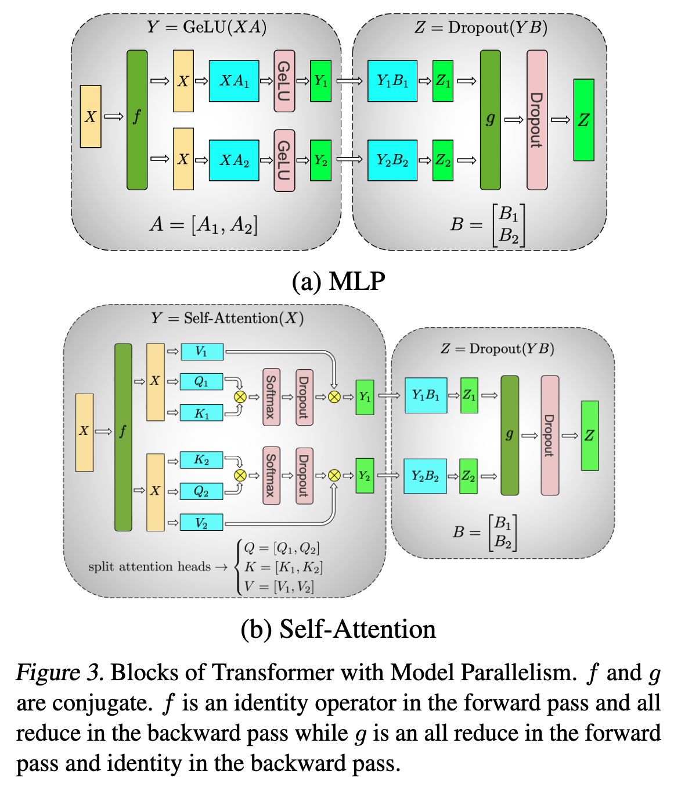
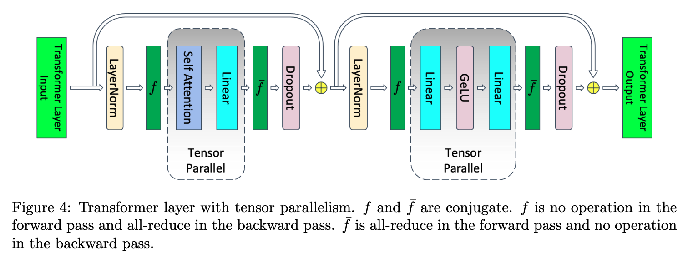
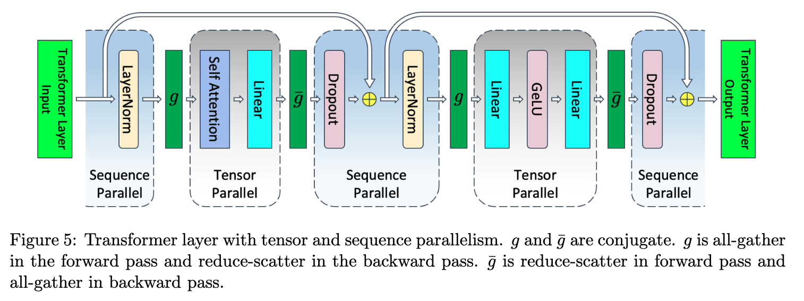
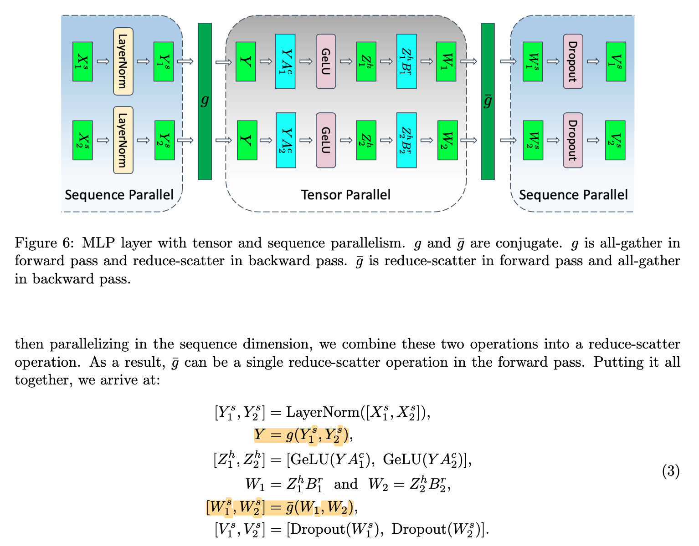

## TLDR

为了突破单设备的计算与内存瓶颈，大模型推理通常通过**并行化计算与数据分布**来提升吞吐和降低延迟。

给定 hidden states 的形状为 $[b, s, h]$：
- $b$：batch size
- $s$：sequence length
- $h$：hidden dimension

可以从不同维度对计算进行切分，对应不同的并行策略：

**按张量维度切分**
- **DP (Data Parallel, 数据并行)**：切分 $b$
    不同样本之间相互独立，因此可以直接分配到不同设备上，几乎不需要通信（推理阶段尤其如此）。
- **TP (Tensor Parallel, 张量并行)**：切分 $h$
    将一个大矩阵乘法拆分到多个设备上执行，本质是对算子（如 GEMM）进行并行化，需要在计算过程中进行通信（如 all-reduce / all-gather）。
- **SP (Sequence Parallel, 序列并行)**：切分 $s$
    将序列维度分布到不同设备上，可以降低 activation 内存占用。但在 attention 计算中，由于 token 之间存在依赖，需要进行跨设备的通信（如 all-gather 或 reduce-scatter）。

**按模型结构切分**
- **PP (Pipeline Parallel, 流水线并行)**：切分模型层（layer-wise）
    将模型的不同层分布到不同设备上，每个设备负责一部分前向计算。多个输入可以以“流水线”的方式依次通过这些设备，从而提高设备利用率。

## DP 实现

将输入数据沿 $b$ 维度切开，在每个 rank 上都储存模型完整的权重，每个 rank 独立处理用户请求。

DP 与开多个推理实例并发处理的区别在于：
- DP 由同一个推理实例管理
- 这意味着共享一个全局 scheduler，对请求进行统一调度与 batching

## TP 实现

### 如何切分 MLP 层和 Attention 层模型权重或者输入矩阵：MegatronV1

> 参考论文：[Megatron-LM: Training Multi-Billion Parameter Language Models Using Model Parallelism](https://arxiv.org/abs/1909.08053)

基于 [矩阵乘法并行化](../parallelism/矩阵乘法并行化.md) 所提到的思想，我们将模型权重进行拆分。下图分别展示了在 MLP 层和在 Self-Attention 层的模型权重拆分方法。

### MLP 层模型权重拆分

假设 $X \in \mathbb{R}^{b\times s \times h}$ 是 activation 输入，$A \in \mathbb{R}^{h \times h'}$ 和 $B \in \mathbb{R}^{h' \times h}$ 分别是升维和降维矩阵，$\sigma$ 是非线性函数，通常是 GELU，因此 MLP 层可以被建模为下面的计算：
$$
\begin{align}
\text{MLP}: \mathbb{R}^{b \times s \times h} &\to \mathbb{R}^{b \times s \times h} \\
X &\mapsto \sigma(XA)B.
\end{align}
$$

这个操作可以理解为三个矩阵乘法中间插入一个 $\sigma$ 函数。
- 观察到 $\sigma(X_{1}A_{1}+ X_{2}A_{2}) \neq \sigma(X_{1}A_{1})+ \sigma(X_{2}A_{2})$（由于非线性）， 因此若对求和维（内积维）进行拆分，则必须在非线性之前进行一次同步（如 All-Reduce），否则会导致计算结果错误。
- **列切 $A$ 矩阵，行切 $B$ 矩阵**。推导请见 [三个矩阵乘法](../parallelism/矩阵乘法并行化.md#三个矩阵乘法)：$$A \to \begin{bmatrix}
A_{1}  & A_{2}
\end{bmatrix}, \quad B \to \begin{bmatrix}
B_{1} \\
B_{2}
\end{bmatrix}$$
- 图中的 $f$ 与 $g$ 是一对共轭通信算子：
	- $f$ 在前向为恒等映射，在反向执行 All-Reduce；
	- $g$ 在前向执行 All-Reduce，在反向为恒等映射；

### Self-Attention 层模型权重拆分

设输入 $X \in \mathbb{R}^{b \times s \times h}$，多头注意力包含对 $Q,K,V$ 的线性投影以及输出投影。记：
- $W_Q, W_K, W_V \in \mathbb{R}^{h \times h}$
- $W_O \in \mathbb{R}^{h \times h}$

Self-Attention 可以表示为：  
$$  
\begin{align}  
Q &= X W_Q,\quad K = X W_K,\quad V = X W_V \\  
\text{Attn}(X) &= \text{Softmax}\left(\frac{QK^T}{\sqrt{d}}\right)V  
 \\
Y &= \text{Attn}(X) W_O  
\end{align}  
$$

- 对 $Q,K,V$ 的线性投影采用**列并行（column parallel）**，即按输出维度（head 维度）切分权重矩阵：  
    $$  
    W_Q = [W_{Q1}, W_{Q2}],\quad  
    W_K = [W_{K1}, W_{K2}],\quad  
    W_V = [W_{V1}, W_{V2}]  
    $$
- 输出投影矩阵 $W_O$ 采用**行并行（row parallel）**，以对齐前一步的切分结果：  
    $$  
    W_O =  
    \begin{bmatrix}  
    W_{O1} \\
    W_{O2}  
    \end{bmatrix}  
    $$
- 图中的 $f$ 与 $g$ 同样构成一对共轭通信算子：
    - $f$ 在前向为恒等映射，在反向执行 All-Reduce；
    - $g$ 在前向执行 All-Reduce，在反向为恒等映射；

> [!note]
> **TP 和多头的关系**：TP 对 $W_{Q,K,V}$ 矩阵进行列切分，沿 hidden dimension 分布到不同设备上。Multi-head attention 本质上将 hidden dimension（即沿着列方向）划分为多个独立的 head，每个 head 的计算相互独立。因此，这两者天然可以结合：TP 可以直接利用 multi-head 的结构，将不同的 attention head 分配到不同的设备上，使得每个 rank 负责若干个 head 的计算，从而实现无通信的并行计算。

### 总结

如下图所示，一层 Transformer Layer 前向推理包含两次 All-Reduce 通信，Attention Block 一次，MLP Block 一次。

## SP 实现

### MegatronV3：Attention 和 MLP Block 之外的序列并行

> 参考论文：[Reducing Activation Recomputation in Large Transformer Models](https://arxiv.org/abs/2205.05198)

对于 Attention Block 和 MLP Block 之外的操作（如 LayerNorm 和 Dropout），其计算在 sequence 维度上是相互独立的。  
因此，可以沿 sequence 维度 $s$ 对 activation 进行切分，从而避免在 tensor parallel 组内的重复存储，降低中间激活的显存开销。

下图展示了在 TP 基础上做 SP 的实现。其中在前向推理时，$g$ 是 All-Gather，$\bar{g}$ 是 Reduce-Scatter：
- **$g$：Sequence Parallel 的输出是沿 sequence 维度切分的 activation  $Y_j^s$**。当后续算子（如 Attention）需要访问完整 sequence 时，需要通过 All-Gather 恢复完整的 activation $Y$。
- $\bar{g}$：**Tensor Parallel 在计算过程中会产生分布在各个设备上的部分结果（partial results）**。在传统 TP 中，这些结果通过 All-Reduce 聚合为完整输出；而在 TP + SP 结合时，可以将该过程改写为 Reduce-Scatter，从而直接得到按 sequence 切分的结果 $Y_j^s$，供后续 SP 使用。

### DeepSpeed Ulysses：Attention Block 的序列并行

参考这篇 Blog：[DeepSpeed Ulysses：Attention Block 的序列并行](DeepSpeed%20Ulysses：Attention%20Block%20的序列并行.md)
## 并行度分配

- DP与SP/TP可以解耦独立使用
- SP 与 TP 一般可以配合使用
- 一般设计成：**DP$\times$TP=world_size，SP=TP**
## 参考资料

- [大模型推理并行策略(DP/TP/PP/SP/EP)原理简介](https://zhuanlan.zhihu.com/p/2003423046342554380)
- [图解 DeepSpeed-Ulysses & Megatron-LM TP/SP](https://zhuanlan.zhihu.com/p/5750410146)
- [Megatron-LM: Training Multi-Billion Parameter Language Models Using Model Parallelism](https://arxiv.org/abs/1909.08053)
- [Reducing Activation Recomputation in Large Transformer Models](https://arxiv.org/abs/2205.05198)
- [ZeRO: Memory Optimizations Toward Training Trillion Parameter Models](https://arxiv.org/abs/1910.02054)