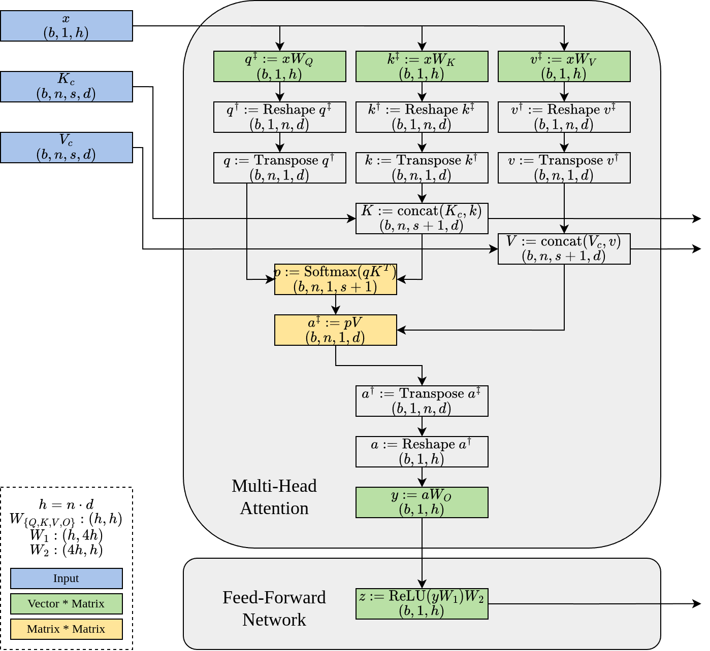

> TODO: 增加 Speculative Model 的分析

通过 [Roofline Model：从算术强度出发理解性能瓶颈](Roofline%20Model：从算术强度出发理解性能瓶颈.md) 可以发现：Transformer 在不同阶段的性能瓶颈并不相同。对于 Prefill 阶段，由于 sequence length 较长，Attention 和 FFN 通常已经能够形成较大的矩阵乘法，因此 batch size 对 arithmetic intensity 的提升有限；而在 Decode 阶段，由于每次仅生成一个 token，FFN / Linear 层会退化为小规模 GEMV，算术强度显著下降，更容易受到 memory bandwidth 限制。此时增大 batch size 可以将 GEMV 重新转化为更高效的 GEMM，从而显著提升 GPU 利用率与整体吞吐。

与此同时，Attention 层在 Decode 阶段的 arithmetic intensity 与 batch size 基本无关，因此批处理对其性能提升有限，甚至可能因为 BMM 工作量增加而带来额外延迟。整体来看，LLM 推理中的 batching 收益主要来自 Decode 阶段 Dense Layer 的吞吐提升，而不是 Attention 本身。

## Transformers 逐步算术强度推导

> 本节内容参考：[剖析GPT推断中的批处理效应](https://abcdabcd987.com/2023/05/13/transformer-batching/)

上图展示了 Decode 阶段的计算流程。基于该流程，可以进一步分析 Transformer Block 在逐步解码过程中各个算子的计算量（FLOPs）、所需的数据传输开销（I/O Bytes），以及两者之比对应的算术强度（Arithmetic Intensity，FLOPs/Bytes）。

### Prefill 阶段分析

Prefill 阶段 Attention 模块本质上是多个 query token 同时算 attention，由于其底层实现是基于 **Batched Matrix Multiplication (BMM)**，对于形状为 $[b,nh, s, d]$ 形状的 $Q$ 和 $[b,nh,d,s]$ 形状的 $K$ 之间的乘法，Batch 里第 $i$ 个条目第 $j$ 个条目运算为：
$$
	\text{out}[i,j] = \text{matmul}( Q[i,j, :, :] , K[i,j,:,:])
$$

> BMM 本质上是多个独立矩阵乘法的批处理。相比单个大型 GEMM，BMM 往往由许多较小矩阵组成，因此更难充分利用 GPU 的 tile reuse 和 Tensor Core 计算能力。另外，大型 GEMM 更容易获得高算术强度和高硬件利用率，而小矩阵 BMM 更容易受到 memory access 和 kernel launch overhead 的影响。

其算术强度为：
$$
	\frac{s^2d}{3sd}=\frac{s}{3}
$$

batch size 不会改变单个 Attention matmul 的理论 arithmetic intensity，因为 FLOPs 与 IO 会同比增长。

> 但增大 batch size 仍然能够提高 GPU occupancy 与 Tensor Core utilization，从而提升实际吞吐。后文会进行分析。

从上表可以看到全连接层（FFN / Linear）和输出投影运算算术强度是：
$$
	O\left( \frac{1}{\frac{1}{h}+ \frac{1}{bs}} \right) \propto bs
$$

由于矩阵乘法中的并行度不仅来自 batch size，也来自 sequence length，因此即使 batch size 较小，只要 sequence length 足够长，仍然能够形成较大的 GEMM，从而维持较高的 GPU 利用率与 arithmetic intensity。这意味着批处理对密集层的效益不大。
### Decode 阶段分析

Decode 阶段的 Attention 模块和 Prefill 阶段计算本质上一致，只是 batch size 维度变成了1，因此批处理不会显著提升吞吐。

在全连接层和输出投影运算，其算术强度：
$$
	O\left( \frac{1}{\frac{1}{h}+\frac{1}{b}} \right) \propto b
$$

> 这是因为相比于 Decode 阶段输入向量形状变成了 $(b,s=1,h)$，对应访存量从 $2bsh$ 变成了 $2bh$

因此在全连接层和输出投影运算增加 batch size 能极大提高吞吐。

### 总结

与此同时，查表可以得到全连接层和输出投影占 $9bh$ 的权重，而 Attention 模块仅占到 $3 \times bs$ 的权重。对于 Decode 阶段全连接层和输出投影运算进行批处理可以有效提升总体端到推理吞吐量。

## 验证

### 全连接层

横轴是 FLOPS，通过前表可以得到 $\text{FLOPS}= O(bsh^2)$，在 decode 阶段 $s=1$. 在 $h$ 不变的情况下可以很好反应模型在不同 batch size 和 sequence length 下 compute-bound 还是 memory-bound.

可以观察到：无论模型有多大，当序列长度不大时，密集层在初始阶段在达到最大吞吐量之前都可以在不同程度上受益于批处理。

与此同时，实验发现批处理不会增加推理延迟。

### Attention 层

Attention 层在 sequence length 较小的时候对 batch size 有较好的 scalability，对于长文本请求则效益收获很小。

与之相反，Attention 层做批处理会显著增加延迟：延迟随批大小增加而增加
- 这是因为 BMM 在 batch size 更大的时候工作量更多，然而单个工作的推理速度并没有提升
## 参考资料

- [Potentials of Multitenancy Fine-Tuned LLM Serving](https://le.qun.ch/en/blog/2023/09/11/multi-lora-potentials/)
- [剖析GPT推断中的批处理效应](https://abcdabcd987.com/2023/05/13/transformer-batching/)
