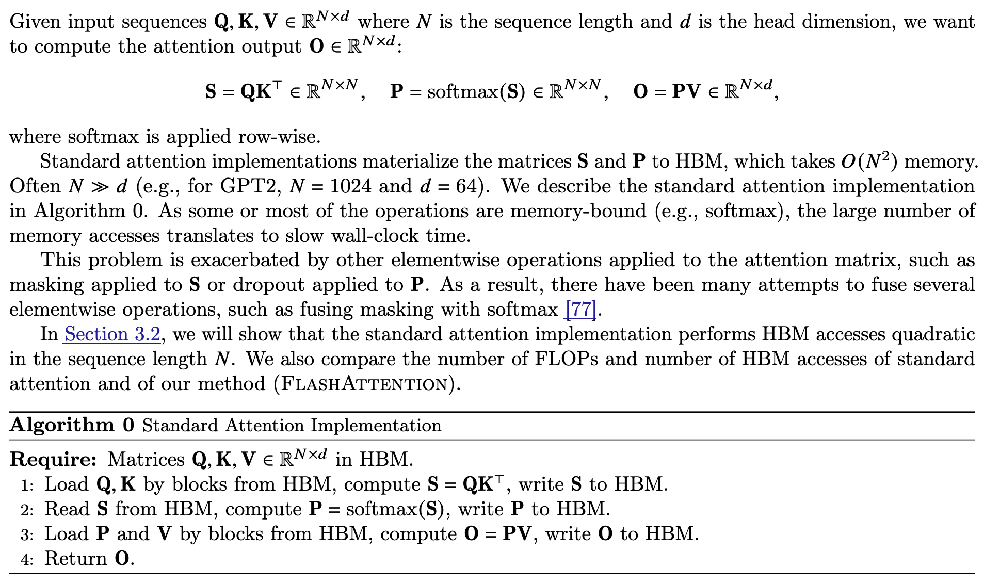
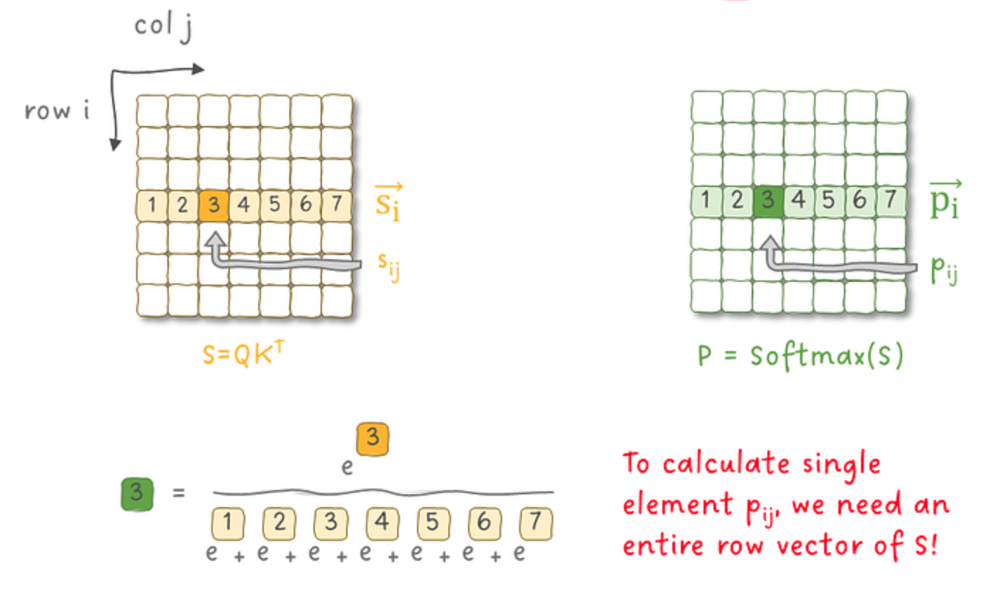
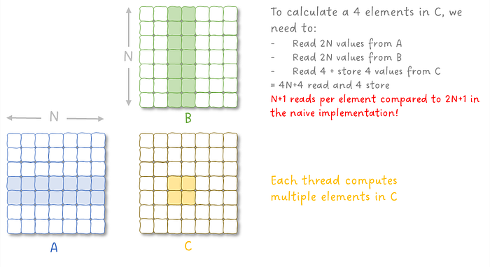
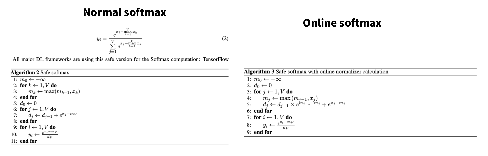

本文介绍 FlashAttention 的核心思想，并推导其关键公式，说明其如何通过分块计算与在线 softmax 更新，在不显式构造 $N\times N$ attention 矩阵的情况下减少显存访问与内存开销，从而提高 GPU 计算效率。

## Naive Attention

Standard Attention 可以建模为：

其中 **(Safe) softmax 函数**定义如下. 对于一个 vector $x \in \mathbb{R}^d$，为了避免指数爆炸，定义：
$$
m(x) := \max_{i}x_{i}, \quad \text{softmax}(x) := \frac{\begin{bmatrix}
\dots  & e^{x_{i}-m(x) } & \dots
\end{bmatrix}}{\sum_{j=1}^d e^{x_{j}-m(x)}} \in \mathbb{R}^d
$$

上图左侧表示 Algorithm 0 的流程。可以看到这会导致中间结果的 **materialization**：需要显式构建大小为 $N \times N$ 的矩阵 $S$ 和 $P$，并将其写入和再次从内存中读取以完成后续计算。这会产生大量的 HBM 访问开销。

一个自然的优化思路是将上述三个步骤 **融合为一个 kernel（Fused Kernel）**，使得每个元素在加载后立即参与后续计算，从而避免中间矩阵的物化。然而，这种融合会面临两个主要挑战：
- **Softmax 的归一化依赖**：如下图所示，softmax 的计算需要知道该行（或列）所有元素的归一化因子（即分母部分）以及向量中所有元素的最大值 $m(x)$，因此在未遍历完整个向量之前无法得到最终结果。这使得 GEMM 操作和 softmax 操作没有办法 fuse.
- **训练阶段的反向传播需求**：在训练过程中，需要保存 softmax 的中间结果（例如概率矩阵  $P$），以便在 backward pass 中计算梯度。

## FlashAttention1 Overview

## Tiling

对于矩阵乘法（GEMM）的优化，一个核心思想是 **Tiling（分块计算）**。其基本动机是减少对慢速内存（如 HBM/DRAM）的访问次数，使数据在片上高速存储（如 cache / shared memory）中被尽可能多次复用。

考虑计算

$$
C = A B^\top, \quad A, B \in \mathbb{R}^{N \times d}, \qquad C \in \mathbb{R}^{N \times N}.
$$

为了提高数据复用率，我们将矩阵 $A$ 和 $B$ 按 **行维度**切分成多个小块（tiles）。设 tile 的大小分别为 $d_A$ 和 $d_B$，则：

$$
A =
\begin{bmatrix}
A_1 \\
\vdots \\
A_{T_A}
\end{bmatrix},
\qquad
A_i \in \mathbb{R}^{d_A \times d},
\qquad
T_A = \left\lceil \frac{N}{d_A} \right\rceil
$$

$$
B =
\begin{bmatrix}
B_1 \\
\vdots \\
B_{T_B}
\end{bmatrix},
\qquad
B_j \in \mathbb{R}^{d_B \times d},
\qquad
T_B = \left\lceil \frac{N}{d_B} \right\rceil
$$

对应地，输出矩阵 $C$ 也被划分为若干子块：

$$
C_{ij} \in \mathbb{R}^{d_A \times d_B}, \qquad
C_{ij} = A_i B_j^\top .
$$

因此整个矩阵乘法可以通过如下分块计算完成：

- For $1 \le i \le T_A$
  - Load $A_i$ 到片上高速内存
  - For $1 \le j \le T_B$
    - Load $B_j$
    - 计算
      $$
      C_{ij} = A_i B_j^\top
      $$
    - 将结果写回对应的 $C_{ij}$

最终返回矩阵 $C$。

这种 **分块计算（tiling）** 的关键优势在于：

- 每个 tile（如 $A_i$ 或 $B_j$）只需从全局内存读取一次
- 在片上内存中可以被多次复用
- 显著减少 HBM 访问带宽压力

因此，现代 GPU 的高性能 GEMM 实现（如 CUDA kernel、TensorCore kernel）都会采用类似的 **tile-based 计算策略** 来提高计算效率。

### Tiling in FlashAttention

在 FlashAttention 中，因为需要对 $Q.K$ 以及 $f(Q.K).V$ 做 GEMM 运算，因此将 $Q$, $K$ 和 $V$ 矩阵都进行分块，切分维度在 sequence dimension 上，即分别将 $Q$ 和 {$K$,$V$} 切分成 $\mathbb{R}^{B_{r}\times d}$ 和 $\mathbb{R}^{B_{c} \times d}$ 的块。

在计算中，outer loop 是 $K$ 和 $V$ 矩阵（对应上一小节的 $B$ 矩阵，按列切分）；inner loop 是 $Q$ 以及形状相同的 $O$ 矩阵。这可以使得 $K$ 和 $V$ 的复用最大化。在每个 tile 内都进行了大小为

$$
\mathbb{R}^{B_{r}\times d} \times \mathbb{R}^{d \times B_{c}} \to \mathbb{R}^{B_{r}\times B_{c}}
$$

的计算，后续第 9-13 行是每个 tile 的计算内容。

## Online Softmax

### 增量 softmax

首先，我们希望解决 **Softmax 的数据依赖问题**。理想情况下，当逐步访问向量 $x \in \mathbb{R}^d$ 的元素时，我们能够 **在线（online）更新 softmax 的统计量**，从而在一次扫描中完成 softmax 的计算，而不需要多次遍历整个向量。

在最朴素的实现中，softmax 通常需要 **三次遍历向量** $x$，每次都需要从内存读取 $d$ 个元素，总的内存访问量约为 $3d$：
- 遍历 $x$，以计算出 $x$ 的最大值 $m(x)$
- 遍历 $x$，以得到  softmax 运算中的分母部分（归一化因子）
- 遍历 $x$，逐元素得到其分子部分

而实际上 softmax 可以采用增量的方式来减少一次遍历，这是因为 softmax 运算中的分母部分可以跟随 $x$ 最大值的更新而更新。

假设遍历到第 $j$ 个元素，
- **更新所有元素的最大值**：得到 $m_{j-1}(x) = \max(x_{1},\dots,x_{j-1})$，因此 $m_{j}(x) := \max{(m_{j-1}(x), x_{j})}$，其满足 $m_{j}(x) \geq m_{j-1}(x)$
- **放缩：更新归一化因子，即 softmax 运算中的分母部分**：得到 $d_{j-1}(x) = \sum_{t=1}^{j-1}e^{t-m_{j-1}(x)}$. 因此 $d_{j}(x) := d_{j-1} \times e^{m_{j-1}(x) - m_{j}(x)} + e^{x_{j }-m_{j}(x)}$

中间推导过程：

$$
\begin{aligned}
d_j(x)
&= \sum_{t=1}^{j} e^{x_t - m_j(x)} \\
&=
\underbrace{\sum_{t=1}^{j-1} e^{x_t - m_{j-1}(x)}}_{d_{j-1}(x)}
\cdot e^{m_{j-1}(x)-m_j(x)}
+
e^{x_j-m_j(x)}
\end{aligned}
$$

最后再遍历一次向量 $x$，逐元素计算最终的 softmax 输出：
$$
\text{softmax}(x) := \frac{\begin{bmatrix}
\dots  & e^{x_{i}-m_{d}(x) } & \dots
\end{bmatrix}}{d_{n}(x)} \in \mathbb{R}^d
$$

这样 softmax 的计算只需要 **两次遍历向量** $x$，总的内存访问量约为 $2d$。

更重要的是，通过维护运行中的最大值 $m_j(x)$ 和归一化因子 $d_j(x)$，softmax 的统计量可以在遍历过程中 **逐步更新（online update）**，从而避免了必须先访问所有元素才能开始计算 softmax 的问题。

### 合并两个向量的 Softmax 统计量

在上一小节中，我们介绍了如何在遍历向量 $x' = \begin{bmatrix}x_1 & \dots & x_{j-1}\end{bmatrix}$ 时，通过新元素 $x_j$ 对 softmax 的统计量进行增量更新，从而得到新的归一化因子。

在这一个小节，我们运用同样的思想 merge 两个向量 $x^{(1)} \in \mathbb{R}^B$ 和 $x^{(2)} \in \mathbb{R}^B$ 的 softmax 结果，从而得到拼接向量 $x = \begin{bmatrix} x^{(1)}  \\ x^{(2)} \end{bmatrix} \in \mathbb{R}^{2B}$ 的 softmax 拼接结果。
对于每个向量，我们保存其最大值 $m^{(1)} = \max_{i}\{x_{i}^{(1)}\}$ 和 $m^{(2)} = \max_{i}\{x_{i}^{(2)}\}$ 和分母（即归一化因子）的结果：$l^{(1)}= \sum_{i} e^{x_{i}^{(1)} - m^{(1)}}$ 和 $l^{(2)} = \sum_{i} e^{x_{i}^{(2)}-m^{(2)}}$，接下来的操作基于这 4 个 state $(m^{(1)}, m^{(2)}, l^{(1)}, l^{(2)})$ 进行。

定义原来两个向量 softmax 计算中的分子向量 $f^{(1)} = \begin{bmatrix} \dots &  e^{x_{i}^{(1)}- m^{(1)}} & \dots\end{bmatrix}$ 和 $f^{(2)} = \begin{bmatrix} \dots &  e^{x_{i}^{(2)}- m^{(2)}} & \dots\end{bmatrix}$ ，这意味着：
$$
\text{softmax}(x^{(i)}) = \frac{f^{(i)}}{l^{(i)}} \in \mathbb{R}^B, \quad i \in \{1, 2\}
$$
我们希望得到的结果：（其中 $f = f(f^{(1)}, f^{(2)})$ 和 $l= l(l^{(1)}, l^{(2)})$ 需要求解）
$$
\text{softmax}(x) = \frac{f(x)}{l(x)} \in \mathbb{R}^{2B}, \quad f(x) \in \mathbb{R}^{2B}, \quad l(x) \in \mathbb{R}
$$

首先**更新 $x$ 的最大值**：$m(x) = \max(m^{(1)}, m^{(2)})$.

接下来是分别对 Softmax 的分母和分子部分**进行放缩**（借助于我们所存储的指数计算求和结果的 $l$ 值）：

Softmax 的分母部分：
$$
l(x) = l^{(1)} \times e^{m^{(1)}- m(x)} + l^{(2)} \times e^{m^{(2)}- m(x)}
$$
Softmax 的分子部分因为 $x$ 的最大值发生了变化同样也需要进行放缩（逐元素操作）：
$$
f(x) = \begin{bmatrix}
 f^{(1)} \times e^{m^{(1)} - m(x)} \\ f^{(2)}\times e^{m^{(2)}-m(x)}
\end{bmatrix} \in \mathbb{R}^{2B}
$$

这使得我们能够先对矩阵的一个 **chunk（或 tile）** 进行局部 softmax 计算。更准确地说，我们计算的是 softmax 的 **统计量（最大值和归一化因子）**。随后通过重新缩放这些统计量，可以将不同 chunk 的结果合并，从而得到整个向量的正确 softmax 归一化结果。

这种性质使得 softmax 可以 **按块（tile-wise）计算并逐步合并**，从而与 attention 的分块计算方式相结合，使得 $QK^T$、softmax 和 $PV$ 可以在同一个 kernel 中完成，而无需显式物化中间的 $N\times N$ attention 矩阵。每个 tile 在加载到共享内存后，可以完成该 tile 对输出 $O$ 的 **部分贡献的计算**，并将结果累积到当前的输出中。

### Online Softmax in FlashAttention

现在我们放在 Attention 情况下，思想也是完全相同：更新最大值，再对分子分母进行放缩。

在进行矩阵分块计算的背景下，假设 outer loop index = $j$，inner loop index = $i$，且 $\{Q_{i}, O_{i}\} \in B_{r} \times d$，$\{K_{j}, V_{j}\} \in d \times B_{c}$，我们希望对于：
- 之前计算结果 $O_{i}\in B_{r} \times d$ 的 softmax 计算，可以表示为 $$O_{i} =  \frac{\text{numerator}}{l_{i}}, \quad \text{where} \; \text{numerator}=O_{i}l_{i}$$ 且 numerator 和 $m_{i}$ 相关（当 $m_{i}$ 改变时分子也要进行缩放），以及是 softmax 运算和 $V$ 矩阵计算的结果
- 以及当前 tile 的局部 softmax 计算，可以表示为 $$\tilde{\text{softmax}}_{ij} (\tilde{m}_{ij}) = \frac{\tilde{P}_{ij}}{\tilde{l}_{ij}} \in \mathbb{R}^{B_{r} \times B_{c}}$$
进行合并。

**首先是 tile 内部的 softmax 计算**。第 10 行是 tile 内部的 state 计算：$\tilde{m}_{ij}$ 表示每一行的最大值，$\tilde{P}_{ij}$ 表示每一行的 softmax 分子，$\tilde{l}_{ij}$ 表示每一行的 softmax 分母。
$$
\tilde{m}_{ij}= \text{rowmax}(S_{ij}) \in \mathbb{R}^{B_{r}}, \quad \tilde{P}_{ij} = \exp(S_{ij}-\tilde{m}_{ij}) \in \mathbb{R}^{B_{r} \times B_{c}}, \quad \tilde{l}_{ij}= \text{rowsum}(\tilde{P}_{ij}) \in \mathbb{R}^{B_{r} }
$$

局部的 softmax 由以下计算得到，且只与 $\tilde{m}_{ij}$ state 有关（因此当它被更新的时候需要对局部 softmax 也进行更新）：
$$
\tilde{\text{softmax}}_{ij} (\tilde{m}_{ij}) = \frac{\tilde{P}_{ij}}{\tilde{l}_{ij}} \in \mathbb{R}^{B_{r} \times B_{c}}
$$

**然后将之前的计算结果与本次计算结果进行合并**：第 11 行是局部 state 与 HBM 中缓存的全局 state 的更新：
$$
m_{i}^\text{new} = \max(m_{i}, \tilde{m}_{ij}) \in \mathbb{R}^{B_{r}}, \quad l_{i}^{\text{new}} = l_{i} \times e^{m_{i}- m_{i}^{\text{new}}} + \tilde{l}_{ij} \times e^{\tilde{m}_{ij}- m_{i}^\text{new}} \in \mathbb{R}^{B_{r}}
$$

第 12 行最为关键：它将“旧的累计结果”与“当前 tile 的新贡献”在统一数值尺度下合并，并完成归一化更新。

**(1) 分子部分 1：当前 tile 的新贡献（未归一化的 numerator 增量）**  

先计算
$$
\tilde{O}_{ij} = \tilde{P}_{ij} V_j \in \mathbb{R}^{B_r\times d}.
$$
由于本轮更新后的 running max 变为 $m_i^{new}$，需要对每一行做指数重缩放：
$$
\Delta_i
= \operatorname{diag}\!\left(e^{\tilde{m}_{ij}-m_i^{new}}\right)\tilde{O}_{ij}
\in \mathbb{R}^{B_r\times d}.
$$

**(2) 分子部分 2：旧的累计结果对应的贡献（在新尺度下重缩放）**  
将先前累计的输出 $O_i$（它对应旧尺度 $m_i,l_i$）恢复为未归一化的 **numerator**，并将指数尺度从 $m_i$ 重缩放到新的 $m_i^{new}$：
$$
\Phi_i
= \operatorname{diag}\!\left(l_i\,e^{m_i-m_i^{new}}\right) O_i
\in \mathbb{R}^{B_r\times d}.
$$

**(3)** 归一化因子即为 $l_{i}^\text{new}$.

**(4) 合并并归一化，得到新的输出**  
$$
O_i^{new}
 = \frac{\text{old numerator} + \text{new numerator}} {\text{new denominator}} = 
\operatorname{diag}(l_i^{new})^{-1}\bigl(\Phi_i + \Delta_i\bigr)
\in \mathbb{R}^{B_r\times d}.
$$

这与论文中的写法等价：
$$
O_i^{new}
=
\operatorname{diag}(l_i^{new})^{-1}
\left(
\operatorname{diag}(l_i)e^{m_i-m_i^{new}}O_i
+
e^{\tilde{m}_{ij}-m_i^{new}}\tilde{P}_{ij}V_j
\right),
$$
其中 $e^{\tilde{m}_{ij}-m_i^{new}}$ 表示对矩阵按行 broadcast 的逐行缩放。

**参数初始化**：$O$ 和 $l$ 采用零初始化而 $m$ 初始化为 $-\infty$. 这意味这对于第一个 iteration，即为标准的 softmax.

## 参考资料

- [FlashAttention: Fast and Memory-Efficient Exact Attention with IO-Awareness](https://arxiv.org/abs/2205.14135)
- [FlashAttention — Visually and Exhaustively Explained](https://medium.com/ai-advances/flashattention-visually-and-exhaustively-explained-d6124670f7fb)
- [Flash Attention](https://huggingface.co/docs/text-generation-inference/en/conceptual/flash_attention)