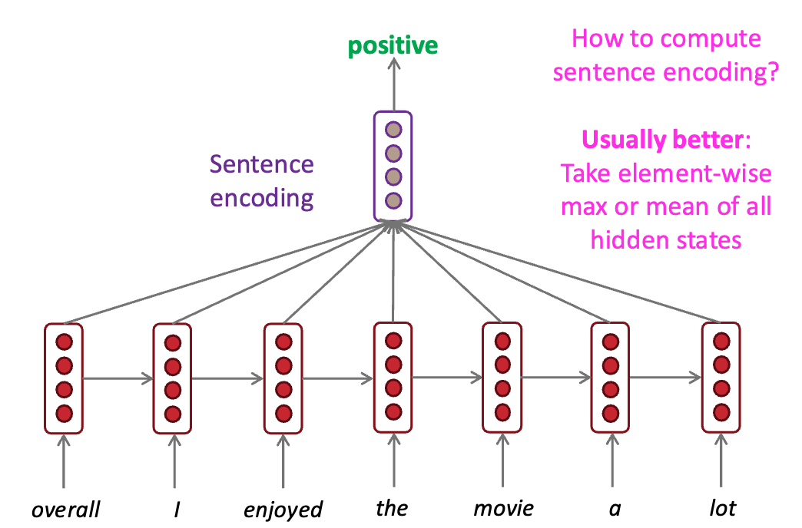
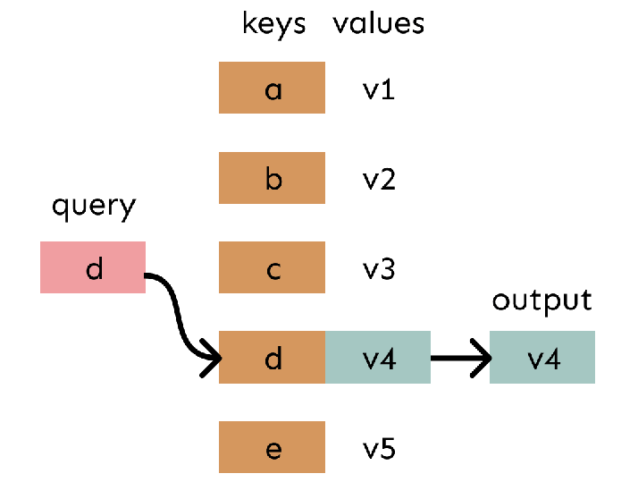
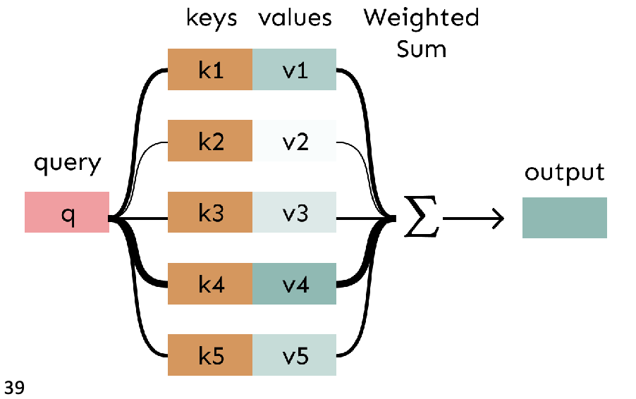
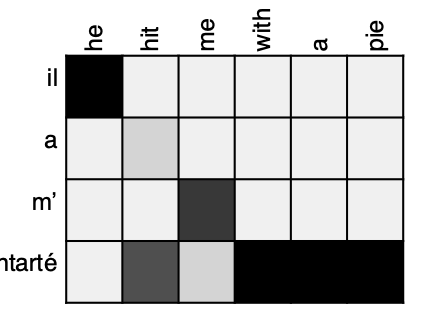
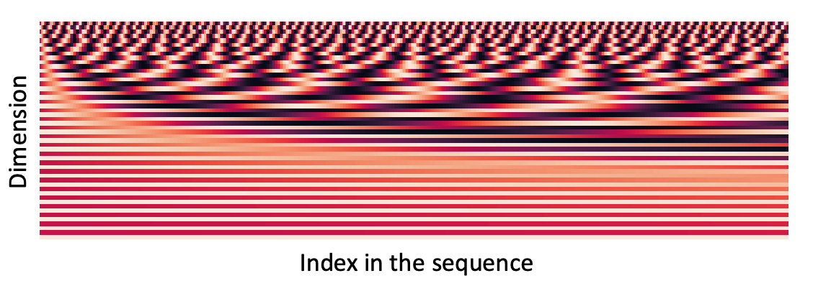
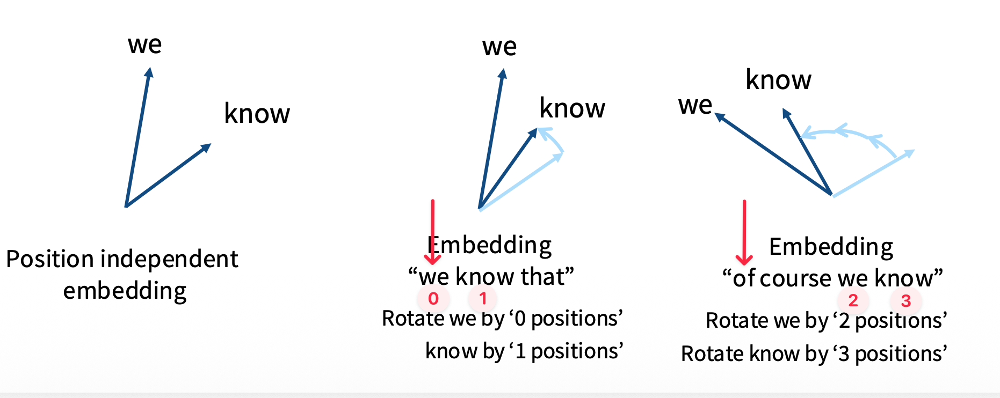
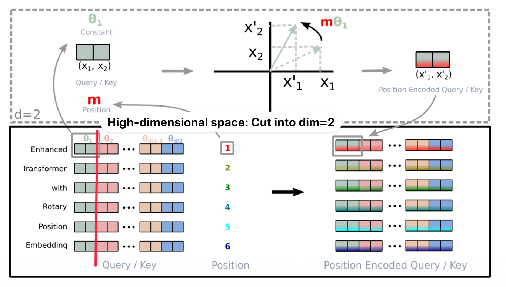
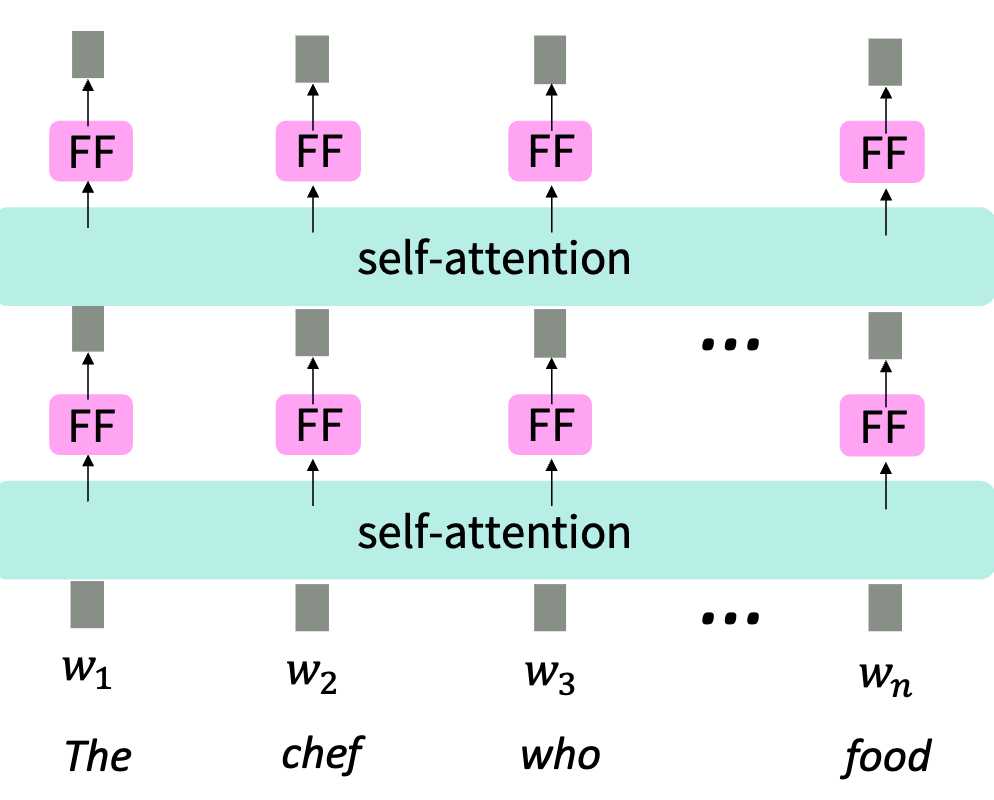
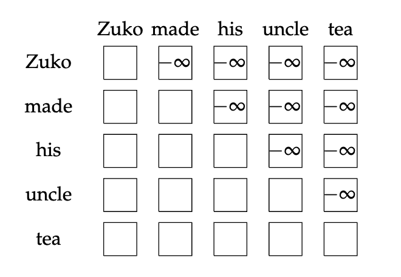

本文将会介绍 LLM 的核心部件 Attention.

> 参考论文：[Attention Is All You Need](https://arxiv.org/abs/1706.03762)

## 引入

### Encoding: Neural Modeling

假设 $w_{1:n}$ 是一个 sequence，其中每一个 $w_{i}\in \mathcal{V}$ 是词表中的一个 token，可以将其理解为一个 token id 或者一个英文单词。为了进行矩阵运算，我们通常将 $w_i$ 表示为对应的 one-hot 向量：

$$
w_i \in \{0,1\}^{|\mathcal{V}|}.
$$

我们将字典中的每一个元素映射为在 $\mathbb{R}^d$ 中的高维向量。由于需要对字典的每一个元素都建立映射规则，因此定义对应的 embedding matrix 

$$
E \in \mathbb{R}^{d \times |\mathcal{V}|}
$$

因此对于我们的 sequence，其 embedding 是 $x = E w$，且：
$$
x_{1:n} = w_{1:n} E^\top \in \mathbb{R}^{n \times d}
$$

这里我们得到的是对于每个 $w_{i}$，其对应的 non-contextual embedding $x_{i} \in \mathbb{R}^d$. 在此基础上，我们通常通过一个序列建模结构（例如 RNN 或 Transformer），结合上下文信息计算每个 token 的 contextual embedding $h_i \in \mathbb{R}^d$.

在自回归模型中，$h_i$ 仅依赖于该 token 之前的 tokens。

### Sentence Encoding：平均池化

在 RNN 最为流行的时代，为了通过一段文字得到二分类评价（比如评价一个评论是正面还是负面的）往往采取 Sentence Encoding：例如，可以通过 mean-pooling 得到句子表示：
$$
h_{\text{sentence}} = \frac{1}{n} \sum_{i=1}^{n} h_i
$$

这种做法每个词向量的权重都是一样的，不考虑词序也不考虑语义重要性。，接一个分类器，最终得到正/反二分结果。这种做法每个词向量的权重都是一样的，不考虑词序也不考虑语义重要性。

## Attention：对所有“词向量”的加权平均

基于上述 mean-pooling 的思想，Attention 可以看作一种 **数据依赖的加权 pooling**：不同的上下文 token 会被分配不同的重要性权重，而不是均匀平均。
### 权重计算：Lookup Table 的思想

Attention 本质上就是一种**加权平均**——当这些权重是通过学习得到时，这种机制会变得非常强大！

如下图，在 **查找表（lookup table）** 中，
- 我们有一组 key 映射到对应的 value。给定一个 query，它会精确匹配某一个 key，从而返回对应的 value
- 这是 one-hot 选择
- 用公式可以表示为：

$$
O = \sum_i \alpha_i V_i, \quad \alpha_i \in \{0,1\}, \quad \sum_i \alpha_i = 1
$$

而在 **Attention** 中：
- **query** 会对所有 **key** 进行“匹配”，得到一组介于 0 和 1 之间的权重。 这个权重值由 query 和 key 的值决定。
- 每个 key 对应的 **value** 会乘以对应权重，然后进行加权求和

每个上下文 token 现在有两个向量需要表示：
- $K$ 值：与 Query 进行点乘计算，以得到该 token 的权重值
- $V$ 值：实际表示该 token 意义，即原先的 embedding 的意义

### Attention 公式表达

考虑序列 $x_{1:n}$ 中的一个 token $x_i$。我们定义其对应的查询向量（query）为：
$$
q_i = Q x_i,\quad Q \in \mathbb{R}^{d \times d}
$$

对于序列中的每一个 token $x_j \in \{x_1, \dots, x_n\}$，我们分别定义对应的键（key）和值（value）为：
$$
k_j = K x_j,\quad v_j = V x_j
$$
其中 $K \in \mathbb{R}^{d \times d}$，$V \in \mathbb{R}^{d \times d}$。

那么，对于序列中**任意 token $x_i$ 的上下文表示（contextual representation）**  $h_i$，也就是 attention 的输出，是对整个序列中 value 的加权线性组合：
$$
\boxed{h_i = \sum_{j=1}^{n} \textcolor{red}{\alpha_{ij}} v_j}
$$

其中权重 $\alpha_{ij}$ 表示第 $j$ 个 token 对 $x_i$ 的贡献强度（重要性）。

这些权重的计算方式如下：
- 首先计算 query $q_i$ 与所有 key $\{k_1, \dots, k_n\}$ 的相似度（affinity），通常使用点积 $q_i^T k_j$
- 然后在 key 维度上做 Softmax 归一化

因此，对于序列中**任意两个 token $x_i$ 和 $x_j$，其注意力权重 $\alpha_{ij}$** 表示在计算 $x_i$ 的上下文表示时，第 $j$ 个 token 对其贡献的强度，其计算方式为：
$$
\boxed{\alpha_{ij} = [\text{softmax}(q_{i}K^T)]_{j} = \frac{\exp(q_i^T k_j)}{\sum_{t=1}^{n} \exp(q_i^T k_t)}}
$$
### 可解释性（Interpretability）

注意力机制提供了一定程度的可解释性：
- 通过观察注意力分布，可以看到模型在关注哪些位置
- 可以“免费”获得（soft）对齐关系（alignment）
- 模型会自行学习这种对齐关系

注意力分布示例：

## Self-Attention

在普通的 Attention 计算公式中，$Q$ 与 $(K, V)$ 的来源没有任何约束，它们可以来自不同的表示。
$$
\text{Attention}: (Q, K, V) \mapsto \text{softmax}(Q K^T)V
$$

**Self-Attention（自注意力）** 是一种特殊情况，其中 $Q, K, V$ 都来自同一个输入序列。给定输入序列表示 $X$：
$$
Q = X W_Q, \quad K = X W_K, \quad V = X W_V
$$
## 序列顺序问题 - 位置编码（Position Embedding）

### 位置编码

自注意力本身不包含顺序信息，因此我们需要**显式地编码序列中的位置信息**，并将其融入到 $Q, K, V$ 中。

> 对 $W_V$ 并不严格必要，因为 $W_V x_i$ 本身是非上下文的。

将每个位置表示为一个向量：
$$
\forall i \in \{1, ..., n\} : p_i \in \mathbb{R}^d
$$

设 $x_i$ 是 token $w_i$ 的 embedding，则带位置的表示通常为：
$$
\text{Embed}(x, i) = x_i + p_i \in \mathbb{R}^d
$$

> 也可以拼接（concatenate），但实践中通常采用相加（add）。

### 正弦位置编码（Sinusoidal Position Encoding）

使用不同频率的正弦和余弦函数来编码位置：

$$
p_i =
\begin{bmatrix}
\sin(i / 10000^{2j/d}) \\
\cos(i / 10000^{2j/d}) \\
\vdots \\
\sin(i / 10000^{2(d/2)/d}) \\
\cos(i / 10000^{2(d/2)/d})
\end{bmatrix}
$$

**优点**
- 周期性意味着模型更关注相对位置，而不是绝对位置
- 理论上可以外推到更长序列

**缺点**
- 不可学习
- 实际外推效果往往不好

### 可学习位置编码

核心思想：
$$
\forall i \in \{1, ..., n\}, \quad p_i
$$
作为可学习参数，构成矩阵：
$$
p \in \mathbb{R}^{d \times n}
$$

每个 $p_i$ 是一列。

**优点**
- 灵活性高，可以适配数据

**缺点**
- 无法外推到训练范围之外的位置

### 现代位置编码 - RoPE

设 embedding 函数为：
$$
f(x, i)
$$

#### 核心思想

希望表示满足：
- 对**绝对位置不敏感**
- 只依赖**相对位置**

即：
$$
\langle f(x, i), f(y, j) \rangle = g(x, y, i - j)
$$

但传统的：
$$
f(x, i) = x_i + p_i
$$
会引入：
- $\langle p_i, y \rangle$
- $\langle x, p_j \rangle$
- $\langle p_i, p_j \rangle$
以上这些变量包含了绝对位置信息。

#### 基于旋转的方案

定义：
$$
f(x, i) = R_i x_i
$$

其中 $R_i$ 是正交变换，满足：
$$
R_i^T = R_{-i}
$$

则有：
$$
\langle R_i x, R_j y \rangle = \langle x, R_{j-i} y \rangle
$$
只依赖相对位置

#### 示例：二维旋转

$$
R_i =
\begin{bmatrix}
\cos \theta_i & -\sin \theta_i \\
\sin \theta_i & \cos \theta_i
\end{bmatrix}, \quad
\theta_i = i \omega
$$

问题：
$$
R_i = R_j \iff (i - j)\omega = 2\pi k
$$

→ 长序列下会发生冲突（collision）

#### RoPE 的解决方法

RoPE 在不同子空间使用不同频率进行旋转：

将位置编码为高维“相位向量”，使得在所有频率上同时冲突的概率极低。

### 数学形式

$$
f_{q, k}(x_m, m) = R_{\Theta, m}^d W_{q,k} x_m
$$

其中：
$$
R_{\Theta, m}^d =
\begin{bmatrix}
\cos(m\theta_1) & -\sin(m\theta_1) & 0 & \cdots & 0 \\
\sin(m\theta_1) & \cos(m\theta_1) & 0 & \cdots & 0 \\
0 & 0 & \cos(m\theta_2) & \cdots & 0 \\
0 & 0 & \sin(m\theta_2) & \cdots & 0 \\
\vdots & \vdots & \vdots & \ddots & \vdots \\
0 & 0 & 0 & \cdots & \cos(m\theta_{d/2}) \\
0 & 0 & 0 & \cdots & \sin(m\theta_{d/2})
\end{bmatrix}
$$

$$
\theta_k = 10000^{-2k/d}
$$

## 元素级非线性

如果堆叠两层 attention：
$$
\begin{aligned}
o_i &= \sum_{j=1}^n \alpha_{ij} V^{(2)} \left( \sum_{k=1}^n \alpha_{jk} V^{(1)} x_k \right) \\
&= \sum_{k=1}^n \left( \alpha_{jk} \sum_{j=1}^n \alpha_{ij} \right) (V^{(2)} V^{(1)}) x_k
\end{aligned}
$$

如果两层 attention 之间没有非线性的话，多层会退化成一层.

因此我们在每一层 attention 后，对每个 token 独立应用 MLP：
$$
\begin{aligned}
m_i &= \text{MLP}(\text{output}_i) \\
&= W_2(\text{ReLU}(W_1 \cdot \text{output}_i + b_1) + b_2)
\end{aligned}
$$

## 未来信息屏蔽 Masking

在自回归建模中：
$$
w_t \sim \text{softmax}(f(w_{1:t-1}))
$$

预测当前位置时，不能看到未来信息。

通过 mask 实现：
$$
\alpha_{ij}^{\text{masked}} =
\begin{cases}
\alpha_{ij}, & j \le i \\
-\infty, & \text{otherwise}
\end{cases}
$$

## 总结

一个最小的 self-attention 架构包含：
- Self-Attention 操作
- 位置编码
- 元素级非线性
- 未来信息 Mask（用于语言建模）