在大模型推理系统中，涉及 batching、KV Cache、Prefill/Decode、并行策略等大量概念。本文将对这些关键机制进行系统梳理。

## 请求处理

### Chunked Prefill

> [!note]
> **Chunked Prefill** 通过将原本规模为 $O(S^2)$ 的 Causal Attention 计算拆分为若干较小的分块计算，从而降低 Prefill 阶段的峰值显存占用。

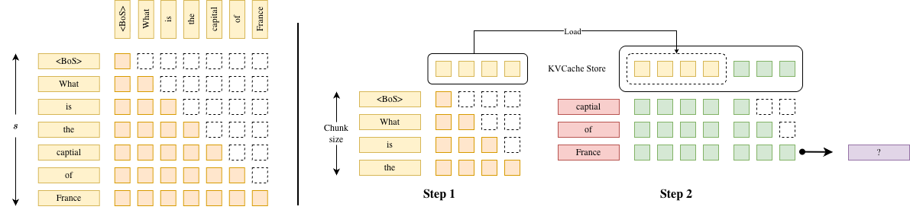

Chunked Prefill 由 [Sarathi](https://arxiv.org/abs/2308.16369)[^3] 提出。上图展示了 Chunked Prefill 的主要流程。Chunked Prefill 将原本一次性处理完整序列的 Prefill 过程拆分为多个按顺序执行的分块计算。设 Chunk size 为 $c$，则对于长度为 $S$ 的输入序列，会被划分为 $\lceil S / c \rceil$ 个 chunk 依次处理。

在每一次分块计算中，系统会：

- 选取当前 chunk 中的至多 $c$ 个 token；
- 计算这些 token 的 $Q/K/V$ 表示，并将新生成的 $K/V$ 写入 KV Cache；
- 将当前 chunk 的 $Q$与已累计的历史 $K$（包括此前所有 chunk 的 token）进行因果 Attention 计算；
- 若该 chunk 为最后一段，则完成整个 Prefill 阶段，并进入后续 Decode 阶段。

[^3]:Agrawal, Amey, et al. "Sarathi: Efficient llm inference by piggybacking decodes with chunked prefills." _arXiv preprint arXiv:2308.16369_ (2023).

### Continuous Batching

> [!note]
> **Continuous batching** 是一种面向在线推理的调度机制，能够大幅提高系统吞吐、减少推理 Latency 以及提高 GPU 利用率.

直接将多个请求简单拼成一个固定 batch 进行推理，会带来两个结构性问题：
1. **长度不一致导致的 padding 浪费**：不同请求的输入长度不同。为了将它们组织成规则 tensor 输入模型，通常需要对较短序列进行 padding。模型在计算时也会对这些“无效 token”执行 attention 和 FFN 计算，造成算力浪费。
2. **Decode 阶段的生命周期不同步（Tail Latency）**：在生成阶段，每个请求需要生成的 token 数量不同，而且生成长度在开始时是不可预测的。在固定 batch 机制下，只有当 batch 中**最后一个请求完成生成**后，整个 batch 才能结束并返回结果。因此，已经提前完成生成的请求会被迫等待最长的那个请求完成，导致尾延迟（tail latency）显著上升。

核心思想是当一个请求结束（例如生成 `<EoS>` Token）立刻就被替换为新的请求：
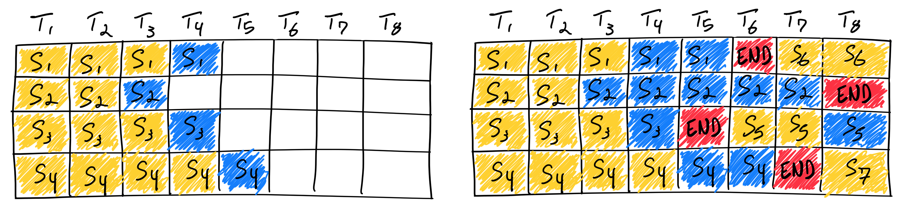

Continuous Batching 通常依赖于 **ragged batching** 技术来实现，即在同一个批次中拼接来自不同请求、长度不一的 token 序列。为了保证不同请求之间互不干扰，系统会通过构造块 block-diagonal 的 Causal Attention Mask（或等价的序列偏移管理机制），确保每个请求的 token 仅与自身历史 token 进行 Attention 计算，而不会与其他请求的 token 发生交互。

Continuous Batching 通常与 Chunked Prefill 结合使用。下图展示了在三个请求同时存在时的推理示例。在每一个调度 step 中，系统的执行流程如下：
- 对正在进行 Decode 的请求执行一次 forward 计算，各生成一个新的 token；
- 在剩余的计算预算内，调度处于 Prefill 阶段的请求，按 chunk 大小处理相应数量的 token；
- 当某个请求完成（Decode 结束）时，将其从当前 batch 中移除；
- 将新到达的请求或尚未完成 Chunked Prefill 的请求加入 batch，以维持持续的计算负载。

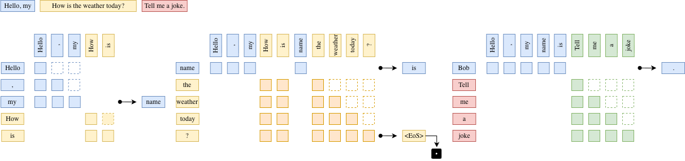
Continuous Batching 在工程实现上通常结合 Paged Attention，以实现对 KV Cache 的更细粒度管理。若采用“一个 token 对应一个 block”的设计，会导致显存碎片化严重，并带来较高的元数据与调度开销。更高效的做法是使用固定大小的 Cache Block，每个 block 存储多个连续 token 的 KV 表示，从而在保持灵活分配能力的同时减少碎片化并提高内存利用率。

## KVCache 管理

### KVCache 机制

> [!note]
> **KVCache**：在 causal self-attention 的 decode 阶段，缓存此前所有 token 的 $K$ 和 $V$ 向量，使得生成新 token 时只需计算当前 token 的 $Q$, $K$, $V$ 向量，避免计算整个序列的 attention.

在 causal self-attention 的 decode 阶段，每次只会生成一个新的 token。对于该 token，模型只需要计算其对应的 $Q,K,V$ 向量，而此前所有 token 的 $K,V$ 向量在生成后保持不变，因此可以缓存为 KV Cache。

在计算 attention 时，新 token 的 $Q$ 会与缓存中的所有 $K$（包括当前 token 的 $K$）进行 $QK^T$ 计算，再与对应的 $V$ 进行加权求和，从而得到当前 token 的 attention 输出。

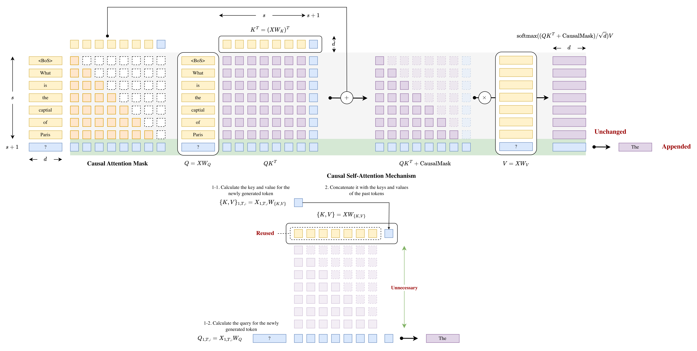
### Paged Attention

> [!note]
> **Paged Attention** 使用类似虚拟内存分页的管理方式，使得 KV Cache 可以按需分配与回收，从而有效降低显存碎片化并提高内存利用率。

PagedAttention 是由 [vLLM](https://arxiv.org/abs/2309.06180)[^1]提出的，将 KV Cache 按固定大小的 Block 进行划分，每个 Block 存储若干连续 token 的 KV 表示。对于单个请求，其 KV Cache 由多个 Block 组成，并通过逻辑到物理 Block 的映射表进行管理。

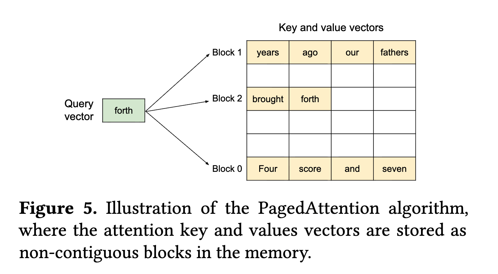

在 Paged Attention 中，每个请求维护一组 Logical KV Blocks，可类比为该请求的“虚拟页表”。这些 Logical Blocks 并不直接对应连续的物理显存，而是映射到全局内存池中的 Physical KV Blocks（固定大小的物理块）。

系统通过维护一张 Block Table，记录每个请求的 Logical KV Block 与 Physical KV Block 之间的映射关系。在访问 KV Cache 时，请求首先根据自身的逻辑块编号查找 Block Table，再定位到对应的物理块，从而完成对实际显存的访问。

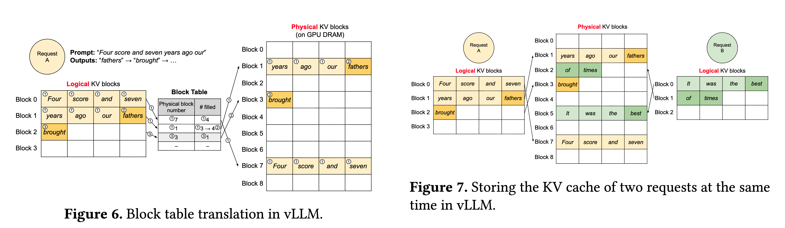

[^1]: Kwon, Woosuk, et al. "Efficient memory management for large language model serving with pagedattention." _Proceedings of the 29th symposium on operating systems principles_. 2023.

### Copy-on-write

> [!note]
> **Copy-on-write** 的核心思想是当多个请求拥有相同前缀 token 时，共享其对应的 KV cache blocks。由于 KV cache 是 append-only 结构，当请求在生成阶段产生分歧时，只为分歧后的 token 分配新的 block，而共享的前缀 block 继续复用，从而显著减少显存开销。

如下图，可以观察到 Sample A1 和 Sample A2 都共享利用了 Physical KV blocks 中的 Block 7.

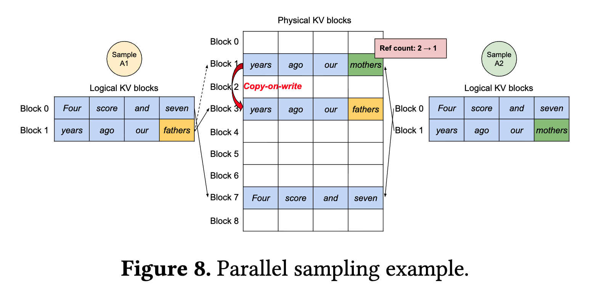
### Radix Attention

> [!note]
> **Radix Attention 通过构建前缀树**（radix tree）来组织请求的 token 序列，使共享前缀在结构上合并为同一路径，从而避免了显式的重复检测过程。

Radix Attention 由主流推理平台 SGLang 在 [这篇文章](https://arxiv.org/pdf/2312.07104)[^2] 提出的。

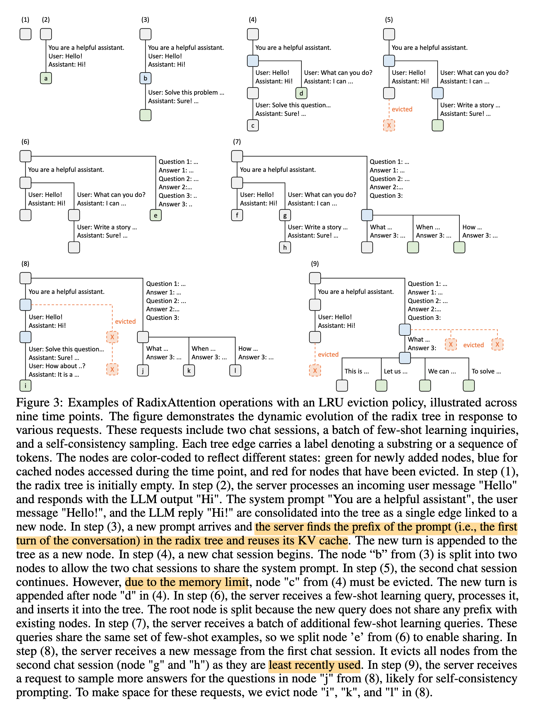

[^2]: Zheng, Lianmin, et al. "Sglang: Efficient execution of structured language model programs." _Advances in neural information processing systems_ 37 (2024): 62557-62583.

## Disaggregation

### (E)PD Disaggregation

> [!note]
> Encode、Prefill 与 Decode 阶段在计算形态、资源瓶颈与扩展规律上存在显著差异。**EPD Disaggregation** 通过将阶段解耦并分别部署，使系统能够针对阶段特征进行差异化的并行与容量配置，从而提升整体吞吐、降低尾延迟，并增强弹性扩缩容能力。

Prefill 和 Decode phase 对于 Batchsize 的 scalability 如下图所示 [^4]。Prefill 阶段由于有大量的 GEMM 运算，因此是 compute-bound；而 Decode 阶段在每个 step 生成新的 token 时都要访问大量的 KVCache，因此是 memory-bound.

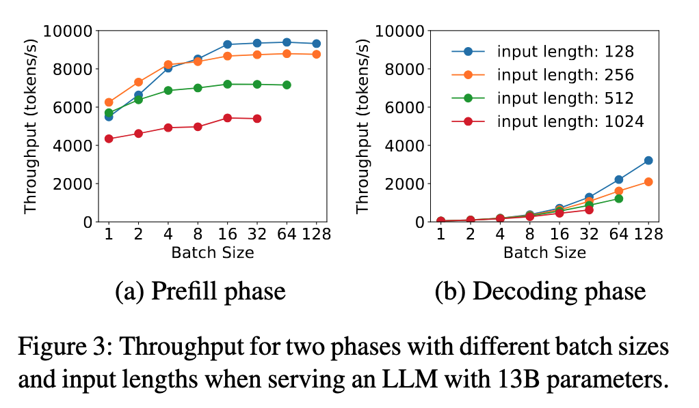

PD 分离是一个在 LLM 推理优化中较大的一个方向，后续会专门有一篇文章介绍常见的优化方法。

[^4]: Zhong, Yinmin, et al. "{DistServe}: Disaggregating prefill and decoding for goodput-optimized large language model serving." _18th USENIX Symposium on Operating Systems Design and Implementation (OSDI 24)_. 2024.
### AF Disaggregation

> [!note]
> **AF Disaggregation** 指的是 Attention 与 FFN 分离。将 Attention 与 FFN 子模块分别部署到不同设备上，通过调整不同的 A 与 F 配比可实现较高推理性能

在主流 Decoder-only 模型中，Attention 与 FFN 层（或者 MoE 层）对 compute 和 memory 的需求存在显著差异。
在 Decode 阶段，Attention 通常是 memory-bound，而 FFN 更多是 compute-bound.
这意味着增大 batch size 时，Attention 的计算资源需求基本不变，而 FFN 则能够随着 batch size 增加获得性能收益，直到完全利用所有的计算资源。

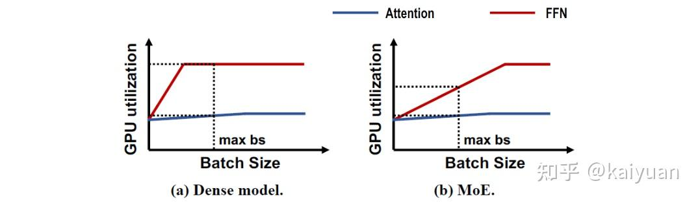

FFN 的最佳 batch size 满足 $$b \geq \alpha \times \gamma \times \text{Flops} / \text{Bandwidth}$$，其中 $\alpha$ 表示权重的存储大小（16-bit 为 1，例如 8-bit 就是 0.5），$\gamma$ 表示激活的参数数量（即与专家数量相关），在 dense model 情况下就是 1，比如在 256 个 Expert 中激活 8 个 Expert，$\gamma = 256/8$.

AF 分离意味着在每一层中，A 和 F 之间都要传输 Activation，不可避免会产生更多通信开销。更多参考资料：[# LLM 推理提速：Attention与FFN分离(AFD)方案解析](https://zhuanlan.zhihu.com/p/1952393747112367273)
## 推理模式

### Speculative Decoding

> [!note]
> **Speculative Decoding** 试图解决在 Auto Regressive 生成 Token 的情况下，尽可能实现一个模型同时生成多个 Token 的效果。

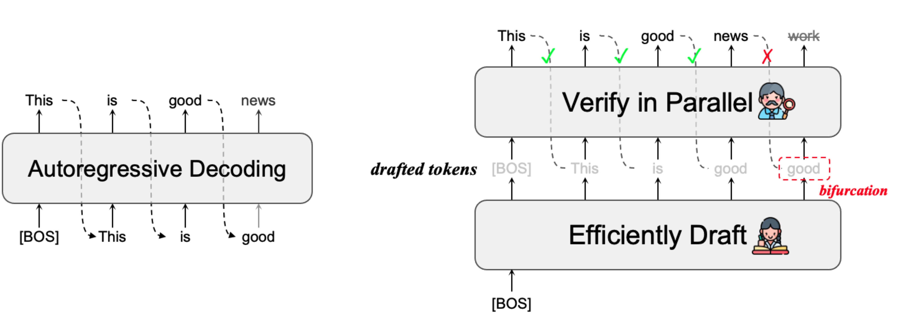
## 量化程度

W8A16：是一种量化模式；W8 表示权重使用 8 位整数（INT8）进行量化而 A16表示 Activation 保留 16 位浮点数（FP16/BF16）精度。
为了保持推理精度，一般来说 Activation 会保留更高的精度。其他常见的格式如 W4A16, W8A8 等。

## Attention 层优化

### Flash Attention

> [!note]
> **Flash Attention** 是一种加速 Attention 运算的算法。

Standard Attention 可以建模为：

可以发现需要重复将结果写入读入 HBM，对此进行优化。思路是在 tile/block 计算过程中，在线（streaming）计算 softmax，从而避免把中间的 attention matrix 写入 HBM。为了适配 block 矩阵乘法，对 softmax 计算进行优化，使得在 tile/block 计算中可以在线更新，而不是先遍历数据找到最大值再进行计算。

优化之后的算法：

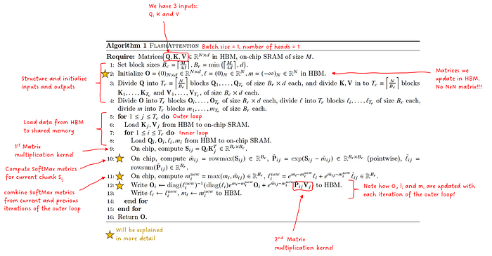
具体可以参考我的文章：[Flash Attention](Flash%20Attention.md).

## Load Balancer

### DPLB

>[!note]
>**Data parallel load balancing (DPLB)** 是数据并行负载均衡

### EPLB

> [!note]
> **Expert parallel load balancing (EPLB)** 是负责在 MoE 模型推理情景下，使在不同设备上的 Experts 负载均衡。

## Misc.

- **[Multi-Lora](https://zhida.zhihu.com/search?content_id=267603145&content_type=Article&match_order=1&q=Multi-Lora&zhida_source=entity)**(Low-Rank Adaptation)：多LoRA适配器共用基础模型，在拥有一个基础预训练模型与针对不同任务分别微调的多个特定LoRA适配器的情况下，多LoRA服务机制能根据传入请求动态选择所需的LoRA模块。参考Lora[[11]](https://zhuanlan.zhihu.com/p/1983137653336585901#ref_11)，Multi-LoRA[[12]](https://zhuanlan.zhihu.com/p/1983137653336585901#ref_12)。
- **[Guided Decoder](https://zhida.zhihu.com/search?content_id=267603145&content_type=Article&match_order=1&q=Guided+Decoder&zhida_source=entity)**：引导解码器。约束模型输出，使其严格遵循预定义的格式或语法规则（如 JSON、SQL、正则表达式等），从而生成结构化、可控的文本输出。
- **Function Call/Tool Call**：工具调用。利用LLM的引导解码输出支持函数调用所需参数格式，使得LLM能够调用工具，参考1[[13]](https://zhuanlan.zhihu.com/p/1983137653336585901#ref_13),2[[14]](https://zhuanlan.zhihu.com/p/1983137653336585901#ref_14)。

## Benchmark

### Latency

- **Time to First Token (TTFT)**: 首个 token 生成的时间，衡量 prefill 性能
- **End-to-End Latency (E2EL)**：端到端请求时延，从输入到输出结果
- **Inter Token Latency (ITL)**：Decode 阶段每个 token 的生成时间

以上三者之间的关系：
$$
\text{ITL} = \frac{\text{E2EL} - \text{TTFT}}{n-1}
$$

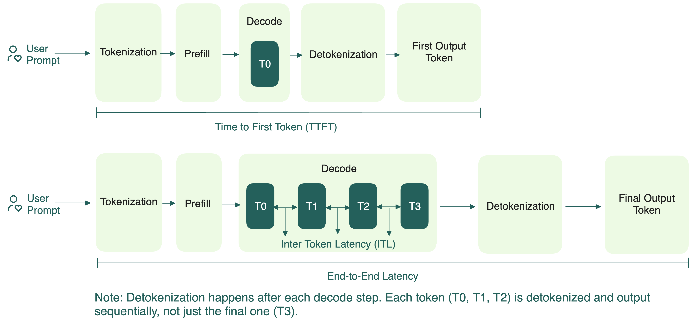

除此之外，还有
- **Time per output token (TPOT)**：所有 tokens 生成的平均时间。计算方式是：$\text{E2EL}/n$
- **Time Between Tokens (TBT)**：生成 token 之间的时间差。分别记录第 $i-1$ 和第 $i$ 个 token 的生成时间，$$\text{TBT}_{i} = \text{Latency}_{i} - \text{Latency}_{i-1}.$$

### Throughput

- **Queries Per Second (QPS)**：每秒处理的请求数量。假设在一段时间内处理了 $T$ 个请求，对于每个请求 $i$，其 latency 是 $\text{latency}_{i}$，则：$$\text{QPS} = \frac{T}{\sum_{\text{i}=0}^T \text{latency}_{i}}$$
- 在类似 continuous batching 的情景下，也可以使用 $t_{\text{end}}- t_{\text{start}}$ 作为所有请求处理时间的估计。

- **Tokens Per Second (TPS)**：每秒吞吐的 token 数目（注意区别：一个请求可能需要生成多个 token）。通常是选取一个时间段，计算这个时间段内生成的 token 数量 $n_{\text{tok}}$，则：$$ \text{TPS}= \frac{n_{\text{tokens}}}{t_{\text{start}}- t_{\text{end}}} $$
- **Top Percentile 90/99 (P90/P99)**：至少有90%或者99%的请求满足该条件。例如至少 90% 的请求 latency 小于等于 1s，则 P90Latency = 1s.

### Misc.

- **Request Per Second (RPS)**：每秒接受到的请求数量，吞吐测试的参考指标
- **Service Level Objective (SLO)**：服务质量目标。例如，希望始终满足请求 TPS P99=20 tokens/s.
- **Model Flops Utilization (MFU)**：衡量 GPU 算力资源使用效率

## 采样参数

- **Temperature**：温度，操作用于调整logits的概率分布整体情况，能让概率分布变得**尖锐**或者**平坦**。当温度较大时意味着除了模型倾向的答案，同时更多考虑其他词作为备选。（后续会在备选 token 中进行随机采样，当其他备选词概率变高意味着它们更有可能被选到）
- **Top-K**：概率排序后只选取 Top-K 个概率最大的值.
- **Top-P**：概率排序后按概率最高到最低顺序选，直到累计概率达到 $P$. 剩余的丢弃
- **Min-P**：保留所有概率至少为最高概率的 $P$ 倍的候选词
- **Frequency Penalty**：频率惩罚，对出现过的词，根据其出现频率降低logits值，频率越高衰减越严重
- **Presence Penalty**：存在惩罚，对出现过的词，在logits中减去一个相应惩罚值，每个词至多惩罚一次
- **Repetition Penalty**：重复惩罚，对重复出现的词进行衰减，类似频率处理
- **Beam Search**：束搜索，是一种结合topK和剪枝的搜索算法，每次保留束宽（beam width）k个结果

## 参考资料

- [大模型推理核心概念与术语总结](https://zhuanlan.zhihu.com/p/1983137653336585901)
- [Key metrics for LLM inference](https://bentoml.com/llm/inference-optimization/llm-inference-metrics)