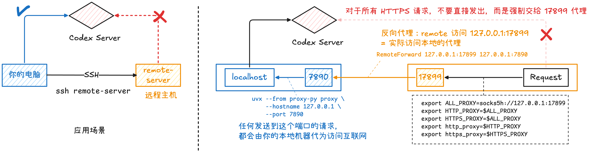

在某些环境中远程机器无法直接访问外网，导致无法在远程机器上下载 HuggingFace 模型、无法调用 OpenAI / Codex API，pip install 或 git clone 失败等等情况。我们希望能够让远程机器借用自己本地电脑的网络来对这些网站和服务器进行访问。

本文将介绍基于这个思路的解决方案和实现方式。本质上，我们通过 SSH 隧道把远程服务器的请求转运到本地，再由本地去访问互联网，最后把结果再返回给远程。

## 思路和步骤

核心思路是利用 **SSH 反向端口转发（RemoteForward）** 和**本地 HTTP 代理**，让远程服务器的 HTTP / HTTPS 请求经由本地电脑发出。

本地运行一个 HTTP 代理服务，并通过 SSH 将该代理暴露到远程服务器的本地回环地址上。这样远程服务器无需直接访问外网，而是将请求发送给 SSH 隧道另一端的本地代理，由本地电脑代为访问互联网并返回结果。




数据流可以理解为：

```
remote server
   ↓ (HTTP Proxy)
127.0.0.1:17899 (remote)
   ↓ (SSH RemoteForward)
127.0.0.1:7890 (local)
   ↓ (proxy-py)
Internet
```

假设我能够通过 `ssh remoteMachine` 来连接到我的远程服务器。

**第一步：在本地启动 HTTP 代理**。首先在本地电脑启动一个 HTTP 代理服务器。例如使用 proxy-py：

```sh
uvx --from proxy-py proxy \
    --hostname 127.0.0.1 \
    --port 7890
```

启动成功后，本地将监听：`127.0.0.1:7890`. 所有发送到该端口的 HTTP / HTTPS 请求都会由本机代为访问互联网。[^1]

**第二步：建立远程到本地的反向端口转发**。在 SSH 配置中加入：

```
Host remoteMachine-proxy
    HostName xxx.xxx.xxx.xxx
    User username

    RemoteForward 127.0.0.1:17899 127.0.0.1:7890

    ExitOnForwardFailure yes
    ForkAfterAuthentication yes
    SessionType none
```

这样允许远程服务器 `127.0.0.1:17899` 经过 SSH 远程隧道可以发送到本地电脑 `127.0.0.1:7890`. 然后执行：`ssh remoteMachine-proxy`

最后两行使得 SSH 在后台保持隧道，而不会持续占用当前终端。

**第三步：在远程配置代理环境变量**。让大多数支持代理环境变量的 HTTP / HTTPS 请求，不直接访问外网，而是先交给 `127.0.0.1:17899` 这个代理。

```
// 写入 ~/.zshrc 或者 ~/.bashrc
vpn() {
  unset HTTP_PROXY HTTPS_PROXY http_proxy https_proxy ALL_PROXY all_proxy

  export HTTP_PROXY="http://127.0.0.1:17899"
  export HTTPS_PROXY="http://127.0.0.1:17899"
  export http_proxy="http://127.0.0.1:17899"
  export https_proxy="http://127.0.0.1:17899"
  export ALL_PROXY="http://127.0.0.1:17899"
  export all_proxy="http://127.0.0.1:17899"
  export NO_PROXY="localhost,127.0.0.1,::1"
  export no_proxy="localhost,127.0.0.1,::1"

  echo "Proxy enabled: http://127.0.0.1:17899"
}

unvpn() {
  unset HTTP_PROXY HTTPS_PROXY http_proxy https_proxy ALL_PROXY all_proxy
  unset NO_PROXY no_proxy

  echo "Proxy disabled"
}
```


这样就完成了。

## 启动

在需要启用 SSH 端口转发时，首先在本地电脑上执行：

```
ssh remoteMachine-proxy
```

然后在远程服务器上执行：

```
vpn
```

启动环境变量。

[^1]: 如果希望长期运行该代理，可以使用 `tmux` 或 `screen` 创建持久会话；也可以在启动后按 `Ctrl+Z` 暂停进程，再执行 `bg` 和 `disown` 将其放入后台运行，使其在关闭当前终端后继续保持运行。
