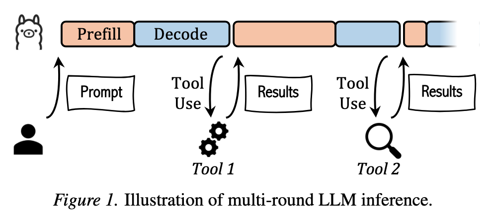
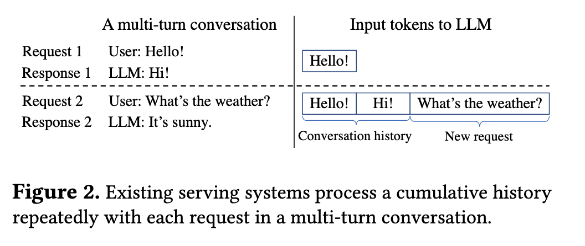
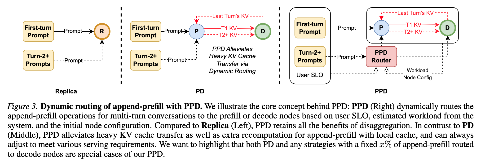
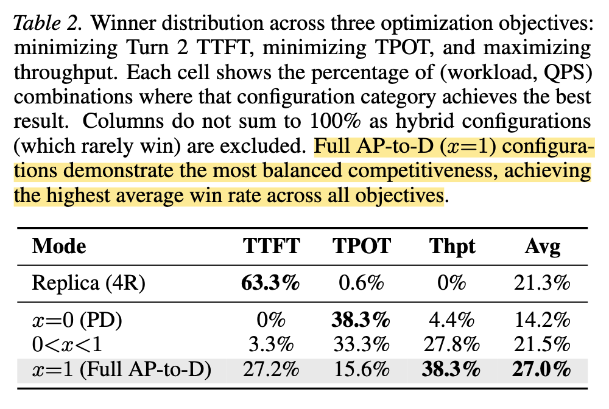
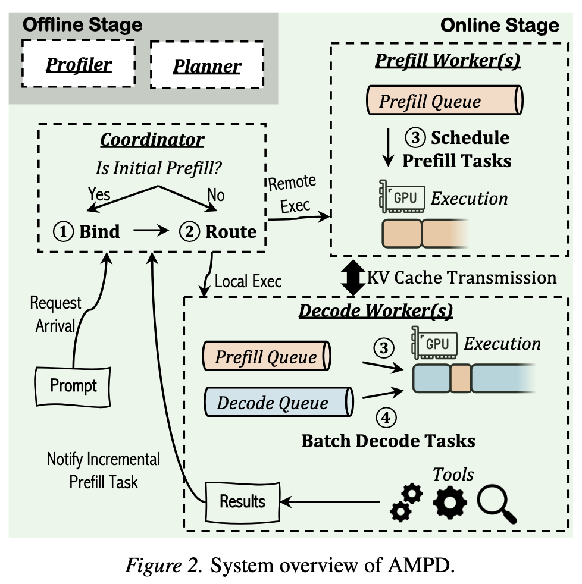
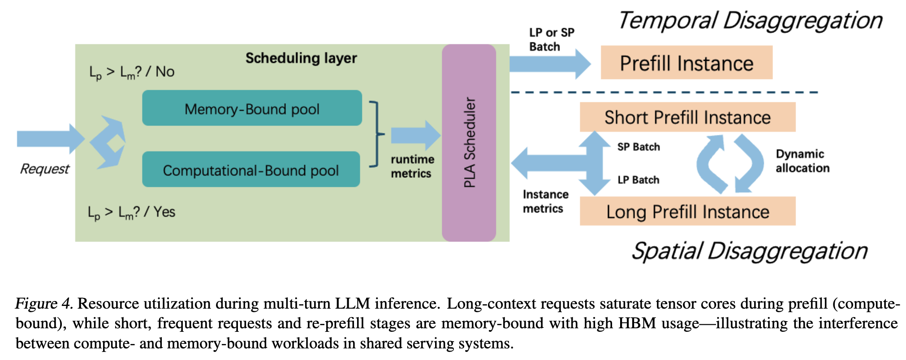
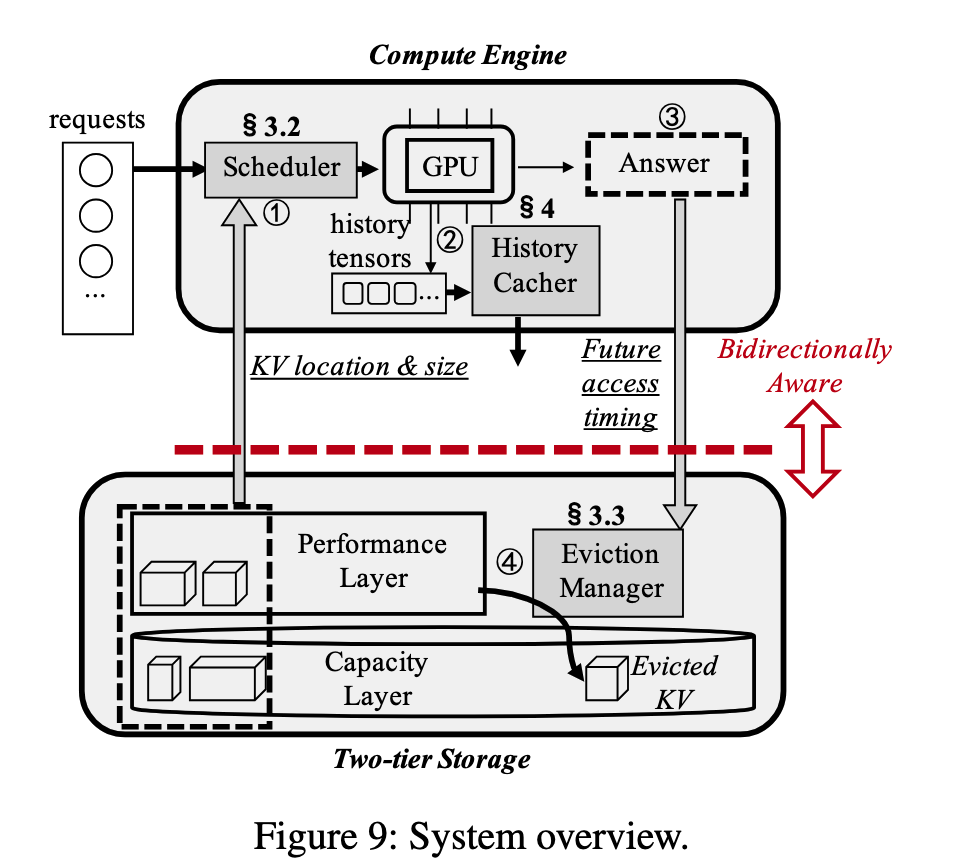
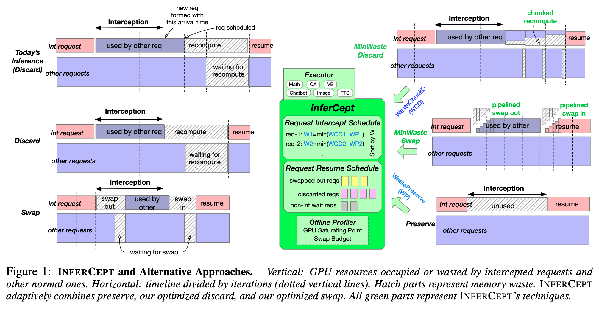
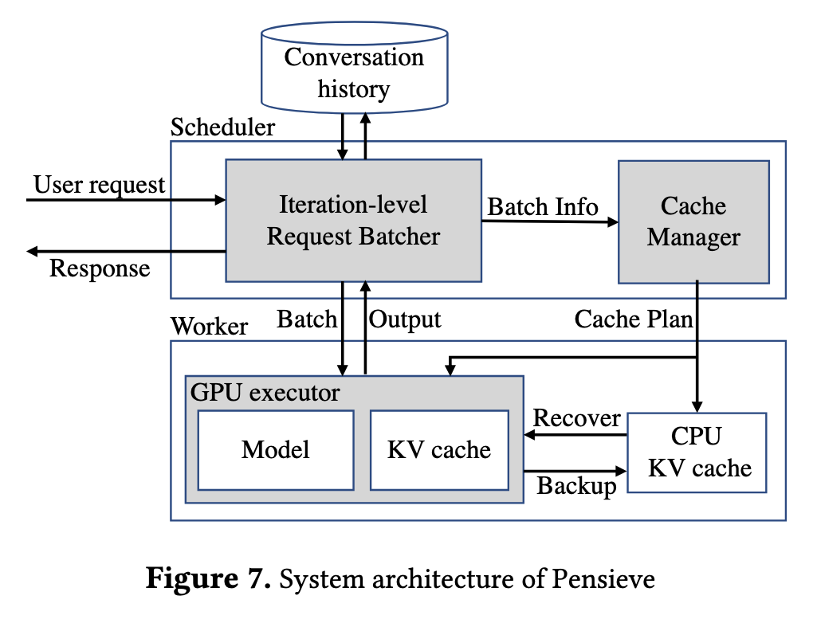
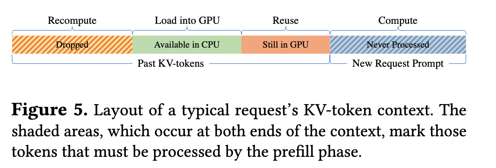

## 多轮对话应用场景

**Session 和 Requests**. 一个 session 里面包括了多次 request.

## 论文阅读

### SwiftCache (2606)

探索异构模型在同一台服务器上的 KV Cache 内存存储系统，由于不关注异构模型所以这里忽略。

### PPD (2603, ICML'26)

**关键词**：多轮对话、PD 分离

主要关注 PD 分离 serving 多轮对话场景下，后续轮次的 request 是由 Prefill 实例处理还是 Decode 实例处理。

**Challenges and Insights**.
1. **传统 Prefill-Decode 分离的单向 KV 传输协议，与多轮对话的状态复用需求存在冲突。**
	- 在传统 PD 架构中，Prefill 节点是 KV producer，Decode 节点是 KV consumer，KV Cache 只能按照 `P → D` 的方向传输，通常不存在 `D → P` 的反向路径。
	- 第一轮请求由 P 执行 Full Prefill，将 KV Cache 发送到 D；D 生成回复后，最新的历史 KV，包括回复 token 的 KV，实际上保存在 D 上。
	- 但第二轮请求通常仍然被发送到 P。由于 P 无法访问 D 上上一轮生成的 KV，论文讨论的 canonical PD 路径需要根据对话文本重新构造历史 KV，再把当前完整 KV 发送回 D。
	- 因此，每一轮都会重复经历“历史 KV 重计算—P 排队—KV 网络传输—D Decode”，使 Turn 2+ 的输入即使很短，TTFT 仍然较高；随着上下文和轮数增长，KV 传输还可能逐渐成为系统瓶颈。
2. 传统的 PD 分离框架让 Prefill 实例处理 Append Prefill（即 Turn 2+ 请求），但是文章发现让 Decode 节点直接执行 Turn 2+ 的 Append Prefill 更好
	- **Full Prefill** 没有可复用的历史 KV，需要处理完整的 $n$ 个输入 token，Attention 计算量约为 $O(n^2)$。
	- **Append Prefill，AP** 已经拥有 $n$ 个历史 token 的 KV，只需要处理本轮新增的 $m$ 个 token，每个新 token 对历史上下文执行 Attention，计算量约为 $O(m(m+n))$.
	- 多轮对话中通常有 $m \ll n$，因此 AP 比对相同总上下文执行 Full Prefill 便宜得多。
	- 在论文的 H100、Llama-3.1-8B 微基准中，Decode batch size 为 200 时，混入一次 Full Prefill 会使 TPOT 增加约 48%，而混入一次 Append Prefill 只增加约 2%。即使上下文扩展到 64K，AP 的干扰仍低于约 25%。
	- 这说明传统 PD 所依据的所有 Prefill 都必须与 Decode 物理隔离过于粗粒度；真正需要严格隔离的是 Full Prefill，而轻量的 AP 可以考虑与 Decode 共置。
3. **因此，可以让 Decode 节点直接执行 Turn 2+ 的 Append Prefill。**
	- PPD 的完整名称是 **Prefill + Prefill-capable Decode**：保留专门处理 Full Prefill 的 P 节点，但允许 D 节点额外处理轻量的 Append Prefill。
	- 第一轮仍然采用传统 PD，D 接收第一轮 KV 后，将其保存在本地 Prefix Cache 中，并继续保存自己生成的回复 token KV。
	- 第二轮及后续请求可以直接返回同一个 D，这样既不需要在 P 上重新构造历史 KV，也不需要再次执行大规模 `P → D` KV 传输，同时仍然把第一轮 Full Prefill 与 Decode 隔离。
4. 但是，Append Prefill 固定放在 D 上并不总是最优，因为 AP 仍然会干扰正在进行的 Decode。
	- 特别的，对于 Append Prefill Prefill-heavy 请求，本轮新增输入较长，AP 可能明显干扰其他 Decode 请求。
	- 结论是在不同场景下，设 $x$ 为 Turn 2+ 请求路由到 Decode 实例的比例，不存在一种配置使得该配置使系统在所有指标上胜出 
5. **PPD 采用 Offline Profiling + Online Lookup，而不是在线运行复杂性能模型。**
	- 离线阶段针对每种离散 workload，分别测量 $x=0$ 和 $x=1$ 下的 Turn 2 TTFT 与 TPOT，并根据加权目标预先计算最佳路由选择。
	- 在线时，Router 将实时请求映射到最近的 workload cell（做匹配），直接返回预计算结果，单请求决策开销低于 1 ms

> 论文没有给出推荐 PD 实例比例，也没有对此作出优化

### AMPD (2602, ICML'26)

**Challenges and Insights**.

1. **Incremental Prefill 可以在 Decode Worker 本地执行，也可以发送到 Prefill Worker，但两种方法分别优化 TTFT 和 ITL。** 因此具体多轮对话的后续 Prefill 请求不一定要放在 Prefill 实例上完成，应该由谁完成？
	- **Local Execution**：在负责该 session 的 Decode Worker 上直接执行 Prefill。
	    - 优点是不需要搬运历史 KV Cache，也不会增加 Prefill Worker 的队列压力，因此通常能够降低 TTFT。
	    - 缺点是 Prefill 会暂停 Decode Worker 当前正在执行的 Decode batch，引入 Prefill-Decode interference，使其他请求的 ITL/TPOT 上升。
	- **Remote Execution**：将 Prefill 发送到独立的 Prefill Worker。
	    - 优点是 Decode Worker 可以继续稳定执行 Decode，保护 ITL。
	    - 缺点是 Prefill Worker 需要排队，并且需要在 Prefill Worker 和 Decode Worker 之间迁移 KV Cache，可能使 TTFT 上升。
	- 因此 Turn 2+ 请求需要根据 **当前 P/D 两侧的实时负载和 SLO slack** 动态决策。
2. **多轮工作负载还会改变最优的 P/D 实例比例与并行策略，因此 AMPD 进一步进行 Offline Deployment Planning。**
	- 单轮 PD 配置通常只根据 Initial Prefill 长度和输出长度，决定多少 GPU 分配给 P、多少分配给 D。
	- 但多轮 workload 中还包含 Incremental Prefill、历史 KV 读取和双向 KV 传输，P/D 两侧的实际负载不能再只由首轮输入和最终输出长度表示。

**System Design**.
1. **Offline Profiler**
	- Profiling 不同 history length、incremental input length、batch size 和并行策略下的 Prefill、Decode 与 KV 传输开销
	- 通过 ILP 同时决定 P/D GPU 分配、Worker replica 数量及模型并行度。
2. **Session Binding**
    - 请求到达时，根据显存使用情况绑定一个 Decode Worker。
    - 该 Decode Worker负责保存 session 的历史 KV，并执行该 session 的所有 Decode。
3. **Adaptive Prefill Routing**
    - 对 Initial Prefill 和 Incremental Prefill，动态选择：
        - 在绑定的 Decode Worker本地执行；
        - 或路由到某一个 Prefill Worker远程执行。
    - 首先利用 TTFT/ITL slack 快速决策；两侧均拥塞时，再比较计算、排队和 KV 传输的预计总成本。
4. **TTFT-aware Prefill Reordering**
    - 在每个 Prefill Queue 的队首取较小窗口。
    - 重新排列任务，使满足 TTFT SLO 的任务数量最大。
    - 使用最大 postponement 次数防止 starvation。
5. **Lazy Bidirectional KV Transfer**
    - Remote Incremental Prefill 开始执行时，P 才从 D 读取历史 KV。
    - P 完成计算后，仅将新增 incremental KV 返回 D。
    - 使用 NIXL 和 RDMA 执行跨 Worker传输，并尝试将传输与计算重叠。
    - Coordinator、Worker Queue 和窗口化 TTFT/ITL 统计通过 Redis 全局共享；系统实现基于 NVIDIA Dynamo。

### LAPS (2601, MLSYS'26)

**关键词**：多轮对话、PD 分离

**Challenges and Insights**.
1. **即使已经进行 Prefill-Decode 分离，Prefill 阶段内部仍然存在显著的异构请求干扰。**
    - 现有 PD 分离系统将 Prefill 和 Decode 部署在不同实例上，解决了 Prefill 与 Decode 之间的资源竞争，但通常仍将不同长度的 Prefill 请求放入统一队列和 batch。
    - Long Prefill 通常具有较高 arithmetic intensity，由大规模 GEMM 主导，属于 **compute-bound**；Short Prefill，尤其是读取大量历史 KV、只处理少量新增 token 的 re-prefill，则更容易属于 **memory-bound**。
    - 当两类请求混合执行时，一方面 Long Prefill 会阻塞 Short Prefill，形成 **Head-of-Line Blocking**；另一方面，计算密集型工作与显存带宽密集型工作混合，会产生 **compute-memory interference**，同时损害两类请求的性能。
2. **多轮对话会持续产生大量 Short Re-prefill 请求，使 Prefill 内部异构性成为常态。**
    - 在多轮对话中，历史上下文已经保存在 KV Cache 中，后续轮次通常只需要对本轮新增的少量 token 执行 re-prefill。
    - 因此，虽然整个 conversation 的上下文越来越长，但每轮新增的 Prefill 段通常较短，并需要读取较长的历史 KV，更容易受到显存带宽限制。
    - 这意味着真实多轮负载中往往同时存在少量 Long Prefill 和大量 Short Prefill/Re-prefill，不能再将所有 Prefill 看作同一种 workload。
3. **因此，需要在 Prefill 阶段进一步执行 LP/SP Disaggregation。**
    - LAPS 根据 profiling 得到当前模型与硬件上的 compute-memory boundary，并据此将请求划分为 Long Prefill 和 Short Prefill。
    - 两类请求进入独立的 waiting queue，调度器不再将 LP 和 SP 混入同一个 batch，从而避免 HoL blocking 和 compute-memory interference。
    - 单 Prefill 实例下使用 **Temporal Disaggregation**：LP batch 和 SP batch 在同一实例上分时执行。
    - 多 Prefill 实例下使用 **Spatial Disaggregation**：不同实例分别服务 LP Pool 与 SP Pool。
4. **Short Prefill 具有较短且相对稳定的 tensor shape，因此可以使用 CUDA Graph 加速。**
    - 普通长 Prefill 的输入长度和 batch shape 变化较大，难以复用预先捕获的 CUDA Graph。
    - 多轮 re-prefill 通常只有几十个新增 token，可以按照 token length 和 batch size 划分 bucket，例如长度为 8、16、32、64。
    - LAPS 为常见的 `(prompt length, batch size)` shape 预先捕获 CUDA Graph；运行时将请求 padding 到最近的 bucket，并将 shape 相近的请求组成 batch，从而减少 CPU kernel launch 开销。
    - 这种优化也带来了 padding 和 KV slot 浪费，需要在 Graph 复用率、延迟和显存占用之间进行权衡。
5. **Short Prefill 的 batching 不能只追求立即执行，还需要平衡排队延迟与大 batch 效率。**
    - 请求立即到达就执行可以降低 waiting time，但 batch 太小，CUDA Graph 和 GPU 并行度的收益有限。
    - 等待更多请求可以形成更大的、shape 更规整的 batch，但等待过久又会增加 TTFT，甚至违反 SLA。
    - LAPS 提出 **Adaptive Wait-Depth（AWD）Scheduler**，同时维护等待窗口和目标 batch depth。
    - 调度器根据请求的 SLA slack 与预计填满 CUDA Graph bucket 所需的时间决定等待多久；若请求即将违反 deadline，则立即发射 batch。
6. **多实例场景下，LP/SP 的资源比例必须随实时负载动态变化。**
    - 固定分配 LP 实例和 SP 实例无法适应随时间变化的请求比例，可能出现一侧排队严重、另一侧 GPU 空闲。
    - LAPS 定期监控两个 instance pool 的队列积压、SLA 偏差和 GPU 利用率，计算各自的 load pressure。
    - 当两侧压力差超过阈值时，控制器在 cooldown 和 hysteresis 约束下，将一个实例从低压力 Pool 迁移到高压力 Pool，避免频繁振荡。

### Bidaw (2512, FAST'26)

**关键词**：多轮对话、KV Cache 存储

**Challenges and Insights**.
1. 真实多轮对话会产生大量长期存活、间歇访问的 KV，因此简单的 LRU/FIFO 难以有效管理 Host Memory。
2. 不同请求的 KV 加载时间差异巨大，I/O-忽略 FCFS 会产生严重的 Head-of-Line Blocking
3. Bidaw 认为主要问题在于：
	- **请求调度缺乏 Storage Awareness**
	    - 现有调度器通常只考虑请求到达时间、GPU batch 或显存容量，却不知道请求的历史 KV 位于 Host Memory 还是 SSD，也不知道需要加载多少 KV。
	    - 因此，KV-loading time 很长的请求可能排在队首，阻塞 KV 已经就绪的请求，形成 **I/O-induced Head-of-Line Blocking**。
	    - Bidaw 的解决方式不是精确预测每个请求的加载时间，而是根据 KV 的**位置和大小**，将请求分为 Ready Queue 与 Preparing Queue，并在 SSD 请求之间使用 disk-HRRN 调度。
	- **KV Cache Eviction 缺乏对未来访问模式的感知**
	    - LRU、FIFO 等策略只观察过去的访问记录，无法判断某个 conversation 的 KV 下一次大概什么时候会被访问。
	    - Bidaw 利用交互式对话中的 user pattern：**模型上一轮回复越长，用户通常需要越长时间阅读和输入下一轮问题**。
	    - 因此，它使用上一轮回答长度预测下一次访问的 weighted reuse distance，再估计 KV 的 hit potential，优先淘汰未来命中概率较低的 KV。

**System Design**.
1. **将请求分为 Ready Queue 和 Preparing Queue。**
	- 当请求到达时，调度器查询该请求历史 KV 的位置和大小。
	- 如果 KV 已经位于 Host Memory，进入 **Ready Queue**，可以参与 GPU 调度。
	- 如果 KV 位于 SSD，进入 **Preparing Queue**；系统先异步将其加载到 Host Memory，完成后再将请求提升到 Ready Queue。
	- Ready Queue 使用 FCFS，但请求从 Preparing Queue 返回后，仍保留其原始到达时间。Preparing Queue 不能只执行 Shortest-KV-First，否则大 KV 请求可能永久饥饿。
2. Bidaw 使用上一轮模型回答长度，预测下一次 KV 访问的 Weighted Reuse Distance 下界。B
	- Bidaw 通过 Ghost Cache 估计不同 Reuse Distance 下的 Hit Potential，并淘汰期望命中潜力最低的 KV。
	- 系统在后台维护一个使用 Belady Optimal 的 Ghost Cache。- Ghost Cache 并不能预知真实在线请求的未来；它利用已经结束的历史 trace，在回看时获得这些旧请求的未来信息，从而统计不同 weighted reuse distance bucket 在最优策略下的历史命中率。

### KVCache Cache in the Wild (2506, ATC'25)

### InferCept (2402, ICML'24)

**Challenges and Insights**.
1. **现有 LLM serving 将一次 generation 视为连续执行的 request，但 Agent/Tool Use 场景中推理过程会被频繁中断（interception）**。
    - 在生成过程中，请求可能因为 **tool invocation、API 调用、human feedback、environment interaction** 等原因暂停执行。
    - 当前主流 serving 系统通常将 interception 视为请求结束，直接释放该请求对应的 KV Cache 和运行状态。
    - 当外部操作完成后恢复推理时，需要重新恢复上下文，因此产生大量重复 prefill 或数据恢复开销。据论文统计，interception 会导致约 **37%–40%** 的额外 forward 计算。
2. **Interception 期间如何管理 GPU 上保存的 KV Cache 成为核心问题。**
    - **Discard**：直接释放 KV Cache，GPU 空间利用率最高，但恢复时需要重新 prefill 全部历史。
    - **Preserve**：始终保留 KV Cache 在 GPU 中，恢复最快，但 interception 时间较长时会长期占用 GPU 显存，降低系统吞吐。
    - **Swap**：将 KV Cache 迁移到 CPU，能够释放 GPU 空间，但 CPU-GPU 数据迁移本身存在较高延迟，并且迁移过程中仍然会占用一定 GPU 资源。
3. **不存在一种策略始终最优，应根据 interception 时间动态选择资源管理方式。**
    - 当 interception 时间较短时，继续保留 GPU 中的 KV Cache 更划算。
    - 当 interception 时间较长时，直接丢弃并重新计算可能比长期占用 GPU 更高效。
    - 对于中等长度的 interception，则更适合执行 GPU-CPU Swap。
    - 因此，InferCept 的核心思想是在 **Discard、Preserve 与 Swap** 三种策略之间进行动态选择，根据 interception 持续时间和 GPU 资源情况取得整体最优性能。
4. **无论选择 Swap 还是 Discard，恢复阶段仍然存在进一步优化空间。**
    - 对于 Swap，传统实现采用串行的数据迁移，会导致 GPU 长时间等待数据恢复。
    - InferCept 将 Swap 过程设计为 **Pipeline + Overlap + Chunking**，使数据迁移能够与模型 Forward 重叠执行，从而降低等待时间和 GPU 空闲时间。
    - 对于 Discard，恢复历史需要重新执行 Prefill，InferCept 将重计算与其他请求的 Decode 过程进行重叠执行，提高 GPU 利用率，进一步隐藏恢复带来的额外开销。

**System Design**.
1. Strategy Selection
    - 预测每个请求的 interception 时间
    - 并结合 GPU 当前资源情况，为请求动态选择 **Discard、Preserve 或 Swap**。
2. Swap Optimization
    - 将传统串行 Swap 改为 **Pipeline + Overlap + Chunking**。
    - 将不同 Layer 的 Swap、数据传输以及正常 Forward 重叠执行，并进一步将大规模 Swap 分割到多个迭代中，减少 GPU 空闲时间和显存浪费。
3. Recomputation Optimization
    - 当请求采用 Discard 时，不直接执行完整重计算，而是将 Prefill 与其他请求的 Decode 并行调度。
    - 利用 Decode 阶段 GPU 利用率较低的特点隐藏重计算开销，提高整体吞吐。

### Pensieve (2312, EUROSYS'25)

Pensieve 把 conversation 视为 stateful session：上一轮 KV 不应在回复结束时自动消失，而应跨 GPU/CPU/SSD 层存留，在后续轮增量 prefill。

**Challenges and Insights**.
1. **现有多轮对话和普通 LLM inference 系统区别**。现有 LLM serving 系统以 request 为单位进行管理，每个请求结束后都会释放其对应的 KV Cache，因此系统在请求之间是 **stateless** 的。
	- 而对于同一个 conversation，后一轮请求实际上需要以前几轮完整的对话历史作为输入，这意味着历史 token 会在不同 request 中被反复执行 prefill。
	- 随着对话不断变长，重复 prefill 的开销迅速累积，最终成为多轮对话的主要性能瓶颈。
2. 重计算 KV Cache 代价很高，因此考虑 offload KV Cache 到 CPU 上，使用 GPU-CPU 二级缓存结构。
	- 为了避免重复计算历史 KV Cache，Pensieve 提出将 KV Cache 保留到请求结束之后，使其能够在同一 conversation 的后续请求中直接复用。
	- 活跃会话保留在 GPU 中，而暂时不活跃的会话则迁移到容量更大的 CPU 内存，在下一轮请求到来时再恢复，从而在显存容量与计算开销之间取得平衡。
3. 现有的 KV Cache swapping 都是以整个 conservation 为单位的，需要细化到 token（实现上为 block）粒度，使 eviction、swap 与 recovery 可以针对部分历史 KV 进行
	- 一次恢复往往只需要部分历史 KV，如果每次都迁移完整 conversation，不仅浪费带宽，也降低缓存利用率。
	- 按照 token（实现上对应缓存块）的粒度进行缓存管理、迁移和回收
4. 复原 KV Cache 的方法：应该平衡重计算和数据传输以加速恢复历史
	- 一种是完全从 CPU 加载历史 KV，另一种是完全重新执行 prefill。前者受到 CPU-GPU 带宽限制，后者则浪费 GPU 计算资源。
	- 因此，Pensieve 的核心思想是在 **CPU-GPU 数据传输** 与 **GPU 重计算** 之间进行联合优化，根据不同历史片段选择加载还是重计算，使两部分开销达到更好的平衡，从而最小化整个历史恢复延迟。

**工程上实现**. 由于 vLLM 不支持在 prefill 阶段使用不连续的 KV cache 进行计算，因此 Pensieve 设计了支持 **多 Query Token + 非连续 KV Cache** 的新 Attention Kernel，在保持 Prefill 并行性的同时支持 GPU-CPU 分层缓存管理。
