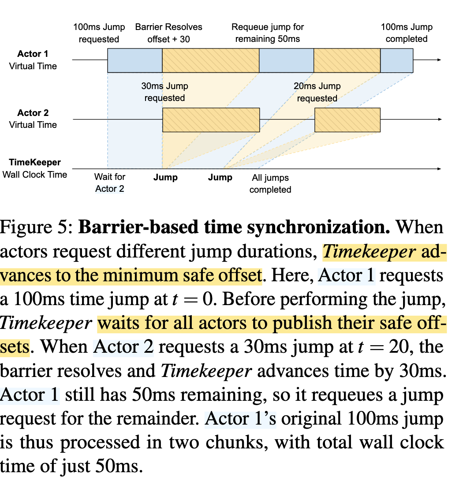
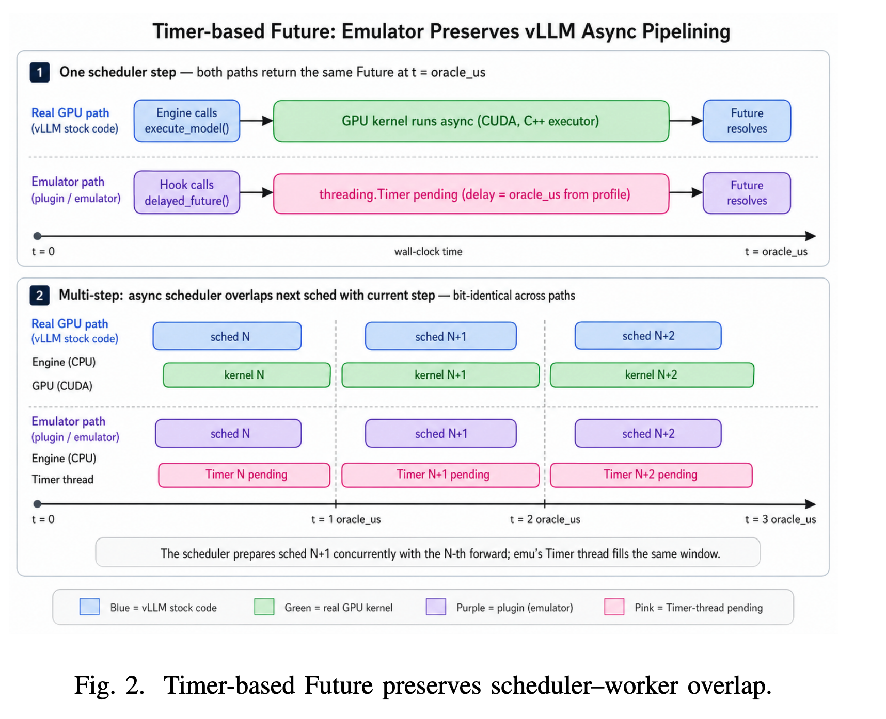

## LLM 模拟器介绍

### LLM Simulator/Emulator 使用动机


**LLM Simulator/Emulator 可以有效减少评估部署配置成本 (Revati)**。

以部署 Qwen3-235B-A22B 为例：运维人员需要选择
- 张量并行（TP）度数（1–8）
- 流水线并行（PP）阶段数（1–8）
- 专家并行（EP）度数（1–8）
- 最大 batch size（1–256）
- chunked prefill 大小（256–8192 tokens）
- KV Cache 淘汰策略（LRU、LFU、cost-aware）
- 请求路由策略（round-robin、sticky、cache-aware）
- 解耦部署策略（prefill/decode 共置还是分离）
等配置组合，这些共同构成了一个极其巨大的设计空间。

已有研究表明，如果能够根据模型特征与 workload 特征合理调优这些配置，系统吞吐量可以提升 3–5 倍。因此，为了有效部署这些系统，运维人员通常需要在代表性 workload 上测试不同配置，并从中选出既满足延迟要求、又能提供最大吞吐量的方案。

问题在于：评估单个配置通常需要约 2–4 小时的 profiling，才能收集到具有统计意义的 tail latency 数据。对于一个 64-GPU 集群而言，以当前 H100 云端价格（每 GPU 每小时约 2.5–7 美元）计算，仅仅评估 100 个配置，就需要消耗 12,800–25,600 GPU-hours，总成本高达 3.2 万到 17.9 万美元。这意味着，对整个配置空间进行系统性的穷举探索，在工程实践中几乎不可承受。最终，大多数部署者不得不依赖经验性的 heuristics 或少量人工试验来完成配置选择，而难以真正找到全局最优部署方案。

为了降低配置评估成本，当前业界与学术界普遍采用**离散事件模拟器（Discrete-Event Simulators, DES）** 来替代真实硬件实验。这类系统试图以较低代价对 serving system 的运行行为进行建模，从而在不实际执行 GPU 计算的情况下，快速预测不同配置下的系统性能。相比直接在真实集群上反复部署与 profiling，模拟器能够显著降低实验成本，并加速设计空间探索，因此逐渐成为大规模 LLM serving 配置优化中的重要工具。

这些工具的核心做法是：在一个简化的模拟框架中，手动**重新实现**服务系统的控制逻辑，例如调度器、内存分配器以及请求路由器。随后，通过一个性能模型来预测 GPU 执行某个 batch 所需要的时间。模拟器会将自己的时钟推进这么长的时间，并继续处理下一个事件。

由于整个过程中不需要真正执行 GPU 计算，这类模拟器可以在无需真实硬件的前提下，实现相比真实运行速度快一个数量级的加速。

### Simulator 和 Emulator 区别

传统的 **Simulator** 并不会直接运行真实的 serving system，而是手动复现其中的核心逻辑，例如 scheduler、batching、KV cache 管理与请求调度等，再结合 workload trace 与性能模型来模拟系统行为。因此，本质上它是在“重新实现”一个简化版系统，其准确性高度依赖于模型是否能够正确刻画真实系统的行为。

而 **Emulator** 则不同，它会直接运行真实的 serving framework（例如 vLLM 或 SGLang）的原始代码，保留真实的 control plane 与调度逻辑，只对底层硬件执行部分进行虚拟化，例如将 GPU computation、CUDA API 调用或显存分配替换为 sleep、runtime prediction 或 virtual time jump 等机制。因此，Emulator 的核心思想并不是重新模拟系统逻辑，而是在真实系统 + 虚拟硬件的基础上运行


### 现有 LLM Simulator 局限性


1. 重新实现 serving framework 的调度与运行时逻辑相关问题 (Revati)
	1. 实现细节高度复杂，复现逻辑和实际实现不同
	2. 同样策略或逻辑在不同框架下有不同实现方式等
	3. 实际代码迭代快导致代码维护困难
2. 因此考虑能不能做 Emulator 来减少代码复现，同时实现更高性能建模效果

## Revati (26.01)

> 参考论文：[Revati: Transparent GPU-Free Time-Warp Emulation for LLM Serving](https://arxiv.org/abs/2601.00397)

**Strawman approach: Sleep-Based Emulation**. 保留真实运行系统，但是当要去调用 GPU（例如内存分配、前向推理）的时候，直接替换为 `sleep(...)`.
- 通过拦截 CUDA API calls via `LD_PRELOAD` 实现（在运行时做）
- `sleep` 的时候阻塞 CPU thread
- 因此事件没有被加速

在这个基础上，Revati 为了加速系统模拟的运行时间做了进一步优化：

**Time-Accelerated Emulation**. 直接跳过 `sleep` 持续的时间，直接进入到下一个事件的 timestamp
- 不阻塞，直接快进
- 这是基于 data plane 的结果不影响 control plane 调度逻辑假设（对现行 LLM serving sytem 成立）
- **需要保证是在保留因果关系的前提下**（需要我们实现）

因此需要解决问题：**分布式离散事件模拟（PDES）**。如何在多个真实并发进程之间安全推进 virtual time，而不破坏 causality。

现有的实现方式
- Optimistic approaches：所有进程独立推进，遇到因果关系冲突回滚
	- 不适用，因为我们这是 Emulation，不能回滚
- **Conservative approaches**：各个进程在推进之前，需要先协调当前最远能够安全推进到哪里，所有进程固定推进一个当前全局安全的位置




可以理解为：

```
while True:
    collect_all_actor_targets()
    t = min(targets)
    global_virtual_time = t
    broadcast(t) // advance_to(t)
```


其他：
- 在实现上，如果想 fake GPU，不能把所有 GPU memory 都一起 fake 掉。serving framework 的 GPU memory 里，有一部分其实承担了控制逻辑通信。这些数据在内存空间里实现。
- 论文没有开源，也在 LLM-Emu 中被批评说拦截 API 行为并不稳定。

## LLM-Emu (26.05)

> 参考论文：[LLM-Emu: Native Runtime Emulation of LLM Inference via Profile-Driven Sampling](https://arxiv.org/abs/2605.00616)



LLM-Emu：
- 离线采集真实 GPU 执行数据，建立每次 schedule step `(total_tokens, concurrency) -> latency distribution` 的 profile；
	- 原文： The profile pack used by the oracle is a JSON artifact capturing per-step latency as two joint distributions (decode-only and prefill-or-mixed) over two-dimensional buckets keyed by tt (total tokens in the step) and conc (concurrency, the number of running requests).
- **GPU 执行**：将固定时间的 `sleep` 替换为基于 profile 的 latency sampling 与 timer-based waiting；
- 不采用 Revati 式的 aggressive time jump（快进），而是在真实 wall-clock 下运行真实 vLLM serving runtime。
	- 这是为了能够保留 jitter、tail latency 与 request interaction 等在线 serving dynamics
	- 所以 LLM-Emu 才是本质的 Sleep-based emulation `sleep(...)`，而 Revati 做了快进
	- 只有 GPU Compute 被跳过


其他：
- 论文没有提到多 worker 时间协调，多节点 clock consistency 等等。
- 代码开源在：https://github.com/AKafakA/llm-emu ，且前公开的  LLM-Emu GitHub 仓库里，核心 patch 明确只接到了 `vllm.v1.executor.uniproc_executor`，只默认单机。