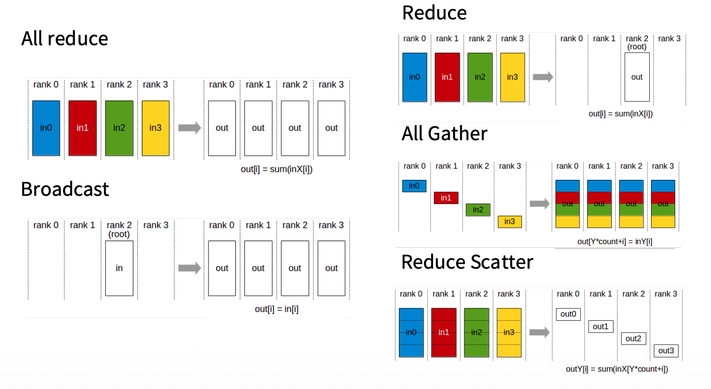
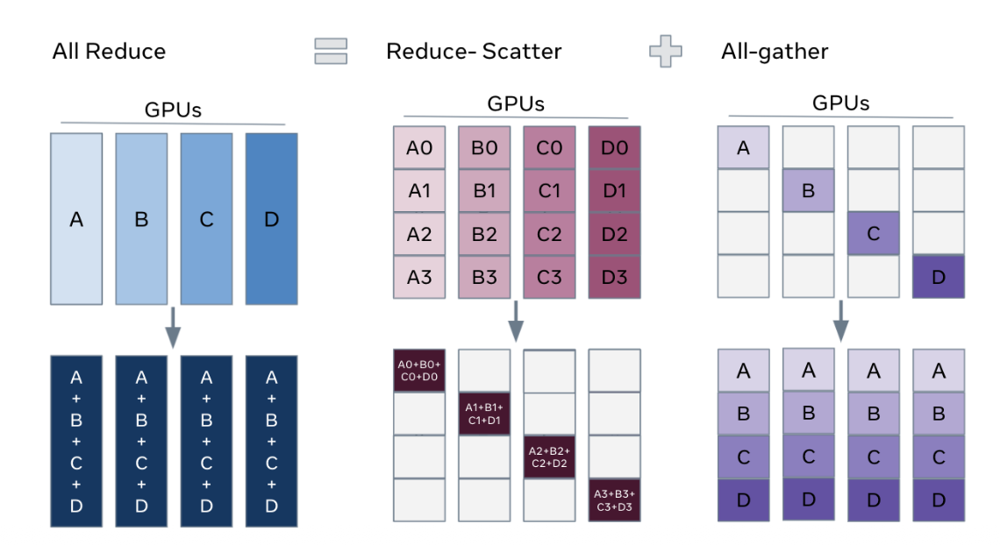

本文会介绍在并行计算中常见的通信原语。


## 基础概念定义

我们定义每个设备为一个 rank.

在并行集合通信中，
- **All** 表示通信的 dst 是所有设备
- **Reduce** 表示对于数据执行 associative/commutative 计算（例如求和/求平均）
- **Gather** 表示将“分散”（在各个设备）的数据 shard 合并起来
- **Scatter** 则是 Gather 的反面，将完整的数据分块分发给多个设备

## 集合通信操作定义
### 局部和全局

假设我们希望将一个设备上的数据复制给所有其他设备，让所有设备都拥有该数据的一份*完整*备份，这就是 **广播（Broadcast）**。

```
|  D0  |  D1  |  D2  |  D3  |
|      |      | data |      |
--copy-->
| data | data | data | data |
```

与广播相反的情形：假设我们所有设备都存储了相同形状的数据，*现在我们希望将这些数据进行 Reduce 操作（例如求和/求平均）之后*将计算结果只保留到一个设备上，这个操作是 **归约（Reduce）**.

```
|  D0  |  D1  |  D2  |  D3  |
| data | data | data | data |
--reduce (e.g. sum/avg)-->
|      |      | data |      | (Reduced)
```

### 全局和全局

前面介绍了 Reduce 操作，如果我们希望把 Reduce 操作之后的结果保留在所有设备上，这个操作是 **All Reduce**.

```
|  D0  |  D1  |  D2  |  D3  |
| data | data | data | data |
--reduce (e.g. sum/avg)-->
| data | data | data | data | (Reduced)
```


假设我们现在每个设备都持有数据的一部分，例如：
- 完整的数据是一个 array：$x = [x_{0}, x_{1}, \dots, x_{1023}] \in \mathbb{R}^{1024}$
- 现在一共有 4 个设备，rank 0 持有 $x^{(0)}= [x_{0}, \dots, x_{255}] \in \mathbb{R}^{1024/4}$, rank 1 持有 $x^{(1)} = [x_{256}, \dots, x_{511}] \in \mathbb{R}^{1024/4}$, ...

现在我们希望每个设备都有该数据的完整备份，这意味着：
- 每个 rank 需要将自己的数据复制到所有其它 rank 上
- 每个 rank 需要接收除了自己所持有的数据部分之外的数据 shard

这被称之为 **All Gather**.

```
|    D0     |    D1     |    D2     |    D3     |
| data[0]   | data[1]   | data[2]   | data[3]   |
--concatenate-->
| data[0:3] | data[0:3] | data[0:3] | data[0:3] |
```

与 All Gather 相反的情形：
- 假设我们所有设备都存储了相同形状的数据，
- *现在我们希望将这些数据进行 Reduce 操作（例如求和/求平均）之后*
- 将数据的每一部分分发给不同的设备
- 这意味着每个设备只用负责计算 其被分配到部分的 Reduce 操作计算，并且不同设备的 Reduce 操作计算可以同时进行

这被称之为 **Reduce Scatter**.

```
|    D0     |    D1     |    D2     |    D3     |
| data[0:3] | data[0:3] | data[0:3] | data[0:3] |
--reduce[0]-|-reduce[1]-|-reduce[2]-|-reduce[3]-|
| data[0]   | data[1]   | data[2]   | data[3]   | (Reduced)
```

## Ring 通信

在上一个章节介绍了通信的逻辑语义，实际实现算法最常见的是 ring 通信，其核心思想是：
- 将所有 device 连成一个环。假设我们有 4 个设备，这意味着 `0 -> 1 -> 2 -> 3 -> 0`
- 系统形成一个 pipeline，在每一步中：
- 每个 GPU 发送给其 *右* 邻居，并且接受来自其 *左* 邻居的数据

例子：
```
|    D0     |    D1     |    D2     |    D3     |
| A[0]      | A[1]      | A[2]      | A[3]      |
    -           -           -           -
| ---A[0]-->| ---A[1]-->| ---A[2]-->| ---A[3]-->|
| A[0,3]    | A[1,0]    | A[2,1]    | A[3,2]    |
      -           -           -           -
| ---A[3]-->| ---A[0]-->| ---A[1]-->| ---A[2]-->|
| A[0,3,2]  | A[1,0,3]  | A[2,1,0]  | A[3,2,1]  |
        -           -           -           -
| ---A[1]-->| ---A[2]-->| ---A[0]-->| ---A[3]-->|
| A[0,3,2,1]| A[1,0,3,2]| A[2,1,0,3]| A[3,2,1,0]|
```

## All-Reduce 计算优化

假设我们有 $p$ 个设备。回顾一下，All-Reduce 操作
- 首先，所有设备上都有形状相同的数据 $x\in \mathbb{R}^N$
- 我们希望对于所有 $x_{i}, i\in \{1, \dots, N\}$，跨设备进行 Reduce 操作

我们可以
- 利用 Reduce-Scatter 的思想，让 device i 负责 $[x_{i/p \times N}, \dots, x_{i/p \times N+N}]$ 的 Reduce 计算，
- 再通过一次 All-Gather 操作将每个 device 得到的 reduced data shard 合并成完整的数据，完成同步

因此，一个重要的结论是：
$$
\text{All-Reduce} = \text{Reduce-Scatter} + \text{All-Gather}
$$



通信计算：
- 假设不同 device 之间传递的 tensor size = $N$，$N$ 是整个 tensor 的大小且一共有 $p$ 个 device，每个设备持有 $N/p$ 的数据
- 一共要进行 $p-1$ 个 step
- 因此每个设备在整个流程中要传输 $(p-1)N/p$ 的数据

在 All-Reduce 的情景下：
- ReduceScatter 需要发送 $(p-1) \times N/p$ 数据（这是因为进行 Reduce 操作时，需要接收所有其他设备上的数）
- AllGather 拼接，同理也需要发送 $(p-1) \times N/p$ 数据

因此，一共是
$$
2 \frac{p-1}{p} N
$$
数据，当 $p$ 数量很大的时候近似于 $2N$.
## 总结

我们介绍了 Reduce, Broadcast, All {Gather/Reduce} 和 Reduce Scatter 操作以及如何优化 All-Reduce 操作。
