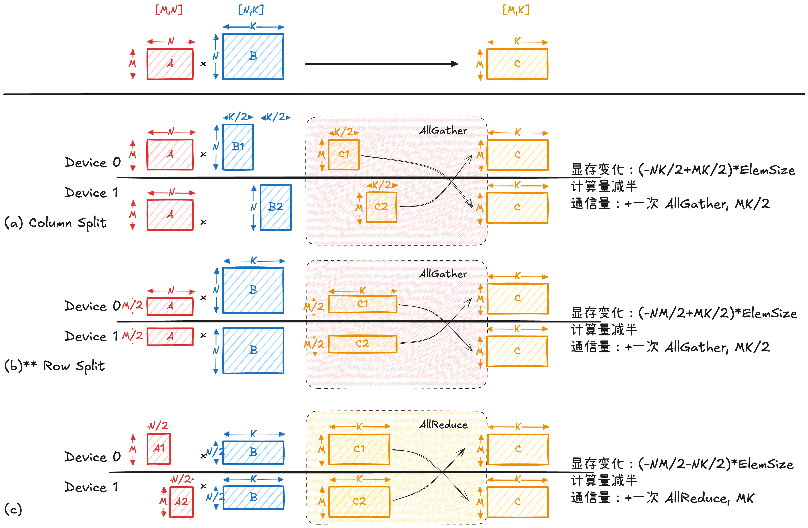
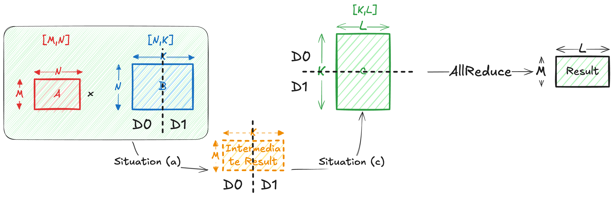

本文简单介绍 GEMM 运算的几种常见的并行计算方式。

## 两个矩阵乘法


考虑我们需要做以下矩阵乘法的场景：
$$
(A,B) \mapsto AB, \quad A \in \mathbb{R}^{M \times N}, \; B \in \mathbb{R}^{N \times K}
$$

下图 (a)–(c) 展示了三种典型的矩阵切分方式。其核心区别在于：是否对乘法中的求和维度（即 $N$ 维）进行切分。
- **(a) 列切 B**：每个设备负责输出矩阵 C 的一部分列，计算彼此独立，无需通信，但为了得到完整的输出矩阵需要进行一次 AllGather。
- **(b) 行切 A**：每个设备负责输出矩阵 C 的一部分行，同样无需通信，但为了得到完整的输出矩阵需要进行一次 AllGather。该方式在神经网络推理中最为常见（例如 activation 按 batch 或 token 维切分）。
- **(c) 列切 A 且行切 B**：等价于对乘法中的求和维度进行切分，每个设备仅计算部分乘加结果（partial sum），最终**必须**需要通过 AllReduce 完成结果合并。这种方式具有更高的并行粒度，但会引入额外通信开销。



### 参考代码实现

```python
# Code for (a)
import numpy as np
M, N, K = 4, 16, 8

A = np.random.randint(0, 10, size=(M, N))
B = np.random.randint(0, 10, size=(N, K))
print("Matrix A shape:", A.shape)
print("Matrix B shape:", B.shape)

num_splits = 4
assert K % num_splits == 0, "K must be divisible by num_splits"
B_splits = np.split(B, num_splits, axis=1)
for i, B_split in enumerate(B_splits):
    print(f"Split {i} shape: {B_split.shape}")
    
# Distributed computation of A @ B using splits of B
local_results = [A @ B_split for B_split in B_splits]
for i, local_result in enumerate(local_results):
    print(f"Local result {i} shape: {local_result.shape}")
    
# Assemble the final result: AllGather
C_final = np.hstack(local_results)
# equivalent to C_final = np.concatenate(local_results, axis=1)
print("Final result shape:", C_final.shape)
```
## 三个矩阵乘法

现在考虑到我们需要做三个矩阵乘法，即：
$$
(A,B,C) \mapsto ABC, \quad A \in \mathbb{R}^{M \times N}, \; B \in \mathbb{R}^{N \times K}, \; C \in \mathbb{R}^{K \times L}
$$
常见的方法是 **列切 B + 行切 C**。
- 第一步 $AB$ 计算类似上一小节 (a)，得到列切的输出
- 再运用上一小节 (c)，与行切 $C$ 计算，再经过 AllReduce 得到完整输出

