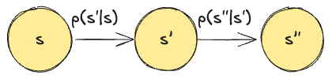
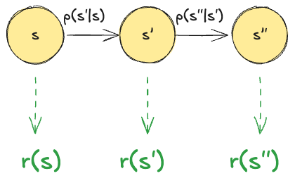
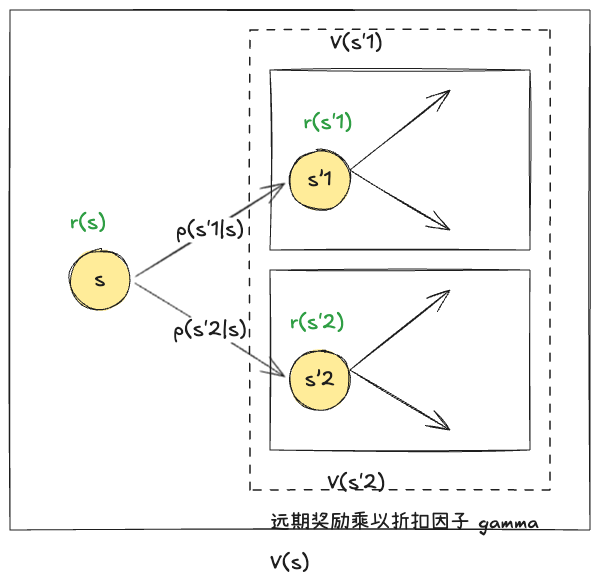
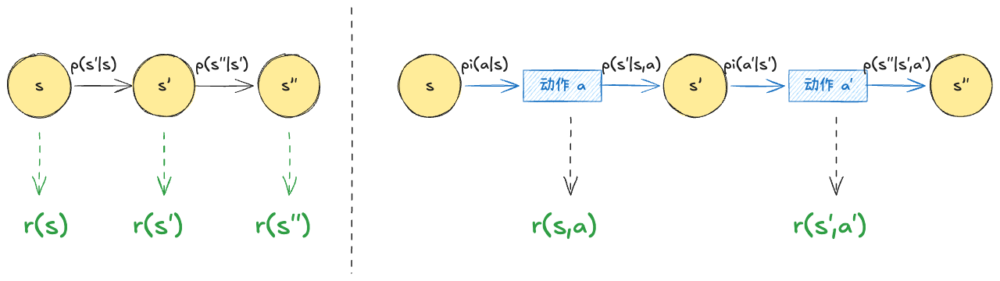
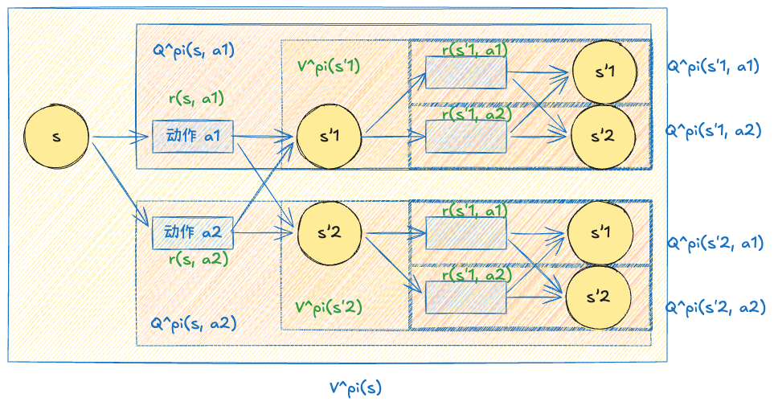
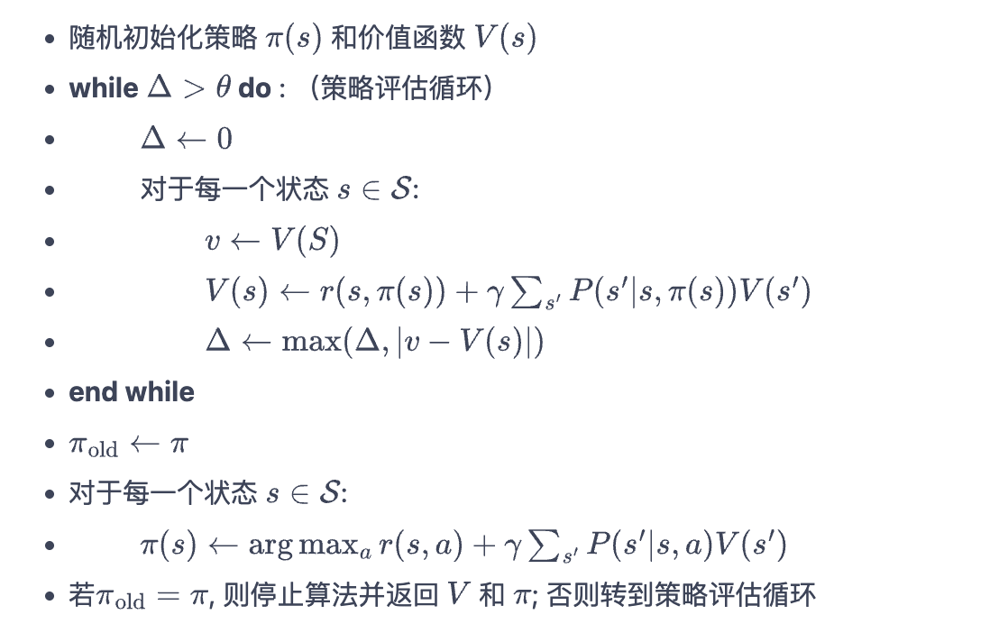

**马尔可夫决策过程**（Markov decision process，MDP）是强化学习的重要概念。本文在[动手学强化学习](https://hrl.boyuai.com/chapter/1/%E9%A9%AC%E5%B0%94%E5%8F%AF%E5%A4%AB%E5%86%B3%E7%AD%96%E8%BF%87%E7%A8%8B)著作的基础上，对于马尔可夫决策过程进行了总结。

## 随机过程

**随机过程 (stochastic process)** 研究对象是随时间演变的随机现象，其中：

**状态 (state)**：随机现象在某时刻 $t$ 的取值是一个向量随机变量 $S_{t} \in \mathcal{S}$，其中 $\mathcal{S} = \{ s_{1},\dots, s_{n} \}$ 表示所有可能的状态集合，且 $|\mathcal{S}|=n$ 表示可能的状态数量.
- 举例：$S_t=$ (机器人位置，机器人速度，机器人加速度)

**状态转移**：在某个时刻 $t$ 的状态 $S_{t}$ 取决于 $t$ 时刻之前的状态 $\{S_{1},\dots, S_{t-1}\}$.

**状态转移概率**：已知历史信息 $(S_{1},\dots,S_{t})$ 时，下一个时刻状态为 $S_{t+1}$ 的概率是：
$$
\mathbb{P}(S_{t+1}|S_{1},\dots,S_{t})
$$

## 马尔可夫过程

> [!note]
> 马尔可夫过程可以看作一个带概率的状态机：其描述了一类随机系统，其中状态随时间演化，并满足：下一时刻的状态只依赖当前状态，而与过去无关。

**马尔可夫性质 (Markov property)**. 在某个时刻 $t+1$ 的状态只取决于上一时刻，即在时刻 $t$ 的状态。用公式表述就是：
$$
\mathbb{P}(S_{t+1}= s_{t+1}|S_{t}=s_{t}) = \mathbb{P}(S_{t+1} = s_{t+1}| S_{1} = s_{1},\dots,S_{t}=s_{t})
$$
- 虽然马尔可夫性质使得下一时刻的状态只依赖当前状态，看似忽略了历史信息，但实际上可以通过将历史信息编码到当前状态中，从而不丢失对未来预测所需的信息。

**状态转移矩阵 (state transition matrix)**. 基于马尔可夫性质的状态转移概率可以用矩阵表述：
$$
\mathcal{P} = \begin{bmatrix}
\mathbb{P}(S_{t+1}|S_{t})
\end{bmatrix}_{|\mathcal{S}| \times |\mathcal{S}|} = \begin{bmatrix}
\mathbb{P}(s_{1}|s_{1})  &  \dots &  \mathbb{P}(s_{n}|s_{1}) \\
\vdots  & \ddots  & \vdots \\
\mathbb{P}(s_{1}|s_{n})  & \dots  &  \mathbb{P}(s_{n}|s_{n})
\end{bmatrix}
$$
- 每一行表示一种初始状态
- 每一列表示一种转移后的状态
- 对于第 $i$ 行第 $j$ 列矩阵表示 $\mathbb{P}(S_{t+1}=s_{j}| S_{t} = s_{i})$，即 $s_{i}\to s_{j}$ 的状态转移

**马尔可夫过程 (Markov process)**. 指具有马尔可夫性质的随机过程，可以表示为
$$
\text{Markov process} = \langle \mathcal{S}, \mathcal{P}\rangle
$$

**状态序列 (episode)**. 一串按时间顺序排列的状态
- 例如 $s_{1}\to s_{1} \to s_{2}\to s_{3}\to s_{6}$

**采样 (sampling)**. 从某一个状态开始，根据它的状态转移矩阵，一步一步随机生成一个状态序列的过程。

## 马尔可夫奖励过程

> [!note]
> 马尔可夫奖励过程是在马尔可夫过程的基础上，引入奖励函数，用于评估从某个状态出发的长期回报，从而衡量状态的优劣。
> 
> 重要概念：价值函数描述了从状态出发的*长期期望回报*。

### 问题建模

**奖励 (reward)**. 对于一个状态 $s$，其奖励 $r(s) \in \mathbb{R}$ 表示处于（或者理解为从任意状态转移到）该状态时所获得的期望奖励。
- 这是单步的
- 其向量化表示： $\mathcal{R} = \begin{bmatrix} R(s_{1})  \\ \vdots  \\  R(s_{n})\end{bmatrix}$

**回报 (return)**. 对于一个状态序列，从第 $t$ 时刻开始直到终止状态时，所有奖励的衰减之和
$$
G_{t}= R_{t}+ \gamma R_{t+1} + \gamma^2 R_{t+2}+\dots = \sum_{k=0}^\infty \gamma^k R_{t+k}
$$
- 这是多步的
- $\gamma\in [0,1)$ 是折扣因子，表示我们倾向于尽快获得奖励、对远期利益打折扣的程度
- $R_{t}$ 表示在时刻 $t$ 获得的奖励

**马尔可夫奖励过程 (Markov reward process)**. 在马尔可夫过程的基础上，加上每个状态的奖励函数和回报的折扣因子，可以表示为
$$
\text{Markov reward process} =\langle \mathcal{S}, \mathcal{P}, \mathcal{R}, \gamma \rangle
$$
- 通过定义奖励和状态转移，使我们可以用“长期期望回报”来量化一个状态的好坏

### 状态价值函数

**价值 (value)** 和 **价值函数 (value function)**. 对于一个状态 $s$，其期望回报称之为该状态的价值。所有状态的价值组成了价值函数
$$
V(s) = \mathbb{E} [G_{t}|S_{t}=s]
$$
- 期望回报是指在给定状态转移概率（以及策略）下，对所有可能的未来状态序列的回报取期望。
- 价值函数是指对于所有状态，建立一个从状态到其价值的映射

**贝尔曼方程 (Bellman equation)**. 求解每个状态的价值. 推导：

$$
\begin{align}
V(s) &= \mathbb{E}[G_{t}|S_{t}= s]  \\
&= \mathbb{E}[R_{t}+ \gamma (R_{t+1}+ \gamma R_{t+2}+\gamma^2R_{t+3}+\dots)|S_{t}=s] \\
&= \mathbb{E}[R_{t}+\gamma G_{t+1}|S_{t}=s] \\
&= \mathbb{E}[R_{t}|S_{t}=s] + \gamma \sum_{s_{t+1}\in \mathcal{S}}\mathbb{E}[G_{t+1}|S_{t+1}=s_{t+1}] \mathbb{P}(S_{t+1}=s_{t+1}| S_{t}=s_{t}) \\
&= r(s) + \gamma \sum_{s' \in \mathcal{S}} V(s') p(s'|s)
\end{align}
$$
可以看到，任意状态 $s$ 的价值可以理解为以下几项之和：
- 当前拿到的及时奖励 $r(s)$
- 未来价值的期望：所有在下一个时刻可能的状态 $s'$ 
	- 计算各自的价值 $V(s')$ 
	- 计算各自的概率，即转移函数 $p(s'|s)$
	- 两者相乘，再乘以折扣因子 $\gamma$

将价值、转移函数和奖励向量化，则得到：
$$
\mathcal{V} = \mathcal{R} + \gamma \mathcal{P} \mathcal{V} \implies \mathcal{V} = (1 - \gamma \mathcal{P})^{-1} \mathcal{R}
$$

其中 $\mathcal{V} = \begin{bmatrix} V(s_{1})  \\ \vdots  \\  V(s_{n})\end{bmatrix}$

## 马尔可夫决策过程

> [!note]
> 现在考虑有智能体参与的环境，智能体通过做出动作改变了状态之间的转移概率以及获得奖励的方式。
> 
> 重要概念：现在 {状态/动作} 价值函数同样也是表达 {特定状态/基于现在状态做出特定动作} 的远期期望收益，但其和智能体采取的策略 $\pi$，也就是智能体具体会做什么动作有关。

### 问题建模

**智能体 (agent)**. 之前介绍的过程是自发改变的随机过程，现在我们引入外界的“刺激”来改变这个随机过程，我们将这个刺激称为智能体。具体而言，在基础的马尔可夫过程中，环境会从 $s_{t} \to s_{t+1} \to s_{t+2} \to \dots$ 从状态到状态的变化。智能体在中间引入了动作的概念，即：
- 智能体有一些可选的**动作(action)**，其集合为 $\mathcal{A}$
- 智能体的 **策略 (policy)**. 这些动作是基于输入状态 $s$ 采取的。基于状态 $s$ 的情况下，智能体采取动作 $a$ 的概率为：$\pi(a|s) = \mathbb{P}(A_{t}=a|S_{t}=s)$.
- 状态转移函数：现在下一个时刻的状态不仅取决于上一个时刻的状态，还取决于上一个时刻智能体所做出的动作：$\mathbb{P}(s'|s,a)$
- 奖励函数：现在奖励函数不只是由状态，还和智能体决策（动作）一起共同决定：$r(s,a)$
	- 这意味着智能体不再是进入状态 $s$ 就获得奖励，而是基于状态 $s$ 做出动作 $a$ 再获得奖励

**马尔可夫决策过程 (Markov decision process)**. 在马尔可夫奖励过程的基础上，引入智能体的动作概念，并且修改状态转移函数和奖励函数，使其现在和智能体的动作有关：
$$
\text{Markov decision process}= \langle \mathcal{S}, \mathcal{A}, \mathbb{P}(s'|s,a), r(s,a), \gamma \rangle
$$

### 状态价值函数和动作价值函数

**状态价值函数 (state-value function)**. 和在马尔可夫奖励过程的状态的价值函数相似，描述从状态 $s$ 出发，遵守策略 $\pi$ 所能获得期望回报：
$$
V^\pi (s) = \mathbb{E}_{\pi}[G_{t}|S_{t}=s] 
$$

**贝尔曼期望方程 (Bellman Expectation Equation)——状态价值函数**：
- 智能体会基于该状态 $s$ 做出动作 $a$，且概率为 $\pi(s,a)$
- 对于每个动作 $a$，会带来奖励 $r(s,a)$
- 这会导致智能体可能进入状态 $s'$，概率为 $p(s'|s,a)$
- 对应的状态 $s'$ 具有价值 $V^\pi(s')$
- 因为是远期收益，需要加上折扣因子 $\gamma$

因此，可以写为：
$$
\begin{align}
V^\pi (s) &= \mathbb{E}_{\pi}[G_{t}|S_{t}=s]  \\
&= \mathbb{E}_{\pi}[R_{t}+\gamma R_{t+1}+ \gamma^2R_{t+2}+ \dots |S_{t}=s] \\
&= \mathbb{E}_{\pi}[R_{t}|S_{t}=s] + \gamma \mathbb{E}_{\pi} [G_{t+1}|S_{t}=s] \\
&= \sum_{a \in \mathcal{A}}\pi(a|s)r(s,a) + \gamma\sum_{a\in \mathcal{A}} \sum_{s' \in \mathcal{S}} \underbrace{\pi(a|s)\,\mathbb{P}(s'|s,a)}_{\text{probability of transitioning from } s \text{ to } s' \text{ via } a}\mathbb{E}_{\pi}[G_{t+1}|S_{t+1}=s'] \\
&= \sum_{a\in\mathcal{A}} \pi(a|s) \left( r(s,a) + \gamma \sum_{s' \in \mathcal{S}}  \mathbb{P}(s'|s, a) V^\pi (s') \right)
\end{align}
$$

**动作价值函数 (action-value function)**. 与此同时，我们需要衡量在当前策略下，对当前状态 $s$ 做出动作 $a$ 所带来的收益：
$$
Q^\pi (s, a) = \mathbb{E}_{\pi}[G_{t}|S_{t}=s, A_{t}=a]
$$

动作价值函数和状态价值函数的关系：
- 状态 $s$ 的价值函数等于
	- 策略 $\pi$ 基于状态 $s$ 采取动作 $a$ 的概率 $\pi(a|s)$
	- 乘以这个动作的价值 $Q^\pi(s,a)$
- 动作 $(s,a)$ 的价值函数等于
	- 及时奖励
	- 加上经过衰减后的未来奖励，即
		- 下一个时刻进入状态 $s'$ 的概率 $\mathbb{P}(s'|s,a)$
		- 对应状态 $s'$ 的价值 $V^\pi (s')$
		- 的加权求和

用公式表达即：
$$
\begin{cases}
V^\pi(s) = \sum_{a \in \mathcal{A}} \pi(a|s) Q^\pi (s, a) \\
Q^\pi(s,a) = r(s,a) + \gamma\sum_{s' \in \mathcal{S}} \mathbb{P}(s'|s,a) V^\pi (s')
\end{cases}
$$

**贝尔曼期望方程 (Bellman Expectation Equation)——动作价值函数**：基于以上两个关系，可以消除 $V^\pi(s)$，得到 $Q^\pi(s,a)$ 的表达式：
$$
Q^\pi(s,a) = r(s, a) + \gamma \sum_{s' \in\mathcal{S}}  \mathbb{P}(s'|s,a)  \sum_{a' \in A}\pi(a'|s') Q^\pi (s',a')
$$
> 这些公式可以直接从图中直观观察到，本质上是概率乘以对应奖励加权求和。

### 马尔可夫决策过程求解

通过贝尔曼方程，我们可以得到马尔可夫奖励过程的解析解。基于此，我们通过将马尔可夫决策过程退化成马尔可夫奖励过程得到其解析解：

状态奖励：从 $r(s,a)$ 到 $r(s)$ 做动作奖励的加权求和：
$$
r(s) = \sum_{a\in \mathcal{A}} \pi(a|s) r(s, a)
$$

同理，从 $p(s'|s,a)$ 到 $p(s'|s)$ 转移概率也对所有动作做加权求和：
$$
\mathbb{P}(s'|s)= \sum_{a\in \mathcal{A}} \pi(a|s) \mathbb{P}(s'|s,a)
$$
这样就可以做 MDP 到 MRP 的转换：
$$
\langle \mathcal{S}, \mathcal{A}, \mathbb{P}(s'|s,a), r(s,a), \gamma \rangle \to \langle \mathcal{S}, \mathbb{P}'(s'|s), r'(s), \gamma \rangle
$$

## 最优策略和贝尔曼最优方程

**最优策略**. 如何定义一个策略 $\pi(a|s)$ 是最优的？
- 这意味着从任意状态 $s \in \mathcal{S}$ 出发，智能体所获得的预期远期收益都是最高的
- 这个期望收益可以用状态价值函数来描述

因此，如果 $\pi^* \in \Pi$ 是最优策略，它满足：
$$
\forall s\in \mathcal{S}, \quad V^{*} (s) = \max_{\pi}V^\pi(s)
$$
其中 $V^*(s) = V^{\pi^*}(s)$

同样的，对于任意状态-动作对 $(s,a)\in \mathcal{S}\times\mathcal{A}$（意思是处于状态 $s$ 且智能体采取动作 $a$ 的情况下），策略$\pi^*$ 最优意味着：在之后继续采取策略 $\pi^*$ 为这个状态-动作对所带来的远期价值最高。
$$
\forall (s, a) \in \mathcal{S} \times \mathcal{A}, \quad Q^*(s,a) = \max_{\pi}Q^\pi (s, a)
$$

**最优策略在任意状态 $s$ 一定会在所有可能的状态-动作对 $(s,.)$ 中，采取动作 $a$ 使得状态-动作对 $(s,a)$ 使得其动作价值最高。** 换言之：
$$
\pi^*(s) \in \arg \max_{a \in \mathcal{A}}Q^*(s, a), \quad V^*(s) = \max_{a \in \mathcal{A}} Q^*(s, a)
$$
如果 $\pi^*$ 是确定性策略，则 $V^*(s)= Q^*(s, \pi^*(s))$

**贝尔曼最优方程 (Bellman optimality equation)**. 对于最优状态价值函数和最优动作价值函数进行推导。

首先最优策略意味着在状态-动作对 $(s,a)$ 下，无论在下一个时刻进入哪个状态 $s'$，都会带来该状态的最优状态价值。这意味着：
$$
\begin{align}
Q^*(s, a) 
&=   r(s,a) + \gamma \sum_{s\in \mathcal{S}} p(s'|s,a)  V^* (s')  \\
&=  r(s,a) + \gamma \sum_{s\in \mathcal{S}} p(s'|s,a) \max_{a\in \mathcal{A}} Q^*(s,a)
\end{align}
$$

将这个表达式代回最优状态价值函数，我们得到：
$$
V^*(s) = \max_{a\in \mathcal{A}} \left\{ r(s,a) + \gamma \sum_{s' \in \mathcal{S}} p(s'|s,a) V^*(s') \right\}
$$

## 最优策略的解

在本章节我们将会提供在已知转移函数 $p(s'|s,a)$ 和奖励函数 $r(s,a)$ 的马尔可夫决策过程下，如何解得最优策略。

### 策略迭代算法

现在我们希望得到最优策略。现在我们知道：
- 对于任意策略 $\pi$，其对应一种状态价值函数 $V^\pi(s)$ 和动作价值函数 $Q^{\pi}(s, a)$
- 因此当策略发生变化的时候，需要重新评估这两个值
- 可不可以通过迭代的方式，持续优化策略使得其逐渐靠近最优策略？

这等价于：
$$
\dots \to \pi_{i} \to^\text{Evaluation} V^{\pi_{i}} \to^\text{Optimization} \to \pi_{i+1} \to \dots \to \pi^*
$$

基于以上思想，**策略迭代算法**
- 从初始策略 $\pi_{0}$ 开始
- 反复进行：对于当前策略 $\pi_{i}$
	- 对该策略进行评估，即计算其状态价值函数
	- 对该策略进行提升，即找到一个不差于该策略的策略 $\pi_{i+1}$
	- 直到状态价值函数优化程度提升幅度小于一定程度停止

**策略评估**：得到当前策略 $\pi_{i}$ 的状态价值函数。这可以通过*贝尔曼期望方程*中的最优状态价值函数推导。这可以通过迭代+不动点的思想计算，即对于策略 $\pi_{i}$
- 将状态价值函数随机初始化，得到 $V^0(s)$
- 当前轮的状态价值函数用上一轮的状态价值计算
- 最终状态价值函数一定会收敛到该策略的实际状态价值函数 $V^k \to_{k \to + \infty} V^{\pi_{i}}$

$$
\forall s\in\mathcal{S}, \quad V^{k+1}(s) = \sum_{a\in \mathcal{A}} \pi(a|s) \left( r(s,a) + \sum_{s' \in \mathcal{S}} p(s'|s, a)V^k(s)\right)
$$

**策略优化**：找到一个新策略 $\pi_{i+1}$ 使其不差于当前策略 $\pi_{i}$. 这意味着对于任意状态
$$
\forall s \in \mathcal{S}, \quad Q^{\pi_{i}}(s, \pi_{i+1}(s)) \geq V^{\pi_{i}}(s)
$$

**我们可以对于任意状态 $s$，贪心选取在目前策略 $\pi_{i}$ 下，对每一个状态 $s$ 选取动作价值最大的动作**，因此

$$
\forall s \in\mathcal{S}, \quad \pi_{i+1}(s) = \arg\max_{a\in \mathcal{A}} Q^{\pi_{i} } (s,a) = \arg \max_{a\in\mathcal{A}} \left\{r(s,a) + \gamma\sum_{s' \in \mathcal{S}} \mathbb{P}(s'|s,a) V^\pi (s')\right\}
$$
当优化程度小于一定阀值 $\Delta$ 即停止。

具体算法表述：

## 价值迭代算法

贝尔曼最优方程告诉我们在最优情况下价值是怎么样的。这意味着我们可以利用这个公式，在目前时刻做出决策之后，假设未来时刻都一直是最优的，反推现在应该如何做。

通过贝尔曼最优方程我们得到价值最优函数的表达式：

$$
V^*(s) = \max_{a\in \mathcal{A}} \left\{ r(s,a) + \gamma \sum_{s' \in \mathcal{S}} p(s'|s,a) V^*(s') \right\}
$$
这个公式可以通过动态规划做求解：
- 迭代求解，等式左边的 $V^*(s)$ 为 $V_{k+1}$，等式右边的为 $V_{k}$
- $V^*$ 是这个方程的不动点，因此当 $V_{k+1}=V_{k}$ 时我们就找到了想求的 $V^*$

再求得价值最优函数后，我们直接定义策略 $\pi$ 对每一个状态 $s$ 采取动作价值最大的动作 $a$
$$
\forall s \in\mathcal{S}, \quad \pi(s) = \arg\max_{a\in \mathcal{A}} Q^{ *} (s,a) = \arg \max_{a\in\mathcal{A}} \left\{r(s,a) + \gamma\sum_{s' \in \mathcal{S}} \mathbb{P}(s'|s,a) V^* (s')\right\}
$$
容易得到 $\pi$ 就是我们想求的最优策略。

## 参考资料

- [第 3 章 马尔可夫决策过程（动手学强化学习）](https://hrl.boyuai.com/chapter/1/%E9%A9%AC%E5%B0%94%E5%8F%AF%E5%A4%AB%E5%86%B3%E7%AD%96%E8%BF%87%E7%A8%8B)

