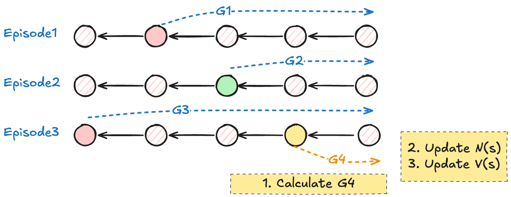
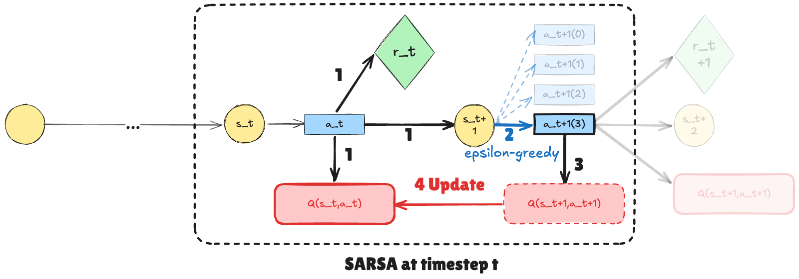

在 [强化学习基础（1）：马尔可夫决策过程](强化学习基础（1）：马尔可夫决策过程.md) 中我们学习了
- 马尔可夫决策过程建模 $\langle \mathcal{S}, \mathcal{A}, p(s'|s,a), r(s,a), \gamma \rangle$
- 状态奖励函数 $V(s)$ 和动作奖励函数 $Q(s,a)$
- 最优决策定义 $\pi^*$
- 在已知转移函数 $p(s'|s,a)$ 的情况下如何通过迭代算法求得最优决策

在本章我们将看到如何在转移函数 $p(s'|s,a)$ 未知的情况下求得最优决策。

## 蒙特卡罗方法

假设现在系统处于状态 $s \in \mathcal{S}$，我们所求的最优策略 $\pi^*$ 一定满足：
$$
\forall \pi \neq \pi^*, \quad V^\pi(s) \leq V^{\pi^*} (s)
$$

- 如何最大化状态价值函数？首先我们需要知道如何估计在策略 $\pi$ 下状态价值函数 $V^\pi(s)$ 的值
- 状态价值函数是从当前时刻状态 $s$ 出发所有序列的回报的期望。
- 因此，最朴素的想法就是尽可能罗列从当前时刻状态出发的所有序列（用采样近似），分别计算回报再求期望。因此如果用 $G_{t}^{(i)}$ 标识从当前时刻状态出发、index 为 $i$ 的序列的回报，则：

$$
V^\pi (s) = \mathbb{E}_{\pi} [G_{t}|S_{t}=s] \approx \frac{1}{N}\sum_{i = 1}^N G_{t}^{(i)}
$$

因此我们就可以统计所有序列中经过状态 $s$ 的次数 $N(s)$ 以及对于所有对应回报的和 $M(s)$，得到
$$
V(s) = \frac{M(s)}{N(s)}
$$

或者我们也通过增量更新的的方法对每个状态 $s$ 的状态价值函数求解：
- 初始化统计次数 $N(s) = 0$，状态价值 $V(s) =0$
- 一个序列可能经过多次状态 $s$
- 对所有候选序列：
	- 遍历序列，对于每一次经过状态 $s$（假设初始是时刻 $t$，此时是时刻 $t+k$）：
		- 更新计数器 $N(s) := N(s) +1$
		- 计算这个状态的回报 $G := r_{t+k} + \gamma r_{t+k+1}+ \dots$
		- 对于统计回报量进行更新：

$$
V(s) := V(s) + \frac{1}{N(s)}(G-V(s))
$$

通过迭代更新 $V(s)$ 我们能够持续从样本数据中学习。

## 时序差分方法

> [!note]
> 时序差分方法体现 bootstrap 思想：通过采样获得下一个时刻的新状态 $s_{t+1}$ 和奖励 $r_{t}$，并且使用当前奖励 + 下一状态的价值估计更新当前时刻的状态价值函数。

回到我们的马尔可夫决策过程中，假设此时处于时刻 $t$，系统处于状态 $s$，根据贝尔曼期望方程，
$$
V^\pi (s) = \mathbb{E} [G_{t}|S_{t}=s] = \mathbb{E}_{s'\in \mathcal{S}}[r_{t}+\gamma V^\pi(s')|S_{t}=s]
$$

- 问题在于，如果我们不知道转移函数 $p(s'|s,a)$ 我们无法求这个期望
- 可不可以通过一次采样 + 当前估计进行 bootstrap
- 所以我们考虑，在当前状态 $s$ 下做出动作 $a$ 之后，系统进入新状态 $s'$ 的时刻，通过 $V(s')$ 更新我们对于 $V(s)$ 的评估

$$
V(s_{t}) := V(s_{t})+ \alpha [r_t + \gamma V (s_{t+1})- V(s_{t})]
$$

其中 $\alpha = \frac{1}{N(s)}$ 时 $V^\pi$ 严格表示为回报的期望，当 $\alpha$ 为其它值时可以表示增量更新的步伐。

## SARSA 算法

相似的，我们希望能够衡量在状态 $s$ 下做出 $a \in \mathcal{A}$ 动作的价值 $Q(s,a)$. 根据贝尔曼期望方程，
$$
Q(s,a)= r(s, a) + \gamma\mathbb{E}[G_{t+1}|S_{t}=s, A_{t}=a]
$$
同样的这一步可以通过增量方程来实现：假设在 $t+1$ 时刻基于状态 $s_{t+1}$，通过策略 $\pi$ 采取动作 $a_{t+1}$。则 $t$ 时刻的价值函数可以通过下面式子更新得到：
$$
Q(s, a) := Q(s,a) + \alpha [r_{t}+ \gamma Q(s_{t+1},a_{t+1}) - Q(s_{t},a_{t})]
$$
在动作价值函数的基础上，最基础的选取方式是使用贪婪算法：
$$
a' = \arg\max_{a} Q(s,a)
$$

但是这可能会导致有些状态-动作对永远不会被使用，因此我们使用 $\epsilon$-贪婪策略，综合探索-利用思想：
$$
\pi(a|s) = \begin{cases}
\frac{\epsilon}{|A|} + 1- \epsilon \quad &\text{if } a = \arg\max_{a'}Q(s,a') \\
\frac{\epsilon}{|A|} \quad &\text{otherwise}
\end{cases}
$$

总结：**SARSA 算法**. 从环境初始状态-动作对 $(s_{0},a_{0})$ 开始，对每个时间步 $t$：
- 目前状态为 $s_{t}$，采取了动作 $a_{t}$，获得了奖励 $r_{t}$，并且系统在时刻 $t+1$ 进入状态 $s_{t+1}$
- 我们将对 $Q(s_{t},a_{t})$ 进行更新
- 用 $\epsilon$-greedy 策略，根据 $Q(s_{t+1},.)$ 选择基于时刻 $t+1$ 状态的动作 $a_{t+1}$
- 计算得到的 $Q(s_{t+1},a_{t+1})$
- 增量更新：$Q(s, a) := Q(s,a) + \alpha [r_{t}+ \gamma Q(s_{t+1},a_{t+1}) - Q(s_{t},a_{t})]$
- 更新 $s:= s'$，更新 $a:= a'$，继续与环境交互
