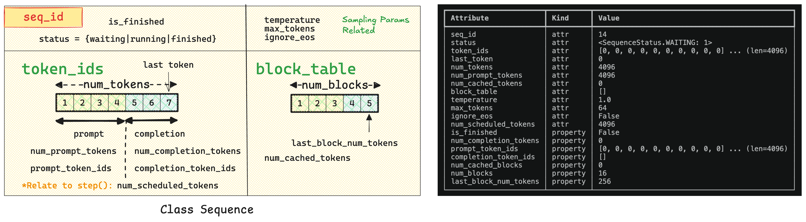
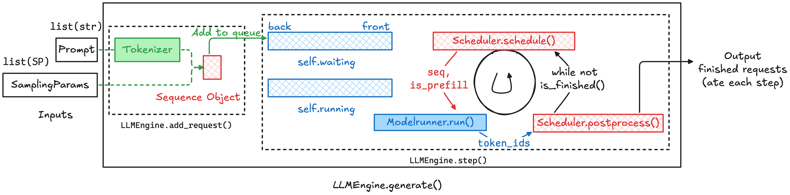
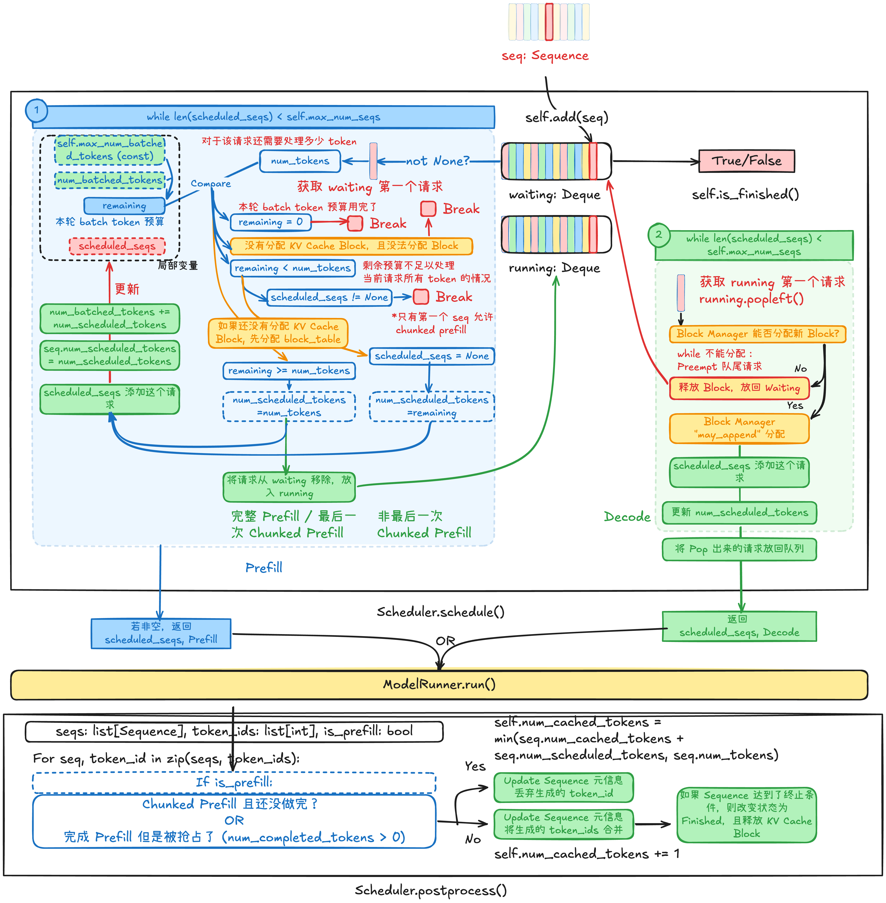

本文从 [Nano-vLLM](https://github.com/GeeeekExplorer/nano-vllm) 入手，解读一个轻量级的大模型请求 Scheduler 是如何做的。

## 请求的基本单位：Sequence 类

> 本小节对应 Nano vLLM 的 [`class Sequence`](https://github.com/GeeeekExplorer/nano-vllm/blob/812eb1c1e434576c0b7ae64d2cefb937aa80399d/nanovllm/engine/sequence.py#L14)，点击链接跳转。




## LLM Engine 上层调度 API

> 本小节对应 Nano vLLM 的 [`Engine.generate()` API](https://github.com/GeeeekExplorer/nano-vllm/blob/812eb1c1e434576c0b7ae64d2cefb937aa80399d/nanovllm/engine/llm_engine.py#L60)，点击链接跳转。

在具体看 Scheduler 的实现细节之前，我们先研究一下 LLM Engine 是如何调用 Scheduler 的 API 的。用一张图来概览 LLM Engine 的调用流程：



下面代码忽略了实现细节，只是为了表述整体流程。

`LLMEngine.generate()` 一次性接受多个请求，并在一次 `generate()` 调用内部，通过反复调用 `step()` 推进所有请求直到完成（这里不是流式输入，而是一次性提交一批请求）：
1. 将输入请求
	1. Tokenize
	2. 封装成 Sequence 对象
	3. 调用 `scheduler.add()` 加入 Scheduler waiting queue
2. 当 Scheduler 仍有请求没有完成时（通过 `scheduler.is_finished()` API）
	1. 持续调用 `self.step()` 。`step()` 每次推进一轮调度与执行，并返回这一轮产生的输出（将在后面解释）
	2. 将获得的输出添加到 `outputs` 中，等待所有请求完成后输出

```python
class LLMEngine:
    def add_request(self, prompt: str | list[int], sampling_params: SamplingParams):
	    # (1-1): Tokenize
        if isinstance(prompt, str):
            prompt = self.tokenizer.encode(prompt)
        
        # (1-2): 封装成 Sequence 对象
        seq = Sequence(prompt, sampling_params)
        
        # (1-3): 加入 Scheduler waiting queue
        self.scheduler.add(seq)
        
	def is_finished(self):
        return self.scheduler.is_finished()
        
	def generate(
	        self,
	        prompts: list[str] | list[list[int]],
	        sampling_params: SamplingParams | list[SamplingParams],
	        use_tqdm: bool = True,
	    ) -> list[str]:
	    
	    # (1) 将输入请求封装成 Sequence 对象，加入 Scheduler waiting queue
	    for prompt, sp in zip(prompts, sampling_params):
		    self.add_request(prompt, sp) # 见上方
		    
		outputs = {}
		# (2) 循环体判断条件：Scheduler 仍有请求没有完成
		while not self.is_finished():
			# (2-1)：持续调用 self.step() API
			output, num_tokens = self.step() # <- 【关键！】将会解释
			# (2-2): 将当前轮的输出加入 outputs
			for seq_id, token_ids in output:
				outputs[seq_id] = token_ids
				
		return outputs
```

在循环体内，我们看到 LLMEngine 调用了一个叫 `self.step()` 的函数，具体而言：
1. 调用 `scheduler.schedule()` API，决定：哪些 sequence 参与执行？这一轮属于 prefill 还是 decode batch？
2. 调用 `model_runner.run()` API，由 `is_prefill` bool 变量控制是执行 Prefill 还是 Decode 的一次前向计算
3. 调用 `scheduler.postprocess()` API，更新序列状态，例如追加生成 token，更新状态，维护 KV Cache 等

```python
class LLMEngine:
    def step(self):
	    # (2-1-1) 由 Scheduler 决定
		#     本轮要执行哪些请求
		#     本轮要执行 P 还是 D 的一次 iteration?
        seqs, is_prefill = self.scheduler.schedule()
        
        # 统计当前批处理的 token 数量，只是为了 benchmark 用
        num_tokens = sum(seq.num_scheduled_tokens for seq in seqs) if is_prefill else -len(seqs)
        
        # （2-1-2） 执行这一轮模型的前向计算
        token_ids = self.model_runner.call("run", seqs, is_prefill)
        
        # （2-1-3） 更新序列状态，例如追加生成 token，更新状态，维护 KV Cache 等
        self.scheduler.postprocess(seqs, token_ids, is_prefill)
        
        outputs = [(seq.seq_id, seq.completion_token_ids) for seq in seqs if seq.is_finished]
        return outputs, num_tokens
```

总结：我们在 Scheduler 中需要实现的 API：
- `add()`：将请求添加到 waiting queue 中
- `is_finished()`：Scheduler 停止运行条件
- **`schedule()`：在每一轮决定：哪些 sequence 参与执行？这一轮属于 prefill 还是 decode batch？**
- `postprocess()` 在每一轮前向计算完成之后更新序列状态，例如追加生成 token，更新状态，维护 KV Cache 等
## 请求调度：Scheduler 类

> 本小节对应 Nano vLLM 的 [`class Scheduler`](https://github.com/GeeeekExplorer/nano-vllm/blob/812eb1c1e434576c0b7ae64d2cefb937aa80399d/nanovllm/engine/scheduler.py#L8)，点击链接跳转。

Scheduler 通过维护 

```python
self.waiting: deque[Sequence] = deque()
self.running: deque[Sequence] = deque()
```

系统使用两个 deque 管理请求：
- `waiting`：**所有还需要做 prefill 的请求**（包括：还没开始、chunked prefill 中、以及被抢占后需要继续 prefill 的）
- `running`：已经完成 prefill、进入 decode 阶段的请求

新请求统一加入 `waiting` 队尾。  
在调度过程中，prefill 阶段通常按 FIFO 顺序从队首选择请求进行处理；但在 decode 阶段，`running` 队列更像一个活跃集合，其调度不严格遵循 FIFO，而是根据 batching 和完成情况动态更新。

### 添加 Sequence 和判断终止条件函数

下面观察源码是如何实现 `add()`, `is_finished()`.
- `add()`，被上层 `LLMEngine.add_request()` 调用，加入 Scheduler waiting queue
- `is_finished()` 当两个 deque 都空时返回 True

```python
class Scheduler:
    def __init__(self, config: Config):
        self.max_num_seqs = config.max_num_seqs
        self.max_num_batched_tokens = config.max_num_batched_tokens
        self.eos = config.eos
        self.block_manager = BlockManager(config.num_kvcache_blocks, config.kvcache_block_size)
        self.waiting: deque[Sequence] = deque()
        self.running: deque[Sequence] = deque()

    def is_finished(self):
        return not self.waiting and not self.running

    def add(self, seq: Sequence):
        self.waiting.append(seq)
```

### 调度逻辑和后处理函数

下图展示了 [`Scheduler.schedule()`](https://github.com/GeeeekExplorer/nano-vllm/blob/812eb1c1e434576c0b7ae64d2cefb937aa80399d/nanovllm/engine/scheduler.py#L24) 和 [`Schedule.postprocess()`](https://github.com/GeeeekExplorer/nano-vllm/blob/812eb1c1e434576c0b7ae64d2cefb937aa80399d/nanovllm/engine/scheduler.py#L71) 的核心逻辑。



Nano-vLLM Scheduler 的核心特性：
- 阶段式调度（Phase-based）
    - Prefill 和 Decode 不混跑
    - 只有当 `waiting` 为空时才进入 Decode
    - 这是为了避免 compute-bound 与 memory-bound workload 冲突
- 资源约束调度：
	- 单轮能跑的请求数量由 `self.max_num_seqs` 限制
	- 单轮能跑的 token 数量由 `self.num_batched_tokens` 限制
- Prefill 调度策略：
	- 按照 `waiting` queue 顺序处理
	- 对每个请求：
		- 如果 token budget 足够则做完整 prefill
		- 否则做 Chunked Prefill
	- 限制只有一个请求能够触发 Chunked Prefill，剩下的则不允许
- Decode 阶段策略：continuous batching

`Scheduler.schedule()` 函数在每个 step 执行以下步骤：
1. 首先判断是否有请求需要做 Prefill，这是通过检查 `waiting` queue 是否非空实现的。如果非空，则优先做 Prefill，进入 `# prefill` 之后的代码
2. 然后再判断是否有请求需要做 Decode，通过检查 `decode` queue 实现，进入 `# decode` 之后的代码
3. 输出本轮需要被执行 forward 的 sequences，以及这一轮是属于 Prefill 还是 Decode

`schedule` 函数维护两个局部变量：
- `scheduled_seqs` 即被选中调度的请求
- `num_batched_tokens` 即需要被处理的被选中调度的请求 token 数量。


在 Prefill 阶段，只要 `scheduled_seqs` 数量没有达到 Scheduler 限制则对于 `waiting` 队列列首的元素进行检查：
（1-1）首先是比较 Sequence 需要处理的 `num_tokens`（注意不是完整的 token 数量！）和还剩下多少 token 预算可以被处理
（1-2）有以下几种情况终止调度直接返回：
- 没有 token 预算了
- Block Manager 没有办法为这个请求分配完整的 KV Cache Block 了
- 预算不够执行完整的 Prefill 且已经有请求执行 Chunked Prefill 了
（1-3）在（1-2）之后，就确定当前选中的 Sequence 可以被成功调度。这里先分配 Sequence 的 KV Cache Block
（1-4）

```python
class Scheduler:
    def schedule(self) -> tuple[list[Sequence], bool]:
        scheduled_seqs = []
        num_batched_tokens = 0

        # prefill
        while self.waiting and len(scheduled_seqs) < self.max_num_seqs:
            seq = self.waiting[0]
            
            # (1-1)
            num_tokens = max(seq.num_tokens - seq.num_cached_tokens, 1)
            remaining = self.max_num_batched_tokens - num_batched_tokens
            
            # (1-2)
            if remaining == 0 or (not seq.block_table and not self.block_manager.can_allocate(seq)):    # no budget
                break
            if remaining < num_tokens and scheduled_seqs:    # only allow chunked prefill for the first seq
                break
                
            # (1-3)
            if not seq.block_table:
                self.block_manager.allocate(seq)
                
            # (1-4)
            seq.num_scheduled_tokens = min(num_tokens, remaining)
            if seq.num_scheduled_tokens == num_tokens:
                seq.status = SequenceStatus.RUNNING
                self.waiting.popleft()
                self.running.append(seq)
            scheduled_seqs.append(seq)
            num_batched_tokens += seq.num_scheduled_tokens
        if scheduled_seqs:
            return scheduled_seqs, True

        # decode
        while self.running and len(scheduled_seqs) < self.max_num_seqs:
            seq = self.running.popleft()
            while not self.block_manager.can_append(seq):
                if self.running:
                    self.preempt(self.running.pop())
                else:
                    self.preempt(seq)
                    break
            else:
                seq.num_scheduled_tokens = 1
                self.block_manager.may_append(seq)
                scheduled_seqs.append(seq)
        assert scheduled_seqs
        self.running.extendleft(reversed(scheduled_seqs))
        return scheduled_seqs, False

    def preempt(self, seq: Sequence):
        seq.status = SequenceStatus.WAITING
        self.block_manager.deallocate(seq)
        self.waiting.appendleft(seq)
```